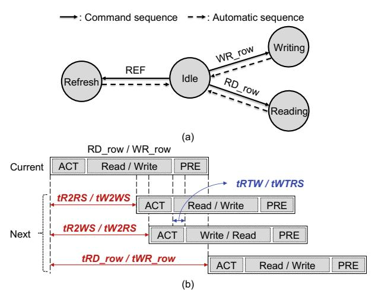

# A. Rome Memory Controller Architecture

As the memory interface is simplified, the MC can also be significantly simplified. The MC now issues only three row-level commands (RD\_row, WR\_row, and REF), so the timing constraints among ACT, PRE, and RD/WR typical of conventional DRAM interfaces are eliminated. Row-granularity operation also reduces the bank states in the bank FSM and timing parameters, and adopting VBA reduces the complexity

Fig. 11. (a) Bank state diagram and (b) timing parameters of RoMe MC.

TABLE III
TIMING PARAMETERS OF ROME

| Name    | Description   | Destination        |  |
|---------|---------------|--------------------|--|
| tR2RS   | Different VBA | DD mary to DD mary |  |
| tR2RR   | Different SID | RD_row to RD_row   |  |
| tR2WS   | Different VBA | DD morr to MD morr |  |
| tR2WR   | Different SID | RD_row to WR_row   |  |
| tW2RS   | Different VBA | WR row to RD row   |  |
| tW2RR   | Different SID | WK_IOW to RD_IOW   |  |
| tW2WS   | Different VBA | WR row to WR row   |  |
| tW2WR   | Different SID | WK_IOW IO WK_IOW   |  |
| tRD_row | Same VBA      | RD_row delay       |  |
| tWR_row | Same VBA      | WR_row delay       |  |

of bank-state tracking logic. Finally, the scheduler's complexity for maximizing bandwidth is greatly reduced.

Bank states: Row-level access drastically simplifies the bank states related to data access. Figure 11(a) illustrates the bank states of RoMe, which are Idle, Writing, Reading, and Refreshing. Idle means the VBA is ready to accept a DRAM command immediately. Refreshing indicates that a REF command is in progress. Reading and Writing mean the bank is executing a RD\_row or WR\_row command, respectively. In conventional DRAM, after a Reading or Writing state, the bank returns to an Active state and can dynamically transition to additional reads or a precharge. Under RoMe, however, DRAM is accessed only via RD\_row and WR\_row commands. Upon completion, the bank automatically returns to Idle. Thus, the Active, Activating, and Precharging states are no longer needed.

Timing parameters: The RoMe MC considers only a minimal set of timing constraints when performing memory accesses. It issues only RD\_row, WR\_row, and REF commands, and each command returns its bank to the Idle state automatically. Thus, it must track only the timing relationships between RD\_row and WR\_row commands. Rather than juggling the full set of row C/A and column C/A timing parameters in a conventional interface, the MC needs to manage only a few timing parameters. Table III lists the ten timing parameters used in RoMe, categorized by Read-to-Read, Read-to-Write, Write-to-Read, and Write-to-Write for same-bank, different-bank, and different-stack-ID cases. Figure 11(b) illustrates

TABLE IV SIMPLIFIED COMPONENTS OF ROME MC

|                     | Conventional MC         | RoMe MC          |
|---------------------|-------------------------|------------------|
| # of timing params. | 15                      | 10               |
| # of bank FSMs      | # of total banks per PC | 5                |
| # of bank states    | 7                       | 4                |
| Page policy         | Open                    | -                |
|                     | Row-buffer locality,    |                  |
| Scheduling          | Bank group interleaving | VBA interleaving |
|                     | PC interleaving         |                  |

when each timing parameter applies. For tR2RS and tW2WS, the next data transfer to the same row can begin immediately after the current one finishes. For tR2WS and tW2RS, the bus direction must switch, so an additional tRTW or tWTRS delay is incurred. Accesses to different stack IDs (tR2RR, tR2WR, tW2WR, and tW2RR) incur a 1-2 nCK longer delay than different-bank accesses [\[27\]](#page-13-7). Finally, tRD\_row and tWR\_row simply chain within the same VBA, so the next operation can start as soon as the previous one completes.

The number of bank FSMs: Because RoMe drives at most two VBA at any given time, the MC needs only two bank FSM instances for scheduling. Since two VBAs can saturate the bandwidth, the MC needs only to track the currently accessed VBA and the next VBA. Nevertheless, due to the use of per-bank refresh, additional bank FSMs are implemented to track the status of banks being refreshed for a duration of tRFCpb divided by tREFIpb. Memory requests are mapped to whichever bank FSM instance is free, and once a request completes, that FSM is deallocated.

Request queue size: The RoMe MC employing a highly simplified scheduler treats each 4KB access as a single request, enabling it to saturate DRAM bandwidth with a significantly smaller request queue. In a cache-line access granularity, the ratio of tCCDS to tRC exceeds 40×, whereas with row granularity access, the ratio of tR2RS to tRD\_row is less than 2×. If the queue size is too small, it cannot look far enough ahead to exploit bank-level parallelism; thus, a certain minimum size is still necessary. HBM4 requires a queue depth of at least 45 entries, while RoMe achieves peak throughput with only two entries. Thus, RoMe can saturate DRAM bandwidth with a depth of just two, allowing the MC to reduce the request queue size.

Command scheduling: The command scheduler delivers high performance and fairness with minimal complexity. It first checks which VBA is active, then serves ready requests in oldest-first order. As row-buffer locality is guaranteed by row granularity access, the scheduler needs only to avoid back-toback commands to the same VBA to fully utilize bandwidth. An age-based mechanism ensures that the oldest pending request is served next, improving tail latency and fairness.

Row-level access removes the need for any page-policy mechanism. Conventional MCs dynamically switch between open, close, and adaptive page policies by monitoring rowbuffer hits to adapt to varying access patterns [\[20\]](#page-13-9). In contrast, RoMe always precharges immediately after reading a row, in-

TABLE V TIMING PARAMETERS OF HBM4 AND ROME

|                       | HBM4              | RoMe          |
|-----------------------|-------------------|---------------|
| channels/cube         | 32                | 36            |
| (PCs/cube)            | (64)              |               |
| stacks                | 4                 | 4             |
| banks/channels        | 128               | 32            |
| row size              | 1 KB              | 4 KB          |
| data rate             | 8 Gb/s            | 8 Gb/s        |
| bandwidth             | 2 TB/s            | 2.25 TB/s     |
|                       | tRC=45, tRP=16,   | tR2RS/R=64/68 |
|                       | tRAS=29, tCL=16,  | tR2WS/R=69/73 |
|                       | tRCDRD=tRCDWR=16, | tW2RS/R=71/75 |
| timing parameter (ns) | tWR=16, tFAW=12,  | tW2WS/R=64/68 |
|                       | tCCDL=2, tCCDS=1, | tRD row=95    |
|                       | tCCDR=2, tRRD=2   | tWR row=115   |
| AGMC                  | 32 B              | 4 KB          |

herently matching LLM's sequential access without requiring any additional policy logic.

## *B. Refresh and Write Operations*

We optimize refresh behavior to suit the simplified interface with VBA. For all-bank refresh (REFab), no bank in the target channel can operate during a refresh; thus, both the baseline and the RoMe MC behave the same. By contrast, for perbank refresh (REFpb), triggering a REF command on any single bank within a VBA blocks the entire VBA. Thus, it is important to minimize this overhead. Instead of issuing a REFpb every tREFIpb, MC issues one per-bank refresh every 2×tREFIpb. The command generator then sends two REFpb commands (one to each bank in the VBA) with an interval defined by the REFpb-to-REFpb timing interval, tRREFD. This reduces the stall time per VBA from 2×tRFCpb (e.g., 2 × 280 ns) to tRFCpb+tRREFD (e.g., 280 ns + 8 ns).

Buffering multiple 4 KB write chunks in a write queue would require a large write buffer. To avoid this, RoMe processes write requests immediately upon arrival, keeping the queue size small. Since LLM workloads are heavily dominated by reads, the impact of immediate write handling is minimal. Additionally, by issuing large 4 KB write requests atomically, RoMe reduces the frequency of read/write turnaround delays.

