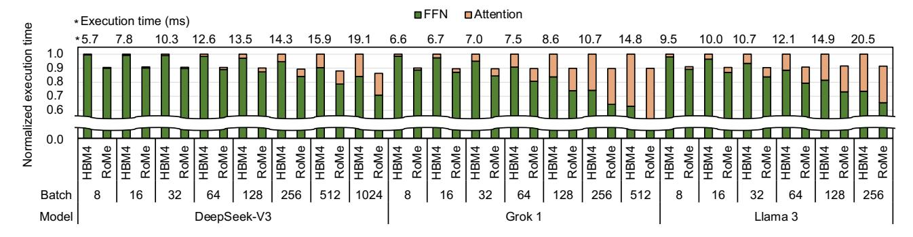
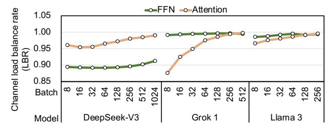
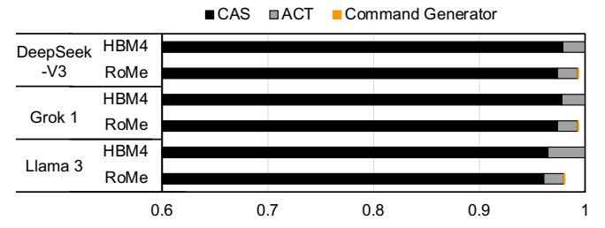

# *A. Methodology*

System: We first describe the configuration of a single accelerator and then extend the design to a multi-accelerator system representative of real LLM deployments. Modern AI accelerators exhibit arithmetic intensities of 200–300 Op/B for BF16 operations (*e.g.*, 281 Op/B on B200 [\[48\]](#page-13-2)) and attach up to eight HBM cubes per device [\[48\]](#page-13-2). Accordingly, we configure our target accelerator to sustain 280 Op/B and connect to eight HBM4 cubes. Each HBM4 cube provides 32 GB capacity with 8 Gbps data rate and a 16-Hi configuration [\[27\]](#page-13-7), yielding total 256 GB memory system with 16 TB/s bandwidth. To match our target arithmetic intensity, we scale BF16 throughput to 4480 TFLOPS. Because real-world LLM deployments often span multiple devices to meet high capacity demands, we evaluate a system with eight accelerators operating in parallel,

Fig. 12. TPOT (time per output token) comparison between HBM4-based memory system and RoMe across various batch sizes for DeepSeek-V3, Grok 1, and Llama 3. The sequence length is 8K and the maximum batch size is constrained by memory capacity.

each providing 560 TFLOPS of BF16, 256 GB of memory capacity, and 16 TB/s of memory bandwidth.

**Simulation:** We model the AI accelerator equipped with the RoMe memory system, using LLMSimulator [77]. It allows configuring both the accelerator and the memory subsystem, supports continuous batching, and integrates Ramulator 2.0 [38] for cycle-accurate DRAM simulation. We implement RoMe in Ramulator 2.0, configuring both the accelerator and RoMe to process 4 KB requests. From the simulator, we collect time per output token (TPOT) and DRAM energy.

To ensure fair comparison, we sweep address mappings for both the baseline and RoMe, selecting the configuration that maximizes bandwidth utilization. We implement the MC for both systems using the FR-FCFS scheduling policy [60]. The baseline MC adopts an open-page policy, while both systems employ per-bank refresh commands to improve bandwidth availability. Table V summarizes the timing parameters used in our experiments. Because JEDEC has not finalized HBM4 timings, we adopt values from prior studies [2], [51].

**LLM:** We evaluate three large-scale LLMs: Grok 1 [73], DeepSeek-V3 [12], and Llama 3-405B (Llama 3 hereafter) [13]. DeepSeek-V3 uses Multi-head Latent Attention (MLA) and Mixture of Experts (MoE) together, Grok 1 adopts Grouped Query Attention (GQA) and MoE together, and Llama 3 adopts GQA but does not adopt MoE, instead using a fully-connected (FC) layer. For MoE, DeepSeek-V3 selects 8 of 256 experts per layer, while Grok 1 selects 2 of 8. All weights are stored in BF16.

During prefill, we apply tensor parallelism (TP) across the eight accelerators. During decode, TP is applied to the attention layers with degrees of 1, 8, and 8 for DeepSeek-V3, Grok 1, and Llama 3, respectively. It is because the compressed KV cache of MLA favors data parallelism to avoid TP communication overhead [78]. GQA runs with TP of 8, which our experiments and prior work have shown to be optimal [13]. For MoE, we use expert parallelism where each accelerator owns a distinct subset of experts, sending inputs to the target accelerator when a given expert is required and then receiving the output afterward.

Fig. 13. Channel load balance ratio of RoMe across various batch sizes in DeepSeek-V3, Grok 1, and Llama 3 when the sequence length is 8K.

#### B. Performance Analysis of RoMe

We measured the TPOT of the baseline (HBM4) and RoMe during the decode stage with varying batch sizes when the sequence length is fixed at 8K. As shown in Figure 12, RoMe reduces TPOT by 10.4%, 10.2%, and 9.0% of HBM4 for DeepSeek-V3, Grok 1, and Llama 3, respectively. This improvement is largely attributed to RoMe's 12.5% higher memory bandwidth from its increased number of channels. However, the scaling does not fully align because several layers (e.g., FFN layers) are not memory-bound.

Because RoMe operates at a 4 KB access granularity instead of the 32 B, load imbalance across memory channels becomes a critical concern for effective bandwidth utilization. Figure 13 shows channel load balance rate (LBR) of RoMe for attention  $(LBR_{Attn})$  and FFN  $(LBR_{FFN})$  layers across various batch sizes. LBR quantifies how uniformly data is distributed across memory channels, with its values normalized to the HBM4 baseline, whose LBR is nearly 1. The value closer to 1 indicates a more uniform data distribution across memory channels, enabling RoMe to fully utilize its available bandwidth, while lower values reflect increasing imbalance.

LBR differences across models primarily arise from their parallelization strategies and the relative contribution of weights and activations. In the attention layers, the hidden dimensions are 7,168 (DeepSeek-V3), 6,144 (Grok 1), and 16,384 (Llama 3), which are proportional to weight sizes. Given that data movement is dominated by weights at small batch sizes, DeepSeek-V3 adopts data parallelism, resulting in relatively high  $LBR_{Attn}$  even with a small KV-cache size due to MLA. In contrast, Grok 1 and Llama 3 employ TP and GQA, which reduces the data movement size of the weight per

Fig. 14. Energy consumption of HBM4-based memory system and RoMe in DeepSeek-V3, Grok 1, and Llama 3 when the batch size is 256.

device, leading to lower  $LBR_{Attn}$  at small batches. However, Llama 3 still maintains high  $LBR_{Attn}$  because its large hidden dimension size keeps the weight contribution significant even under TP. As batch size increases, the KV-cache and activation footprints grow, improving  $LBR_{Attn}$  across all three models.

 $LBR_{FFN}$  is determined by their dimension size and architecture. DeepSeek-V3, with a small intermediate dimension of 2,048, shows relatively low  $LBR_{FFN}$ , while Grok 1 and Llama 3 have larger dimensions of 32,768 and 53,248, respectively. For the FFN layers, DeepSeek-V3 and Grok 1 employ an MoE architecture, while Llama 3 uses a dense architecture. In MoE layers, only a subset of experts (top-k) is activated, so  $LBR_{FFN}$  improves only at large batch sizes where more experts are selected.  $LBR_{FFN}$  improves once all experts begin to be selected, occurring around a batch of 64 in DeepSeek-V3 and a batch of 8 in Grok 1 in our experiments.

We omit results for the prefill stage, as its performance remains unchanged under both memory systems due to its compute-bound nature. This behavior stems from the characteristics of the prefill stage. Unlike the decode stage, which typically processes a single input token at a time, the prefill stage handles thousands of input tokens simultaneously. As a result, the workload is dominated by GEMM operations. Moreover, the large number of input tokens leads to significantly higher access volume to activations, weights, and KV-cache compared to the decode stage. Across all three evaluated LLMs, we observe that the performance difference in the prefill stage remains within 0.1%, confirming its insensitivity to the underlying memory system.

#### C. Area & Energy Overhead

First, we calculated the area overhead incurred by the four additional channels based on HBM3E specifications [34]. The  $\mu$ bump pitch was assumed to be 22  $\mu$ m [62], which applies to both the DRAM and logic die. The number of  $\mu$ bumps per channel was conservatively scaled by increasing it to four times the number required per channel [62], [77]. This configuration requires 48 additional  $\mu$ bumps for additional TSVs, corresponding to an area of approximately 0.14 mm2. Considering the edge margin, the DRAM die area increases by about 12%, and the logic die area grows proportionally, resulting in a total area overhead of only 0.10%.

We implemented the RoMe MC command scheduler and the command generator in Verilog, and utilized Synopsys Design Compiler with a 7nm process technology [9] to measure area

and energy consumption. Given that RoMe incorporates 36 legacy channels per cube, the total area overhead for the command generator amounts to  $4268.8 \ \mu\text{m}^2$ . This represents negligible overhead, occupying 0.003% of the logic die area.

For RoMe MC, we compared the area of the scheduling logic—including the command scheduler, bank FSM, and request queue—between RoMe and conventional MC. The request queue depth was set to 64 entries for the conventional MC and 4 entries for RoMe MC, both evaluated under the FR-FCFS scheduling policy [60]. Under these conditions, the command scheduling logic in RoMe MC occupies only 9.1% of the area of a conventional MC, indicating that RoMe achieves a much simpler architecture.

Figure 14 shows the energy consumption of LLM workloads under HBM4 and RoMe. We comprehensively calculated energy consumption by including the contributions of data movement within the HBM, command generator, and I/O interface. The underlying energy model for HBM4 is adopted from [2]. Compared to HBM4, RoMe reduces energy consumption by 1.9%, 0.7%, and 0.7% for the three evaluated LLMs, respectively. This improvement is primarily attributed to the decreased number of ACTs and the reduced energy consumption within the interposer. Specifically, the ACT energy consumption is reduced to 55.5%, 86.0%, and 84.4%, respectively. Because RoMe accesses DRAM via RD\_row/WR\_row, it requires only the minimal number of ACTs regardless of the amount of data accessed, thereby minimizing energy consumption from ACTs. Furthermore, interposer energy is reduced because RoMe MC issues a single RD row or WR row instead of 32 RDs or WRs. Although overfetch may slightly increase the number of RDs and WRs, the overall overhead remains marginal. Notably, the energy consumed by the command generator is negligible, contributing on average 0.06% relative to the total energy consumption. Overall, these results indicate that RoMe achieves slight improvements in energy efficiency while providing noticeable performance gains.

