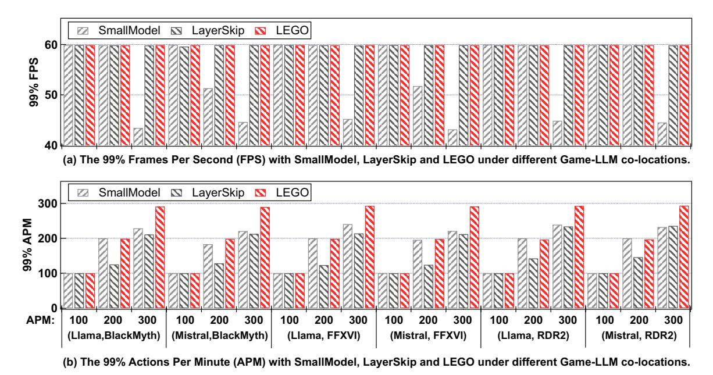
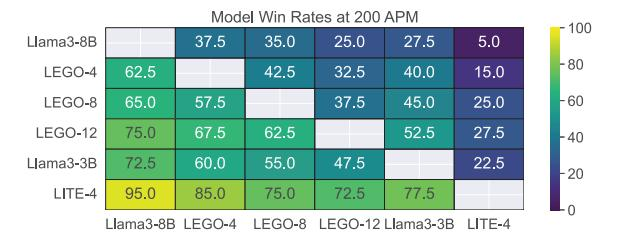
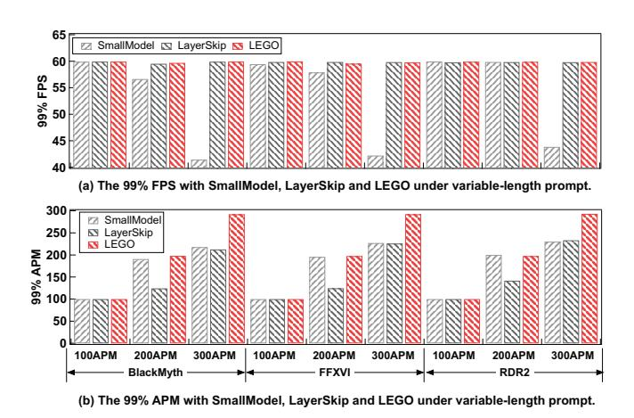
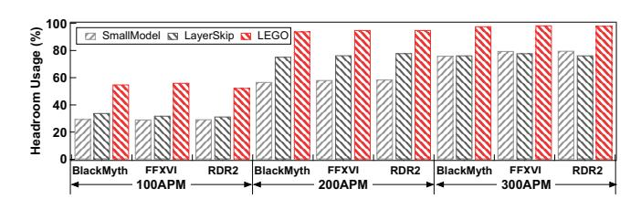
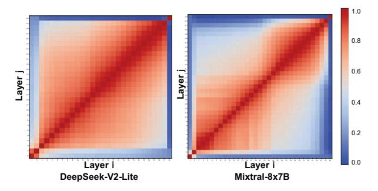

# *D. Support for Sudden Spike & Variable-length prompts*

We define a sudden spike as an event where the rendering workload between two consecutive frames increases by more than 50%. Experimental results show that only 1.2% of frames exhibit such spikes, and even within these windows, the prediction error remains below 1.3%. This is because, each LLM execution window spans 12-36 frames, making a singleframe spike negligible to the overall headroom prediction. Moreover, multi-frame workload increases can be effectively captured by our temporal prediction model.

To handle severe spikes, we enhance the scheduler to maintain strict QoS. After each token generation, the scheduler updates the temporal prediction with the latest workload data. For instance, after generating the first token, the remaining tokens correspond to a 16-frame execution window, which is used for re-prediction. If a QoS violation risk is detected, the scheduler dynamically adjusts the layer-skipping strategy for subsequent tokens.

To support variable-length prompts, we add a duration predictor for LLM inference task. While the duration prediction is widely studied in previous works [49], [68], [69], we could integrate it into LEGO. Once the inference duration is predicted, we can determine an appropriate layer-skipping strategy for LLM inference based on the available GPU headroom.

#### VI. IMPLEMENTATION

We utilize llama.cpp [20] as the LLM inference framework. We use Unreal Engine 4 (UE4) [18] as the game engine, with DirectX 12 [34] as the graphics library. We integrate only the front-end of llama.cpp into UE4 and invoke other functions via a dynamic library. Since llama.cpp separates computation graph creation and traversal, we modify the traversal function to incorporate scheduling logic. The engine monitors rendering task state variables and launches inference subtasks upon rendering completion, dispatching transformer layers in the decoding phase, or self-attention and FFN sublayers in the prefilling phase. If no new rendering task arrives, additional inference subtasks continue executing. To support this, we register a new schedulable traversal function in the dynamic library, ensuring correct inference execution.

#### VII. EVALUATION

#### *A. Experiment Setup*

*1) Testbed:* Table III summarizes the software and hardware configurations used in our experiments. Notably, LEGO does not rely on any specialized hardware features of the RTX 4090, making it easily deployable on other gaming GPUs. As shown in Table III, we evaluate LEGO using three popular games and two popular LLM models. Throughout our experiments, all games are configured to run at 60 FPS with high visual settings (4K).

Current consumer-grade gaming GPUs do not support MIG usage. Cloud gaming platforms, like NVIDIA GeForce NOW [42], instead rely on NVIDIA vGPU for time slicing, which only allows static time-slice division. In our experiments, we enhance all baselines with PilotFish, a dynamic timeslice mechanism that enables the LLM inference task to immediately utilize released GPU resources once rendering completes, without waiting for a preassigned slice.

- *2) Baselines:*
- SmallModel: A naive solution is to use a smaller model from the same family to balance APM support and accuracy retention. We replace Llama3-8B [16] with Llama3-3B and Mistral-7B [4] with Mistral-4B. At runtime, we partition the LLM inference task into multiple equally sized subtasks based on the average rendering headroom of the game. Once a rendering task completes, the LLM inference task dispatches one subtask for execution.
- LayerSkip: We use two layer-skipping methods as baselines: LITE [58] and CALM [52]. Both methods rely on a runtime discrimination mechanism to determine layer skipping based on predefined thresholds. Since LITE achieves better inference accuracy, we use LITE for comparison in all experiments and evaluate both LITE and CALM in Section 7.3. After the layer-skipping strategy is determined, Layer-Skip adopts the same scheduling approach as SmallModel.

#### *B. Ensuring FPS and APM*

We first demonstrate the effectiveness of LEGO by comparing it with the two baselines across all combinations of game scenarios and LLM models.

Fig. 12: The 99% FPS and APM with *SmallModel*, *LayerSkip* and LEGO under different Game-LLM co-locations.

Figure 12(a) presents the 99th-percentile FPS of the games, while Figure 12(b) shows the 99th-percentile APM of the LLM inference tasks. As shown, SmallModel successfully handles the 100 APM and 200 APM scenarios. This is because, in Section 1, we discussed the worst-case scenario using the minimum rendering headroom. However, since rendering tasks can tolerate a slightly delayed start, SmallModel is still able to maintain FPS and APM targets in the 100 APM and 200 APM scenarios. However, under the 300 APM scenario, SmallModel experiences a 26.2% FPS drop and a 20.5% APM drop, demonstrating its limitations. Additionally, Section 7.3 further highlights the lower inference accuracy resulting from underutilized rendering headroom.

For LayerSkip, it successfully handles the 100 APM scenario for the same reason as SmallModel. However, in the 200 APM and 300 APM scenarios, it introduces a 28.6% APM drop while maintaining the game's FPS. This occurs because rendering tasks can tolerate a slightly delayed start. However, since LayerSkip does not strictly enforce resource usage constraints, it leads to severe latency violations for LLM inference tasks.

In contrast, LEGO successfully maintains both FPS and APM targets across all co-location scenarios. This is because LEGO is an algorithm–system co-design specifically tailored for gaming scenarios. On the algorithm side, LEGO introduces a resource-oriented layer-skipping adaptor that enables layerskipping based solely on resource conditions. On the system side, LEGO implements a headroom-maximizing scheduler to ensure that the latency targets of both tasks are met at runtime.

#### *C. Inference Accuracy*

In this subsection, we present the inference accuracy improvements of LEGO compared to baseline methods. Specifically, both LEGO's adaptor and the corresponding modules

TABLE IV: The inference accuracy of LEGO, LITE and CALM.

| Method | Dataset | 0    | 4    | 8    | 12   | 13   | 14   | Baseline |
|--------|---------|------|------|------|------|------|------|----------|
| LEGO   | mmlu    | 66.8 | 66.7 | 66.4 | 66.3 | 63.9 | 40.9 | 58.2     |
| LEGO   | arc-c   | 76.3 | 75.0 | 74.4 | 73.9 | 52.2 | 27.8 | 73.6     |
| LEGO   | squad   | 70.1 | 69.2 | 58.3 | 57.3 | 42.0 | 20.5 | 39.5     |
| LITE   | mmlu    | 66.8 | 14.3 | 11.2 | 8.7  | /    | /    | 58.2     |
| LITE   | arc-c   | 76.3 | 66.4 | 60.0 | 41.0 | /    | /    | 73.6     |
| LITE   | squad   | 70.1 | 41.6 | 31.9 | 19.2 | /    | /    | 39.5     |
| CALM   | mmlu    | 66.8 | /    | 21.5 | /    | 13.0 | /    | 58.2     |
| CALM   | arc-c   | 76.3 | 31.9 | /    | 22.4 | /    | /    | 73.6     |
| CALM   | squad   | 70.1 | 26.3 | /    | 2.5  | /    | /    | 39.5     |

in the baseline methods are trained on the same upstream dataset, WebInstruct. After training, we evaluate the models on three downstream datasets: MMLU, ARC-C, and SQuAD2.0. MMLU and ARC-C are evaluated based on accuracy, while SQuAD2.0 is evaluated using the F1 score.

Table IV presents the inference accuracy of Llama3-8B under different layer-skipping settings with LEGO support. We do not put the results of Mistral-7B due to the page limit, which have a similar effect. In this table, the "skip 0" column represents the original LLM accuracy, while the "baseline" column represents the accuracy of Llama3-3B. Notably, Llama3-8B achieves the same execution time as Llama3-3B when skipping 12 layers.

As shown in the table, LEGO consistently outperforms the baseline (Llama3-3B) when the number of skipped layers is smaller than 12. This demonstrates that LEGO effectively preserves LLM inference accuracy through knowledge distillation. In fact, in the 100 APM and 200 APM scenarios, LEGO requires skipping only 5 layers in 90% of cases. In the 300 APM scenario, LEGO skips only 13 layers in 80% of cases. Although LEGO's inference accuracy falls below Llama3-3B in the 300 APM scenario, Llama3-3B experiences severe latency violations under this setting. In contrast, LEGO

Fig. 13: The win rate heatmap under 200 APM scenario, each cell denotes the win rate of column model over row model.

ensures that both LLM inference and rendering tasks meet their latency targets simultaneously.

In the lower half of Table IV, we compare the inference accuracy of two layer-skipping baselines. Since these methods rely on predefined confidence thresholds for layer skipping, it can be difficult to adjust the thresholds to achieve a desired average number of skipped layers. As shown in the table, both methods suffer significant accuracy degradation due to two key factors. First, these layer-skipping methods use KV replication to fill the KV cache of skipped layers, leading to accuracy loss. Second, these methods discard the knowledge contained in the skipped layers, resulting in direct loss of important information. Based on the table, we calculate the accuracy degradation introduced by various layer-skipping techniques. The results show that LEGO reduces accuracy loss by up to 86.3% when skipping 12 layers, compared to LITE.

#### *D. Effect on Real Gaming*

To evaluate the performance of LEGO in a real gaming scenario, we adopt an open-sourced project that evaluates LLMs using *Street Fighter III*. In this project, LLMs control fighters and compete against each other to determine which model performs better in real-time gameplay. Since the game is relatively simple, it does not need the GPU for rendering.

In this experiment, we evaluate the following models: Llama3-8B, Llama3-3B, LEGO-4, LEGO-8, LEGO-12, and LITE-4. Here, LEGO-4 refers to Llama3-8B with 4 layers skipped using LEGO, while LITE-4 refers to Llama3-8B with 4 layers skipped using LITE. Each model pair is evaluated through 40 combat rounds, and all models are configured to operate at 200 APM to ensure a fair comparison of inference accuracy. We do not put the results of 100 APM and 300 APM due to the page limit, which have similar effects.

Figure 13 shows the win rate heatmap among these LLMs. Each cell represents the win rate of the model in the column over the model in the row. For example, the win rate of Llama3-8B over LITE-4 is 95.0%. As expected, Llama3-8B achieves the highest win rate against all other models due to its full parameter and knowledge capacity. Among the reduced models, LEGO-4 consistently outperforms LEGO-8, LEGO-12, Llama3-3B, and LITE-4. Similarly, LEGO-8 surpasses LEGO-12, Llama3-3B, and LITE-4. The win rate of LEGO-12 over Llama3-3B is 47.5%, indicating comparable performance. While LEGO-12 and Llama3-3B exhibit similar inference accuracy, Llama3-3B shows higher win rates against other

Fig. 14: The 99% FPS and APM with *SmallModel*, *LayerSkip* and LEGO under variable-length prompts.

models compared to LEGO-12. This is likely because LEGO was trained with limited fine-tuning data, whereas Llama3-3B is a mature, well-trained model.

It is important to note that all models in this experiment run at a fixed 200 APM, so the comparison focuses solely on inference accuracy. When applying real layer-skipping traces from *BlackMyth*, *FFXVI*, and *RDR2*, LEGO achieves a 100% win rate over the baselines due to its ability to maintain the target APM under limited resources.

#### *E. Effect vs Nvidia ACE*

Nvidia ACE [43] is a LLM-powered AI game companion, which has drawn significant attention. Since the highest priority in gaming is to ensure the player's visual experience, Nvidia ACE proposes a relatively small model, INT4-based Nemotron3-4B. Experimental results show that INT4-based Nemotron3-4B achieves win rates of 5%, 12.5%, 12.5%, 15%, and 15% against Llama3-8B, LEGO-4, LEGO-8, LEGO-12, and Llama3-3B, respectively. All opponents use FP16 precision, as LEGO could utilize more GPU headroom to support FP16 execution. These results demonstrate that LEGO outperforms NVIDIA ACE. Actually, in all experiments, we use an FP16-based Llama3-3B as a stronger baseline.

### *F. Variable-length Prompts*

In this experiment, the input length is uniformly sampled within the range [256, 1024]. Figure 14(a) presents the 99thpercentile FPS of the games, and Figure 14(b) shows the 99thpercentile APM of the LLM inference tasks.

As shown, SmallModel successfully handles the 100 APM scenario but fails under 200 APM and 300 APM. At 200 APM, it experiences a 3.1% FPS drop and a 2.3% APM drop; at 300 APM, the drops increase to 29.3% and 25.0%, respectively. This occurs because SmallModel cannot sustain inference workloads when the input length exceeds 768 under high APM conditions. For LayerSkip, it successfully handles the 100 APM scenario for the same reason as SmallModel. However, under 200 APM and 300 APM, it incurs an average 30.1% APM drop while maintaining game FPS. In contrast,

Fig. 15: The headroom usage with *SmallModel*, *LayerSkip* and LEGO under different Game-LLM co-locations.

Fig. 16: The similarity heatmaps of two popular MoE Models.

LEGO consistently maintains both APM and FPS across all scenarios, demonstrating its robustness and effectiveness under variable input conditions.

### *G. Rendering Headroom Usage*

Figure 15 presents the headroom usage of SmallModel, LayerSkip, and LEGO when co-locating Llama models with games under different APM scenarios. As shown in Figure 15, LEGO improves rendering headroom usage by 25.2%, 28.6%, and 18.8% compared to SmallModel in the 100 APM, 200 APM, and 300 APM scenarios. Similarly, LEGO achieves 0%, 14.0%, and 16.2% improvement in rendering headroom usage over LayerSkip in the three APM scenarios.

In the 100 APM scenario, LEGO shows no improvement over LayerSkip. This is because the rendering headroom between rendering tasks alone is sufficient for LLM inference. However, in the 200 APM and 300 APM scenarios, LEGO's improved headroom usage primarily stems from its ability to utilize GPU idle time within rendering tasks, enabling more efficient execution of LLM inference tasks.

#### *H. MoE Models*

We evaluate LEGO on two mainstream MoE models, DeepSeek-V2-Lite and Mixtral-8x7B. Figure 16 first illustrates the similarity heatmaps of both models. As shown, both MoE models exhibit higher inter-layer similarity in the later layers, consistent with the dense LLMs.

Table V reports the inference accuracy of both models under various layer-skipping configurations and datasets. Since DeepSeek-V2-Lite has 28 layers, we test skipping 3, 6, and 9 layers; for Mixtral-8x7B, we skip 4, 8, and 12 layers, consistent with the dense LLM settings. As shown, the adaptor effectively preserves inference accuracy when fewer than eight layers are skipped, but accuracy degradation becomes more pronounced at higher skip levels. This occurs because a

TABLE V: The inference accuracy of LEGO under different layer-skipping configurations.

| Model    | Dataset | Origin | skip-3/4 | skip-6/8 | skip-9/12 |
|----------|---------|--------|----------|----------|-----------|
| DeepSeek | mmlu    | 56.6   | 56.3     | 56.1     | 45.1      |
| DeepSeek | arc-c   | 55.6   | 55.4     | 53.2     | 44.2      |
| DeepSeek | squad   | 26.8   | 25.5     | 23.5     | 13.1      |
| Mixtral  | mmlu    | 67.8   | 67.8     | 67.3     | 59.9      |
| Mixtral  | arc-c   | 61.7   | 56.1     | 50.8     | 14.9      |
| Mixtral  | squad   | 35.3   | 32.9     | 30.4     | 16.3      |

TABLE VI: The inference accuracy and Normalized Inference Time of MoE models when adjusting topk.

| Model    | topk | accuracy | Normalized Inference Time |
|----------|------|----------|---------------------------|
| DeepSeek | 6    | 56.6     | 100.00%                   |
| DeepSeek | 4    | 55.1     | 93.94%                    |
| DeepSeek | 2    | 49.3     | 88.33%                    |
| DeepSeek | 1    | 35.1     | 84.47%                    |
| Mixtral  | 2    | 67.8     | 100.00%                   |
| Mixtral  | 1    | 61.2     | 90.71%                    |

substantial portion of knowledge in MoE architectures resides within experts, and removing entire transformer layers disrupts expert routing and representation learning.

We further evaluate DeepSeek-V2-Lite and Mixtral-8x7B by measuring inference accuracy and latency across different top-k values. As shown in Table VI, reducing top-k maintains reasonable accuracy for MoE models, but execution time does not decrease proportionally. Moreover, since top-k is typically a small integer, it provides only a few discrete adjustment options, corresponding to fixed resource usage levels for LLM inference. This limited flexibility makes quantization poorly suited for dynamic resource conditions in gaming scenarios.

#### *I. Multiple AI Agents*

When multiple agents are present (up to nine AI agents in Dota-like games), LLM inference must be executed in batches, which dramatically increases latency. For instance, with an input length of 512, Llama3-8B requires about 400 ms to generate the first token at batch size = 9, while the execution window at 200 APM is only 300 ms. Therefore, when multiple AI agents are required, smaller models such as Llama3-3B or below must be used.

Our method fully supports Llama3-3B with adaptor-based layer skipping. Experimental results show that, at input length = 512, batch size = 9, and output length = 8, LEGO maintains the target FPS and target APM under both 100 APM and 200 APM scenarios. In contrast, SmallModel can only support Llama3-1B at 100 APM and fails to meet performance targets at 200 APM. However, LEGO cannot support Llama3-3B at 300 APM, as the LLM inference time (300 ms) exceeds the execution window (200 ms).

#### *J. Justifying APM as a Target*

For human players, a high-quality 150 APM gameplay often outperforms a low-quality 200 APM one. However, this observation does not hold for LLMs. Table VII shows the win rate of 150APM Llama3-8B against LEGO-4, LEGO-8, LEGO-12 and Llama3-3B under 200 APM. As shown, 150

TABLE VII: The win rate of Llama3-8B (150 APM) against the opponent models (200 APM).

|                    | LEGO-4 | LEGO-8 | LEGO-12 | Llama3-3B |
|--------------------|--------|--------|---------|-----------|
| Llama3-8B (150APM) | 7.5%   | 10%    | 12.5%   | 7.5%      |

APM Llama3-8B achieves a maximum win rate of 12.5%. This is because LLMs with layer skipping could also maintain high inference accuracy whereas the action quality of human players varies widely, often approaching zero. In LLMpowered gaming, APM serves as a user- or developer-defined operational target, assuming that each action is effective. Hence, we adopt APM as the primary performance metric.

#### *K. Overhead and Discussions*

*Overhead:* The overhead of our method primarily arises from two aspects: offline adaptor preparation and online LR model training. For offline adaptor preparation, the overhead depends on the number of adaptors required for a given colocation scenario. BlackMyth, for instance, requires up to 14 LLM adaptors and has a total training time of 36 hours. This offline overhead is negligible.

Each adaptor (an FFN network) occupies 268.8 MB, totaling 3.23 GB for 12 adaptors. The intermediate-result tensor adds 67.5 MB, but since it is required regardless of layer skipping, it incurs no extra memory overhead. At runtime, fitting an LR model with three input windows takes only 0.9 ms, making it suitable for scheduling.

*Discussion about Adaptive Rendering Workload:* Adaptive rendering techniques are activated only when GPU resources are insufficient. Methods such as Dynamic Resolution Scaling (DRS) and Microsoft Flight Simulator Scaling (MSFS) dynamically reduce rendering workloads to maintain frame rate. In our experiments, all games were configured at maximum graphics settings with DRS enabled, yet no workload adjustment was triggered on the RTX 4090.

*Discussion about Quantization and Dynamic Pruning:* LEGO is compatible with quantization techniques. Currently, LEGO supports experiments using FP16-based Llama3-8B. After applying INT4 quantization, LEGO can further support LLMs up to 30B parameters. In addition, LEGO can work with any static optimization method, like static quantization and sparsity methods. In contrast, LEGO cannot cooperate with dynamic acceleration methods, since such approaches introduce execution-time uncertainty and additional computational overhead.

*Discussion about Small Language Models:* Although Small Language Models (SLMs) are becoming increasingly capable, SLMs struggle to handle long-context reasoning and deep compositional tasks. As a result, while SLMs may alleviate some of the challenges that LEGO addresses in simple tasks, LEGO remains essential for more complex scenarios, which require longer contexts, deeper reasoning, and extended computation time under limited resources.

#### VIII. RELATED WORK

*a) Layer Skipping:* With large language models, accelerating inference by selectively skipping layers is a key research focus. CALM [52] trains a classifier to assess token consistency and adjusts computational resources dynamically. LITE [58] employs confidence-based early exiting for layer selection. These methods reduce average computation but struggle with dynamic, limited time in Gaming-LLM co-location. In addition, several works [17], [35], [37] have proposed layerskipping methods to accelerate LLM inference. However, these approaches focus solely on the dynamics of token generation and fail to provide static and stable acceleration suitable for gaming scenarios.

More importantly, LLM-Streamline [13] also proposes to replace consecutive transformer layers with a lightweight network. However, we believe that LLM-Streamline's reasoning process for the design is insufficient. While more than 90% of consecutive transformer layers exhibit over 80% similarity, this alone does not justify skipping them. Our experiments show that skipping discrete layers leads to greater performance degradation than skipping consecutive ones. This is because knowledge is distributed not only within individual transformer layers but also across their inter-layer connections, and skipping discrete layers leads to more knowledge loss.

- *b) Game Co-location:* Several studies have explored colocating different games [29], [30], [50], [65] and games with other tasks [9], [66]. GAugur [29] employs machine learning to predict performance interference among co-located games. PilotFish [66] integrates cloud gaming with deep learning training, utilizing idle GPU cycles between frames. However, these co-located tasks lack strict runtime requirements, making it impractical to dynamically adjust them based on varying computation times in our scenario.
- *c) GPU Co-location:* Currently, numerous researches focus on improving GPU utilization and optimizing the performance of co-located applications. Several systems have been developed for handling DNN inference [15], [19], [33], [47] and training workloads [31], [62]. TurboTransformers [19] addresses memory allocation and algorithm optimization for variable-length requests. Additionally, some systems are designed to handle both real-time and best-effort tasks in a biased GPU sharing environment [12], [25], [56], [64], [67]. However, these systems generally fail to address the challenges in Game-LLM co-location scenarios where computational resources are dynamic and often insufficient.

#### IX. CONCLUSION

In this work, we propose LEGO, an algorithm-system codesign that enables the efficient co-location of LLM inference and game rendering tasks. By introducing a resource-oriented layer-skipping adaptor and a headroom-maximizing scheduler, LEGO effectively balances resource utilization while ensuring latency targets for both tasks. Experimental results on an Nvidia RTX 4090 demonstrate significant improvements in rendering headroom usage and LLM inference accuracy.

#### ACKNOWLEDGMENTS

This work is partially sponsored by the National Key Research and Development Program of China (2024YFB4505703), the National Natural Science Foundation of China (62302302, 62232011), and Natural Science Foundation of Shanghai Municipality (24ZR1430500). This work was supported by Ant Group through CCF-Ant Research Fund. Quan Chen is the corresponding author.

#### REFERENCES

- "Actions per minute define in lark," https://www.larksuite.com/en\_us/ topics/gaming-glossary/actions-per-minute-apm, accessed: January 10, 2025.
- [2] "Actions per minute define in wikipedia," https://en.wikipedia.org/wiki/ Actions\_per\_minute, accessed: January 10, 2025.
- [3] "Evaluate Ilms in real time with street fighter iii," https://github.com/ OpenGenerativeAI/Ilm-colosseum, accessed: January 10, 2025.
- [4] "Mistral-7b and mistral-4b," https://arxiv.org/abs/2310.06825, accessed: January 10, 2025.
- [5] "Nvidia nsight systems," https://developer.nvidia.com/nsight-systems, accessed: January 10, 2025.
- [6] J. A., "How to Run Open-Source LLMs Locally with the OpenAI Connector and Ollama in Mendix," https://www.mendix.com/blog/how-to-run-open-source-llms-locally-with-the-openai-connector-and-ollama/, 2024, accessed: 2025-07-27.
- [7] C. Berner, G. Brockman, B. Chan, V. Cheung, P. Debiak, C. Dennison, D. Farhi, Q. Fischer, S. Hashme, C. Hesse *et al.*, "Dota 2 with large scale deep reinforcement learning," *arXiv preprint arXiv:1912.06680*, 2019.
- [8] B. Chen, C. Shu, E. Shareghi, N. Collier, K. Narasimhan, and S. Yao, "Fireact: Toward language agent fine-tuning," arXiv preprint arXiv:2310.05915, 2023.
- [9] B. Chen, H. Zhao, W. Cui, Y. He, S. Zhang, Q. Chen, Z. Li, and M. Guo, "Maximizing the utilization of gpus used by cloud gaming through adaptive co-location with combo," in *Proceedings of the 2023* ACM Symposium on Cloud Computing, 2023, pp. 265–280.
- [10] J. Chen, Y. Lin, S. Peng, S. Wu, K. Kent, H. Dai, K. Ye, and Y. Wang, "Understanding serverless inference in mobile-edge networks: A benchmark approach," *IEEE Transactions on Cloud Computing*, 2024.
- [11] P. Chen, P. Bu, J. Song, Y. Gao, and B. Zheng, "Can vlms play action role-playing games? take black myth wukong as a study case," *arXiv* preprint arXiv:2409.12889, 2024.
- [12] Q. Chen, H. Yang, J. Mars, and L. Tang, "Baymax: Qos awareness and increased utilization for non-preemptive accelerators in warehouse scale computers," ACM SIGPLAN Notices, vol. 51, no. 4, pp. 681–696, 2016.
- [13] X. Chen, Y. Hu, J. Zhang, Y. Wang, C. Li, and H. Chen, "Streamlining redundant layers to compress large language models," in *The Thirteenth International Conference on Learning Representations*, 2025.
- [14] P. Cheng, Y. Dai, T. Hu, H. Xu, Z. Zhang, L. Han, N. Du, and X. Li, "Self-playing adversarial language game enhances llm reasoning," Advances in Neural Information Processing Systems, vol. 37, pp. 126515–126543, 2024.
- [15] A. Dhakal, S. G. Kulkarni, and K. Ramakrishnan, "Gslice: controlled spatial sharing of gpus for a scalable inference platform," in *Proceedings* of the 11th ACM Symposium on Cloud Computing, 2020, pp. 492–506.
- [16] A. Dubey, A. Jauhri, A. Pandey, A. Kadian, A. Al-Dahle, A. Letman, A. Mathur, A. Schelten, A. Yang, A. Fan et al., "The llama 3 herd of models," arXiv preprint arXiv:2407.21783, 2024.
- [17] M. Elhoushi, A. Shrivastava, D. Liskovich, B. Hosmer, B. Wasti, L. Lai, A. Mahmoud, B. Acun, S. Agarwal, A. Roman *et al.*, "Layerskip: Enabling early exit inference and self-speculative decoding," *arXiv* preprint arXiv:2404.16710, 2024.
- [18] Epic Games, "Unreal engine." [Online]. Available: https://www. unrealengine.com
- [19] J. Fang, Y. Yu, C. Zhao, and J. Zhou, "Turbotransformers: an efficient gpu serving system for transformer models," in *Proceedings of the* 26th ACM SIGPLAN Symposium on Principles and Practice of Parallel Programming, 2021, pp. 389–402.
- [20] ggml, "LlaMa.cpp," https://github.com/ggml-org/llama.cpp, 2022, accessed: 2025-07-27.

- [21] Git-disl, "LLM Game Agent Papers," https://github.com/git-disl/ awesome-LLM-game-agent-papers, 2024, accessed: 2025-07-27.
- [22] Google, "Google recaps how its LLMs could change in-game interactions," https://the-decoder.com/google-recaps-how-its-llms-couldchange-in-game-interactions/, 2024, accessed: 2025-07-27.
- [23] J. Gregory, Game engine architecture. AK Peters/CRC Press, 2018.
- [24] C. Guo, J. Tang, W. Hu, J. Leng, C. Zhang, F. Yang, Y. Liu, M. Guo, and Y. Zhu, "Olive: Accelerating large language models via hardware-friendly outlier-victim pair quantization," in *Proceedings of the 50th Annual International Symposium on Computer Architecture*, 2023, pp. 1–15.
- [25] M. Han, H. Zhang, R. Chen, and H. Chen, "Microsecond-scale preemption for concurrent {GPU-accelerated} {DNN} inferences," in 16th USENIX Symposium on Operating Systems Design and Implementation (OSDI 22), 2022, pp. 539–558.
- [26] InZOI, "Creating Next-Gen Agents in KRAFTON's inZOI," https://schedule.gdconf.com/session/creating-next-gen-agents-inkraftons-inzoi-presented-by-nvidia/911189?utm\_source=chatgpt.com, 2025, accessed: 2025-10-21.
- [27] I. Lambe, "The NEW Surprising Number of Steam Games that Use GenAI," https://www.totallyhuman.io/blog/the-surprising-new-numberof-genai-games-on-steam, 2025, accessed: 2025-10-21.
- [28] J. Leandro, S. Rao, M. Xu, W. Xu, N. Jojic, C. Brockett, and B. Dolan, "Geneva: Generating and visualizing branching narratives using llms," in 2024 IEEE Conference on Games (CoG). IEEE, 2024, pp. 1–5.
- [29] Y. Li, C. Shan, R. Chen, X. Tang, W. Cai, S. Tang, X. Liu, G. Wang, X. Gong, and Y. Zhang, "Gaugur: Quantifying performance interference of colocated games for improving resource utilization in cloud gaming," in *Proceedings of the 28th international symposium on high*performance parallel and distributed computing, 2019, pp. 231–242.
- [30] Y. Li, C. Zhao, X. Tang, W. Cai, X. Liu, G. Wang, and X. Gong, "To-wards minimizing resource usage with qos guarantee in cloud gaming," *IEEE Transactions on Parallel and Distributed Systems*, vol. 32, no. 2, pp. 426–440, 2020.
- [31] G. Lim, J. Ahn, W. Xiao, Y. Kwon, and M. Jeon, "Zico: Efficient {GPU} memory sharing for concurrent {DNN} training," in 2021 USENIX Annual Technical Conference (USENIX ATC 21), 2021, pp. 161–175.
- [32] C. Lin, Z. Han, C. Zhang, Y. Yang, F. Yang, C. Chen, and L. Qiu, "Parrot: Efficient serving of {LLM-based} applications with semantic variable," in 18th USENIX Symposium on Operating Systems Design and Implementation (OSDI 24), 2024, pp. 929–945.
- [33] Z. Liu, J. Leng, Z. Zhang, Q. Chen, C. Li, and M. Guo, "Veltair: towards high-performance multi-tenant deep learning services via adaptive compilation and scheduling," in *Proceedings of the 27th ACM International* Conference on Architectural Support for Programming Languages and Operating Systems, 2022, pp. 388–401.
- [34] F. Luna, Introduction to 3D game programming with DirectX 12. Mercury Learning and Information, 2016.
- [35] X. Luo, W. Wang, and X. Yan, "Adaptive layer-skipping in pre-trained llms," arXiv preprint arXiv:2503.23798, 2025.
- [36] W. Ma, Q. Mi, Y. Zeng, X. Yan, Y. Wu, R. Lin, H. Zhang, and J. Wang, "Large language models play starcraft ii: Benchmarks and a chain of summarization approach," arXiv preprint arXiv:2312.11865, 2023.
- [37] X. Men, M. Xu, Q. Zhang, B. Wang, H. Lin, Y. Lu, X. Han, and W. Chen, "Shortgpt: Layers in large language models are more redundant than you expect," arXiv preprint arXiv:2403.03853, 2024.
- [38] K. Meng, D. Bau, A. Andonian, and Y. Belinkov, "Locating and editing factual associations in GPT," Advances in Neural Information Processing Systems, vol. 35, pp. 17359–17372, 2022.
- [39] NetEase, "NetEase to add game version of ChatGPT to Justice Online Mobile for dialogue generation and unique reactions," https://gameworldobserver.com/2023/02/16/netease-chatgpt-justice-online-mobile-dialogue-generation?utm\_source=chatgpt.com, 2025, accessed: 2025-10-21.
- [40] A. News, "Can AI make video games more immersive?" https://apnews.com/article/ai-artificial-intelligence-video-games-npcc1327bb9130136d0a5f658f44176c5e7, 2024, accessed: 2025-07-27.
- [41] Nvidia, "RTX 4090 whitepaper," https://images.nvidia.com/aem-dam/ Solutions/geforce/ada/nvidia-ada-gpu-architecture.pdf, 2023, accessed: 2025-07-27.
- [42] Nvidia, "GeForce NOW," https://www.nvidia.com/en-sg/geforce-now/, 2025, accessed: 2025-10-21.
- [43] Nvidia, "NVIDIA ACE for Games," https://developer.nvidia.com/acefor-games, 2025, accessed: 2025-10-21.

- [44] Nvidia, "NVIDIA Announces First Digital Human Technologies On-Device Small Language Model," https://blogs.nvidia.com/blog/digitalhuman-technology-mecha-break/, 2025, accessed: 2025-10-21.
- [45] Nvidia, "NVIDIA Redefines Game AI With ACE Autonomous Game Characters," https://www.nvidia.com/en-us/geforce/news/nvidia-aceautonomous-ai-companions-pubg-naraka-bladepoint/, 2025, accessed: 2025-10-21.
- [46] Nvidia, "RTX 5090 whitepaper," https://images.nvidia.com/aem-dam/ Solutions/geforce/blackwell/nvidia-rtx-blackwell-gpu-architecture.pdf, 2025, accessed: 2025-07-27.
- [47] C. Olston, N. Fiedel, K. Gorovoy, J. Harmsen, L. Lao, F. Li, V. Rajashekhar, S. Ramesh, and J. Soyke, "Tensorflow-serving: Flexible, highperformance ml serving," *arXiv preprint arXiv:1712.06139*, 2017.
- [48] J. S. Park, J. C. O'Brien, C. J. Cai, M. R. Morris, P. Liang, and M. S. Bernstein, "Generative agents: Interactive simulacra of human behavior. arxiv," *arXiv preprint ArXiv:2304.03442*, 2023.
- [49] P. Patel, E. Choukse, C. Zhang, A. Shah, ´I. Goiri, S. Maleki, and R. Bianchini, "Splitwise: Efficient generative llm inference using phase splitting," in *2024 ACM/IEEE 51st Annual International Symposium on Computer Architecture (ISCA)*. IEEE, 2024, pp. 118–132.
- [50] Z. Qi, J. Yao, C. Zhang, M. Yu, Z. Yang, and H. Guan, "Vgris: Virtualized gpu resource isolation and scheduling in cloud gaming," *ACM Transactions on Architecture and Code Optimization (TACO)*, vol. 11, no. 2, pp. 1–25, 2014.
- [51] S. Sarfaraz, "1 in 5 Steam games released in 2025 use Generative AI," https://tech4gamers.com/1-in-5-steam-games-in-2025-usegenerative-ai/, 2025, accessed: 2025-10-21.
- [52] T. Schuster, A. Fisch, J. Gupta, M. Dehghani, D. Bahri, V. Tran, Y. Tay, and D. Metzler, "Confident adaptive language modeling," *Advances in Neural Information Processing Systems*, vol. 35, pp. 17 456–17 472, 2022.
- [53] X. Shao, W. Jiang, F. Zuo, and M. Liu, "Swarmbrain: Embodied agent for real-time strategy game starcraft ii via large language models," *arXiv preprint arXiv:2401.17749*, 2024.
- [54] C. Siebler, "Optimizing latency for Azure OpenAI Service," https: //clemenssiebler.com/posts/optimizing-latency-azure-openai/, 2023, accessed: 2025-07-27.
- [55] Steam, "AI Roguelite," https://store.steampowered.com/app/1889620/ AI Roguelite/, 2025, accessed: 2025-10-21.
- [56] F. Strati, X. Ma, and A. Klimovic, "Orion: Interference-aware, finegrained gpu sharing for ml applications," in *Proceedings of the Nineteenth European Conference on Computer Systems*, 2024, pp. 1075– 1092.
- [57] P. Sweetser, "Large language models and video games: A preliminary scoping review," in *Proceedings of the 6th ACM Conference on Conversational User Interfaces*, 2024, pp. 1–8.
- [58] N. Varshney, A. Chatterjee, M. Parmar, and C. Baral, "Accelerating llama inference by enabling intermediate layer decoding via instruction tuning with lite," *arXiv preprint arXiv:2310.18581*, 2023.
- [59] A. Vaswani, N. Shazeer, N. Parmar, J. Uszkoreit, L. Jones, A. N. Gomez, Ł. Kaiser, and I. Polosukhin, "Attention is all you need," in *Advances in neural information processing systems*, 2017.
- [60] T. Verge, "Nvidia's AI NPCs are no longer chatbots they're your new PUBG teammate," https://www.theverge.com/2025/1/6/24337949/ nvidia-ace-ai-npcs-pubg-ally-teammate?utm source=chatgpt.com, 2025, accessed: 2025-10-21.
- [61] C. Vohera, H. Chheda, D. Chouhan, A. Desai, and V. Jain, "Game engine architecture and comparative study of different game engines," in *2021 12th International Conference on Computing Communication and Networking Technologies (ICCCNT)*. IEEE, 2021, pp. 1–6.
- [62] G. Wang, K. Wang, K. Jiang, X. Li, and I. Stoica, "Wavelet: Efficient dnn training with tick-tock scheduling," *Proceedings of Machine Learning and Systems*, vol. 3, pp. 696–710, 2021.
- [63] G. Wang, Y. Xie, Y. Jiang, A. Mandlekar, C. Xiao, Y. Zhu, L. Fan, and A. Anandkumar, "Voyager: An open-ended embodied agent with large language models," *arXiv preprint arXiv:2305.16291*, 2023.
- [64] W. Xiao, S. Ren, Y. Li, Y. Zhang, P. Hou, Z. Li, Y. Feng, W. Lin, and Y. Jia, "{AntMan}: Dynamic scaling on {GPU} clusters for deep learning," in *14th USENIX Symposium on Operating Systems Design and Implementation (OSDI 20)*, 2020, pp. 533–548.
- [65] C. Zhang, J. Yao, Z. Qi, M. Yu, and H. Guan, "vgasa: Adaptive scheduling algorithm of virtualized gpu resource in cloud gaming," *IEEE Transactions on Parallel and Distributed Systems*, vol. 25, no. 11, pp. 3036–3045, 2013.

- [66] W. Zhang, B. Chen, Z. Han, Q. Chen, P. Cheng, F. Yang, R. Shu, Y. Yang, and M. Guo, "{PilotFish}: Harvesting free cycles of cloud gaming with deep learning training," in *2022 USENIX Annual Technical Conference (USENIX ATC 22)*, 2022, pp. 217–232.
- [67] W. Zhang, W. Cui, K. Fu, Q. Chen, D. E. Mawhirter, B. Wu, C. Li, and M. Guo, "Laius: Towards latency awareness and improved utilization of spatial multitasking accelerators in datacenters," in *Proceedings of the ACM international conference on supercomputing*, 2019, pp. 58–68.
- [68] Y. Zhong, S. Liu, J. Chen, J. Hu, Y. Zhu, X. Liu, X. Jin, and H. Zhang, "{DistServe}: Disaggregating prefill and decoding for goodput-optimized large language model serving," in *18th USENIX Symposium on Operating Systems Design and Implementation (OSDI 24)*, 2024, pp. 193–210.
- [69] K. Zhu, Y. Gao, Y. Zhao, L. Zhao, G. Zuo, Y. Gu, D. Xie, Z. Ye, K. Kamahori, C.-Y. Lin *et al.*, "{NanoFlow}: Towards optimal large language model serving throughput," in *19th USENIX Symposium on Operating Systems Design and Implementation (OSDI 25)*, 2025, pp. 749–765.