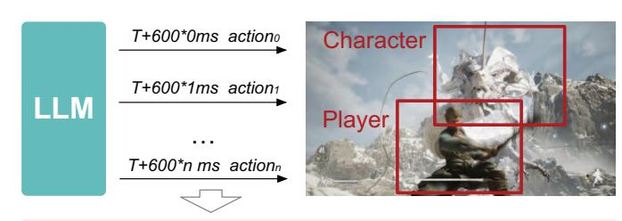
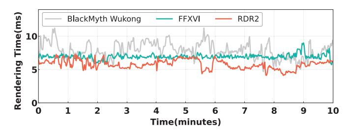
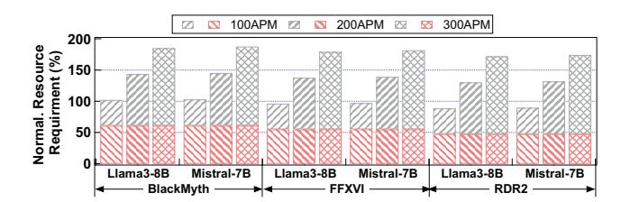
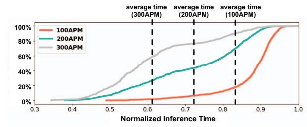
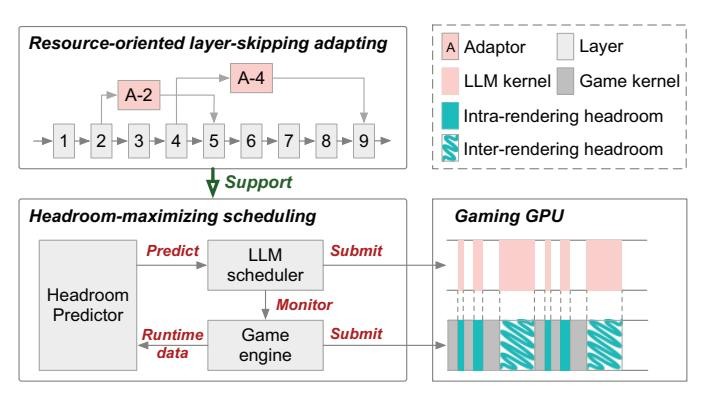
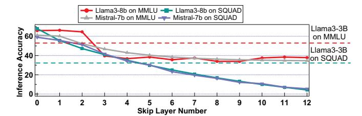
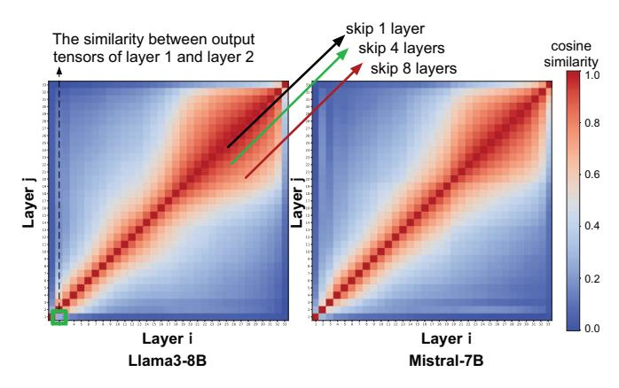
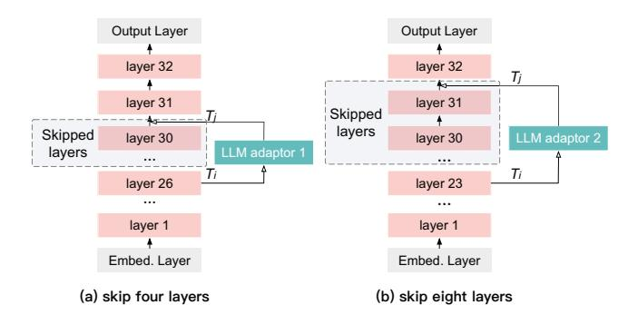
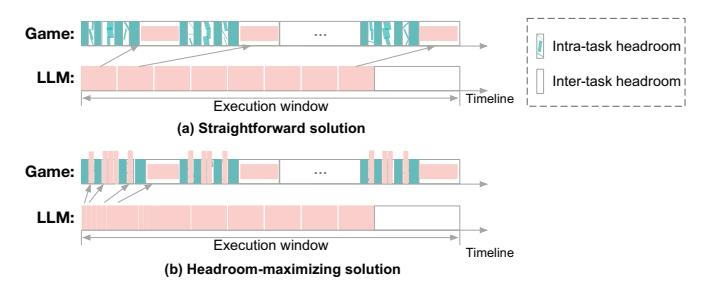
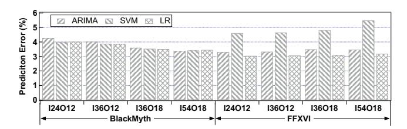

# II. BACKGROUND AND MOTIVATION

#### *A. Trends in Using LLMs in Games*

As of 2025, approximately 7% of all games on Steam (about 7,800 out of 110,000) incorporate AI technologies [27]. The proportion of newly released games adopting LLMs has grown by over 700% compared to 2024 [51]. Among these, 16 games (4 released before 2024 and 12 in 2025) explicitly report using LLMs at runtime [26], [39], [44], [45], [55], [60]. Table I shows the specific applications of representative games.

More importantly, NVIDIA has introduced the LLMpowered game companion ACE in 2023, which has attracted significant attention and adoption from game studios [43]. Meanwhile, academic interest has surged, with 57, 141, and 159 papers published in 2023, 2024, and 2025, respectively [21], [22], [28], [40], [57]. This surge in both industrial adoption and academic output underscores the increasing significance and momentum of this emerging field.

#### *B. LLM workflow in Game*

Taking the combat scenario as an example, LLMs simulate player behavior to act as characters or enemies with varying difficulty levels. Figure 2 illustrates the workflow of LLMs in such scenarios. As shown, human players continuously perform in-game actions at a certain frequency. In response, LLMs must generate actions at a comparable rate [1], [2], [7].

*Prompt: This is a combat scenario. You are the character. The goal is to reduce the player's health to zero…*

- *scenario description: 50 -100 tokens*
- *NPC and player statues (health and skills): 200 300 tokens*
- *history effect (actions and their effect): 100 300 tokens*

*Output: Move X0 Y0 Z0 Move X1 Y2 Z2… (4 - 20 tokens)*

Fig. 2: The LLM workflow in combat scenarios.

Fig. 3: The execution times of rendering tasks for three games.

The frequency of human player actions is commonly measured using the metric *Actions Per Minute (APM)*. Average players typically have an APM of 50–100, excellent players range between 150–200, and professional players achieve 250–300. To match the operational frequency of human players, the LLM's action generation rate should adapt accordingly. In this paper, we select three representative scenarios corresponding to APM levels of 100, 200, and 300, representing average, advanced, and professional gameplay.

In the 100 APM combat scenario, the LLM should generate one action every 600 milliseconds. The lower part of Figure 2 illustrates a possible input-output pair for a single action. As shown in the figure, the LLM input consists of three aspects: (1) the current game scene's state information, (2) the current state information of the character and player, and (3) historical action information. The LLM output contains 4–20 tokens, encoding information for one to five skills. Each skill includes its name and emission direction. Five skills represent a combo, referring to consecutive skill executions within a short time. When the LLM generates the action, the game engine executes the action in the game scene.

Following prior works [23], [61], key game states (e.g., player positions, skill states) are directly accessible from the game engine. Since the input length and output length fall within a range, we select 512 as the representative input length and 16 as the output length throughout the paper.

#### *C. The Co-location of Game and LLM*

*1) Inefficiency of Existing Deployment:* While existing research typically employs separate hardware for game rendering and LLM inference tasks, this approach is not feasible on the

Fig. 4: The total resource requirements of Game-LLM colocation pairs across three APM scenarios.

client side, as most users have access to only a single GPU on their personal machines.

In this case, there are two possible options for the client: using cloud-based LLM services or co-locating both tasks on the same gaming GPU. However, for Azure OpenAI, network latency ranges from about 20–110 ms within nearby regions and can reach up to 300 ms across continents [54]. Meanwhile, using the OpenAI API adds around 300–700 ms of latency compared to running the model locally [6]. The network latency is unacceptable for gaming scenarios, where 200 APM and 300 APM workloads demand SLO targets of 300 ms and 200 ms, respectively [10], [32]. Moreover, LLM services rely on large batch sizes to improve resource utilization, which further increases end-to-end latency. More critically, the reliance on LLM services significantly increases the overall cost of the game and reduces its market competitiveness.

Alternatively, we examine the feasibility of local task colocation by profiling GPU utilization when game rendering runs alone. We select *Black Myth: Wukong (BlackMyth)*, *Final Fantasy XVI (FFXVI)*, *Red Dead Redemption 2 (RDR2)* as game benchmarks, and collect 30 minutes of rendering data for each. All games are configured with high visual settings (4K resolution) and run at 60 frames per second (FPS). Specifically, we measure the compute headroom between the end of one rendering task and the start of the next.

Figure 3 presents the rendering times for the three games. As shown, all rendering tasks exhibit significant compute headroom, referred to as *rendering headroom*. Specifically, the maximum rendering times for the three games are 10.1 ms, 9.1 ms, and 7.9 ms, respectively, while the SLO for rendering tasks is 16.6 ms. Over the long term, these games require GPU time slice reservations of 60.8%, 54.8%, and 47.6% to ensure all rendering tasks meet their latency targets. This suggests that co-locating game rendering and LLM inference on the same gaming GPU is a promising solution.

*2) The Challenges of Game-LLM Co-location:* Although task co-location is promising, it faces two key challenges.

First, directly co-locating rendering and LLM inference tasks exceeds GPU compute capacity. Figure 4 presents the total resource demand across three games, two LLM models (Llama3-8B [16] and Mistral-7B [4]), and three APM scenarios. In the figure, red bars represent rendering task resource consumption, while gray bars indicate LLM inference task demand. The stacked bars show the total resource demand at task co-location. As shown, 14 out of 18 scenarios exceed the

Fig. 5: The CDF of LLM inference task execution time under LITE using different threshold.

compute limit, meaning that existing GPUs lack the capacity to handle both tasks simultaneously.

Second, co-locating rendering and LLM inference tasks requires fine-grained task scheduling. Figure 1 illustrates that a single LLM inference task spans multiple rendering task periods. Direct co-location leads to severe latency violations in rendering tasks. To ensure both tasks meet their latency targets, LLM inference must utilize the fragmented headroom within rendering tasks. Moreover, Figure 3 shows that rendering task execution time fluctuates significantly, further increasing scheduling complexity.

### *D. Possible solutions*

Since ensuring the player's visual experience is the highest priority in gaming scenarios, we should reduce the computational demands of LLM inference tasks. To address this, three potential solutions exist: using smaller models, applying quantization techniques, and employing layer-skipping methods. However, the first two approaches lack the flexibility to adapt to dynamic resource conditions in task co-location scenarios. Therefore, in this paper, we focus on layer-skipping methods as a more adaptable solution.

- *1) Smaller Model:* We collect the overall computational demand when co-locating tasks with two corresponding smallsize models. Results show that, while small models can meet resource demands in the 100 APM scenario, they fail to support the 200 APM and 300 APM scenarios. Furthermore, even in the 100 APM scenario where small models can be deployed, they suffer an average inference accuracy drop of 20.41% on the MMLU, ARC-C, and SQuAD-2.0 datasets.1
- *2) Layer-skipping Methods:* Existing layer-skipping methods rely on runtime discrimination mechanisms to make pertoken layer-skipping decisions. In this work, we adopt LITE [58] as the baseline method. LITE designs a finetune method for the LLM model and defines a predefined confidence threshold for each layer. At runtime, if a token's confidence score exceeds the threshold at a given layer, LITE skips the remaining layers and outputs the token. As a result, different tokens may exit the model at different depths.

We measure the inference time of Llama3-8B [16] under LITE. Specifically, we configure LITE with corresponding

1Currently, there is a lack of mature, standardized datasets specifically tailored for LLM-based gaming. Therefore, following prior works [8], [14], [57], we use datasets that are closely aligned with gaming-related tasks, such as role-playing and reasoning.

Fig. 6: The design overview of LEGO.

thresholds for different APM scenarios. This ensures the average computation time of LLM inference aligns with the latency target. Figure 5 presents the LLM inference time on the SQuAD-2.0 dataset, with all times normalized to the latency target. As shown, 47.1% of LLM inference tasks exceed the predefined latency target, leading to latency violations.

To enable LITE to meet SLO guarantees, a naive approach is to force early layer skipping when there is a risk of SLO violation. Building on the above experiment, we implement LITE-S, an extension of LITE that incorporates SLO constraints. Experimental results show that enforcing SLO guarantees leads to a 27.2% drop in accuracy, primarily because LITE-S skips layers that are considered important by its own confidence-based mechanism.

Therefore, current layer-skipping methods could not address the challenges of task co-location in gaming scenarios.

#### III. LEGO DESIGN

In this section, we present LEGO, an algorithm-system co-design that meets the requirements of task co-location in gaming scenarios. As shown in Figure 6, LEGO proposes a resource-oriented layer-skipping adaptor and a headroommaximizing LLM scheduler. The adaptor enables LLM inference tasks to perform layer skipping based solely on compute resources while preserving inference accuracy as much as possible. The scheduler facilitates fine-grained scheduling of LLM inference tasks, maximizing the utilization of rendering headroom while ensuring the latency targets of both tasks.

Specifically, inspired by knowledge distillation, LEGO introduces a resource-oriented layer-skipping adaptor to distill knowledge from skipped layers. When defining a layerskipping strategy for a specific resource usage, LEGO identifies less important layers and then employs an adaptor (a feedforward network layer) to distill knowledge from the skipped layers. This self-distillation design caters to layer-skipping demands based on resource availability, while preserving inference quality.

With the support of the adaptor, the headroom-maximizing LLM scheduler determines the layer-skipping strategy and schedules LLM inference tasks to effectively utilize dynamic and fragmented rendering headroom at runtime. The scheduler

Fig. 7: The accuracy drops when skipping layers directly.

design is based on two key observations: (1) rendering headroom exists not only between rendering tasks but also within them, and (2) although predicting each compute headroom of multiple consecutive rendering tasks is difficult, the overall headroom of these tasks can be accurately estimated using a linear regression (LR) model.

At runtime, the scheduler employs the LR model to predict rendering headroom. Specifically, it uses the total headroom from the previous three inference windows to predict the available headroom for the next window. For example, in a 100 APM scenario, each inference window spans the total rendering headroom across 36 rendering tasks. Based on this prediction, the scheduler selects an appropriate layer-skipping strategy for the upcoming LLM inference.

Following the layer-skipping strategy, the scheduler splits the LLM inference task into smaller subtasks to utilize fragmented GPU headroom. For intra-rendering headroom, the scheduler monitors the start and end of rendering subtasks. When no rendering subtasks are active, it dispatches finegrained LLM subtasks to fill these short gaps. Once a rendering task completes, it switches to coarse-grained subtasks to better utilize the larger headroom available between rendering tasks. Throughout this process, the scheduler maximizes the use of all available rendering headroom. It is worth noting that the LR model already consider the intra-rendering headroom.

Note that, LEGO is designed for commercial game companies, rather than end users. It provides a practical deployment solution: commercial companies can train their own models and adaptors, then package them together with the game. When users download the game, both the game and the LLM are deployed and ready to run locally. In addition, LEGO can be integrated into cloud gaming platforms, like Nvidia GeForce NOW [43]. In this setting, PilotFish [66] is a timedivision management mechanism for cloud gaming, which can be leveraged to schedule LLM inference within the available compute headroom.

#### IV. LAYER-SKIPPING ADAPTOR

In this section, we first present an empirical analysis of the performance degradation caused by layer skipping based solely on resource availability. We then introduce our resourceoriented layer-skipping adaptor to mitigate the accuracy loss.

#### *A. Performance Degradation*

In Figure 7, we present the inference accuracy of two LLMs (*i.e.*, Llama3-8B and Mistral-7B), evaluated on the MMLU and SQuAD-2.0 datasets, under varying layerskipping configurations. For the experiment, "skipping 1 layer" denotes bypassing the final transformer layer of the LLM, thereby connecting the penultimate transformer layer directly to the output layer. Similarly, "skipping N layers" corresponds to bypassing the last N transformer layers.

For reference, the inference accuracy of the Llama3-3B and Mistral-4B models serves as the baseline, as indicated by the dashed lines. As shown in Figure 7, both Llama3-8B and Mistral-7B exhibit a pronounced drop in inference accuracy. When four layers are skipped, the accuracy falls below the baseline, indicating a substantial loss of model knowledge.

Theoretically, the inference accuracy drop implies a degradation of the latent knowledge representation in the LLM. Direct layer skipping may incur knowledge loss in two ways [17]: (1) the removal of knowledge encoded within individual transformer layers, and (2) the disruption of coherent representations between different transformer layers.

Faced with this pronounced performance degradation, we propose a two-stage mitigation strategy. First, we identify transformer layers that contribute less to the overall knowledge representation. Second, we employ a knowledge distillation technique to approximate and restore the knowledge encapsulated in the skipped layers, thus maintaining inference quality and enhancing computational efficiency.

#### *B. Resource-oriented Layer-skipping Adapting*

Given that all transformer layers share identical output tensor dimensions, previous studies [38] on LLM interpretability indicate that each transformer layer encodes a distinct knowledge representation in its output tensor. *Therefore, a high degree of similarity between the input and output tensors of a transformer layer implies that minimal new information is introduced at that layer, resulting in a reduced contribution of unique knowledge to the model.* Consequently, we begin by quantifying the similarity among the transformer layers.

In Figure 8, we illustrate the similarity heatmaps for Llama3-8B and Mistral-7B, in which the output tensors across all transformer layers are compared. Each block represents the similarity between the output tensor Ti of transformer layer Li and the output tensor Tj of transformer layer Lj . For example, the block enclosed by a green square in the bottomleft corner corresponds to the similarity between the output tensor T1 of layer L1 and the output tensor T2 of layer L2. Notably, the experiment for Figure 8 uses 2400 samples from the WebInstruct dataset. For each sample, we use the first 16 output tokens, consistent with our game setting.

From Figure 8, we derive three critical observations. First, the diagonal lines in the heatmap reflect the various layerskipping configurations. For instance, the blocks along the green diagonal correspond to the Layer pairs (Lj , Li) where j–i = 4, meaning they collectively represent all possible 4 layer skip candidates. Secondly, both LLMs demonstrate high inter-layer similarity in the latter layers of the network, in contrast to the lower similarity observed in the initial layers, thereby suggesting that omitting several consecutive layers in

Fig. 8: The similarity heatmaps for Llama3-8B and Mistral-7B, comparing output tensors across all transformer layers.

the later layers is a feasible approach. Finally, the output of the last transformer layer exhibits low similarity to that of the penultimate layer. Considering that the final transformer layer encodes crucial knowledge for interfacing with the output layer, it should not be skipped.

Based on these observations, we propose a resource-oriented layer-skipping adapter, implemented as an FFN layer, to replace a block of consecutive transformer layers. In particular, when skipping N layers, we identify the contiguous layer range that exhibits the highest similarity along the diagonal of the similarity heatmap. For example, when skipping four layers for Llama3-8B, the layer range from  $L_{25}$  to  $L_{29}$  displays the highest similarity. Similarly, when skipping eight layers, the layer range from  $L_{23}$  to  $L_{31}$  exhibits the highest similarity.

In Figure 9, we present two examples that illustrate the adaptor. When skipping layers during inference, an additional FFN layer is used to approximate the knowledge representation originally encapsulated by the skipped transformer layers.

#### C. Prepare Adaptors Offline

Preparing the adaptors first requires identifying the possible layer-skipping range for a specific game, followed by training the adaptors on a designated dataset.

1) Perceive the layer-skipping range: Determining the layer-skipping range can be divided into three steps.

**Step 1:** We profile the execution times of rendering tasks over a representative gameplay period. Based on these measurements, we compute the minimum and maximum computational headroom (i.e.,  $C_{min}$  and  $C_{max}$ ) for the rendering tasks. Using these values, we then calculate the minimum and maximum rendering headroom ( $H_{min}$  and  $H_{max}$ ) available for LLM inference under different APM scenarios.

**Step 2:** We measure the overall computational time  $T_{overall}$  for an LLM inference action, and profile the prefill phase  $(T_{pl})$  and the decode phase  $(T_{dl})$  for each transformer layer.

**Step 3:** Using the profiling results, we compute the minimum number of layers M that must be skipped to satisfy the minimum rendering headroom, and the maximum number N under the maximum rendering headroom. Consequently, this

Fig. 9: The LLM adaptor examples.

approach yields N-M+1 distinct layer-skipping strategies, each of which requires a separately trained adaptor.

2) Train the adaptors on the dataset: Generally, game companies build their LLMs by fine-tuning a mature base model, such as Llama3-8B, on their private datasets. Based on the resulting fine-tuned model, we first construct the inter-layer similarity heatmap using the same dataset. Specifically, we first compute the cosine similarity between transformer layers for each data item, and then produce the similarity heatmap by averaging these similarities across the entire dataset.

Next, for each specific layer-skipping strategy, we analyze the similarity heatmap to identify a contiguous range of layers with the highest similarity. For example, in a particular layer-skipping case—i.e., skipping from the k-th layer to the k+n-th layer—we employ an adaptor (a feed-forward network, FFN) [59] to approximate the transformation performed by the skipped layers (from k-th to k+n-th). The adaptor is trained by minimizing the Mean Squared Error (MSE) loss between its output and the original output of the skipped layers, which is formulated as  $\mathcal{L}_{mse} = ||f_{k+n} - \text{FFN}_k^{k+n}(f_k)||_2^2$ , where  $f_{k+n}$  and  $f_k$  are the output features of the (k+n)-th and k-th layers, respectively. FFN $_k^{k+n}$  denotes the corresponding adaptor network.

The above training process updates only the weights of the adaptor, which contains a relatively small number of parameters, making training efficient. Moreover, the process can be further accelerated by reusing intermediate outputs from earlier layers across different adaptors, reducing redundant computation. For example, in the case of *BlackMyth*, up to 14 LLM adaptors are required, and the total training time is approximately 36 hours.

#### V. HEADROOM-MAXIMIZING SCHEDULER

In this section, we first conduct an in-depth analysis of rendering headroom. Next, we design a rendering headroom prediction model to support runtime scheduling. Finally, we propose a headroom-maximizing strategy to effectively utilize the dynamic and fragmented rendering headroom.

#### A. Headroom Analysis

Figure 10(a) illustrates the scheduling requirements for LLM inference tasks under task co-location. As shown, executing an LLM inference task requires leveraging the compute headroom from multiple rendering tasks within its execution

Fig. 10: The scheduling solutions for the task co-location.

Fig. 11: The prediction accuracy of three time-series models under various configurations.

window. One straightforward method is to adopt PilotFish's method [66] to monitor rendering task completion. Once a rendering task completes, the scheduler calculates the available compute headroom based on the current timestamp and dispatches an appropriately sized LLM inference subtask.

While this method efficiently utilizes compute headroom between rendering tasks, we observe that limited compute resources can lead to excessive layer skipping in LLM inference tasks. For instance, in the 300 APM scenario across all three games, LLM inference tasks skip over 50% of transformer layers. Even though the LLM adaptor distills knowledge from skipped layers, inference accuracy still drops by 70%.

To address this issue, we further analyze GPU utilization under task co-location. We dive into the task trace using Nvidia's profiling tool *nsight-system* [5]. Experimental results reveal that while LLM inference tasks continuously occupy the GPU, rendering tasks do not. As shown in Figure 10(a), significant GPU idle time exists within rendering tasks themselves.

Further investigation reveals that intra-rendering headroom arises from optimizations within the game engine. Specifically, game engines optimize rendering by batching similar objects, accelerating the rendering pipeline. As a result, a rendering task consists of multiple subtasks, where some perform computations (rendering subtasks) and others handle auxiliary operations that do not use the GPU (auxiliary subtasks).

#### *B. Headroom Prediction*

Before layer-skipping strategy selection, the scheduler must predict the total rendering headroom within the next execution window. A naive approach is to use existing time-series models to predict the headroom of each rendering task within the window and then compute the total available headroom.

Figure 11 shows the prediction accuracy of three time-series models under various configurations. For example, I24-O12

TABLE II: The prediction errors using LR model with the execution window as a time unit across all scenarios.

| Scenarios | 100APM | 200APM | 300APM |
|-----------|--------|--------|--------|
| BlackMyth | 0.44%  | 0.87%  | 1.31%  |
| FFXVI     | 0.19%  | 0.38%  | 0.55%  |
| RDR2      | 0.27%  | 0.54%  | 0.81%  |

indicates a setup where the headroom values from 24 previous rendering tasks are used to predict the headroom of the next 12. These configurations correspond to the window sizes of different APM scenarios: 36 tasks for 100 APM, 18 for 200 APM, and 12 for 300 APM. We do not present the results of 100 APM due to its poor performance.

As shown in Figure 11, all three models exhibit prediction errors exceeding 3%, with the maximum error reaching 5.49%. Such accuracy is insufficient for selecting an optimal layer-skipping strategy for LLM inference. Additionally, these models suffer from severe prediction overhead, including both model construction time and inference time. LR requires 13.5 ms for prediction using 24 inputs, whereas ARIMA takes about 1 second and SVM exceeds 50 seconds.

To address these issues, we find that using the LLM inference execution window as a time unit significantly improves prediction accuracy. Based on this, we use an LR model, which takes the overall rendering headroom from the past three execution windows as input, and predicts the overall rendering headroom for the next execution window. Table II presents the prediction accuracy across all scenarios. The LR model achieves a maximum error of just 1.3% and an average error of only 0.6%. Furthermore, its inference overhead is just 1.3 ms with three input windows, making it well-suited for realtime headroom prediction.

## *C. Runtime Scheduling*

It is important to note that the headroom prediction already accounts for intra-rendering headroom. After predicting the rendering headroom, the scheduler determines an appropriate layer-skipping strategy for the next LLM inference task. It then splits the inference task into smaller subtasks to utilize the fragmented GPU headroom, in a way that adapts subtask granularity to fit both intra-rendering and inter-rendering headroom. Specifically, Figure 10(b) illustrates the scheduling process employed by the scheduler.

For the intra-rendering headroom, the scheduler employs a feedback-driven scheduling mechanism. It monitors the start and completion of rendering subtasks. When a rendering subtask completes, the scheduler submits a fine-grained LLM inference subtask to utilize the available GPU idle time. Once the inference subtask completes, the scheduler checks whether the next rendering subtask has started computation. If the next rendering subtask has started, the LLM scheduler waits. If the next rendering subtask has not started, the scheduler continues dispatching inference subtasks.

Meanwhile, our analysis shows that the average intrarendering headroom is 0.24 ms, while 90% of intra-rendering headroom is shorter than 0.73 ms. The total intra-rendering

TABLE III: Experimental specifications.

|            | Windows 11, CUDA driver 566.36                  |
|------------|-------------------------------------------------|
| Software   | CUDA SDK 12.1, Direct X 12.1, llama.cpp fc83a9e |
| Hardware   | Intel(R) i9-13900KF @ 3.00 GHz, Nvidia RTX 4090 |
| LLM Models | Llama3.2-8B-Instruct, Mistral-7B-Instruct-v0.3  |
| Games      | BlackMyth, FFXVI, RDR2                          |

headroom per rendering task averages 1.39 ms, with a maximum of 3.1 ms. Based on this time distribution, we observe that transformer layers could serve as an appropriate subtask granularity during the LLM inference decode phase, as their execution time is approximately 0.4 ms. During the prefill phase, attention layers and FFN layers are better suited, with execution times of 0.5 ms and 1.0 ms, respectively.

To strictly ensure that rendering tasks meet their latency targets, we apply the following runtime scheduling condition: -Tsubtasks ≤ Tminimal. Here, Tsubtask represents the execution time of each dispatched LLM inference subtask, and Tminimal represents the minimal inter-rendering headroom of all rendering tasks in the game. By enforcing this constraint at runtime, we guarantee that utilizing intra-rendering headroom does not lead to latency violations for rendering tasks.

Once a rendering task completes, the scheduler switches to coarse-grained LLM subtask scheduling to utilize the inter-rendering headroom. Based on the timestamps of the completed rendering task and the start of the next one, the scheduler can easily determine the size of LLM subtasks, which contain multiple transformer layers.

