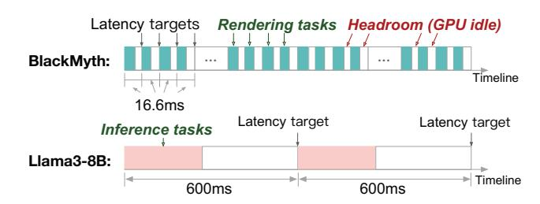

# LEGO: Supporting LLM-enhanced Games with One Gaming GPU

Han Zhao∗¶, Weihao Cui∗-¶, Zeshen Zhang, Wenhao Zhang∗, Jiangtong Li, Quan Chen∗, Pu Pang∗, Zijun Li∗, Zhenhua Han†, Yuqing Yang‡, Minyi Guo∗ ∗*Shanghai Jiao Tong University* -*National University of Singapore Tongji University* †*Shanghai Qiji Zhifeng Co., Ltd.* ‡*Microsoft Research* ¶*Equal Contribution*

*Abstract*—Artificial intelligence (AI) has been increasingly applied to gaming, with large language models (LLMs) playing a key role in character control. However, efficiently co-locating game rendering and LLM inference on one GPU presents challenges due to resource constraints, diverse latency requirements, and fine-grained task scheduling. We propose LEGO, an algorithm-system co-design that enables the efficient colocation of LLM inference and game rendering tasks. Algorithmwise, LEGO features a resource-oriented layer-skipping adaptor, which distills knowledge from skipped layers to reduce computational demand while maintaining inference accuracy. Systemwise, LEGO proposes a headroom-maximizing LLM scheduler, which dynamically partitions inference tasks to utilize available rendering headroom. Evaluations on an Nvidia RTX 4090 show that LEGO meets latency targets in all scenarios, improves rendering headroom utilization by up to 28.6%, and reduces LLM inference accuracy loss by up to 86.3% compared to current layer-skipping approaches.

### I. INTRODUCTION

Using artificial intelligence (AI) algorithms to enhance games has long been a prominent area of research [7], [36]. The recent emergence of large language models (LLMs) has opened up new possibilities for AI applications in gaming [48], [53], [63]. For example, the Open Generative AI community uses *Street Fighter III* [3] to evaluate the action skills of LLMs. Similarly, researchers at Alibaba have explored the use of LLMs to play the action game *Black Myth: Wukong (BlackMyth)* [11]. In these scenarios, the LLM receives environment information and character status as prompts and generates combat actions.

Existing research typically employs separate hardware to support game rendering and LLM inference tasks. Figure 1 illustrates the separate deployment of a popular game, *Black-Myth*, alongside an LLM inference task using Llama3-8B [16]. As shown, both game rendering and LLM inference tasks exhibit periodic execution patterns. The default configuration of *BlackMyth* is 60 frames per second (FPS), meaning a rendering task is generated every 16.6 ms and should be completed within the same 16.6 ms deadline. Meanwhile, LLM inference is designed to simulate player actions at varying skill levels, characterized by actions per minute (APM) [1], [2], [7]. An average player has an APM of approximately 100, an excellent player around 200, and a professional player about 300. Under the 100 APM scenario, an LLM inference task is generated every 600 ms, with a latency target of 600 ms.

Fig. 1: The separate deployment of a game *BlackMyth* and an LLM inference task using *Llama3-8B*.

However, existing deployment strategies are not feasible on the client side, as most users have only one GPU on their personal machines. In this case, a natural idea is to leverage cloud-based LLM services. Unfortunately, the end-toend network overhead of cloud LLM services typically ranges from 20ms to 110ms [6], [10], [32], [54]. This is unacceptable for gaming scenarios, where 200 APM and 300 APM scenarios require SLOs (Service-Level Objective) of 300 ms and 200 ms, respectively. More critically, relying on cloud-based LLM services increases the overall cost of the game and undermines its market competitiveness.

Meanwhile, we observe considerable underutilization of GPU resources when the rendering task runs alone. Experimental results on an Nvidia RTX 4090 show that *BlackMyth* with high visual settings utilizes only 60.8% of the GPU time. This underutilization suggests a promising opportunity to colocate game rendering and LLM inference on the same gaming GPU. However, effectively leveraging this opportunity is nontrivial, as the available compute headroom is insufficient, dynamic, and fragmented.

Although 39.2% of the GPU time slice appears idle in *BlackMyth*, running Llama3-8B [16] in a 100 APM scenario requires 41.9% of the GPU time–exceeding the available capacity. The resource gap only widens under 200 APM and 300 APM scenarios. Moreover, LLM inference relies on compute headroom from multiple rendering tasks for computation. Direct co-location leads to disordered contention, causing latency violations for rendering tasks. Therefore, effective co-location demands fine-grained task scheduling, which is challenging.

Since the highest priority in gaming is to ensure the player's visual experience, we should reduce the computational demands of LLM inference under limited resources. Faced with this demand, layer-skipping [52], [58] and quantization [24], [41], [46] techniques are two potential solutions. However, current GPUs only support limited formats, which means several fixed resource usage levels for LLM inference task. This lack of flexibility makes quantization poorly suited for dynamic resource conditions in task co-location within gaming. Therefore, in this work, we focus on layer-skipping techniques as a more adaptable solution.

Existing layer-skipping methods [52], [58] rely on runtime discrimination mechanisms to make per-token layer-skipping decisions. These methods typically optimize for the average number of skipped layers across all tokens, rather than enforcing guarantees for individual tokens. As a result, they easily lead to latency violations under strict SLO constraints. Meantime, adapting these methods to enforce strict SLO guarantee requires skipping layers in advance. This results in significant accuracy degradation, as they may skip layers that are deemed important by their own mechanisms.

To this end, we propose LEGO, an algorithm–system co-design approach that maintains inference accuracy while satisfying the SLOs of both LLM inference and rendering tasks. Algorithm-wise, LEGO proposes a resource-oriented layer-skipping technique that mitigates accuracy degradation when layer-skipping decisions are made based solely on resource availability. System-wise, LEGO designs a headroommaximizing scheduling strategy that enables LLM inference to fully utilize available compute resources, thereby further reducing the need for layer skipping.

Specifically, LEGO first proposes the layer-skipping adaptor for task co-location in gaming. Inspired by knowledge distillation methods, the adaptor distills information from the skipped layers. For each possible layer-skipping configuration, LEGO identifies the less important layers and trains an adaptor (a feed-forward network) to distill knowledge from them. This design mitigates the loss of critical information caused by SLO-driven layer skipping, thereby preserving the quality of inference. For runtime scheduling, LEGO then designs an LLM scheduler based on two observations: 1) rendering headroom exists not only in the gaps between consecutive rendering tasks but also within individual rendering tasks; 2) the overall headroom across these tasks can be effectively estimated, while accurately predicting per-task compute headroom of multiple consecutive rendering tasks is challenging.

At runtime, the LLM scheduler employs a linear regression (LR) model for rendering headroom prediction. The model takes the overall headroom from the previous three inference windows to predict the headroom of the next one. Based on the prediction, the scheduler determines the appropriate layerskipping strategy for the upcoming LLM inference task. After determining the layer skipping, the scheduler splits each LLM inference task into smaller subtasks to make use of fragmented GPU headroom. For intra-rendering headroom, it monitors the start and end of rendering subtasks. When no rendering subtasks are running, the scheduler dispatches fine-grained LLM subtasks to utilize this headroom. Once a rendering task completes, it switches to coarse-grained LLM subtasks

TABLE I: Representative games that using LLM at runtime.

| Game           | Year | Runtime LLM Usage                          |
|----------------|------|--------------------------------------------|
| AI Roguelite   | 2023 | Live-generate text and mechanics decisions |
| Vaudeville     | 2023 | Dialogues generated in real time           |
| AI Game Master | 2025 | Procedural quests/characters               |
| inZOI          | 2025 | LLM-driven NPCs, player-prompt generate    |
| PUBG Ally      | 2025 | Co-playable LLM agent companion            |
| Astrobuilder   | 2025 | NPC behavior/strategic guidance            |
| Mecha BREAK    | 2025 | Conversational NPCs via NVIDIA ACE         |
| AI2U           | 2025 | NPC dialogue & voice generated via LLM     |
| EmemeTown      | 2025 | NPC conversations generated in real time   |
| Life of an NPC | 2025 | LLM-directed town                          |

to better use the larger headroom between rendering tasks.

We evaluate LEGO using several popular games and LLM models on a mainstream gaming GPU, the Nvidia RTX 4090. Experimental results show that LEGO consistently meets the latency targets for both rendering and LLM inference across all APM scenarios. In addition, LEGO improves rendering headroom utilization by up to 28.6% and reduces accuracy loss by up to 86.3% compared to existing layer-skipping methods. Our key contributions are as follows:

- We present a practical solution for integrating LLMs into games without incurring the latency and cost penalties. This would have a positive impact on the gaming industry.
- We design a resource-oriented layer-skipping adaptor to distill knowledge from the skipped layers, which could reduce the latency drop of LLM.
- We propose a headroom-maximizing LLM scheduler to enable LLM inference to utilize all available rendering headroom. This helps make the optimal layer-skipping strategy.

