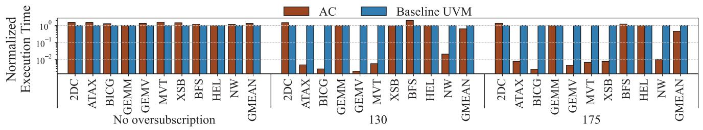
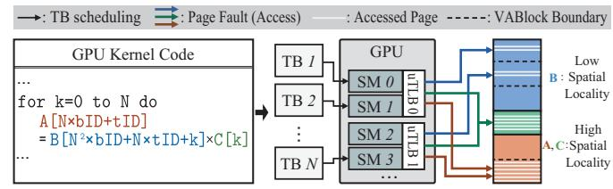

# *A. Challenges in the Existing UVM Systems*

Page Fault Handling Overheads. To improve efficiency, the UVM driver fetches up to 256 page faults at once from the GPU fault buffer [4]. Since these faults often originate from multiple VABlocks, handling the entire batch requires completing the fault handling process for all involved VABlocks [2]. Despite batching and VABlock-level grouping, handling the faults for a single VABlock typically takes tens of microseconds [30]. As a result, processing a full batch may take several milliseconds—latency that cannot be hidden by GPU context switching, leading to noticeable performance degradation [4], [5], [32], [58].

Figure 2a illustrates the average latency of the three key VABlock fault handling operations, *Populate*, *Eviction*, and *Copy*, measured across 10 different benchmarks in Table I. The results confirm that the *Populate* operation incurs the most significant latency, which is nearly twice that of the *Copy* and *Eviction* operations. This extended duration is primarily caused by the host-side unmap operation [2], an unavoidable step before pages can be copied to the GPU. To address the long fault handling time, prior works [30], [32] have attempted to overlap *Eviction* and sequential *Populate*-*Copy* by leveraging the two DMA copy engines available on modern GPUs [41]. However, since *Populate* alone dominates the total latency as we observed, such parallelization yields limited overall benefit. Consequently, hiding or reducing *Populate* latency is essential for meaningful UVM performance improvement.

Thrashing. When the working set size exceeds the available GPU memory, recently evicted pages are likely to be accessed again soon afterward, triggering repeated page faults and forcing their migration back into GPU memory. This repeated eviction and reloading of active chunks, commonly referred to as *thrashing*, causes the GPU to spend the majority of its

Fig. 3: The execution time of Access counter-based UVM (AC) and Baseline UVM.

time handling faults and transferring data rather than executing kernel computations. For clarity, in this paper, we define the aggregate size of GPU chunks actually demanded by a UVM system as the Working Chunk Set Size (WCSS). Note that WCSS can be significantly larger than the actual memory footprint of the workload, since GPU memory is allocated at a coarse granularity (e.g., 2 MB chunks), which may result in internal fragmentation.

Figure 2b illustrates the normalized geomean performance of the baseline UVM system and the Access counter-based migration (AC) across the applications in Table I, under 100%–300% oversubscription ratios. As shown in the figure, baseline UVM's execution time increases by  $33.2\times$  when the memory footprint is  $2\times$  the available GPU memory, and by  $60.7\times$  when it reaches  $3\times$ .

While such slowdowns are a consequence of thrashing, several characteristics of UVM, discussed next, make the system susceptible to thrashing. First, UVM's coarse-grained 2 MB chunk allocation inflates memory demand even when only a few 4KB pages are needed. This mismatch between actual usage and allocation becomes especially problematic for sparse access patterns, further increasing the risk of thrashing [32], [48]. Second, when GPU memory becomes scarce, UVM selects victims primarily based on their last fault time. This simplistic replacement policy often evicts active VABlocks, causing them to be re-fetched almost immediately. Such repeated eviction-refetch cycles not only waste valuable CPU-GPU bandwidth but also intensify thrashing by displacing useful data and triggering additional page faults. Lastly, UVM's long fault handling latency and speculative prefetcher exacerbate thrashing [12]. The lengthy handling process penalizes the repeated memory copies inherent to thrashing, while speculative prefetching [16], [20] further increases data movement, extending fault resolution time. As a result, thrashing in UVM systems not only arises more readily under high memory pressure but also incurs substantial overhead due to the additional data transfers over the lowbandwidth CPU-GPU interconnect.

**Summary:** UVM suffers from long page fault handling latency, with *Populate* being the largest contributor. It is further degraded by severe thrashing under memory pressure, where coarse-grained allocation and last-fault-time victim selection frequently re-evict needed data, causing repeated refetches and excessive CPU–GPU transfers.

B. Prior Approaches for Thrashing Mitigations: Adjust Page Placement via Zero-copy

To prevent thrashing in UVM systems, prior works have utilized Zero-copy: a technique where pages are pinned in host memory, allowing the GPU to directly access them at cache-line granularity without migration. A prominent real-machine technique is NVIDIA's Access counter-based migration (AC) [41]. AC initially places all pages in a Zero-copy state, then uses access counters to migrate any page to the GPU whose access count surpasses a static threshold. By copying only the most recently accessed pages to the GPU, this AC solution lowers the overall page fault rate, thereby mitigating thrashing. Even though Zero-copy accesses have substantially lower transfer bandwidth than on-board GPU memory accesses, the performance gain from mitigating thrashing can exceed these overheads.

Figure 3 presents the results for 10 benchmarks executed with both Baseline UVM and AC under three scenarios: no oversubscription, 130% oversubscription, and 175% oversubscription. In this figure, AC outperforms the baseline UVM by an average of  $2.2\times$  and  $150\times$  on thrashing-prone applications, at 175% oversubscription, highlighting the potential of Zerocopy for mitigating thrashing.

However, AC's static threshold-based page placement, which disregards memory access patterns and the current GPU memory pressure, causes performance degradation in scenarios where memory pressure is either lower or higher than the optimal spot. Under no oversubscription in Figure 3, the execution time for AC increases by an average of  $1.3\times$  and up to  $2.5\times$  compared to the baseline UVM. In addition, AC fails to completely suppress thrashing under high memory oversubscription ratios. In Figure 2b, the performance of AC degrades quadratically; at 210% and 300% oversubscription, the system is  $4.7\times$  and  $8.9\times$  slower, respectively, than the case without oversubscription.

Unlike AC, achieving optimal performance under varying GPU memory pressures requires dynamically adjusting page placement based on runtime memory conditions and access patterns to minimize the Zero-copy penalty. A key distinction guiding page placement is that Zero-copy pages are accessed at cache-line granularity (128 B) and loaded into the GPU cache, whereas migration occurs in 2 MB chunks. Due to this contrast, while a VABlock with sparse access would cause significant WCSS amplification if migrated, with Zero-copy access, the penalty is minimized because only actively

Fig. 4: GPU thread execution architecture.

used data is transferred at a fine, cache-line granularity and subsequently cached into a few cache lines. Conversely, a VABlock with high utilization where all internal pages are accessed would experience no WCSS amplification upon migration but would suffer a significant performance degradation with Zero-copy due to the need for remote access for every page. This intuition suggests that dynamically adjusting the Zero-copy policy based on a VABlock's spatial locality (i.e., VABlock utilization) can lead to a system-level optimized page placement.

Leveraging this intuition, several prior works [7], [9], [33] have proposed techniques to selectively orchestrate page placement between GPU memory and Zero-copy based on access patterns. However, these approaches require hardware modifications or compiler assistance, which undermines the core advantages of UVM: application portability and GPU memory abstraction. The reliance of prior works on additional modifications stems from a limitation of the UVM system: the host UVM driver can only observe GPU memory accesses through page faults. While some study [20] has used page fault addresses and timestamps to infer access patterns at runtime, this metric becomes inaccurate once thrashing is mitigated and faults become infrequent. In such minimum-fault scenarios, the technique cannot measure spatial locality, rendering it unsuitable for the dynamic Zero-copy adjustments required to maintain a stable, thrashing-free state. Therefore, a new runtime metric is required that can quantify spatial locality even in minimum-fault conditions.

**Summary:** A promising approach to mitigate thrashing is to dynamically adapt VABlock placement based on memory access sparsity, configuring sparse VABlocks for Zero-copy and migrating dense VABlocks, at runtime.

