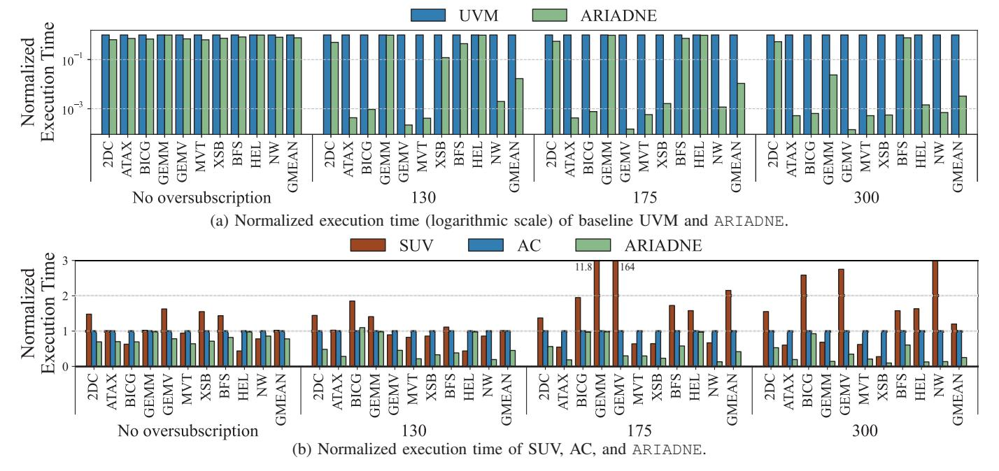

# A. Experiment Setup

System Configurations We evaluate the performance of ARIADNE on a real system which comprises an NVIDIA RTX A5000 GPU and an AMD Ryzen 7700X CPU, connected via a PCIe 4.0 x16 interface, with 64 GB of DDR5 DRAM. We use Linux kernel version 6.0 and the NVIDIA open-source kernel driver version 535.86. For experiments involving memory oversubscription, we reserve a portion of the GPU memory using cudaMalloc, a common method in prior studies [7], [20], [22]. In evaluation, the oversubscription ratio is calculated as: Memory Footprint of Various memory conditions—from ample to moderate and severe pressure—we conduct experiments under no oversubscription, as well as 130%, 175%, and 300% oversubscription ratios.

Fig. 9: Overall performances.

| Abbr. | Benchmark                                        |
|-------|--------------------------------------------------|
| 2DC   | 2D convolution of matrix                         |
| ATAX  | Matrix transpose and vector multiplication       |
| BICG  | BiCG sub kernel of BiCGStab linear solver        |
| GEMM  | Matrix multiplication                            |
| GEMV  | Scalar, vector and matrix multiplication         |
| MVT   | Matrix vector product and transpose              |
| XSB   | XSBench: Monte Carlo neutron transport algorithm |
| BFS   | Breadth first search                             |
| HEL   | Calculate hellinger distances                    |
| NW    | Needleman-Wunsch algorithm                       |

TABLE I: Benchmark Configurations.

**Workload** As shown in Table I, our experiments are conducted on 10 GPGPU benchmarks from the Rodinia [10], [22], [23], Polybench [21], [22], HeCBench [27], and XSBench [49] suites, which feature diverse memory access patterns. The memory footprint for all benchmarks is set to 4 GB. Execution time is measured as the end-to-end runtime of the CUDA kernels included in the benchmarks.

