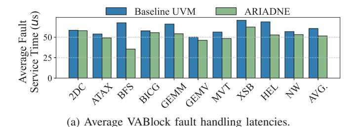
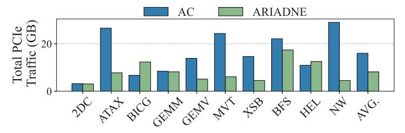
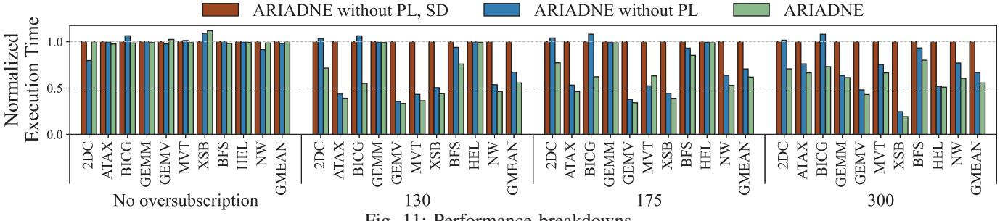
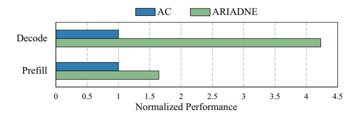

# B. Overall Performance of ARIADNE

In this section, we compare the performance of ARIADNE against 1) the baseline UVM system and 2) two state-of-the-art (SOTA) real-system methodologies. The baseline UVM system utilizes the default NVIDIA open-source kernel module (v535.86). The first SOTA is NVIDIA's Access Counter-based migration (AC) [40]. The second is SUV [7], for which we apply its provided API to the benchmark codes, configure compile-time variables such as GPU free memory size and footprints, and recompile them using the SUV framework. Since the baseline UVM system suffers from thrashing, leading to a massive performance

degradation compared to SOTA methods, we first compare UVM and ARIADNE, and then evaluate ARIADNE against the SOTA methods, for clarity.

Compare with baseline UVM Figure 9a presents the execution time of UVM and ARIADNE across various benchmarks and oversubscription ratios, plotted on a logarithmic scale. Runtimes are normalized to that of the baseline UVM in each scenario. Across all tested benchmarks and oversubscription ratios, ARIADNE consistently demonstrates significantly shorter execution times than UVM. The primary reason for these improvements is ARIADNE's ability to prevent thrashing by dynamically placing VABlocks with low Sharing Degree into Zero-copy. Even under a 300% oversubscription, ARIADNE successfully suppresses thrashing for benchmarks with sparse access patterns like ATAX, GEMV, and MVT. Furthermore, for benchmarks like GEMM and HEL, which do not thrash at 175% but do at 300% oversubscription, ARIADNE effectively prevents thrashing. Moreover, ARIADNE outperforms the baseline UVM even in no-oversubscription scenarios, thereby validating the effectiveness of pipelined VABlock fault handling.

Compare with SOTAs ARIADNE also achieves substantial performance improvements over the SOTA methods, SUV and AC. Figure 9b shows the execution times of ARIADNE, SUV [7], and AC [41] normalized to AC across various benchmarks and oversubscription ratios.

At 130%, 175%, and 300% oversubscription, ARIADNE delivers geomean speedups of  $1.9\times$ ,  $2.3\times$ , and  $4.0\times$  over AC, and achieves geomean speedups of  $1.9\times$ ,  $5.0\times$ , and  $4.8\times$  over SUV. Crucially, ARIADNE's performance advantage over SUV and AC grows as the oversubscription ratio increases. This signifies that ARIADNE's design, which lever-

(b) Total PCIe traffic at 175% oversubscription.

Fig. 10: Speedup analysis.

Fig. 11: Performance breakdowns.

ages Sharing Degree for runtime dynamic Zero-copy, prevents thrashing and achieves efficient page placement scalable to memory demands. Consequently, when the allocated memory is  $1.3 \times (130\%)$ ,  $1.75 \times (175\%)$ , and  $3 \times (300\%)$  the available GPU memory, ARIADNE's runtime is only  $1.6\times$ ,  $1.8\times$ , and  $2.3 \times$  that of the no-oversubscription case, demonstrating linear performance degradation characteristics. This contrasts sharply with the exponential degradation of UVM and the quadratic degradation of AC and SUV, highlighting the scalability and practicality of ARIADNE's design for oversubscription.

ARIADNE consistently delivers performance gains over AC and SUV in mixed access patterns benchmarks, such as BFS, XSB, and NW. Similarly, in applications that are inherently prone to thrashing due to sparse access patterns like ATAX, GEMV, and MVT, ARIADNE shows a significant performance advantage. This result suggests that the dynamic design of ARIADNE is more effective at preventing thrashing than either SUV's or AC's static approaches. For GEMM and HEL, ARIADNE performs similarly to AC up to 175% oversubscription because the working set sizes of these two benchmarks are considerably smaller than their footprints. However, at 300% oversubscription where they begin to thrash, ARIADNE provides a significant performance boost through its optimal dynamic VABlock placement.

In a few cases with no oversubscription, ARIADNE exhibits lower performance than SUV. This is attributed to the ARIADNE prefetcher, which is limited to a 2MB VABlock granularity. In contrast, SUV performs prefetching across large data ranges via compile-time static code analysis, thus achieving the highest performance in BICG, HEL and NW.

In thrashing-prone benchmarks, SUV outperforms AC but is outperformed by ARIADNE. However, in some scenarios, SUV underperforms compared to AC. For instance, due to inaccuracies in its compile-level analysis, SUV fails to prevent thrashing in the GEMV benchmark at 175% oversubscription, highlighting the limitations of relying solely on compilerassisted static analysis. The working-set size and access density, estimated through static code analysis of SUV, fail to accurately represent the dynamic memory environment, which is constantly changing due to thread scheduling and phase shifts during application execution. This discrepancy between static estimates and runtime reality may grow with GPU memory pressure, and the resulting performance penalty from incorrect memory management decisions also increases. Moreover, because ARIADNE can accurately measure a VABlock's real-time access characteristics via its Sharing Degree, it provides superior performance over SUV and AC in most lowoversubscription benchmarks.

We evaluated ARIADNE on the inference of the Llama3.1 70B model, as depicted in Figure 12. ARIADNE delivers  $4.2\times$  and  $1.6\times$  speedups over the AC in the Decode and Prefill phases, respectively. The performance gain is more pronounced in the Decode phase, which is dominated by GEMV operations. This is consistent with the results in Figure 9b, where ARIADNE yields greater improvements for GEMV kernels compared to GEMM kernels.

#### C. Reasons for Performance Improvement

Figure 10a shows the average VABlock fault handling time of Baseline UVM and ARIADNE, across 10 benchmarks. ARIADNE's Pipelined VABlock fault handling consistently reduces the VABlock fault handling latency by an average of 17%, up to 48% (BFS), without introducing penalties. Figure 10b presents a per-benchmark comparison of the total PCIe traffic for ARIADNE and AC. Across 10 benchmarks, ARIADNE consumes, on average, only 51% of the PCIe traffic

Fig. 12: Performances of Llama3.1 70B inference (input token length = 2048).

compared to AC. These results demonstrate the effectiveness of ARIADNE's pipelined fault handling and dynamic VABlock placement policy, which is guided by the Sharing Degree.

