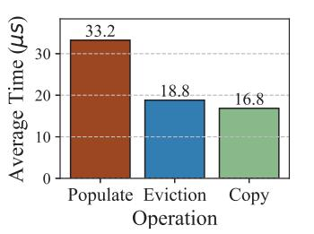
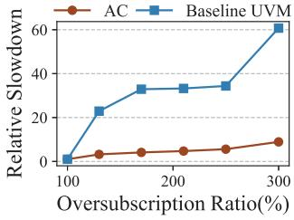

# B. Unified Virtual Memory

Unified Virtual Memory (UVM) enables the CPU and GPU to share a single virtual address space and abstracts GPU memory management, allowing applications to transparently

execute even on systems with limited GPU memory capacity without requiring code modifications [18]. Memory allocated via cudaMallocManaged is automatically managed by the UVM driver, removing the need for explicit data transfer operations such as cudaMemcpy. When a page managed by UVM (i.e., a UVM page) residing in host memory is accessed by the GPU, the UVM driver transparently migrates it into GPU memory.

To enhance efficiency, UVM manages memory at a granularity coarser than individual pages by grouping contiguous virtual address ranges into VABlocks and allocating GPU physical memory in larger units called chunks [40]. Typically, a VABlock and a chunk each correspond to a 2 MB region of virtual memory and GPU physical memory, respectively [3]. Chunks serve as the atomic units for physical memory allocation on the GPU and are organized through an eviction queue, which tracks chunk residency and facilitates selective eviction under memory oversubscription. Each VABlock maintains metadata, such as a page residency mask, to monitor the residency of individual pages within GPU memory, guiding runtime decisions regarding eviction, migration, and Zerocopy optimization.

By managing memory through VABlocks and chunks, UVM efficiently supports GPU memory oversubscription, allowing allocations that exceed the GPU's physical memory capacity. Such capabilities are becoming increasingly critical due to the widespread adoption of GPUs in diverse applications and the growing disparity between GPUs' substantial computational capabilities and their relatively limited memory capacity.

Figure 1 illustrates the page migration process managed by the UVM driver. When a GPU program accesses a UVMmanaged page that is not currently resident in GPU memory, the GPU generates a 1 page fault at a 4 KB page granularity and records this event in its fault buffer. Upon receiving an interrupt triggered by these faults, the UVM driver retrieves fault records from the buffer and initiates the 2 fault handling process. Although faults occur at a 4 KB granularity, the UVM driver batches and processes faults belonging to the same 2 MB VABlock together to enhance efficiency [30].

The fault handling procedure for each VABlock typically involves three sequential stages: 3 *Populate*, 4 *Eviction*, and 5 *Copy*. During the *Populate* stage, the UVM driver checks for available unused chunks in GPU memory and allocates a suitable chunk to the page-faulted VABlock. Typically, since a chunk and a VABlock both have a fixed size of 2 MB in UVM-enabled systems, each VABlock is allocated exactly one chunk. If there are no unused chunks available, the *Eviction* stage is triggered, where the UVM driver selects and evicts the earliest accessed chunk from the GPU. The data of this evicted chunk is migrated back to host memory, freeing space for the incoming allocation. In the subsequent *Copy* stage, the driver copies data from the host memory into the allocated GPU chunk. Although GPU memory allocation during the *Populate* stage is performed at a 2 MB granularity, the actual data copying typically occurs at a smaller granularity than 2 MB to ensure efficiency. Instead of copying pages individually

(a) Latency breakdown of UVM page fault handling.

(b) Slowdowns under different memory oversubscription ratios.

Fig. 2: Characteristics of UVM and Access-counter based migration UVM (AC) under memory oversubscription.

(4 KB each), the driver commonly performs copies at larger intermediate granularities (e.g., 64 KB) and simultaneously selects adjacent pages for prefetching to further improve transfer efficiency [16], [34]. This host-side fault handling mechanism, which involves long-latency operations and coarse-grained memory management, can significantly degrade performance, particularly under high memory pressure.

### III. DIAGNOSIS OF EXISTING WORK

