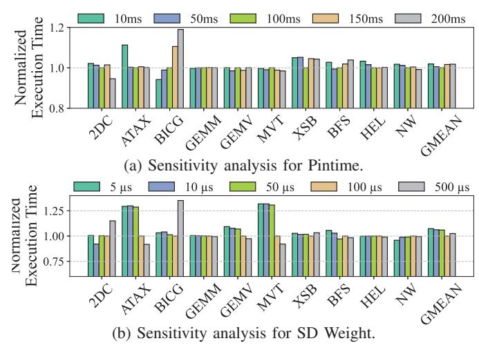
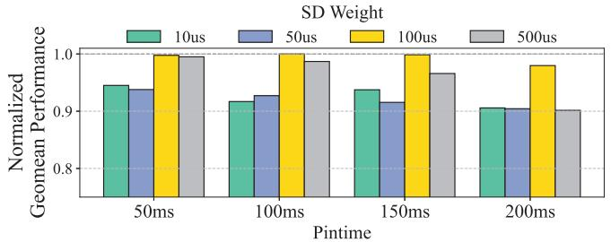
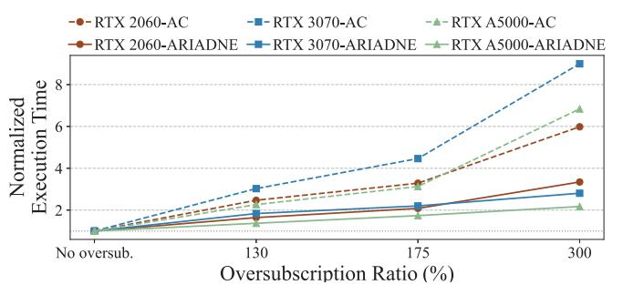

# *D. Performance Breakdown*

We investigate the performance contribution of each component of ARIADNE. Figure 11 compares the performance of ARIADNE without PL, SD (without Sharing Degree-based eviction queue and pipelined fault handling), ARIADNE without PL (without pipelined fault handling), and the full ARIADNE. At 175% oversubscription, ARIADNE without PL improves performance by 42.9% over ARIADNE without PL, SD, and the full ARIADNE achieves a 69% improvement over ARIADNE without PL, SD. These results demonstrate that a page placement policy guided by the Sharing Degree is the key player of ARIADNE's performance gains, and that pipelining effectively hides the policy's overhead under oversubscription.

### *E. Sensitivity Analysis*

Zero-copy Pintime Figure 13a shows the performance variation with respect to the duration a VABlock remains in the Zero-copy state (i.e., Zero-copy Pintime). The results indicate that as long as the Pintime is not short enough to induce thrashing, the average performance difference is a negligible 1%. However, since extreme values led to significant performance degradation in some cases, we set the Pintime to a more stable 100 ms.

SD Weight Figure 13b presents the analysis for the SD Weight which is leveraged for Sharing Degree-aware eviction queue (§V-C). At 175% oversubscription, the execution time varies by 2.2% to 9% depending on the SD Weight. We set the SD Weight to 100 μs, which provides the most stable and superior performance overall.

Moreover, Figure 13c demonstrates the geomean performance variation as both Pintime and SD weight are altered concurrently. These results confirm that the chosen combination of these parameters is optimal, revealing the performance to be comparatively more sensitive to changes in the SD weight.

GPU architecture Figure 13d illustrates the geomean performance slowdowns of ARIADNE and AC with respect to the memory oversubscription ratio across three different GPUs: the RTX 2060, RTX 3070, and RTX A5000. Across all tested GPUs, ARIADNE exhibits linear performance degradation,

(c) Sensitivity analysis for Pintime and SD Weight.

(d) Performance degradations under various GPUs.

Fig. 13: Sensitivity analysis.

whereas AC shows quadratic degradation. Furthermore, this result validates that ARIADNE is applicable across various GPU architectures without modification.

