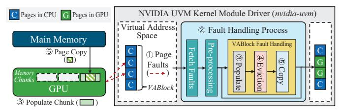

# I. Introduction

While GPUs have become the de facto accelerator for workloads across various domains, including molecular dynamics, robotics, and artificial intelligence, their limited on-board memory remains a critical bottleneck for performance and usability [37], [43], [52], [56]. To address this, Unified Virtual Memory (UVM) [40] integrates the virtual address spaces of the CPU and GPU and transparently migrates the pages that are accessed by the GPU. By migrating only actively used pages to the GPU, UVM effectively prevents out-of-memory (OOM) errors and supports GPU memory oversubscription, the ability to use more memory than physically available on the GPU. Furthermore, this GPU memory abstraction significantly eases the programming burden by eliminating explicit management and application tuning, enhancing portability across different hardware configurations.

Despite its benefits, UVM often incurs significant performance degradation compared to explicit memory management, especially under memory oversubscription, where thrashing

\* Corresponding author.

becomes a critical issue [7], [34]. To mitigate these challenges, prior research has explored techniques broadly categorized into three groups: (1) prefetching, which proactively migrates data from host to device memory to reduce future page faults [16], [20], [28], [34], [36], [47], [54]; (2) access counter-based migration, which monitors page access frequency and migrates hot pages to the GPU based on fixed thresholds [17], [40]; and (3) alternative memory placement techniques such as Zerocopy, which place certain pages in host memory and access them remotely from the GPU without migration [7], [9], [11], [15], [19], [46], [58]. However, these solutions provide limited performance improvements and often compromise UVM's key advantage, its abstraction of GPU physical memory and application portability across diverse hardware environments.

Prefetching can proactively migrate pages to reduce future page faults, but it remains ineffective at mitigating thrashing under high memory pressure. Access counter-based migration, which relies on fixed thresholds, performs reasonably well only under favorable conditions, but fails to adapt to rapidly changing access patterns in real-world workloads [17]. Dynamic Zero-copy techniques aim to improve page placement by pinning cold pages in host memory for remote GPU access, thereby avoiding unnecessary migrations. However, existing approaches require either hardware modifications or compilerlevel instrumentation to track page hotness [7], [9], [15], [33]. Hardware-based solutions are often impractical in production environments, while compiler-assisted methods are unsuitable for applications distributed solely as executables or those with complex build dependencies.

To enhance UVM's performance across various memory pressures without compromising its fundamental GPU memory abstractions, we propose ARIADNE1, a runtime UVM framework, designed based on three design principles.

Design Principle #1. Reduce UVM fault-handling latency through pipelined execution (§IV-B). The UVM driver handles page faults when the GPU accesses non-resident pages, involving three core operations: Populate (GPU memory chunk allocation), Eviction (evicting chunks), and Copy (data

&lt;sup>1Ariadne, princess of Crete from Greek mythology, helped Theseus escape the Labyrinth by giving him a ball of thread. Analogously, ARIADNE leverages thread-level information to measure runtime page usefulness, achieving optimal page placement even in the UVM kernel module that operates with obscured runtime memory access information.

transfer). However, fault-handling latency is too long to be effectively hidden by GPU context switching, reducing GPU utilization [30]. While prior works [30], [32] have parallelized *Eviction* with a sequential *Populate-Copy*, our observations reveal that *Populate* latency is nearly double that of the others, making it the primary bottleneck. ARIADNE addresses this by decoupling *Populate* from *Copy* and pipelining *Populate*, *Eviction*, and *Copy* operations across multiple VABlocks.

Design Principle #2. Sharing Degree: a runtime accesspattern metric leveraging thread-level information (§IV-A). Because the UVM runtime driver has limited visibility into memory access behavior, prior works have modified hardware or compilers to collect access information. In contrast, by leveraging the GPU's thread execution architecture, we identify a method to capture crucial thread-level information at runtime without hardware or compiler modifications. ARIADNE introduces the Sharing Degree, defined as the number of source unified Translation Lookaside Buffers (uTLBs) associated with recent faults for each memory range (VABlock). Since each uTLB can serve as a proxy for a thread group, the Sharing Degree effectively reflects the number of threads actively accessing a VABlock. A high Sharing Degree indicates dense access, while a low value suggests sparse access. To the best of our knowledge, this is the first runtime metric to exploit thread-level access information in UVM.

Design Principle #3. Managing GPU memory region placement between GPU memory and Zero-copy based on runtime memory access characteristics (§III-B, §V-D). In UVM runtime, a virtual address space is managed at the 2 MB Virtual Address Block (VABlock) granularity, where each VABlock corresponds to a 2 MB GPU memory allocation unit called a chunk. Optimal performance under memory oversubscription requires orchestrating VABlock placement between GPU memory and Zero-copy based on access patterns. Given the contrasting access granularities of GPU migration (2 MB chunks) [40] and Zero-copy (128 B cache lines) [9], access sparsity is a natural criterion for guiding placement decisions. Since the Sharing Degree quantifies access sparsity for each VABlock, ARIADNE dynamically adjusts placement based on this metric. We introduce three runtime mechanisms: (1) a memory demand monitor based on the Working Chunk Set Size (WCSS), a UVM-specific metric that quantifies real-time memory demand to guide effective memory overcommitment, (2) a Sharing-Degree-based eviction policy that selects eviction victims based on fine-grained access locality, and (3) a transient Zero-copy retention strategy that keeps recently evicted, but still active, data in Zero-copy mode on the host memory to absorb transient reuse before migrating them back to GPU memory. These mechanisms keep high-utilization VABlocks in GPU memory longer while assigning sparsely accessed VABlocks to Zero-copy, ensuring optimal placement without thrashing or memory waste.

These three principles operate in concert: WCSS ensures precise memory demand tracking, Sharing Degree delivers resilient placement decisions, and pipelined fault handling conceals migration latency. Together, they enable ARIADNE

Fig. 1: UVM fault handling processes.

to maintain high performance under memory oversubscription while preserving UVM's programmability and portability.

We evaluate ARIADNE on a real system using 10 diverse GPU benchmarks across varying memory oversubscription ratios. In our experiments, ARIADNE delivers average speedups of  $1.9\times$ ,  $5.0\times$ , and  $4.8\times$  over an existing SOTA approach at oversubscription levels of 130%, 175%, and 300%, respectively, while effectively preventing thrashing even at the highest level of 300%. Moreover, ARIADNE maintains near-linear performance scaling with oversubscription, increasing execution time by only  $1.6\times$ ,  $1.8\times$ , and  $2.3\times$  relative to the nooversubscription case at these same levels. Because ARIADNE is implemented entirely within NVIDIA's open-source UVM driver, requiring neither recompilation nor hardware changes, it can be applied transparently to any executable or closedsource UVM application. Consequently, ARIADNE advances the core mission of UVM, making GPGPU computing accessible under diverse user needs and memory constraints.

#### II. BACKGROUNDS

#### A. GPU Execution Architecture

To execute simultaneous operations across large datasets, Graphics Processing Units (GPUs) integrate numerous processing cores organized into clusters known as Streaming Multiprocessors (SMs) [39]. Each SM contains its own shared memory and L1 cache, and typically two adjacent SMs share a unified Translation Lookaside Buffer (uTLB) [41], [57]. CUDA programs, referred to as kernels, leverage this parallel hardware architecture by dividing computations into multiple threads. Threads are grouped into thread blocks (TBs), each of which is assigned to an SM for execution [32]. Threads and TBs are uniquely identified by thread IDs (tID) and block IDs (bID), respectively.

An important observation is that the execution model of GPU kernels, composed of multiple TBs and threads, closely resembles iterative operations in CPU programs. Just as CPU programs use loop variables (e.g., i) to select array indices during iterations, GPU kernels utilize tID and bID to determine the specific data accessed by each thread. Consequently, tID and bID play a crucial role in shaping memory access patterns of GPU applications [7], [29], [50], [51].

