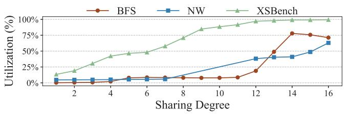
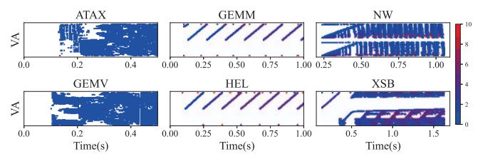
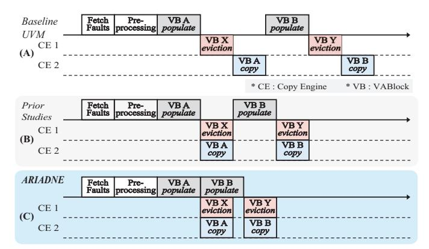
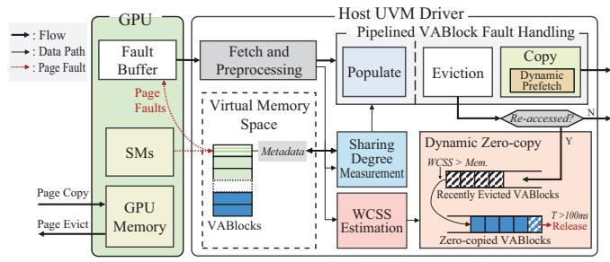

# IV. OPPORTUNITIES FOR UVM PERFORMANCE ENHANCEMENT

A. Sharing Degree: An Effective Runtime Metric for GPU Memory Locality

We propose the **Sharing Degree** as a runtime metric representing the number of SMs (via their uTLBs) concurrently accessing a VABlock. Notably, a high Sharing Degree inherently implies that a given VABlock possesses high spatial locality, a characteristic rooted in the GPU software/hardware thread execution model. Furthermore, the Sharing Degree, which can be measured with only a few faults, is well-suited for guiding the dynamic Zero-copy page placement decisions for thrashing

Fig. 5: The VABlocks' Sharing Degree influences the number of pages accessed before eviction.

mitigation. In this section, we analyze this correlation between Sharing Degree and memory access patterns, both theoretically and empirically.

As analyzed in §II-A, addresses accessed by threads in a GPU program change with the coefficients of the tID and bID (e.g.,  $Array[N \times bID + M \times tID]$ ) [7], [29], [51]. Figure 4 illustrates how memory regions are accessed through both the GPU's software and hardware thread execution architecture. For data B, the large coefficient of the bID term (e.g.,  $N^2$ ) causes each TB to access a distinct VABlock. As a result, the SMs executing these TBs also access different VABlocks, leading to sparse, low-locality accesses. Conversely, for data **A**, **C**, as the coefficient of the bID N is small, adjacent TBs will access the same page and VABlock, leading to concurrent access to these locations by the SMs. Furthermore, due to each TB's bID difference and the varying tID during execution, SMs concurrently accessing the same VABlock will access different addresses and distinct internal pages. As a result, from the perspective of a VABlock, the more SMs that access it concurrently, the more internal pages are accessed simultaneously, resulting in dense access (high VABlock-level spatial locality) and utilization. The Sharing Degree is designed to capture these fundamental memory access patterns from the GPU architecture by tracking thread access information on a per-VABlock basis.

We validate these insights by measuring the utilization of VABlocks as a function of their Sharing Degree in mixed-pattern workloads. Figure 5 shows the VABlock-level utilization according to the Sharing Degree for benchmarks with mixed access patterns: BFS, NW, and XSB [7], [20]. The Sharing Degree was measured using the method described in §V-B, and utilization is defined as the percentage of pages accessed within a VABlock between its migration and eviction. In all these three mixed workloads, the average number of pages accessed within a VABlock consistently increases with the Sharing Degree. This experimental result thus substantiates our insight, derived from the analysis of the GPGPU thread execution architecture, regarding the correlation between Sharing Degree and spatial locality.

Consequently, the Sharing Degree effectively differentiates between distinct memory access patterns at runtime. Figure 6 illustrates the runtime measurements of the Sharing Degree for each page fault across six benchmarks. Each point represents a single fault; the *x*-axis indicates the time of the fault, the *y*-axis represents its virtual address, and the color of the point

Fig. 6: The memory access patterns of six benchmarks.

Fig. 7: Pipelined fault handling operations.

indicates the Sharing Degree of the VABlock where the fault occurred.

ATAX and GEMV, representative benchmarks previously categorized as irregular and sparse access patterns [32], consistently show a Sharing Degree of 1. In contrast, GEMM and HEL, which have been analyzed as regular and dense access patterns [20], exhibit a Sharing Degree that is generally greater than 4. NW and XSB are known to have mixed patterns [15] with various access types coexisting. The measurement of their Sharing Degree also reveals that VABlocks with contrasting values are accessed simultaneously. This further emphasizes the need to distinguish access patterns at the VABlock level, rather than tracking characteristics at the level of the entire GPU or individual CUDA kernels, in order to accurately measure locality on a per-VABlock basis.

Insight 1: The Sharing Degree captures the inherent spatial locality of a memory region by quantifying how many SMs access it concurrently. This runtime metric effectively distinguishes between dense and sparse access patterns, enabling informed GPU memory management decisions.

### *B. Hiding Populate Latency via Pipelined Fault Handling*

Although the *Populate* operation incurs nearly double the latency of *Copy* and *Eviction*, the prior works [30], [32] fail to hide this overhead as they do not decouple *Populate* from the original copy process. Therefore, we explore decoupling the *Populate* from the original copy process and enabling concurrent execution with *Copy* and *Eviction*. As a result, we found that while *Copy* and *Eviction* for a single VABlock's fault handling must be performed after *Populate*, *Populate*, *Copy*, and *Eviction* operations for different VABlocks can indeed be executed simultaneously.

Figure 7 illustrates the execution flow of the VABlock fault handling process under different implementations. (A) represents the baseline UVM, where the *Populate*, *Eviction*, and *Copy* stages of the VABlock fault handling process are performed sequentially. (B) illustrates the approach proposed in prior studies [30], [32], in which *Copy* and *Eviction* are performed concurrently. (C) depicts the pipelined VABlock fault handling process proposed in this study. In (C), after VABlock A completes its *Populate*, the *Populate* of VABlock B, the *Eviction* of VABlock X (which holds the eviction victim chunk), and the *Copy* of VABlock A are performed concurrently. As a result, we can hide a significant portion of populate's latency by pipelining VABlock fault handling.

Insight 2: Decoupling *Populate* from subsequent *Copy*/*Eviction* allows pipelined execution across multiple VABlocks, enabling substantial overlap between stages and effectively hiding the long *Populate* latency.

### V. DESIGN OF ARIADNE

We propose an adaptive UVM management for efficient GPU memory oversubscription, called ARIADNE. By recognizing the real-time memory demands and optimally adjusting the placement of VABlocks based on Sharing Degree, ARIADNE delivers efficient performance across diverse workloads and memory oversubscription ratios. We implement ARIADNE by modifying the UVM host driver (∼ 1600 LOC), requiring no additional GPU resources or architectural modifications over the baseline UVM. Figure 8 illustrates the highlevel design of ARIADNE, highlighting its core components.

### *A. Working Chunk Set Size (WCSS) Estimation*

To maximize GPU memory utilization while preventing thrashing, accurately tracking the current memory demand of the UVM system and precisely managing the excess demand via Zero-copy placement in host memory is crucial. Since applications request GPU memory in chunk units (e.g., 2 MB), ARIADNE tracks the WCSS, representing the number of GPU memory chunks actively required by workloads. Given that each VABlock corresponds to exactly one chunk, ARIADNE calculates WCSS by counting all actively accessed VABlocks. Ideally, this includes VABlocks currently resident on the GPU and those in a Zero-copy state on the host memory, as ensured by ARIADNE's dynamic Zero-copy policy (§V-D).

However, this straightforward calculation can underestimate the actual WCSS if a VABlock that is likely to be used again soon is evicted from GPU memory, as it is immediately removed from the WCSS count despite its high probability of being re-accessed in the near future. To resolve this, ARIADNE maintains a per-VABlock re-access history upon eviction. A recently evicted VABlock that is re-accessed remains included in the WCSS for 500 ms after eviction. Additionally, when no re-access history is initially available, ARIADNE measures the average GPU-wide Sharing Degree. This is because, as

Fig. 8: Overall design of ARIADNE.

discussed in §IV-A, applications with a low average Sharing Degree encounter chunk-level internal fragmentation, exhibit amplified WCSS, and are susceptible to initial thrashing. Thus, if this average Sharing Degree is below a predefined threshold (i.e., 3), all recently evicted VABlocks are retained in the WCSS for 500 ms, thereby mitigating the risk of premature exclusion and initial thrashing.

Consequently, ARIADNE accurately estimates the WCSS at any given moment as the sum of: 1) VABlocks resident in GPU memory, 2) VABlocks currently in a Zero-copy state, and 3) recently evicted VABlocks with a high probability of re-access.

#### B. Sharing Degree Measurement

ARIADNE tracks the Sharing Degree, a metric strongly correlated with access sparsity, at a per-VABlock granularity within the UVM kernel module driver (nvidia-uvm) [40]. To achieve this, ARIADNE leverages the page fault's source uTLB ID, which serves as a reliable proxy for identifying the originating SM and, consequently, the TB responsible for the fault. Specifically, the host UVM driver maintains a circular queue that records the source uTLB IDs of the most recent 16 faults for each VABlock. The Sharing Degree is then computed as the number of unique uTLB IDs currently present in this queue, and this value is updated at the beginning of the fault handling process for each VABlock. Importantly, as the source uTLB ID is readily available to the UVM driver during runtime, the overhead of calculating the Sharing Degree is negligible. This metric effectively captures the fundamental memory access patterns arising from the GPU's thread execution structure, enabling ARIADNE to obtain critical runtime information efficiently without intrusive or costly profiling techniques, as discussed in §IV-A.

#### C. Enhanced VABlock Fault Handling

In baseline UVM, VABlock fault handling (Figure 7a) is performed sequentially within a monolithic routine that includes the *Populate*, *Eviction*, and *Copy* phases. This serialized design forces high-latency operations such as GPU memory allocation and page copying to execute back-to-back, prolonging fault handling latency. Based on insights §IV-B, a promising solution is to pipeline the fault handling process across consecutive VABlocks, enabling the *Populate* stage to execute in parallel with other operations.

Figure 7c illustrates how ARIADNE restructures this process into a two-stage pipeline. Stage1 (*Populate*) allocates GPU chunks and prepares migration metadata, while Stage2 (*Copy*) transfers the corresponding pages to the GPU. Unlike the baseline, these two stages can operate concurrently on different VABlocks, enabling higher throughput. In addition, Eviction is no longer a reactive step following a failed populate, but rather a proactive process running in parallel to ensure a steady supply of free chunks. By decoupling these phases and overlapping their execution, ARIADNE effectively hides much of the high-latency operations behind parallel work.

ARIADNE further enhances this pipelined framework by integrating a dynamic prefetcher into *Copy* and a Sharing Degree-aware priority eviction queue into *Eviction*. The prefetcher reduces future page faults by proactively loading VABlocks with high reuse potential, while the priority eviction policy retains such VABlocks in GPU memory for longer.

**Populate.** The *Populate* unmaps the target host pages, allocates a GPU chunk for the VABlock, and records the pages to be migrated. Unlike the baseline, ARIADNE terminates *Populate* without initiating the page copying, allowing the allocation to complete quickly and enabling the subsequent *Copy* to be pipelined with the next *Populate* request.

Copy. The *Copy* runs in parallel with *Populate*, transferring the pages of a populated VABlock to GPU memory using the GPU copy engine and updating page tables. By default, ARIADNE copies the pages requested along with those selected by the default prefetcher (e.g., TBN prefetcher [41]). If GPU memory usage is sufficient or the VABlock's Sharing Degree exceeds a threshold (three in our design), ARIADNE aggressively copies the entire VABlock. This dynamic prefetching reduces future page faults by proactively bringing in pages likely to be reused before eviction.

**Eviction.** Rather than waiting for *Populate* to fail, ARIADNE initiates *Eviction* when free GPU chunks drop below a threshold (one in our design). *Eviction* runs concurrently with populate and copy in a dedicated thread. To avoid evicting actively used VABlocks, ARIADNE employs a priority queue that incorporates both fault recency and Sharing Degree:

$$key = last\_fault\_time + \left(SD\ Weight \times \frac{Sharing\ Degree}{N_{\text{fault\_history}}}\right)$$

where  $N_{\rm fault\_history}$  denotes the length of the history tracking uTLB IDs that recently caused faults (16 in our implementation), and  $SD\_Weight$  (set to  $100\,\mu s$  based on sensitivity analysis in VII-E) adjusts the influence of Sharing Degree. This approach enables ARIADNE to retain data with a high Sharing Degree—for which GPU residency is more advantageous than Zero-copy, as discussed in VI-A on the GPU for longer durations, thereby reducing costly re-fetches.

#### D. Dynamic Zero-copy

When the workload demands more memory than the available GPU memory, ARIADNE dynamically places certain VABlocks into a temporary Zero-copy state to both reduce

internal fragmentation in GPU memory and mitigate the performance penalty of frequent migrations. The key idea is to keep recently evicted VABlocks that are re-accessed, those counted in the WCSS measurement (§V-A), in a Zero-copy state rather than immediately fetching them back to GPU memory. This second-chance mechanism prevents immediate re-fetch of VABlocks that were just evicted, thereby reducing repeated eviction—fetch cycles and alleviating thrashing.

Evicted VABlocks are determined by the Sharing Degree—aware priority eviction queue (§V-C), which prioritizes eviction of VABlocks with low Sharing Degree and low predicted reuse potential. However, if any of these evicted VABlocks are subsequently accessed again, ARIADNE places them in the Zero-copy state for a fixed duration (100 ms in our design) instead of bringing them back to GPU memory immediately. Since these VABlocks are already resident in host memory, enabling Zero-copy requires no data copying and incurs negligible overhead. If a Zero-copied VABlock is accessed again after the expiration period, it is then promoted back into GPU memory, ensuring that persistently reused VABlocks eventually regain GPU residency while minimizing unnecessary memory churn.

The Zero-copied VABlocks are tracked in a dedicated Zero-copy queue and automatically released from Zero-copy state after the predefined duration. This release step is essential for accurate WCSS measurement and for maximizing GPU memory utilization, since the UVM driver relies on page faults to detect activeness. If Zero-copy state were permanent, inactive VABlocks could indefinitely hold GPU chunks, blocking more beneficial allocations. Conversely, setting the duration too short would limit thrashing prevention. Empirical analysis confirms that our chosen 100 ms duration strikes a good balance across diverse workloads and memory pressures (§VII-E).

This mechanism is implemented using internal APIs of the UVM kernel module driver. We implement functions to set and unset the Zero-copy state for target VABlocks. Metadata for this management is maintained on a per-GPU basis within the UVM driver without consuming GPU memory.

#### E. Putting it all together

When a UVM kernel launches, ARIADNE initializes all required metadata and runtime objects, including dedicated kernel threads for *Copy* and *Eviction*. When a GPU memory access triggers a page fault, the faults are collected in the GPU fault buffer and fetched by the UVM driver. The driver preprocesses these faults and processes them on a per-VABlock basis through ARIADNE's pipelined fault handling mechanism. During this process, ARIADNE updates both the WCSS and the Sharing Degree using the observed fault information.

After handling all fetched faults, ARIADNE checks whether the memory demand by workloads exceeds the available GPU memory capacity. If so, ARIADNE places all recently evicted VABlocks that have been re-accessed into the Zero-copy state,

providing them with a second chance to be reused without immediately occupying GPU memory. If any VABlock remains in the Zero-copy state beyond the predefined duration (100 ms in our design), ARIADNE revokes its Zero-copy status.

A VABlock in ARIADNE can be in one of four states: (1) resident on GPU, (2) stored in host memory but in Zero-copy mode, (3) evicted from GPU but subsequently re-accessed, and (4) evicted and not re-accessed. Based on its measured Sharing Degree and recent access history, a VABlock transitions between these states so that it remains in the one most advantageous for its current usage pattern. This continuous evaluation ensures that VABlocks likely to be reused are retained or given a Zero-copy second chance, while inactive ones are evicted promptly. By combining pipelined fault handling, Sharing Degree—aware eviction, and dynamic Zero-copy, ARIADNE adaptively mitigates thrashing and delivers robust performance across diverse workloads and oversubscription ratios.

#### VI. DISCUSSIONS

Fine-grained Chunk Size Since UVM uses a coarse-grained 2 MB chunk size, one possible approach to thrashing mitigation is to adopt fine-grained chunks to mitigate WCSS amplification. In our experiment, while fine-grained chunk size can mitigate thrashing in certain workloads with frequent sparse access (ATAX, BICG, GEMV, MVT), it causes significant performance degradation (64.4%) in others (2DC, GEMM, XSB, BFS, HEL). The performance degradation is caused by two major factors: a reduced TLB reach and the overhead from repeatedly searching for GPU free space and Populate operation for every 64 KB chunk allocation. Moreover, the smaller chunk approach is not a scalable solution because thrashing is fundamentally unavoidable when the actual byte-level working-set size exceeds the GPU physical memory capacity. Furthermore, while a dynamic chunk sizing technique combined with the Sharing Degree has the potential to minimize the overhead of fine-grained chunks, a naïve implementation causes severe external fragmentation, and necessitates precise and intelligent chunk management. Therefore, ARIADNE does not adopt a fine-grained chunk size.

#### VII. EVALUATION

