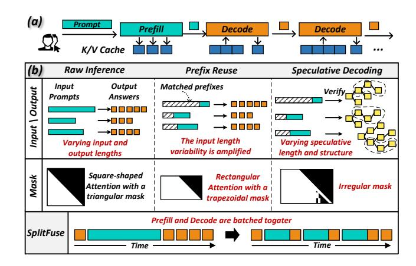

# 1 Introduction

Large language models (LLMs) [\[53,](#page-15-1) [54\]](#page-15-2) have achieved impressive accuracy and are widely applied in fields like natural language processing [\[26\]](#page-14-0) and computer vision [\[28,](#page-14-1) [32\]](#page-14-2). As shown in Fig. [1\(](#page-1-0)a), LLM inference typically consists of two stages: prefill and decode. During the prefill stage, LLMs process the user's input to generate an initial token, while concurrently caching the key/value (K/V) data for future use. In the decode stage, tokens are generated sequentially in an auto-regressive manner. Despite their impressive performance, LLMs come with significant computational costs and latency. As the model size increases and input sequences become longer, the computational demands grow substantially, making online inference increasingly challenging [\[40\]](#page-14-3).

To address these challenges, a number of optimization techniques have emerged to reduce inference costs and latency, such as Prefix Reusing [\[61\]](#page-15-3). Speculative Decoding [\[27,](#page-14-4) [29,](#page-14-5) [42,](#page-14-6) [43,](#page-14-7) [49,](#page-15-4) [60\]](#page-15-5), and SplitFuse [\[24,](#page-14-8) [25,](#page-14-9) [34\]](#page-14-10). Prefix Reusing enables new queries with matching prefixes to reuse cached K/V data and skip computations for shared segments, thereby improving prefill performance. The adoption of the draft model in Speculative Decoding provides a chance for the target model to generate multiple tokens per step, enhancing key/value cache and model weight reuse, which helps mitigate the memory-bound bottleneck of decode in the draft model. SplitFuse splits long-sequence prefill tokens into smaller chunks and schedules them alongside decode tokens, reducing interruptions to the decode stage.

While these optimizations promise to improve inference efficiency, they also introduce new complexities. For LLM serving of a production system, the key challenge is how to integrate all these optimizations efficiently on AI accelerators given that a friendly SIMT programming model is lacking. We illustrate this issue in Fig. [1\(](#page-1-0)b). Performance already struggles with unpredictable and varying input/output token lengths, these optimizations can further exacerbate the issue.

For example, Prefix Reusing increases the variability in input prompt lengths, as the number of cached prefixes depends on both query history and real-time memory availability. With Speculative Decoding, the decode stage no longer processes one token at a time. Instead, it handles a dynamically varying speculative length of tokens [\[47\]](#page-15-6). This new stage is referred to as the Verify stage [\[3,](#page-13-0) [59\]](#page-15-7). It also transforms the attention mask from a standard causal mask into a more complex, dynamically generated version. Additionally, SplitFuse combines the prefill and decode stages into a single batch, further complicating the management of multiple stages within one batch.

These dynamicities pose significant challenges for LLM computations, particularly in Linear and Attention modules. First, the uncertainty of input lengths leads to arbitrary matrix shapes in Linear operations, complicating optimization

Figure 1. Dynamics of LLM Inference.

efforts aimed at achieving peak computational efficiency. Second, the adoption of these technologies introduces greater diversity in attention shapes and mask structures, weakening the effectiveness of existing attention kernels.

Furthermore, in practical systems, the Prefill (P), Decode (D), and Verify (V) stages may operate independently or in combination. Even in disaggregated deployments, the D node may run both D and V stages simultaneously. If disaggregated deployment [\[35,](#page-14-11) [38,](#page-14-12) [50,](#page-15-8) [62\]](#page-15-9) nodes support dynamic role switching, the hybrid P/D/V combinations issue may also arise during role transitions. Since these stages present varying computational loads during the attention phase, attempting to enumerate and optimize for every possible stage combination becomes a labor-intensive and impractical task.

To tackle the challenges posed by dynamicities, we present XY-Serve, a versatile, Ascend NPU [\[44,](#page-14-13) [45\]](#page-14-14) native, and endto-end production LLM-serving system. The main idea is to introduce an abstraction to bridge the gap between varying high-level workloads and fixed hardware-friendly low-level meta-primitives. Specifically, XY-Serve features a token-wise scheduling mechanism that batches tokens in chunks. Tokens could be from either prefill, verify, or decode stages. Then the token chunks will be processed by three core components: Task Decomposition, Task Reordering, and Meta Kernels.

Task Decomposition is a mechanism to decompose and map dynamic workloads onto hardware-friendly meta primitives. For Attention computations, it unifies the P/D/V stages through dynamic tiling, generating hardware-friendly tilebased computational tasks. Each task computes a basic GEMM-Softmax-GEMM pattern. For Linear computations, it decomposes dynamic-shaped GEMM operations into a small set of basic GEMM primitives with fixed tile sizes without any extra overhead on AI accelerators with tile-based programming models.

After decomposition, Task Reordering reorganizes decomposed tasks and schedules them for hardware processing cores. The goal of reordering is to smooth out varying task

sizes at a fine-grained level, balancing workload on different cores for high execution efficiency. For the Attention module, P/D/V tasks have drastically different granularity; thus, reordering of decomposed tasks is essential to achieve load balance. For the Linear module, task reordering is an effective approach to improve L2 cache locality and mitigate bank conflicts.

With Task Decomposition and Reordering, it is possible to construct efficient kernels for Attention and Linear. For the Attention module, we propose meta kernels to efficiently parallelize computations of GEMM-Softmax-GEMM patterns with different tile sizes, without needing to differentiate which P/D/V stage they originate from. With this decoupling approach, it is feasible to integrate a range of optimizations seamlessly and efficiently, including Prefix Reusing, PageAttention [41], SplitFuse, Speculative Decoding, and FlashAttention [31]. These optimizations work synergistically within our meta kernels, achieving superior performance. Moreover, our Attention meta kernels come with aggressive on-chip Cube Core-Vector Core orchestration pipelines, together with novel schemes to handle various kinds of attention masks dynamically. These low-level techniques minimize off-chip memory accesses and maximize on-chip workload balance and execution efficiency.

For the Linear module, we first design and implement a set of highly efficient meta kernels with fixed tile sizes. To handle arbitrary input shapes dynamically, we employ virtual padding at the on-chip memory level, coupled with selective HBM reads and writes, and do not introduce any actual padding overhead. In other words, our approach allows matrix computations to seamlessly handle dynamic shapes while preserving the performance benefits of fixed-shape optimizations.

Experimental evaluation shows that our attention kernels achieve higher efficiency in production workloads, outperforming current SOTA implementations(torch-npu PFA [19] and IFA [18]) by on average of 21.5%. Our Linear kernels not only support arbitrary matrix shapes but also improve performance by an average 14.6% over existing baselines. In end-to-end evaluation, XY-Serve achieves improvement up to 89% over Ascend-vLLM [21] on publicly available datasets [20] and 95% improvement on our in-house industry workloads. Finally, we conduct a comparative evaluation against GPU-based inference systems. In terms of end-to-end MFU and MBU, XY-Serve performs on par with the best GPU implementations.

