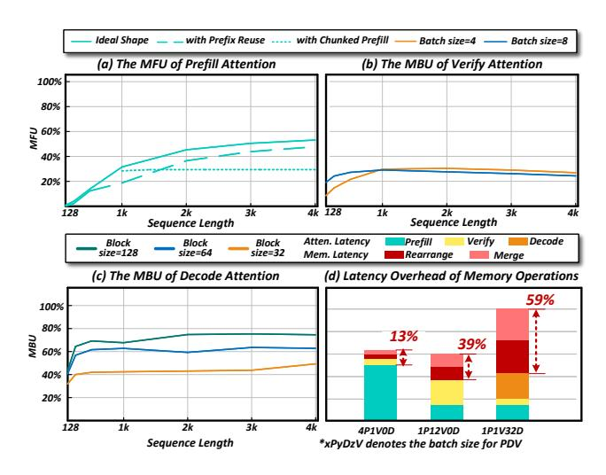

# 2.2 Coarse-grained Tile-based Architecture

**2.2.1 Ascend NPU.** Built on Huawei's DaVinci architecture [44, 45], the Huawei Ascend NPU is a high-performance AI processor. Fig. 3(a) illustrates its structure, which primarily consists of AIC (AI Core) and AIV (AI Vector) components. The AIC, similar to Nvidia's Tensor Core, handles matrix computations, while the AIV is responsible for vector operations. The Memory Transfer Engine (MTE) manages data movement. The computational units and memory access units within the AIC and AIV can operate in parallel to overlap different operations.

2.2.2 Tile-Based Architecture v.s. SIMT. Conventional GPUs are renowned for their CUDA Cores based on SIMT architecture, which employ techniques such as Branch Predication [37] or Warp Compaction [33] to achieve fine-grained control over programs at nearly the single-thread level. As a result, they can avoid performance loss while maintaining

**Figure 3.** (a) The Micro-architecture of Ascend 910B. (b) Comparison of Tiled-based Architecture and SIMT.

programmer-friendly interfaces when dealing with dynamic inputs. In contrast, we focus on Coarse-grained Tile-based Architecture, an abstraction of common AI accelerators, with Ascend NPU as a typical example. These accelerators feature a datapath where a fixed-width tile of data is grouped together and executed by the same operation in a single instruction. This architecture has the potential for higher computation capacity. However, workload dynamism (e.g., dynamic shapes or sparse/memory patterns of input data) complicates programming and degrades performance.

As illustrated in Fig. 3(b), in the SIMT architecture, it is easy to set boundary conditions or patterns for data, with the hardware automatically reorganizing or deactivating unused threads. However, in tile-based architectures, both memory access and computation face challenges when dealing with irregular data patterns. Typical solutions involve complex padding/unpadding or mask operations, which result in additional computation and memory overhead. Consequently, efficiently supporting dynamic workloads on tile-based architectures is a laborious task.

**2.2.3 Abstraction Generality.** This abstraction may also applicable to current GPUs. As GPUs evolve, the Tensor Core has become increasingly important, and Nvidia has introduced a dedicated Tensor Memory Accelerator (TMA), both of which are tile-based units. This trend indicates that GPUs are moving toward a Tile-based Architecture. Recently, Nvidia began to introduce a tile-based programming model to GPUs [13], proving the generality of this hardware abstraction across various accelerators. Therefore, the same issues also exist on current GPUs.

## 3 Challenge

As illustrated in Fig. 4, an LLM serving system with mainstream optimizations can be primitively divided into Linear and P/D/V three types of Attention modules. AI accelerators

Figure 4. Challenges Posed by Dynamic Workloads.

are already struggling with the dynamic input and output length of LLMs. To make things tougher, the introduction of new technologies further increases the diversity and dynamicity of the workload, leading to MFU and MBU issues of the current NPU kernels, as illustrated in Fig. 5. In this section, we detailed these challenges.

#### 3.1 Diverse Attention

Firstly, for prefill Attention, without any optimizations, the query length equals the key-value length, resulting in a square-shaped Attention score matrix and a triangular mask. This shape is ideal for optimization [46], as it's easy to tile the workload into shape-regular units. The current SOTA torch-npu kernel can efficiently handle it, achieving an MFU of 53%.

However, in real-world scenarios involving prefixes, parts of the key and value are reused from the K/V cache [14, 61], transforming the Attention score shape from a square to a rectangle with arbitrary dimensions. Tiling the Attention score will produce many irregular units, which degrades the performance of the kernel. Specifically, the MFU drops to 47% and 30%, as shown in Fig. 5(a). While the reuse of the K/V cache theoretically reduces computation, the decline in kernel efficiency offsets this benefit, resulting in no meaningful end-to-end performance improvement.

Similarly, Speculative Decoding (SD) [27, 43, 49] reshapes decode Attention to resemble prefill Attention but with a shorter query length. Different SD algorithms generate tokens with varying causal structures, resulting in diverse masks during the verify stage. The irregular pattern of the mask makes it challenging to implement efficient tiling. As a result, torch-npu uses the kernel for prefill Attention equipped with a full mask as a fallback. This fallback prevents verify-specific optimizations, leading to an MBU lower than 30%.

Figure 5. The MFU and MBU of Attention Kernel.

Lastly, unlike Linear, where tokens from different batches can share weights, decode Attention requires each token to have its own independent K/V cache, making reuse impossible. This leads to inherently memory-bounded computations. PagedAttention [41] further fragments the K/V cache access patterns, limiting access to small block-sized portions instead of large contiguous blocks. As illustrated in Fig. 5(c), the MBU decreases as block size becomes small, exacerbating the memory bottleneck of the decode stage.

## 3.2 Dynamic GEMM

GEMM is a core operation in LLMs. Beyond the four GEMM operations in the Linear section, the query-key (QK) and score-value (SV) computations in Attention also rely on GEMM. We summarize all of GEMM operations in Fig. 6(a). The M dimension is tied to the number of tokens. For Linear operations, the dimensions N and K are influenced by hiddenSize, which varies with the architecture of the LLM. For Attention operations, the N and K dimensions are dependent on the token K/V length. The number of tokens in the prefill and verify stages is highly dynamic, and this variability is further amplified by the introduction of Prefix Reusing [14,61], making token lengths even more unpredictable. Consequently, the M, N, and K dimensions in GEMM operations for LLM are all dynamically changing.

Most AI accelerators are typically optimized for specific tile sizes, such as  $16 \times 16$ . Therefore, designing GEMM on AI accelerators to support arbitrary shapes while ensuring high performance is inherently challenging. Irregular shapes complicate parallelism and load balancing, causing inefficiencies in workload distribution across processing units. Moreover, the optimization space for flexible algorithms to adapt to diverse shapes is complex. Additionally, handling boundary conditions for non-uniform matrix sizes introduces overhead, which further affects performance. As shown in Fig.

Figure 6. GEMM Operations in LLMs and their MFU.

6(b), employing a general-purpose GEMM kernel (torch-npu 2.1 linear operator [17]) to accommodate all possible results in unstable performance and fails to achieve optimal utilization across all GEMM operations.

