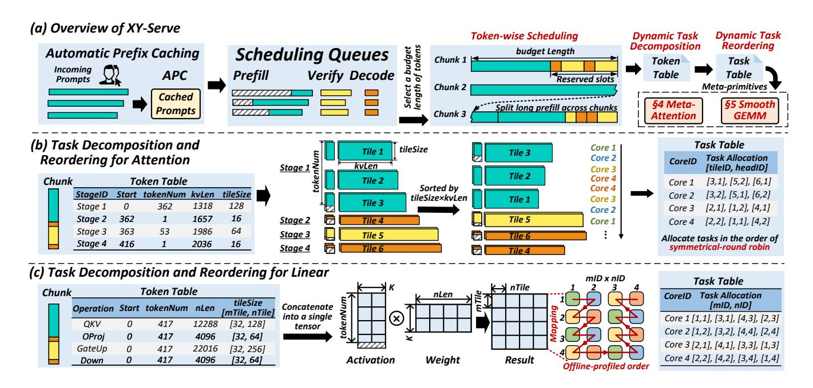

# 3.3 Hybird P/D/V Stages

In practical systems, P/D/V stages may exist independently or coexist simultaneously, leading to arbitrary combinations of interleaved P/D/V stages within a given scheduling budget. For Linear operations, tokens from different stages can reuse the same large model weights. Therefore, it is straightforward to group them together and treat them as the left matrix in a GEMM operation. In contrast, handling Attention operations is significantly more complex. Tokens from different stages and batches need to be processed using their respective K/V. As a result, different combinations of P/D/V stages require different optimization methods. Enumerating and tailoring optimizations for each possible combination of stages and batches is highly labor-intensive and impractical.

A common alternative is a batch-by-batch execution, such as selective batching [58], which processes each batch independently by invoking the corresponding Attention kernel. However, this method introduces additional memory overhead from splitting, rearranging, and merging data, which degrades overall system performance. As shown in Fig. 5(d), the memory overhead may account for more than 50%. Furthermore, batch-by-batch processing leads to inefficient utilization of computational resources, further limiting efficiency.

#### 4 Overview of XY-Serve

To address the aforementioned challenges, we developed XY-Serve, a versatile end-to-end production LLM serving system. As illustrated in Fig.7(a), it is built on four key components: Token-wise Scheduling, Dynamic Task Decomposition and Reordering, Meta-Attention, and SmoothGEMM.

#### 4.1 Token-wise Scheduling

When a user's request enters the system, it first passes through the APC (Automatic Prefix Caching) module, which matches the incoming prompt against existing prompts in the K/V cache, enabling token-wise reuse. Any unmatched tokens are added to the scheduling queues. Consequently, the prompt length in the scheduling queues is the user's input length

Figure 7. Overview of XY-Serve.

minus the length of tokens already cached in the K/V cache. Since both the user's input and the cached token lengths are dynamically variable, the prompt lengths in the scheduling queues become even more dynamic. The scheduling queues also include decode and speculative tokens from previous requests awaiting processing.

As shown in Fig. 7(a), the composition of P/D/V stages in the scheduling queues is inherently unpredictable, with token counts for each stage varying arbitrarily and each stage having a distinct historical K/V length. Additionally, the total token count in a chunk may not always match the budgeted length and can fall below the budget under a low system load.

Previous works have proposed scheduling strategies, which execute different stages in a prefill-priority or decode-priority manner [58], or combine tokens from decode and prefill in a single step [24]. However, these strategies only focus on simple combinations of P/D stages. To create a more flexible scheduling strategy that addresses the four levels of dynamism discussed above, our scheduling operates entirely at the granularity of individual tokens, regardless of their origin. It selects a fixed-budget length of tokens from the scheduling queues to form chunks, which may include tokens from prefill, verify, and decode stages. To improve first-token latency, prefill requests are prioritized. If a user's prefill prompt exceeds the budget length, it is split into smaller parts to ensure that each scheduled chunk remains within the budget. To minimize interruptions caused by prefill on decode and maintain a stable Time Between Tokens (TBT), certain slots are reserved for decode and speculative tokens. Consequently, in most batches, there is a mixture of partial decode

or verify tasks. Prefill-only chunks are scheduled when the queue contains no decode or speculative tokens. Therefore, there is no task starvation problem.

