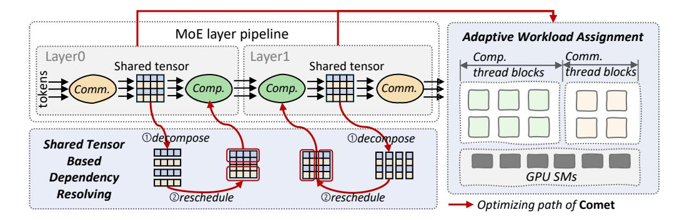

# **2.2.1 Granularity mismatch between computation and communication**

In MoE systems, the token serves as the fundamental unit of data movement, illustrated by the movement of Token A in [Figure 2.](#page-2-0) To maximize GPU compute efficiency, high-performance GEMM(GroupGEMM) kernels typically organize rows into tiles for processing. The purple block in [Figure 2](#page-2-0) represents such a computation tile in GEMM kernels, exemplified by a 128x128 tile. Therefore, the GEMM computations associated with a single expert may require 128 tokens distributed across multiple GPUs. When fusing computation and communication at fine granularity, the disparity between token-level data transfer and tilelevel computation introduces considerable challenges: The complex data dependency adversely affects the efficiency of overlap, prompting the use of fine-grained communication, while integrating fine-grained communication with computation within fused kernels is also challenging.

**Complex data dependency.** The tokens needed for each computation tile, determined by the MoE's gate at runtime, are randomly distributed across multiple devices. Computation for a tile cannot start until all required tokens are available. As shown in [Figure 2,](#page-2-0) Expert0's tile does not initiate processing until both

Token A and Token B are received. Thus, with coarsegrained data communication, data preparation time for each computational tile may be prolonged because of this irregular and complicated data dependency. To mitigate this, we should employ fine-grained communication, where each computational tile reads or writes only the data it requires directly through the Unified Virtual Address [\[18\]](#page-12-11), and leverage the data reorganization and rescheduling to hide it with computation efficiently.

**Fine-grained communication.** The integration of token-wise communication with tile-wise computation for overlapping is non-trivial. Remote I/O operations between GPUs exhibit significantly higher latency compared to local GPU memory access. Therefore, executing numerous fine-grained read and write operations on remote data tokens within computation thread blocks can block subsequent computational tasks, leading to a significant decline in kernel efficiency. This challenge is especially evident in the Hopper architecture, where computation kernels leverage Tensor Memory Accelerator (TMA) hardware instructions [\[20\]](#page-13-10) to establish asynchronous compute pipelines. The integration of long-latency remote I/O operations within these asynchronous pipelines can considerably prolong the overall execution time, adversely affecting performance. Thus, it is critical to constrain the impact of fine-grained communication on computation kernels.

Our first insight is that resolving the granularity mismatch between computation and communication in MoE models is the key to enable efficient overlap of these two processes.

#### **2.2.2 Diverse loads of computation and communication**

Another characteristic of MoE is the dynamic routing of tokens to different experts, resulting in varying input shapes for experts at runtime (e.g., the token number received by Expert0 and Expert1 are different as shown in [Figure 2\)](#page-2-0). This variability imposes differing communication and computation demands on GPUs. Besides, the hardware environments can also have various compute architectures or network topologies, providing different compute capacities and communication bandwidths. Achieving seamless overlap between computation and communication thus requires dynamically adjusting the allocation of GPU resources to different workloads, which is hard to be realized through wrapping workloads into separate kernels.

**Figure 3** Design overview of Comet. Comet is composed of a shared tensor-based dependency resolving method and an adaptive workload assignment mechanism.

Our second insight is that the resource allocation should be adaptive within kernels at runtime to further achieve seamless communication-computation overlapping.

