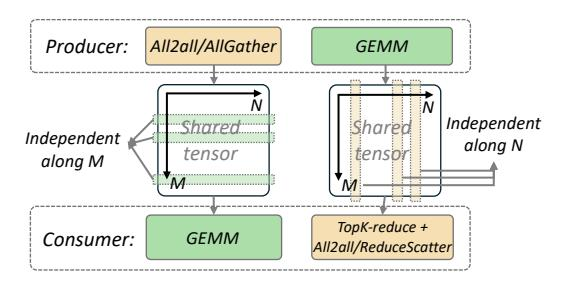
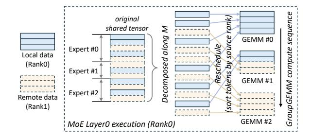
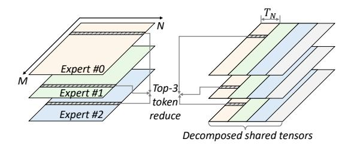
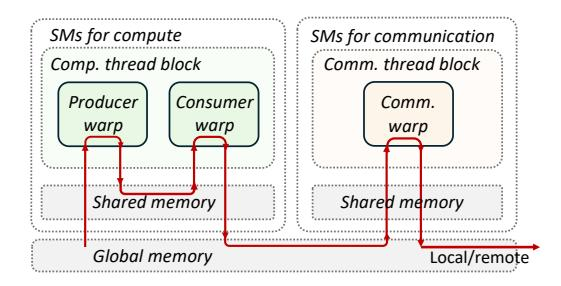

# **3.1 Shared Tensor Based Dependency Resolving**

We now introduce how to resolve the complex data dependency between computation and communication in MoE. It aims to bridge the granularity of communication and computation operations to sustain high efficiency by decomposing and rescheduling shared tensors.

**Figure 4** The producer-consumer modeling of layer0 (left) and layer1 (right) of an MoE layer. The global size of the shared tensor is (M × topk, N) for both layer0 and layer1.

#### **3.1.1 How to decompose the shared tensor?**

Shared tensors, as the bridge between the producer operator and the consumer operator, is the key to enable overlapping. Notably, overlapping can occur only when the producer and consumer operate on independent data within the shared tensor, as illustrated in [Figure 4.](#page-5-0) Thus, we analyze the access pattern of operators on the shared tensor and decompose it along a specific dimension where data remain independent for the consumer operator.

For example, in the communication-computation pipeline in layer0, the consumer operator is a GEMM, with the shared tensor serving as its input matrix. In this case, tokens are independent with each other alongside the M (token) dimension, allowing for decomposition of the shared tensor along M. However, since the computation of a GEMM tile involves multiplication and reduction along the token embedding dimension to produce the final outputs, decomposing the shared tensor along this dimension is not feasible.

As for the computation-communication pipeline in layer1, the consumer operator contains a top-K reduction, which reduces tokens along the M dimension, leading to significant interdependencies between tokens along this dimension. Thus, the shared tensor can only be decomposed along the N dimension where elements are independent.

#### **3.1.2 How to reschedule the decomposed shared tensor?**

At the finest granularity, the shared tensor can be split into individual rows or columns, enabling the consumer to begin computation as soon as a single row or column is received. However, this level of granularity results in low computational efficiency, particularly in pipelines involving compute-intensive GEMMs, which are typically organized and processed

**Figure 5** Decompose and reschedule the shared tensor in MoE layer0. In this illustration, three experts are located on Rank 0, each requiring both local and remote data for computation.

in tiles to achieve high utilization. Therefore, after decomposing shared tensors along specific dimensions, the resulting sub-tensors must be reorganized and rescheduled into tiles for computation. The rescheduling of shared tensors follows two principles: ① Rescheduled sub-tensors should align with the original computation tile granularity for computational efficiency. ② The scheduling policy should prioritize portions of the producer that can be immediately used by the consumer, allowing the consumer to begin execution as early as possible.

Comet leverages GroupGEMM to perform the computations for all experts on current rank. In the communication-computation pipeline (MoE layer0), the shared tensor, consumed by GroupGEMM, is decomposed along the M dimension. To enable early computation by the experts, tokens are sorted based on their source rank, as shown in [Figure 5.](#page-5-1) The compute sequence of tiles in the GroupGEMM is then designed to minimize dependency on remote data, with computation beginning from tiles containing local tokens while the transfer of other remote tokens proceeds concurrently.

In the computation-communication pipeline (MoE layer1), the shared tensor undergoes a top-k reduction after processing by the GroupGEMM of experts. As analyzed previously, the shared tensor is decomposed along the N dimension. The tile computation sequence is adjusted [\(Figure 6\)](#page-6-0) to enable the consumer operator to start processing before expert computations are fully completed. Instead of computing each expert sequentially, GroupGEMM operations are executed column-wise. This approach allows the reduction and communicate operations to proceed as soon as the first TN columns of the shared tensors are computed. Without rescheduling, tokens could only be reduced after all experts have completed their computations.

**Figure 6** Rescheduled compute sequence for MoE layer1 (E = 3 and topk = 3). The execution order of the GroupGEMM is indicated by color (yellow → green → blue → grey). Here, TN denotes the tile size of a GroupGEMM along the N dimension.

**Figure 7** Kernel design for the MoE layer1 on Hopper architecture. Each SM only accommodate one thread block. The red arrows indicates the route of data movement.

