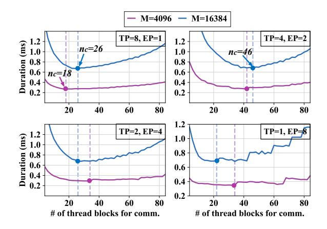

# **3.2 Adaptive Workload Assignment**

With the decomposition and rescheduling of shared tensors, the pipelines in MoE can now achieve finegrained overlap. To ensure effective latency hiding, the durations of fine-grained communication and computation must be closely aligned to minimize pipeline bubbles. Achieving this requires adaptive resource allocation for both computation and communication, tailored to specific tasks involved.

#### **3.2.1 Thread block specialization**

A straightforward approach to achieve communication-computation overlap in Mixture of Experts (MoE) is to encapsulate the entire pipeline within homogeneous thread blocks, integrating communication I/O into the prologue or epilogue of the computation (GEMM), a strategy referred to here as vertical fusion. Through vertical fusion, thread blocks execute concurrently, but the overlap occurs irregularly, leading to non-deterministic latencies of communication and computation, making it challenging to balance their durations for latency hiding. Furthermore, token-level fine-grained I/O in MoE can significantly reduce the computational efficiency of the underlying kernels, particularly on

advanced architectures such as Hopper. To address this, we implement thread block-level isolation between communication and computation workloads. This isolation enables precise control over hardware resource allocation for each workload, facilitating a balanced distribution between computation and communication that maximizes latency hiding.

[Figure 7](#page-6-1) depicts the details of the thread block specialized kernel on Hopper, with the critical data path highlighted in red. Due to the isolation between communication and computation, the GEMM thread blocks in Comet utilize the same implementation as the default GEMM before fusion. In the scenario depicted in [Figure 7,](#page-6-1) where the GEMM is compiled using CUTLASS on the Hopper architecture, the GEMM execution is distributed across different warps. Specifically, the producer warp loads data from global memory into a shared memory buffer with the async TMA instructions, while the consumer warp initiates tensor core MMA operations [\[21\]](#page-13-11). The communication thread blocks subsequently read the results produced by the consumer warp from global memory. Following the top-K reduction, the warps within the communication blocks either write tokens to the local global memory or transmit them to remote destinations. This thread block-specialized programming model is easily portable to other architectures, such as Ampere and Volta, requiring only a substitution of the respective compute thread block implementation.

**Hardware resource restriction.** The proposed thread block-specialized kernel is designed with the primary objective of minimizing data movement costs. However, this design must also contend with hardware resource limitations. For instance, it is theoretically feasible to integrate communication warps with computation warps within the same thread block to eliminate redundant global memory accesses. However, the thread number restriction of warps constrict the communication operator to fully utilize the communication bandwidth. From another perspective, the warps for communication also interfere with the computation warps within the same thread block.

#### **3.2.2 Adaptive thread block assignment**

Suppose that there are n thread blocks for the fused kernel, within which np blocks serve as producers in the pipeline and nc blocks serve as consumers. Identifying an optimal division point np/nc is crucial for maximizing overall efficiency. We demonstrate that the optimal division point is influenced by the shape of input and specific model configurations in an MoE layer. To investigate this, we measure the duration

**Figure 8** Duration of the MoE layer1 kernel with varying number of thread blocks assigned for communication (nc). The total number of thread blocks is identical to the number of SMs on Hopper(132). The figure shows four cases with different parallelisms.

of MoE layer1 across various input sequence lengths and parallelization strategies, as shown in [Figure 8.](#page-7-0) It is observed that there exist an optimal division point under different configurations.

When the input token length changes, although the data sizes processed by communication and computation operations both scale with input length, the scalability of the respective resource requirements differs. Consequently, the optimal division point shifts with changes in input length. For example, when TP = 8, the optimal nc changes from 18 to 26 when M is changed from 4096 to 16384. When the model configuration (parallel strategy) is modified, the optimal division point undergoes a significant alteration. For instance, when TP is adjusted from 8 to 4, the optimal nc is transformed from 26 to 46 with M = 16384.

Comet's library comprises multiple pre-compiled kernels, each with a distinct division point. Prior to deployment, the optimal configuration for each setup is profiled and stored as metadata. During runtime, Comet utilizes this metadata to select the optimal kernel for execution.

