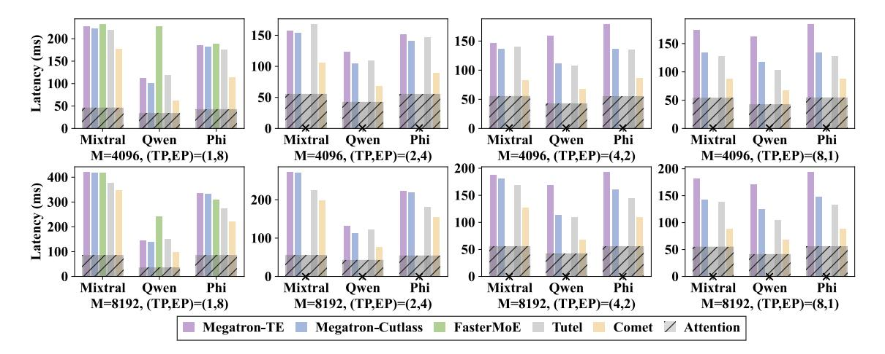

# **5.1 Experimental Setup**

**Testbed.** We evaluate Comet on a server equipped with 8 Nvidia H800 GPUs (80 GB memory each). These GPUs are interconnected through NVLink. Our software environment includes CUDA 12.3, NVSHMEM 2.11, Pytorch 2.4.0 and Megatron-LM (git-hash 6dbe4c).

**Comparing targets.** We then compare Comet with several baselines. All baselines are implemented on Megatron-LM, which is a widely adopted framework for high-performance model execution, integrating hybrid parallel strategies.

The baselines are: (a) **Megatron-Cutlass**: Megatron with MoE experts that are implemented through CUTLASS grouped GEMM [\[22\]](#page-13-14). (b) **Megatron-TE**: Megatron with experts that use transformer en-

**Figure 9** End-to-end MoE model latency. For the computation of MoE layers, the number of token on each device before permutation is  $M \times W/TP$ . The hatched region represents the identical duration of non-MoE (attention) layers in different mechanisms. Note that FASTERMOE only supports expert parallelism for MoE layers.

gine [25]. Transformer Engine is Nvidia's library for accelerating transformer models on NVIDIA GPUs. (c) FasterMoE [7, 8]: FasterMoE is an MoE system that customizes All-to-All communication to overlap the communication and computation operations of experts. (d) Tutel [10]: Tutel delivers several optimization techniques for efficient and adaptive MoE, including adaptive parallelism, the 2-dimensional hierarchical All-to-All algorithm and fast encode/decode with sparse computation on GPU.

#### 5.2 Overall Performance

We evaluate the end-to-end performance of COMET in multiple large MoE models, including Mixtral 8x7B [12], Qwen2-MoE [2] and Phi3.5-MoE [1]. The configurations of these models are shown in Table 2. The experiment is conducted with various input token lengths and diverse hybrid parallel strategies. The experimental details and results are shown in Figure 9. Note that when TP < W, Megatron-LM enables data parallelism for non-MoE layers to improve overall throughput and the data parallel size is W/TP. The computation of attention layers are identical with different mechanisms using Megatron-LM, and only the MoE layer is implemented differently with diverse mechanisms.

As observed, the end-to-end latencies of the benchmarks are reduced by 34.1%, 42.6%, 44.4% and 31.8% with COMET compared with MEGATRON-CUTLASS, MEGATRON-TE, FASTERMOE and TUTEL respectively. The performance gain is more prominent with the identical attention computation apart. COMET outperforms other baselines in all configurations be-

cause it realizes sufficient overlapping and the scheduling inside high-performance fused kernels greatly reduce the the overhead at CPU side.

Besides, we can also observe that MEGATRON-Cutlass and Megatron-TE perform similar. This is because they are identical except from the implementation of GEMM/GroupGEMM. Neither of them supports overlapping, while MEGATRON-TE performs worse in some cases because of the overhead in transformer engine API calls. Tutel performs better than other baselines because it incorporates communication into experts' computation through delicate scheduling and adaptive parallelism. Although communication and computation is overlapped partially, when the number of experts is large (Qwen2), the advantage of Tutel diminishes because of the large scheduling overhead. FASTERMOE only supports expert parallelism (EP = W) and it also does not perform well on Qwen2 because the experts are small in Qwen2 and the kernel invoking time for experts dominates the MoE layer.

