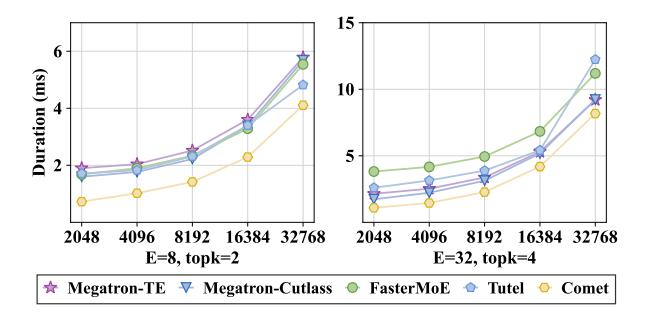
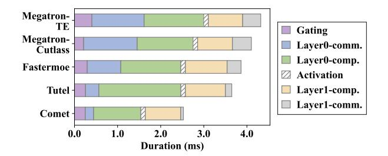
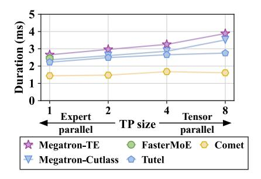

# 5.3 Detailed Evaluation on a Single MoE Layer

We then conduct an in-depth examination of a single MoE layer to perform a detailed analysis.

Handling varying input token lengths. The latency of a single MoE layer with varying input token lengths is shown in Figure 10. With the input token number varying, COMET experiences a shorter duration compared with baselines and the improvement is stable. COMET achieves a 1.28× to 2.37× speedup

**Figure 10** Single MoE layer duration with expert parallelism (EP = 8). The x-axis represents the total input token length M. Each device has M/W tokens before token dispatching. The shape of experts are identical to that of Mixtral 8x7B.

compared with the baselines on average. It is noted that the advantage of COMET is prominent especially when M is small. This is because the scheduling time on the host side predominates the overall duration when M is small and COMET reduces such overhead through kernel scheduling within the fused kernel. The scheduling overhead increases with topk and E for mechanisms with kernel-level scheduling (FASTERMOE and TUTEL) because the experts to manage become more complicated, inducing more kernels to be scheduled.

Time breakdown analysis of an MoE layer. The time breakdown of a specific MoE layer is shown in Figure 11. Note that the communication part only consists of the GPU-to-GPU communication time, and the operations of token indexing, dispatching and combining on local device are regarded as the computation part. As revealed, MEGATRON-TE and Megatron-cutlass experience no overlapping between communication and computation. FASTER-MoE reduces the communication latency through customized Scatter and Gather operators, while the introduced local indexing extends the computation time. Tutel reduces the communication overhead through the optimized all-to-all primitive design. However, its optimized all-to-all also exacerbates the burden of local computation. MEGATRON-TE has no communication overlapped. Comet hides 86.5% of communication latency on average and the computational efficiency of experts is not influenced, while FASTERMOE and TUTEL hide only 29.2% and 68.6% respectively.

Parallelism within the MoE layer. Because of the introduction of expert parallelism, the parallel strategy within the MoE layer can be different from the model's overall parallel strategy. Figure 12 shows

**Figure 11** Time breakdown of an MoE layer with expert parallelism. (EP=8, TP=1, E=8, topk=2 and M=16384).

**Figure 12** Single MoE layer duration under various parallelism strategies with  $E=8, topk=2, M=8192, EP\times TP=8.$ 

the performance of methods applying diverse parallel strategies. Among all baselines, FasterMoE unfortunately does not support tensor parallelism. For other baselines (Megatron-Te, Megatron-Cutlass and Tutel), the MoE layer latency increases when TP grows. This is because that tensor parallelism splits each expert onto multiple devices, triggering more fragmented small GEMMs for experts and resulting in a degradation of computational efficiency. Nevertheless, Comet maintains low latency in diverse parallelisms as the shared tensor is rescheduled to maintain computational efficiency and the weight switching overhead is eliminated.

