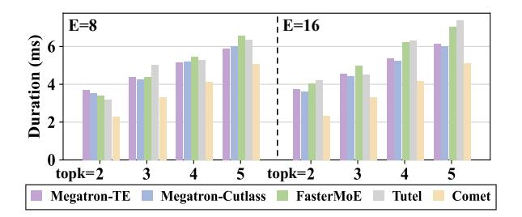
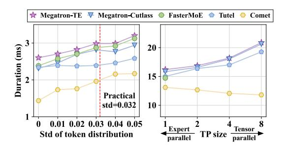

# 5.4 Adaptiveness to Different Configurations

We further inquire into the performance of COMET when adapting different model configurations, runtime workloads and system environments.

**Performance with various MoE parameters.** We adjust the number of experts E as well as topk to evaluate the performance of Comet in various MoE structures. The results are shown in Figure 13. With the increasing of topk, the duration of the MoE layer is increased because the computation amount at run-

**Figure 13** Duration of a single MoE layer (M = 16384,EP = 8, TP = 1) with various number of experts E and topk.

**Figure 14** Performance of a MoE layer when scaling to different scenarios. Left: Duration with various token distribution with expert parallelism (E = 8, topk = 2, M = 8192, TP = 1,EP = 8). Right: Duration on a L20 Cluster with diverse parallelisms (E = 8, topk = 4, M = 8192,EP × TP = 8).

time is scaled up. Comet consistently demonstrates superior performance across different values of topk and E, yielding a speedup in the range of 1.16× to 1.83× compared to baseline implementations.

**Performance with varying token distribution.** When using expert parallelism, the number of tokens routed to different devices varies. We evaluate the performance of Comet in scenarios with imbalanced token distribution. The standard deviation of the token distribution across different experts is denoted as std. As shown in the left panel of [Figure 14,](#page-10-1) 8192 tokens are distributed across various experts with differing distributions. When std = 0, tokens are uniformly distributed and each expert receives M × topk/E = 2048 tokens. At std = 0.05, the leastloaded expert is assigned only a few hundred tokens. In a typical training job in production, the average std is 0.032. When the load imbalance problem is exacerbated, the latency of the MoE layer in all systems is prolonged. Comet consistently outperforms other MoE systems.

**Scaling to distinct clusters.** We carry out the experiments on another distinct cluster with a different

**Table 3** Required device memory size for NVSHMEM.

| Mem(MB) | Mixtral 8x7B | Qwen2-MoE | Phi3.5-MoE |
|---------|--------------|-----------|------------|
| M=4096  | 32           | 16        | 32         |
| M=8192  | 64           | 32        | 64         |

network environment. The cluster is equipped with 8 Nvidia L20 GPUs (46 GB memory) and the GPUs are connected via PCIe bridges. The GPU-to-GPU bandwidth is around 25 GB/s as tested, which is much lower than the H800 cluster. The experiments on the L20 cluster represents a bandwidth-limited environment. As shown in the right panel of [Figure 14,](#page-10-1) the average speedup of Comet compared with other baselines is from 1.19× to 1.46×. The results manifest the superiority of Comet under different cluster environments.

### **5.5 Overhead Analysis**

Comet leverages NVSHMEM to allocate a shared memory buffer for communication on each device. The buffer size is dependent on the model configuration and equals to MN, where M is the input sequence length and N is the model hidden size. For datatype of BF16 or FP16, the allocated memory size is 2MN. The communication buffer is global for the execution of the entire model, which means that it is shared across layers and experts. We list the device memory consumption of Comet in [Table 3,](#page-10-2) and it is negligible compared with the large device memory on current GPUs.

