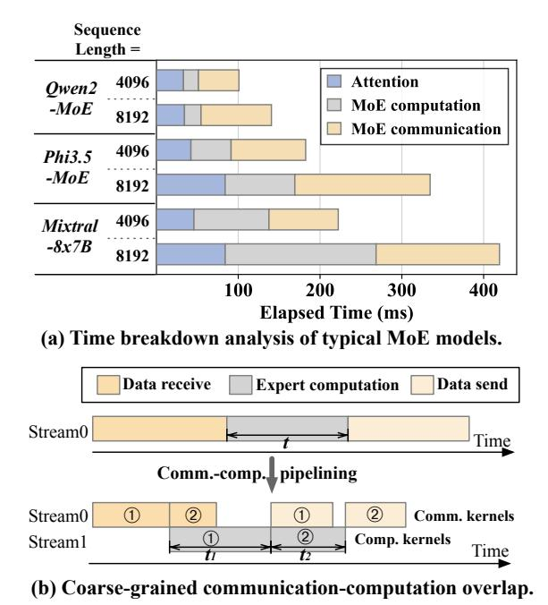

# Comet: Fine-grained Computation-communication Overlapping for Mixture-of-Experts

Shulai Zhang $^{1,2,\circ,*}$ , Ningxin Zheng $^{1,\circ,\dagger}$ , Haibin Lin $^{1,\dagger}$ , Ziheng Jiang $^1$ , Wenlei Bao $^1$  Chengquan Jiang $^1$ , Qi Hou $^1$ , Weihao Cui $^2$ , Size Zheng $^1$ , Li-Wen Chang $^1$ , Quan Chen $^{2,\dagger}$ , Xin Liu $^{1,\dagger}$ 

1ByteDance Seed, 2Shanghai Jiao Tong University

oEqual Contribution, \*Work done at ByteDance Seed, †Corresponding authors

#### **Abstract**

Mixture-of-experts (MoE) has been extensively employed to scale large language models to trillion-plus parameters while maintaining a fixed computational cost. The development of large MoE models in the distributed scenario encounters the problem of large communication overhead. The inter-device communication of a MoE layer can occupy 47% time of the entire model execution with popular models and frameworks. Therefore, existing methods suggest the communication in a MoE layer to be pipelined with the computation for overlapping. However, these coarse grained overlapping schemes introduce a notable impairment of computational efficiency and the latency concealing is sub-optimal.

To this end, we present Comet, an optimized MoE system with fine-grained communication-computation overlapping. Leveraging data dependency analysis and task rescheduling, Comet achieves precise fine-grained overlapping of communication and computation. Through adaptive workload assignment, Comet effectively eliminates fine-grained communication bottlenecks and enhances its adaptability across various scenarios. Our evaluation shows that Comet accelerates the execution of a single MoE layer by  $1.96\times$  and for end-to-end execution, Comet delivers a  $1.71\times$  speedup on average. Comet has been adopted in the production environment of clusters with ten-thousand-scale of GPUs, achieving savings of millions of GPU hours.

Correspondence: Ningxin Zheng, Haibin Lin, Quan Chen, Xin Liu

Project Page: https://github.com/bytedance/flux

#### 1 Introduction

Recent advancements in large language models have revolutionized multiple domains, including natural language processing [35, 36], computer vision [16] and multi-modal perception [3, 14]. These achievements demonstrate that scaling up model size can significantly enhance model capacity. However, the growth in model parameters poses substantial challenges for the deployment of such giant models, as computational resources increasingly constrain model

capacity [28].

To this end, Mixture-of-Experts (MoE) [29] introduces a sparse structure, within which only part of the parameters is activated. Instead of interacting with all parameters in dense models, MoE models allow each input to interact with only a few experts. For example, the Mixtral-8x7B model [12] comprises 45 billion parameters in total, while only 14 billion parameters are active during runtime. Nowadays, MoE has emerged as a key architecture for scaling

**Figure 1** Analysis of the execution of MoE. (a) Time breakdown of MoE models executed on 8 H800 GPUs using Megatron-LM. (b) An illustration of communication-computation overlap by partitioning an expert computation kernel into two.

models to trillion-plus parameters.

The increase in parameter size in MoE models allows for the integration of greater amounts of information, but it poses challenges in expert placement. A typical approach is to distribute the experts across different GPUs as a single GPU cannot store all experts [13]. Consequently, during the execution of MoE layers, there is an intensive need for data exchange among GPUs. In the forward pass of several popular MoE models, the communication among devices accounts for 47% of the total execution time on average, as shown in Figure 1(a).

In a distributed environment, executing an MoE layer involves data reception, expert computation, and data transmission, as depicted in in Figure 1(b). To reduce communication overhead, one effective strategy is to pipeline the process, overlapping communication with expert computation [8, 10, 31, 32]. This approach involves partitioning input data into smaller data chunks, allowing decomposed communication and computation phases to overlap. In the example in Figure 1(b), the received input data is divided into two chunks, and this coarse-grained overlapping reduces the overall execution time relative to non-pipelined execution.

The overlapping in existing mechanisms remains suboptimal due to two primary inefficiencies. First, the efficiency of partitioned experts declines as the data chunks assigned to each expert become smaller, potentially leading to under-utilization of GPU computational resources (e.g., the total compute time of experts after partitioning  $t_1 + t_2$  exceeds the original time t). The coarse-grained partitioning results in unavoidable GPU idle time during the initial and final communication phases, such as when receiving data for chunk 1 and sending data for chunk 2, which do not overlap with computation. Consequently, minimizing the non-overlapping time in these phases while maintaining computational efficiency is crucial. This is challenging because the data dependency between communication and computation is complex and it is hard to be overlapped in a fine-grained granularity efficiently. Second, due to the dynamic nature of MoE, the input shapes for experts are various at runtime, thereby posing diverse communication and computation burdens on GPUs. Encapsulating communication and computation tasks into separate kernels on different streams, like almost all the prior researches do, restricts control over hardware resources and results in non-deterministic kernel performance, thereby hindering seamless overlap (e.g., the computation of chunk 1 and the receiving of chunk 2 are misaligned). The second challenge, therefore, is to dynamically ensure precise allocation of hardware resources between computation and communication workloads at runtime.

The complex data dependency, and the dynamic computation and communication workloads in MoE impede existing systems to realize efficient communication-computation overlap. We therefore propose Comet, a system that enables fine-grained communication-computation overlapping for efficient MoE execution. Comet introduces two key designs: 1) A dependency resolving method that identifies complex data dependencies between communication and computation operations in MoE, enabling optimized computation-communication pipeline structuring. 2) An adaptive workload assignment method that dynamically allocates GPU thread blocks to different workloads within a kernel, balancing communication and computation to improve latency concealment.

COMET facilitates fine-grained overlapping in MoE by analyzing shared data buffers between communication and computation operations, referred to as *shared tensor*. By decomposing the shared tensors along specific dimensions and reorganizing tensor data along with intra-operator execution order,

Comet eliminates the granularity mismatches between communication and computation, thereby enabling fine-grained overlapping. To ensure precise resource allocation and effective latency concealment, Comet integrates communication and computation tasks within fused GPU kernels. Through thread block specialization, Comet isolates the impact of communication on computation performance , maintaining high computational efficiency. By adjusting the number of thread blocks allocated to each workload, Comet effectively balances communication and computation latencies and reduces bubbles in overlapping.

We have integrated Comet into Megatron-LM [\[33\]](#page-13-6) and verified the capability of Comet with various parallel strategies. Our extensive experiments on Nvidia H800 and L20 clusters show that Comet delivers 1.96× speedup for typical MoE layers, and 1.71× speedup for end-to-end MoE model execution (Mixtral-8x7B [\[12\]](#page-12-3), Qwen2-MoE [\[2\]](#page-12-7), Phi3.5-MoE [\[1\]](#page-12-8)) on average, compared with the SOTA MoE systems. Comet has been deployed to accelerate training and inference of large MoE models in production clusters comprising over ten thousand GPUs, achieving savings of millions of GPU hours. Comet introduces a fine-grained pipelined programming model for computation and communication. **We will open-source COMET, aiming to inspire further optimizations**, such as implementing the programming model in Comet using compilers like Triton [\[26\]](#page-13-7) or TVM [\[6\]](#page-12-9).

