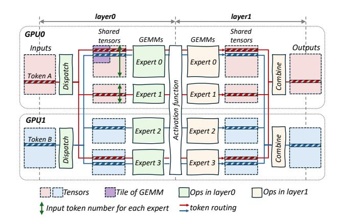

# **2.1 MoE Structure**

**Table 1** Description of symbols.

| Symbol | Description                                      |
|--------|--------------------------------------------------|
| L      | Number of transformer layers                     |
| E      | Total number of experts                          |
| topk   | Number of experts that each token is routed to   |
| TP     | Tensor parallel size                             |
| EP     | Expert parallel size                             |
| W      | Total parallel world size (TP× EP)               |
| M      | Input token length × Batch size                  |
| N      | Embedding size of a token                        |
| K      | Hidden size of the feed-forward layer in experts |

Mixture of Experts (MoE) is critical for efficiently scaling models. By enabling sparse activation of parameters, MoE allows for the integration of more parameters without increasing execution costs, thereby enhancing performance. The key idea of MoE is that it consists of multiple small models, namely experts

**Figure 2** Example of an MoE layer across two GPUs, with two experts reside on GPU0 and two reside on GPU1. The MoE layer is composed of two feed-forward layers. In this example, for each token in the input buffer, it is dispatched to three experts (topk = 3) in layer0 and then the results are combined in layer1. The shape of experts is N × K in layer0 and K × N in layer1.

and tokens are only routed to partial experts for computation. [Figure 2](#page-2-0) shows the typical execution flow of an MoE layer and [Table 1](#page-2-1) explains symbols to describe the execution of an MoE model.

Each input token is assigned to one or more experts for computation, with assignments determined by various algorithms [\[15,](#page-12-10) [40,](#page-13-8) [41\]](#page-13-9). A common method involves a gate network [\[29\]](#page-13-3) that selects the topk experts for each token, as shown in [Figure 2,](#page-2-0) where token A is routed to Expert0, Expert1 and Expert3. After passing through two feed-forward layers of General Matrix Multiply (GEMM), the topk outputs are gathered and reduced to produce the final result.

The operations in MoE's layer0 comprise token communication (dispatch) across GPUs and the first layer of expert computations (GEMM operations), thereby establishing a communication-computation pipeline. MoE's layer1 includes the second layer of expert computations, token undispatch and the topk reduction (combine), forming a computation-communication pipeline.

MoE employs two primary parallelization strategies: **Expert parallelism** [\[13\]](#page-12-4) and **Tensor parallelism** [\[33\]](#page-13-6). In expert parallelism, the weights of different experts are distributed across separate GPUs, with each expert's weights being fully intact. Tokens are routed to the corresponding devices of their respective experts. [Figure 2](#page-2-0) shows a case for expert parallelism, with Expert0 and Expert1 reside on GPU0 and others reside on GPU1. In contrast, tensor parallelism

partitions the weights of all experts along the hidden dimension, with each GPU hosting a portion of the weights from all experts. Both expert and tensor parallelism are essential for the efficient execution of MoE. In practical deployment of MoE models, a hybrid parallelism approach combining both expert and tensor parallelism is often applied.

