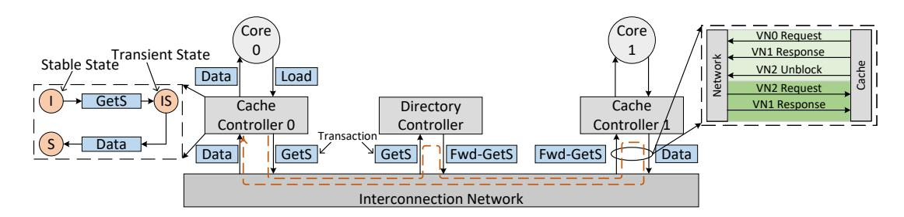

# *A. Chiplet Ecosystem*

Chiplets represent a feasible pathway for sustaining Moore's Law scaling [22], [37], exemplified by commercial deployments such as AMD's MI300 series accelerators [36], [35]. Beyond established area and cost advantages, industry-wide standardization represents a paradigm shift toward vendoragnostic interoperability, which is critical for the open chiplet ecosystem. Chiplet standardization comprises five maturity stages [8], [28], with the ultimate objective of establishing an open ecosystem enabling seamless interoperability between standard chiplets from multiple vendors.

Advanced packaging technologies like TSMC's CoWoS enable multi-chiplet integration onto a shared interposer [15], providing a feasible way toward plug-and-play chiplets [18]. Interposers are functionally classified by their integration of active components: passive interposers comprise only metal wires, and active interposers incorporate transistors [20]. While active interposers incur higher fabrication costs, they significantly enhance routing flexibility and functional integration. Crucially, they leverage mature, low-cost process nodes to consolidate power management, high-speed I/O, and NoC routers. This integration reduces chiplet design complexity, ultimately lowering total system cost [17].

As the interconnection substrate, interposers feature simpler functionality than chiplets, enabling reuse across designs. For instance, SHINSAI [18] demonstrates this paradigm: its reusable active interposer integrates 512MB of on-die SRAM and programmable interconnects capable of adapting to heterogeneous transmission demands (e.g., CPU-to-memory, accelerator-to-CPU). This reusability allows designers to concentrate on core innovations while reinforcing the modularity

Fig. 2. A coherence transaction flow within a directory-based cache coherence protocol. The left part depicts state transitions governed by a finite state machine, while the right part details VN assignments for protocol message classes to prevent protocol deadlock.

essential for a standardized ecosystem. However, interposer reuse necessitates not only standardized die-to-die interfaces (e.g., UCIe) but also deadlock-free NoC routing algorithms [42] [12] [22] to enable safe direct connectivity between arbitrary chiplets.

### *B. Coherence Transaction*

In shared-memory multicore processors, concurrent memory accesses by multiple cores necessitate hardware coherent caches to maintain data coherence. Coherence protocols transparently enforce the ordering of coherence transactions, ensuring cores never observe stale data [7], [30]. The MSI protocol serves as the typical cache coherence implementation, encompasses three stable states (Modified, Shared, Invalid) and several transient states (e.g., IS, IM). Coherence transactions (such as GETS, GETX, and UPGRADE) trigger deterministic state transitions (e.g., I → IS) through a precisely defined state machine. Consequently, the complete protocol specification can be formally derived from exhaustive state transition analysis.

Cache coherence protocols are categorized by their implementation methodology. Snooping-based protocols broadcast coherence messages to all nodes, offering low implementation complexity but exhibiting limited scalability due to broadcast traffic. In contrast, directory-based protocols [29], [30] employ point-to-point message transmission, achieving scalability via directory state tracking while incurring higher request-response latency primarily due to indirection. Given the scalability requirements of multi-chiplet systems, this work focuses exclusively on the directory-based protocol.

A coherence state transition comprises a sequence of coherence transactions, typically initiated by a request and terminated by a response. Fig. 2 depicts transactions and state transitions triggered by a Load operation from the core. Each cache controller implements a finite-state machine (FSM) that governs state transitions based on the current state and incoming transactions. Using Gem5's MESI Two Level protocol [3] as a reference architecture. Processing cores interface directly with private caches. Communication between the cache and directory is transmitted via NoC.

Dependencies exist between coherence transactions (e.g., GetS → Data response) [21]. Protocol-level deadlock arises when dependency cycles form among transactions. To resolve this, distinct VNs are allocated to transactions based on their dependency relationships. As illustrated in Fig. 2, three dedicated VNs ensure protocol-level deadlock prevention. Since transactions map directly to NoC packets, packet routing behaviors may be inferred from transaction dependencies. As Fig. 2 illustrates, when cache controller 0 issues a GetS request at t0, the corresponding Data response will arrive at t1 (t1 > t0). However, runtime variations, including cache line state transitions, directory state updates, and network congestion, introduce non-determinism between transaction and packet routing, necessitating precise modeling for reliable prediction.

### *C. Inter-Chiplet Deadlock Resolution*

Integrating multiple intrinsically deadlock-free chiplets via an interposer may cause inter-chiplet deadlock [12]. Resolving such inter-chiplet deadlock demands evaluation beyond conventional NoC metrics (latency, throughput, area, etc.) [34]. Effective solutions must simultaneously optimize:

- Standardization: Preserving vendor-agnostic chiplet interoperability.
- Integration Overhead: Minimizing design effort required for each added chiplet.
- Portability: Enabling seamless redeployment of chiplets across multi-chiplet systems without vendor-specific reconfiguration.

These metrics are critical for realizing a sustainable chiplet ecosystem and interposer reuse [28], [22], [17], [18]. Standardization guarantees vendor-agnostic interoperability of chiplet interfaces, ensuring seamless communication across heterogeneous chiplet vendors. Integration Overhead quantifies the effort for incorporating a chiplet into a target system, indicating the degree of backward compatibility with existing NoC designs. Portability quantifies the ease with which chiplets can migrate between different floorplans or multi-chiplet systems without redesign.

Existing inter-chiplet deadlock solutions impose significant tradeoffs between performance, implementation complexity, and ecosystem compatibility. Some solutions prevent deadlock using turn restrictions, channel isolation, or injection control. For example, Modular Turn Restriction (MTR) [42] applies turn restrictions at chiplet-interposer boundary routers to break cyclic dependencies. However, this may induce vertical channel load imbalance, and its configuration depends

TABLE I
COMPARISON WITH RELATED DEADLOCK RESOLUTION TECHNIQUES\*

|                    | Modularity | High Resource | Deadlock  | Topology | Low Integration | High        | Chiplet         |
|--------------------|------------|---------------|-----------|----------|-----------------|-------------|-----------------|
|                    |            | Utilization   | Avoidance | Agnostic | Overhead        | Portability | Standardization |
| MTR [42]           | ✓          | Х             | ✓         | Х        | ✓               | Х           | ✓               |
| DeFT [39]          | ✓          | Х             | ✓         | ✓        | Х               | ✓           | ✓               |
| RC [25]            | ✓          | ✓             | ✓         | Х        | Х               | Х           | Х               |
| UPP [41]           | ✓          | ✓             | Х         | ✓        | Х               | ✓           | Х               |
| Steered Bubble [6] | <b>√</b>   | <b>√</b>      | X         | <b>√</b> | <b>√</b>        | ✓           | Х               |
| This work          | <b>√</b>   | <b>√</b>      | ✓         | ✓        | ✓               | ✓           | <b>√</b>        |

\* Some conventional approaches are not listed.

on TSV/interposer wiring layouts, compromising portability. In contrast, DeFT [39] isolates upward/downward traffic via dedicated VCs, requiring at least 2 VCs per virtual network, which increases integration costs. Meanwhile, RC [25] employs dedicated permission networks within chiplets to regulate packet injection. While effective, this approach increases router complexity and creates vendor lock-in through custom control logic.

Solutions like Upward Packet Popup (UPP) [41] and Steered Bubble [6] allow deadlocks to occur initially, then detect deadlock states and recover quickly to minimize performance impact. However, they require non-trivial deadlock detection logic and architectural modifications for escape channels (UPP) or directional bubble routing (Steered Bubble). These modifications increase verification complexity and limit cross-design redeployment.

These techniques necessitate intra-chiplet NoC modifications or detailed internal knowledge, thereby undermining the plug-and-play objectives of the open chiplet ecosystem, as shown in Table I.

Fig. 3. Spatio-temporal distribution patterns across VNs.

#### D. Dependency between VNs

Coherence protocols exhibit strict ordering dependencies between message types (e.g., Request → Forward-Request → Response). Cyclic dependencies within these chains can cause protocol-level deadlock. Conventionally, this is resolved by segregating message classes into distinct VNs, where the minimum VN count equals the length of the longest message dependency chain [21]. Fig. 3 presents spatio-temporal message distribution patterns across VNs at an L1 cache controller port under Gem5's MESI\_Two\_Level protocol, revealing two observations.

Observation 1: Dependency-driven temporal correlation exists between VNs. VN0 and VN2 exhibit synchronized activity fluctuations. Considering they transport different types of coherence transaction messages, this similarity strongly suggests a manifestation of the inherent dependencies between protocol transactions.

Observation 2: VN utilization is asymmetric. The utilization of VN0 is significantly higher than that of VN1 and VN2. VN1/VN2 show intermittent bursts. This asymmetry may stem from protocol-imposed sequentiality. Request generation precedes forward requests, which ultimately trigger responses, thereby creating a throttled pipeline with non-uniform bandwidth demands.

#### III. IMPLEMENTATION

To enable deadlock-free interoperability in the open chiplet ecosystem while preserving vendor independence, we introduce the **D**eadlock-Free **B**ridge **M**odule (DFBM). *First*, it guarantees inter-chiplet deadlock-freedom without requiring modifications to intra-chiplet NoCs; *second*, it achieves zero-intrusive integration, eliminating the need for chiplet-level NoC reconfiguration; *third*, it supports seamless redeployment across heterogeneous multi-chiplet systems, enabling vendoragnostic interoperability.

