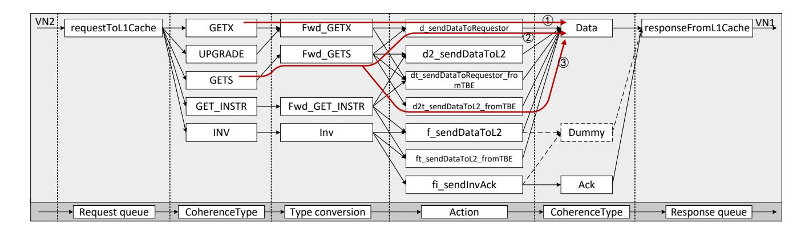

# A. Transaction Model

We employ a straightforward coherence transaction model to characterize the relationships among transactions [21]. All coherence transactions in the protocol constitute the set T. We use a relation  $\stackrel{cause}{\longrightarrow} \subseteq T \times T$ .  $\forall T_a, T_b \in T$ ,  $T_a \stackrel{cause}{\longrightarrow} T_b$  means the

Fig. 6. The coherence transaction flow for the L1 cache request queue. It illustrates how the L1 cache manages incoming requests and processes their corresponding responses.

occurrence of transaction  $T_a$  will be followed by transaction  $T_b$  after a certain interval. For example:

$$GetS \stackrel{cause}{\longrightarrow} Data$$
 (1)

Upon a cache miss during a core Load operation, the requesting cache issues a GetS request packet. This packet routes via the NoC to the relevant directory controller. Two distinct resolution paths exist. When the directory holds valid data, it directly returns a Data response to the source node, as Equation (1) shows. When the directory's state is stale, the directory forwards the request to the current owner cache, which subsequently provides the Data response, as Equation (2) shows.

$$GetS \xrightarrow{cause} Fwd - GetS \xrightarrow{cause} Data$$
 (2)

Every GetS request invariantly generates a corresponding Data response through these protocol mechanisms. According to the protocol state machine, for any coherence transaction  $t_0$ , the set  $R_{t_0}$  composed of all possible consistency transactions that  $t_0$  may lead to can be easily constructed, as shown in Equation (3).

$$R_{t_0} = \{ t \mid t_0 \stackrel{cause}{\longrightarrow} t \} \tag{3}$$

A Walk-through Example: Fig. 6 illustrates the coherence transaction flow for the L1 cache request queue (request-ToL1Cache) under Gem5's MESI\_Two\_Level protocol. The four-stage sequence proceeds as follows: first, a message is dequeued and its protocol message type extracted; second, this type is translated into a controller-recognizable transaction; third, the current cache line state and translated transaction trigger a state transition within the cache controller's FSM; fourth, response messages are generated based on the result of the state transition. Iterating this process for all transactions reveals the complete workflow, as shown in Fig. 6. Consistent with Equation (3), the transaction set for GETS is formally derived as Equation (4).

$$R_{GETS} = \{Data\} \tag{4}$$

### B. Deriving Packet Transmission Behavior

The transaction set  $R_{GETS}$  enables prediction of packet transmission behavior at chiplet NoC boundaries. When transaction GETS appears in RequestToL1Cache at  $t_0$ , a Data response necessarily emerges in ResponseFromL1Cache at  $t_1$  ( $t_1 > t_0$ ). Such deterministic relationships permit inference of response queue from request queue. Systematic analysis of R sets across all coherence transactions establishes correlations between transactions and NoC packet transmission behavior, enabling the construction of the expected credit table.

However, in certain scenarios, protocol non-determinism introduces substantial complexity. Cache line state transitions may trigger variable response counts, ranging from 0 to a protocol-specific maximum K. The same input in a state machine can yield varying state transitions and corresponding actions. For instance, the *Inv* operation may initiate both *Data* and *ACK* simultaneously or either one individually, as Fig. 6 shows.

To address this non-determinism, we propose *dummy packets* that enforce a fixed upper-bound correspondence (K) between requests and responses. This may require protocol modifications to route dummy packets to the DFBM, incurring bandwidth overhead. Quantitative evaluation of this overhead appears in Section VII-D.

#### C. Admission Arbitration

Leveraging the outputs of Stage 1, Stage 2 executes creditbased admission control following these rules.

**Rule 1:** Out-Req messages must be admitted into the CM. As the Out-Req messages injection count is predefined via negotiation with cache controllers during the design phase.

**Rule 2:** In-Rsp messages are unregulated. As they represent terminal coherence transactions with no further downstream dependencies.

For actively initiated packets originating from within the chiplet (Out-Req), the CM pre-negotiates a maximum request number with each managed cache controller during the design phase. When an internal request packet  $P_0$  enters from the chiplet's NoC, the available credit count for its associated

cache controller is decremented by one. Subsequently, when the CM receives the response packet ( *In-Rsp*) corresponding to request P0, the controller's available credit count is incremented by one, completing the credit lifecycle.

Rule 3: *In-Req and In-Fwd-Req messages are only admitted into the CM when available credits exist.*

Rule 4: *Out-Rsp and Out-Fwd-Req messages are unregulated. Because they are subsequent to In-Req and In-Fwd-Req and subject to Rule 3.*

For passively generated responses (*Out-Rsp and Out-Fwd-Req*) triggered by external requests (*In-Req and In-Fwd-Req*), when an external request packet P1 enters the CM destined for the chiplet's NoC, the CM first queries the maximum predicted response count Pmax for this specific transaction. The packet is admitted if and only if the CM maintains sufficient reserved credits to buffer Pmax packets. This conditional admission ensures that all downstream packets recursively triggered by P1 can be fully absorbed by the DFBM, thereby preventing backpressure propagation into the source chiplet.

### *D. Impact on Performance*

Adhering to the aforementioned admission control rules, the CM generally avoids blocking packets, particularly when network load is low and credit is adequate. However, under high network load, the CM may intentionally block packets to prevent resource oversubscription, as congested networks are more prone to deadlock [40]. Furthermore, the isolation of intra- and inter-chiplet packets effectively reduces competition for network resources [43] by segregating traffic domains. This feature of DFBM minimizes the negative impact on packet transmission as much as possible.

