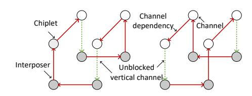
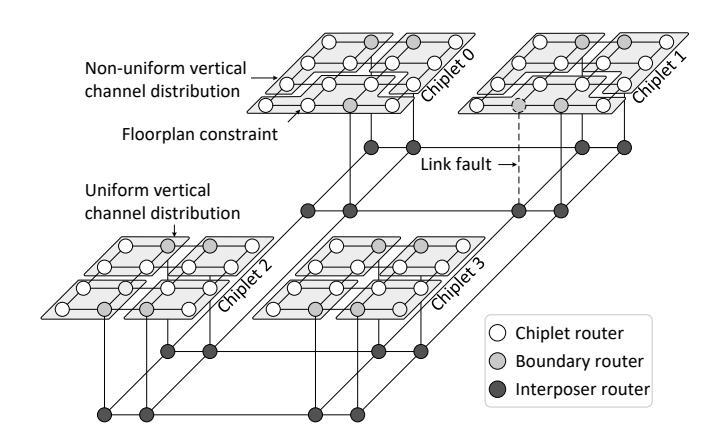

# *D. The Relationship Between CM and CVN-DB*

The CM enforces deadlock avoidance via credit-based injection control, while the CVN-DB improves buffer utilization efficiency through shared buffering across VNs. They operate independently but exchange limited state information. Specifically, CM retrieves deadlock buffer occupancy from CVN-DB to avoid credit oversubscription, and CVN-DB fetches credit values from CM to sequence packet entry into the deadlock buffer. Collectively, they achieve an optimal balance among correctness, performance, and cost for DFBM operating as a standalone module.

### VI. PROOF OF DEADLOCK-FREEDOM

The Channel Dependency Graph (CDG) C = G(V, E) for an interconnection network I is a directed graph: vertices are network channels, edges show dependencies between them. I is deadlock-free if C has no directed cycles. The DFBM prevents cycles in CDG through the injection control of packets between chiplets and the interposer. Fig. 8 shows CDGs under diverse traffic directions.

Fig. 8. A CDG-based analysis of DFBM's deadlock avoidance methodologies. DFBM ensures unblocked downward channels to avoid CDG cycle formation.

*Proof:* Packets injected from chiplets into the interposer are categorized as either actively initiated packets or passively generated packets.

- Actively initiated packets: as Rule 1 presents, fixed credits are negotiated per request-initiating node, guaranteeing absorption of all initiated request packets.
- Passively generated packets: as Rule 4 presents, incoming external requests are tracked to predict the number of responses, with credits pre-reserved to ensure all passively generated packets are absorbed.

Under worst-case scenarios, DFBM guarantees full absorption of all packets traversing from chiplets to the interposer, thereby eliminating dependencies on chiplet-to-interposer vertical channels.

Fig. 9. A multi-chiplet system employs four chiplets interconnected with a shared interposer via vertical channels. Layout constraints or link faults may lead to unevenly distributed boundary routers.

