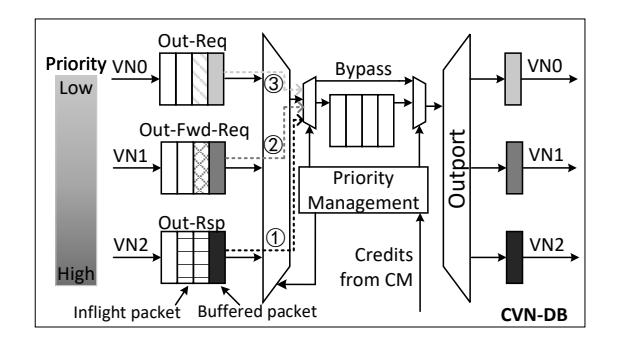

# V. CROSS-VN DEADLOCK BUFFER

The CVN-DB enables cross-VN buffer sharing by enforcing prioritized admission ordering. Its core principle leverages inter-VN dependency relationships to assign message priority levels, where messages from higher-priority VNs receive arbitration preference, as illustrated in Fig. 7.

Fig. 7. CVN-DB supports cross-VN buffer sharing. When packets from different VNs compete for the deadlock buffer, higher-priority VN packets are admitted first.

### *A. VN Priority Assignment*

The CVN-DB establishes a strict priority hierarchy (Response > Forward-Request > Request) based on inherent inter-VN dependency chains. During concurrent buffer access contention, messages from higher-priority VNs (e.g., Response VN) receive admission precedence. This prioritization exploits the causal relationship where higher-priority messages (Responses) are exclusively triggered by lower-priority messages (Requests). By prioritizing response draining while temporarily throttling request injection, the system methodically resolves dependency chains directionally. This sequential dependency elimination systematically prevents circular channel dependencies, thereby guaranteeing deadlock avoidance.

Rule 5: *When the deadlock buffer can hold all pending highpriority VN packets and retains free slots, the current VN packet—being lower-priority—is allowed to enter.*

For packets injected from chiplets to the interposer (*Out-Req, Out-Fwd-Req, Out-Rsp*), the CVN-DB enforces prioritybased admission. *Out-Rsp* packets (highest priority) gain immediate buffer access. *Out-Fwd-Req* packets (lower priority) mandate available buffer capacity that exceeds the buffer reserved for *Out-Rsp* responses. *Out-Req* packets follow similar rules. The reserved buffer comprises buffered and inflight packets. To compute the inflight packet count, CVN-DB leverages credit values obtained from the CM.

As illustrated in Fig. 7 for *Out-Fwd-Req* admission, packets are only enqueued in the buffer when the capacity occupied by pending *Out-Rsp* responses leaves sufficient space to accommodate new *Out-Fwd-Req* packets. This mechanism ensures that, even under worst-case traffic scenarios, the CVN-DB retains enough buffer space to absorb these responses without blocking downstream communication.

