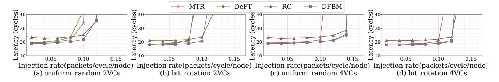
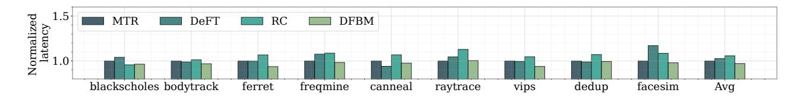
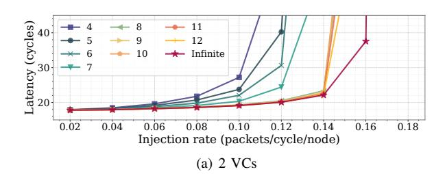
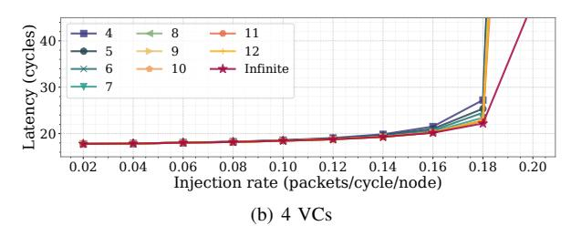

# VII. EVALUATION

We evaluate the DFBM using Gem5 [3] and Garnet [1], with detailed configuration parameters provided in Table II. As illustrated in Fig. 9, the multi-chiplet system comprises four homogeneous chiplets interfacing with a shared interposer via vertical channels. Both chiplets and the interposer adopt 4×4 mesh topologies with XY routing. DFBM is topologyagnostic. Due to mesh's widespread adoption in prior work, we selected mesh as the baseline topology [42], [39], [25]. Given DFBM's deadlock-avoidance design, we evaluate it against three state-of-the-art solutions: MTR (turn-restriction based), DeFT (virtual channel isolation), and RC (injection control).

TABLE II CONFIGURATION PARAMETER.

| Network configurations     |                                         |  |  |  |
|----------------------------|-----------------------------------------|--|--|--|
| Topology                   | Chiplet: 4x4 mesh; Interposer: 4x4 mesh |  |  |  |
| Routing algorithm          | XY                                      |  |  |  |
| Virtual Network            | 3 VNs, 2 or 4 VCs per VN                |  |  |  |
| Traffic pattern            | Uniform-Random, Transpose, Bit-Rotation |  |  |  |
| Flow control               | virtual cut-through                     |  |  |  |
| Full system configurations |                                         |  |  |  |
| Core                       | x86 out of order cores                  |  |  |  |
| L1 Cache                   | 32KB Instruction, 32KB Data,            |  |  |  |
| L2 Cache                   | 256KB per core, 16-way set associative  |  |  |  |
| Cache coherence            | MESI Two Level                          |  |  |  |
| Benchmark                  | PARSEC [2]                              |  |  |  |

As vertical channels may exhibit non-uniform distribution due to floorplan constraints or link faults [38], [13], we conducted performance evaluations under both conditions. As shown in Fig. 9, the chiplet NoC connects to the interposer NoC via boundary routers. Non-uniform vertical channel distribution may lead to uneven load on boundary routers. Under uniform distribution, four chiplets connect via 16 vertical channels, with distribution matching that of Chiplet 2. Under non-uniform distribution, four chiplets use 12 vertical channels, with distribution matching that of Chiplet 0.

The evaluation framework comprises four parts. *First,* assessing performance under both uniform and non-uniform

Fig. 10. Latency and throughput under varying traffic patterns and VC counts.

Fig. 11. Latency and throughput under non-uniform vertical channel distribution, with varying traffic patterns and VC configurations.

vertical channel distributions using synthetic traffic patterns; *second*, full-system simulation across uniform/non-uniform vertical channel distributions. *third*, Verilog generation via OpenSMART [19] followed by area/power analysis using EDA tools. OpenSMART is a NoC RTL generator in BSV and Chisel. *fourth*, quantifying the impact of architectural parameter variations on DFBM performance and deadlock resolution.

#### A. Synthetic

Fig. 10 illustrates the latency and saturation throughput comparisons under varying traffic patterns (uniform\_random, bit rotation) and VC configurations (2, 4 VCs). Analysis of subfigures (a/c) and (b/d) reveals that increasing the number of VCs consistently enhances saturation throughput across all evaluated algorithms. In high-VC configurations (Figs. 10c-10d), all algorithms exhibit comparable saturation throughput, indicating that the number of vertical channels emerges as the primary throughput bottleneck. Under low-VC conditions (Figs. 10a-10b), DeFT and MTR exhibit degraded throughput due to inherent constraints. DeFT's partitioning of VCs into upward/downward directions reduces effective VC utilization by limiting VC selection flexibility, while MTR's turn restrictions exacerbate load imbalance across vertical channels. In contrast, both RC and DFBM maintain unconstrained VC and vertical channel selection, enabling them to achieve 14% higher saturation throughput than DeFT/MTR under uniform traffic patterns, attributed to their routing flexibility.

Fig. 11 illustrates the latency and throughput characteristics under non-uniform vertical channel distributions (as Fig. 9 shows) across diverse traffic patterns (uniform\_random, bit\_rotation) and VC configurations (2, 4 VCs). Increasing VC count maintains its positive impact on saturation bandwidth (Figs. 11c-d). The combined effect of non-uniform channel distribution and MTR's routing restrictions exacerbates performance degradation. In contrast, both RC and DFBM sustain

superior bandwidth utilization through unconstrained vertical channel selection. However, non-uniform channel distribution increases RC's permission network complexity, which inevitably elevates packet latency in the permission network and propagates to overall packet latency. DFBM mitigates this degradation through the CVN-DB's capacity optimization and allocation mechanism, which effectively minimizes the performance impact of channel asymmetry by balancing buffer allocations.

Fig. 12. Area and power.

#### B. Area and Power

In multi-chiplet systems, where chiplets and the interposer typically employ diverse fabrication processes, the total cost is derived using Equation (5):

$$cost = \frac{1}{Y_{assembly}} \left[ \sum_{i=1}^{N} C_{chiplet} + C_{interposer} + C_{assembly} \right]$$
 (5)

Here,  $Y_{assembly}$  denotes the multi-chiplet packaging yield,  $C_{chiplet}$  represents the chiplet manufacturing cost,  $C_{interposer}$  denotes the interposer manufacturing cost, and  $C_{assembly}$  corresponds to the interposer packaging cost. Interposers generally utilize more mature process technologies than chiplets, leading to reduced production costs. Equation (5) quantifies that offloading chiplet manufacturing costs to the interposer offers economic advantages.

Fig. 12 quantifies the hardware overhead via comparative area and power analysis. MTR imposes only vertical channel

Fig. 13. Latency comparisons under full-system mode with uniform vertical channel distributions.

Fig. 14. Latency comparisons under full-system mode with non-uniform vertical channel distributions.

restrictions, achieving the lowest area overhead. DeFT's requirement for at least 2 VCs incurs 48% greater area than MTR. RC introduces 1.9% area overhead localized within chiplets. Dedicated deadlock buffer per VN for DFBM incurs an area overhead of 5%; adopting CVN-DB can reduce the area overhead to 2.5%. Additionally, DFBM confines its overhead entirely to the cost-efficient interposer, exploiting the latter's manufacturing advantage.

#### C. Full System

Fig. 13 and Fig. 14 present latency comparisons under the PARSEC [2] benchmark suite in full-system mode, evaluating both uniform and non-uniform vertical channel distributions with fixed 2 VCs. System configuration parameters are detailed in Table II. The results demonstrate that DFBM consistently outperforms baseline approaches across all evaluated scenarios. Under uniform channel distributions, DFBM achieves 1-7% latency reduction versus MTR, with an average of 3%. Under non-uniform conditions, DFBM maintains 1-4% latency improvement relative to MTR, with an average of 2%. DFBM exhibits stable performance advantages over DeFT and RC across both channel configurations, confirming its resilience to channel distribution variations.

#### D. Sensitivity Study

Further analysis examines parameter sensitivity within the DFBM.

CVN-DB Capacity: Fig. 15 illustrates the impact of CVN-DB buffer capacity variations on latency and throughput under varying VC configurations (VC=2, 4). For VC=4, adjustments to CVN-DB capacity yield negligible performance effects, indicating that vertical channel throughput constitutes the primary performance bottleneck. Conversely, with VC=2, both latency and throughput exhibit significant improvement as buffer capacity increases. However, these gains diminish sharply once the buffer size reaches a certain threshold. The capacity of the CVN-DB correlates with the number of VCs; otherwise, it may become a performance bottleneck. Critically, strategic co-optimization of VC count and buffer capacity enables

performance to asymptotically approach the theoretical limits achievable with infinite buffer resources.

Fig. 15. The impact of CVN-DB buffer capacity with varying VCs.

Fig. 16. Latency and throughput impact for shared or dedicated buffers.

**Shared vs. Dedicated Buffers:** The shared buffer design of CVN-DB across multiple VNs introduces a potential performance trade-off compared to dedicated per-VN buffers. Fig. 16 quantifies this impact through latency and throughput comparisons under VC=2 and VC=4. Analysis of the results reveals that the shared buffer incurs only marginal performance degradation relative to dedicated buffers. This minimal performance penalty stems from two factors. First,

the CVN-DB primarily constrains the admission ordering of congestion packets into the shared buffer. Second, under normal network conditions, congestion packets constitute a small portion of total network traffic, limiting their impact on overall buffer utilization. Consequently, the shared buffer maintains near-equivalent performance to dedicated designs while significantly reducing hardware overhead.

Fig. 17. Percentage of dummy packets.

**Dummy Packet Overhead:** The DFBM leverages dummy packets to enforce deterministic mapping between coherence transactions and packet transmission behaviors. As quantified in Fig. 17, these auxiliary packets account for a small proportion of total network traffic across diverse benchmark workloads. Furthermore, since dummy packets operate exclusively within the chiplet-DFBM interface, the localized transmission of dummy packets incurs minimal latency impact and imposes only restricted bandwidth competition with normal packets.

#### VIII. RELATED WORK

Deadlock arises when cyclic dependencies form in the Channel Dependency Graph (CDG). Resolution can be broadly categorized as follows.

Deadlock avoidance employs proactive constraints to prevent CDG cycle formation. Dally's theory avoids deadlocks by preventing the formation of cycles in CDG (e.g., XY, West-First [10], Turn Model [14]). Dauto's theory [9] maintains deadlock-free escape channels, providing guaranteed forward paths. Bubble Flow Control [4], [24] reserves fixed buffer slots (bubbles) in ring or torus topologies to prevent exhaustion of channel resources. Deflection [40] reroutes contended packets to free outports, eliminating blocking and thus preventing deadlock.

Deadlock recovery dynamically resolves existing dependency cycles. Mechanisms like SPIN [34], SWAP [32], and DRAIN [31] resolve deadlock by coordinating the movement of packets to change their positions and alter channel dependencies. SEEC [33] and Pitstop [11] construct virtual paths enabling packets to bypass congested regions or reach the destination directly.

There are some 2.5D NoC-specific approaches. MTR [42] prevents inter-chiplet CDG cycles via boundary router turn restrictions, featuring low implementation cost. DeFT [39] isolates upward/downward traffic on distinct VCs, ensuring deadlock freedom with at least 2 VCs. RC [25] employs intrachiplet permission networks to isolate inter- and intra-chiplet packets, thereby eliminating channel dependencies between chiplets and the interposer. UPP [41] creates virtual bypass

paths allowing blocking packets in vertical channels to reach their destination, thereby breaking deadlock. Steered Bubble [6] simultaneously monitors upward and downward channels to identify deadlock cycles. It then injects bubbles into the cycles to break the deadlock.

#### IX. CONCLUSION

We introduce the Deadlock-Free Bridge Module (DFBM), enabling universal deadlock-free interconnection between heterogeneous chiplets in multi-chiplet systems. The DFBM's core contribution resides in its ability to decouple deadlock resolution from chiplet NoC implementation specifics, thereby eliminating the need for modifications to chiplets' internal NoCs while ensuring seamless interoperability. This architectural decoupling achieves three advantages. First, it preserves genuine chiplet NoC modularity essential for a vendor-agnostic ecosystem. Second, it eliminates chiplet NoC redesign costs for deadlock avoidance. Third, it enables seamless integration of chiplets. Furthermore, we propose the CVN-DB, enabling deadlock buffer sharing across multiple VNs, eliminating dedicated per-VN buffer allocations. Evaluation results demonstrate that DFBM delivers 1-7% latency reduction versus state-of-the-art solutions, while incurring 2.5% additional area overhead.

#### X. ACKNOWLEDGEMENT

We thank all anonymous reviewers for their insightful comments and suggestions. This work was supported in part by the TDRCJH program (Grant No. 22-TDRCJH-02-006) and the project funded by the State Key Laboratory of High Performance Computing (Grant No. 202401-04).

#### REFERENCES

- N. Agarwal, T. Krishna, L.-S. Peh, and N. K. Jha, "Garnet: A detailed on-chip network model inside a full-system simulator," in 2009 IEEE International Symposium on Performance Analysis of Systems and Software, 2009, pp. 33–42.
- [2] C. Bienia, S. Kumar, J. P. Singh, and K. Li, "The parsec benchmark suite: Characterization and architectural implications," 2008 International Conference on Parallel Architectures and Compilation Techniques (PACT), pp. 72–81, 2008. [Online]. Available: https://api.semanticscholar.org/CorpusID:10043111
- [3] N. Binkert, B. Beckmann, G. Black, S. K. Reinhardt, A. Saidi, A. Basu, J. Hestness, D. R. Hower, T. Krishna, S. Sardashti, R. Sen, K. Sewell, M. Shoaib, N. Vaish, M. D. Hill, and D. A. Wood, "The gem5 simulator," vol. 39, no. 2, pp. 1–7, aug 2011. [Online]. Available: https://doi.org/10.1145/2024716.2024718
- [4] C. Carrion, R. Beivide, J. Gregorio, and F. Vallejo, "A flow control mechanism to avoid message deadlock in k-ary n-cube networks," in *Proceedings Fourth International Conference on High-Performance Computing*, 1997, pp. 322–329.
- [5] S. Chen, S. Li, Z. Zhuang, S. Zheng, Z. Liang, T.-Y. Ho, B. Yu, and A. L. Sangiovanni-Vincentelli, "Floorplet: Performance-aware floorplan framework for chiplet integration," *IEEE Transactions on Computer-Aided Design of Integrated Circuits and Systems*, vol. 43, no. 6, pp. 1638–1649, 2024.
- [6] Z. Chen, Y. Wang, H. Zhou, and J. Zhang, "Steered bubble: An interposer-based deadlock recovery algorithm for multi-chiplet systems," ACM Trans. Archit. Code Optim., vol. 22, no. 1, Mar. 2025. [Online]. Available: https://doi.org/10.1145/3708543
- [7] B. Choi, R. Komuravelli, H. Sung, R. Smolinski, N. Honarmand, S. V. Adve, V. S. Adve, N. P. Carter, and C.-T. Chou, "Denovo: Rethinking the memory hierarchy for disciplined parallelism," in 2011 International Conference on Parallel Architectures and Compilation Techniques, 2011, pp. 155–166.

- [8] D. Das Sharma, G. Pasdast, Z. Qian, and K. Aygun, "Universal chiplet interconnect express (ucie): An open industry standard for innovations with chiplets at package level," *IEEE Transactions on Components, Packaging and Manufacturing Technology*, vol. 12, no. 9, pp. 1423– 1431, 2022.
- [9] J. Duato, "A new theory of deadlock-free adaptive routing in wormhole networks," *IEEE Transactions on Parallel and Distributed Systems*, vol. 4, no. 12, pp. 1320–1331, 1993.
- [10] M. Ebrahimi and M. Daneshtalab, "Ebda: A new theory on design and verification of deadlock-free interconnection networks," in *2017 ACM/IEEE 44th Annual International Symposium on Computer Architecture (ISCA)*, 2017, pp. 703–715.
- [11] H. Farrokhbakht, H. Kao, K. Hasan, P. V. Gratz, T. Krishna, J. San Miguel, and N. E. Jerger, "Pitstop: Enabling a virtual network free network-on-chip," in *2021 IEEE International Symposium on High-Performance Computer Architecture (HPCA)*, 2021, pp. 682–695.
- [12] Y. Feng, D. Xiang, and K. Ma, "A scalable methodology for designing efficient interconnection network of chiplets," in *2023 IEEE International Symposium on High-Performance Computer Architecture (HPCA)*, 2023, pp. 1059–1071.
- [13] Y. Fu, C. Zhang, W. Song, Q. Chen, H. Chen, M. Zhou, and L. Li, "Optimizing vertical link placement and congestion aware dynamic elevator assignment for partially connected 3d-nocs," *IEEE Transactions on Computer-Aided Design of Integrated Circuits and Systems*, vol. 40, no. 10, pp. 1957–1970, 2021.
- [14] C. Glass and L. Ni, "The turn model for adaptive routing," in *[1992] Proceedings the 19th Annual International Symposium on Computer Architecture*, 1992, pp. 278–287.
- [15] Y.-C. Hu, Y.-M. Liang, H.-P. Hu, C.-Y. Tan, C.-T. Shen, C.-H. Lee, and S. Y. Hou, "Cowos architecture evolution for next generation hpc on 2.5d system in package," in *2023 IEEE 73rd Electronic Components and Technology Conference (ECTC)*, 2023, pp. 1022–1026.
- [16] A. Huynh, K. Stahn, M. Mota, C. de Verteuil, J. Pyon, and R. Movahedinia, "Ucie standard: Enhancing die-to-die connectivity in modern packaging," *IEEE Micro*, vol. 45, no. 1, pp. 26–34, 2025.
- [17] S. Jia, B. Jiao, H. Zhu, C. Chen, Q. Liu, and M. Liu, "Eigen: Enabling efficient 3dic interconnect with heterogeneous dual-layer network-onactive-interposer," in *2025 IEEE International Symposium on High Performance Computer Architecture (HPCA)*, 2025, pp. 1573–1587.
- [18] B. Jiao, H. Zhu, Y. Zeng, Y. Li, J. Liao, S. Jia, M. Tian, Z. Chen, J. Zhu, D. Wen, Y. Wang, Y. Wang, J. Xu, F. Wang, J. Tao, C. Chen, Q. Liu, and M. Liu, "37.4 shinsai: A 586mm2 reusable active tsv interposer with programmable interconnect fabric and 512mb 3d underdeck memory," in *2025 IEEE International Solid-State Circuits Conference (ISSCC)*, vol. 68, 2025, pp. 01–03.
- [19] H. Kwon and T. Krishna, "Opensmart: Single-cycle multi-hop noc generator in bsv and chisel," in *2017 IEEE International Symposium on Performance Analysis of Systems and Software (ISPASS)*, 2017, pp. 195–204.
- [20] F. Li, Y. Wang, Y. Cheng, Y. Wang, Y. Han, H. Li, and X. Li, "Gia: A reusable general interposer architecture for agile chiplet integration," in *2022 IEEE/ACM International Conference On Computer Aided Design (ICCAD)*, 2022, pp. 1–9.
- [21] W. Li, A. Goens, N. Oswald, V. Nagarajan, and D. J. Sorin, "Determining the minimum number of virtual networks for different coherence protocols," in *2024 ACM/IEEE 51st Annual International Symposium on Computer Architecture (ISCA)*, 2024, pp. 182–197.
- [22] Z. Li and D. Wentzlaff, "Lucie: A universal chiplet-interposer design framework for plug-and-play integration," in *2024 57th IEEE/ACM International Symposium on Microarchitecture (MICRO)*, 2024, pp. 423– 436.
- [23] W.-H. Liu, M.-S. Chang, and T.-C. Wang, "Floorplanning and signal assignment for silicon interposer-based 3d ics," in *2014 51st ACM/EDAC/IEEE Design Automation Conference (DAC)*, 2014, pp. 1–6.
- [24] S. Ma, Z. Wang, Z. Liu, and N. E. Jerger, "Leaving one slot empty: Flit bubble flow control for torus cache-coherent nocs," *IEEE Transactions on Computers*, vol. 64, no. 3, pp. 763–777, 2015.
- [25] P. Majumder, S. Kim, J. Huang, K. H. Yum, and E. J. Kim, "Remote control: A simple deadlock avoidance scheme for modular systems-onchip," *IEEE Transactions on Computers*, vol. 70, no. 11, pp. 1928–1941, 2021.
- [26] A. O. Munch, N. Nassif, C. L. Molnar, J. Crop, R. Gammack, C. P. Joshi, G. Zelic, K. Munshi, M. Huang, C. R. Morganti, S. Kandula, and A. Biswas, "2.3 emerald rapids: 5th-generation intel® xeon® scalable

- processors," in *2024 IEEE International Solid-State Circuits Conference (ISSCC)*, vol. 67, 2024, pp. 40–42.
- [27] N. Nassif, A. O. Munch, C. L. Molnar, G. Pasdast, S. V. Lyer, Z. Yang, O. Mendoza, M. Huddart, S. Venkataraman, S. Kandula, R. Marom, A. M. Kern, B. Bowhill, D. R. Mulvihill, S. Nimmagadda, V. Kalidindi, J. Krause, M. M. Haq, R. Sharma, and K. Duda, "Sapphire rapids: The next-generation intel xeon scalable processor," in *2022 IEEE International Solid-State Circuits Conference (ISSCC)*, vol. 65, 2022, pp. 44–46.
- [28] P. Onufryk and S. Choudhary, "Ucie: Standard for an open chiplet ecosystem," *IEEE Micro*, vol. 45, no. 1, pp. 16–25, 2025.
- [29] N. Oswald, V. Nagarajan, and D. J. Sorin, "Protogen: Automatically generating directory cache coherence protocols from atomic specifications," in *2018 ACM/IEEE 45th Annual International Symposium on Computer Architecture (ISCA)*, 2018, pp. 247–260.
- [30] N. Oswald, V. Nagarajan, D. J. Sorin, V. Gavrielatos, T. Olausson, and R. Carr, "Heterogen: Automatic synthesis of heterogeneous cache coherence protocols," in *2022 IEEE International Symposium on High-Performance Computer Architecture (HPCA)*, 2022, pp. 756–771.
- [31] M. Parasar, H. Farrokhbakht, N. Enright Jerger, P. V. Gratz, T. Krishna, and J. San Miguel, "Drain: Deadlock removal for arbitrary irregular networks," in *2020 IEEE International Symposium on High Performance Computer Architecture (HPCA)*, 2020, pp. 447–460.
- [32] M. Parasar, N. E. Jerger, P. V. Gratz, J. S. Miguel, and T. Krishna, "Swap: Synchronized weaving of adjacent packets for network deadlock resolution," in *Proceedings of the 52nd Annual IEEE/ACM International Symposium on Microarchitecture*, ser. MICRO '52. New York, NY, USA: Association for Computing Machinery, 2019, pp. 873–885.
- [33] M. Parasar, N. E. Jerger, P. V. Gratz, J. S. Miguel, and T. Krishna, "Seec: Stochastic escape express channel," in *SC21: International Conference for High Performance Computing, Networking, Storage and Analysis*, 2021, pp. 01–14.
- [34] A. Ramrakhyani, P. V. Gratz, and T. Krishna, "Synchronized progress in interconnection networks (spin): A new theory for deadlock freedom," in *2018 ACM/IEEE 45th Annual International Symposium on Computer Architecture (ISCA)*, 2018, pp. 699–711.
- [35] A. Smith and V. K. Alla, "Amd instinct mi300x: A generative ai accelerator and platform architecture," *IEEE Micro*, vol. 45, no. 3, pp. 41–48, 2025.
- [36] A. Smith, E. Chapman, C. Patel, R. Swaminathan, J. Wuu, T. Huang, W. Jung, A. Kaganov, H. McIntyre, and R. Mangaser, "11.1 amd instincttm mi300 series modular chiplet package – hpc and ai accelerator for exa-class systems," in *2024 IEEE International Solid-State Circuits Conference (ISSCC)*, vol. 67, 2024, pp. 490–492.
- [37] C. C. Sudarshan, N. Matkar, S. Vrudhula, S. S. Sapatnekar, and V. A. Chhabria, "Eco-chip: Estimation of carbon footprint of chipletbased architectures for sustainable vlsi," in *2024 IEEE International Symposium on High-Performance Computer Architecture (HPCA)*, 2024, pp. 671–685.
- [38] E. Taheri, M. Isakov, A. Patooghy, and M. A. Kinsy, "Addressing a new class of reliability threats in 3-d network-on-chips," *IEEE Transactions on Computer-Aided Design of Integrated Circuits and Systems*, vol. 39, no. 7, pp. 1358–1371, 2020.
- [39] E. Taheri, S. Pasricha, and M. Nikdast, "Deft: A deadlock-free and faulttolerant routing algorithm for 2.5d chiplet networks," in *2022 Design, Automation & Test in Europe Conference & Exhibition (DATE)*, 2022, pp. 1047–1052.
- [40] Y. Wu, L. Wang, X. Wang, J. Han, S. Yin, S. Wei, and L. Liu, "A deflection-based deadlock recovery framework to achieve high throughput for faulty nocs," *IEEE Transactions on Computer-Aided Design of Integrated Circuits and Systems*, vol. 40, no. 10, pp. 2170–2183, 2021.
- [41] Y. Wu, L. Wang, X. Wang, J. Han, J. Zhu, H. Jiang, S. Yin, S. Wei, and L. Liu, "Upward packet popup for deadlock freedom in modular chiplet-based systems," in *2022 IEEE International Symposium on High-Performance Computer Architecture (HPCA)*, 2022, pp. 986–1000.
- [42] J. Yin, Z. Lin, O. Kayiran, M. Poremba, M. Shoaib Bin Altaf, N. Enright Jerger, and G. H. Loh, "Modular routing design for chiplet-based systems," in *2018 ACM/IEEE 45th Annual International Symposium on Computer Architecture (ISCA)*, 2018, pp. 726–738.
- [43] X. Zhao, L. Eeckhout, and M. Jahre, "Delegated replies: Alleviating network clogging in heterogeneous architectures," in *2022 IEEE International Symposium on High-Performance Computer Architecture (HPCA)*, 2022, pp. 1014–1028.