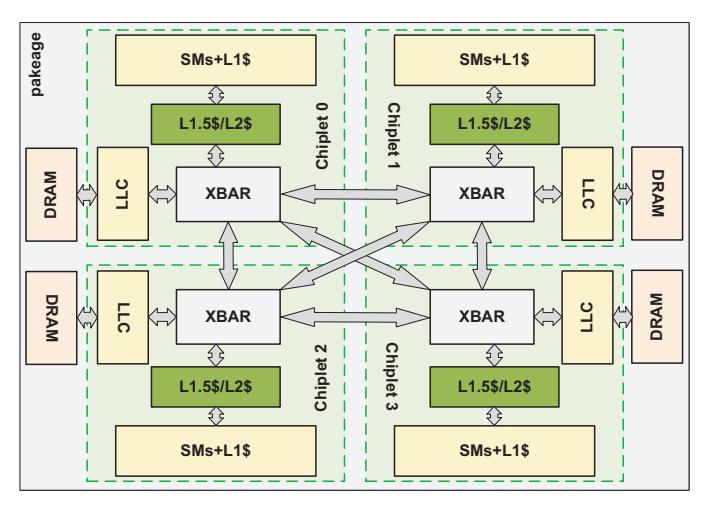
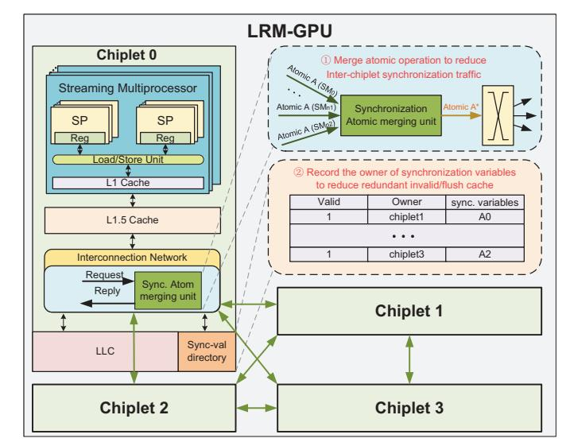

# *A. Multi-Chiplet GPU Architecture*

Fig. 3. Multi-Chiplet GPU architecture. Multiple GPU chiplets are used to build a larger logical single GPU.

Fig. 3 illustrates the architecture of a 4-chiplet GPU. Each GPU chiplet contains multiple SMs along with their private L1 cache, as well as a memory-side LLC and a memory partition. All memory partitions offer a globally shared memory address space across all GPU chiplets. The network route memory accesses to the appropriate destination (either the local LLC or the remote LLC) based on the address. The LLC, which is shared by all SMs across the chiplets, exclusively caches data from its local DRAM partition. Consequently, each cache line has only one location, and cache coherence across LLC banks is not required.

Unlike conventional monolithic GPUs, multi-chiplet GPUs often introduce an additional cache level shared within each chiplet to alleviate the NUMA problem caused by bandwidth mismatch between intra-chiplet and inter-chiplet. MCM-GPU [2] uses an L1.5 cache to only cache data from remote chipsets in order to better utilize the data locality within chiplets. In this design, when an L1 miss occurs and data needs to be fetched from the remote chiplet, the request first accesses the L1.5 cache. If the L1.5 cache also misses, the request is routed to the appropriate LLC and memory partition according to the address mapping policy. The results of MCM-GPU also indicate that the L1.5 cache can achieve good performance. CPELide [8] uses an L2 cache as the shared cache level within a chiplet to exploit the locality of data within chiplets, and the L3 cache (also the LLC) is the global shared cache across all chiplets. Some studies [43, 52] did not add a new cache level, but used LLC (also the L2 cache) on the SM-side, where each chiplet's LLC caches data from all DRAM partitions globally.

Prior research has mainly focused on mitigating the bandwidth constraints between different chiplets due to the limited bandwidth of inter-chiplet links in multi-chiplet GPUs for regular data accesses. As mentioned above, adding an additional cache level or employing SM-side LLCs aims to exploit intrachiplet data locality to reduce remote accesses. MCM-GPU [2] also proposes the first-touch-page and distributed cooperative thread arrays (CTA) scheduling strategies to increase and leverage data locality within a chiplet. AdCoalescer [53] introduces an adaptive coalescer that uses program counter (PC) values to identify memory requests with high data locality and filter redundant remote reads. Nearfetch [55] targets manychiplet GPU architectures and proposes fetching data from nearby chiplets to reduce long-distance data transfers.

While these approaches alleviate the general NUMA issues of regular data accesses, they overlook memory access caused by atomic operations for synchronization and the additional overhead brought by synchronization behavior.

### *B. Synchronization Challenges in Multi-Chiplet GPUs*

GPUs were originally designed under the assumption that inter-thread synchronization would be coarse-grained and infrequent. As a result, GPUs often adopt simple, coarsegrained, software-managed coherence protocols. These protocols typically require that private caches be invalidated/flushed upon acquire/release operations, while atomic operations for synchronization are usually performed directly in the LLC.

However, in order to alleviate the NUMA problem in multichiplet GPUs, multi-chiplet GPU architecture often adds an additional cache level or uses SM-side LLC to utilize the data locality within the chiplet and reduce remote memory access. These changes in multi-chiplet GPU architectures have exacerbated the synchronization overhead. In particular, whether using an additional cache level or the SM-side LLC, they will all cause the lower global shared ordering point and require maintaining data consistency across multiple levels of the cache hierarchy, leading to more expensive synchronization overhead. For example, when a SM issues an acquire synchronization request, since the L1 and L1.5 caches are private caches within the SM and the chiplet respectively, they may cache stale data. Therefore, it is necessary to invalidate the data in both the L1 and L1.5 cache to ensure that subsequent memory accesses can obtain the latest data from the globally shared LLC. Compared to the monolithic GPU, the multichiplet GPU requires the additional invalidation of the L1.5 cache. Given that the capacity of the L1.5 cache is typically larger than that of the L1 cache private to a single SM, and that the L1.5 cache is shared by all SMs within the chiplet, invalidating the L1.5 cache incurs greater overhead compared to invalidating only the L1 cache and also affects memory accesses from other SMs.

In addition, to ensure atomicity and consistency, atomic operations for synchronization on GPUs are typically executed in the globally shared LLC, and synchronization data is not cached in the L1 and L1.5 caches. This renders the additional cache level ineffective in reducing cross-chiplet atomic operations for synchronization. When it comes to global atomic operations that cross different chiplets, the limitation imposed by inter-chiplet bandwidth becomes a pronounced bottleneck. The need to frequently communicate and synchronize data across chiplets via a potentially constrained bandwidth link can significantly hinder performance, especially in scenarios involving frequent atomic operations for synchronization. Therefore, for global atomic operations for synchronization, the limitation of inter-chiplet bandwidth remains a significant challenge.

### C. To Alleviate the Synchronization Overhead

To improve synchronization performance, prior work has actively explored GPU synchronization mechanisms.

DeNovo [47] introduced the DeNovo consistency protocol into GPUs, achieving synchronization by acquiring ownership of the written data. Furthermore, it enhanced DeNovo by adding a selective invalidation mechanism, which can avoid invalidating read-only data regions during synchronization, thereby further optimizing performance. hLRC [1] introduced a mechanism similar to DeNovo to track the ownership of synchronization variables and only performed coherence operations when synchronization variables resided in different L1 caches. However, each time a synchronization operation for the same variable was performed in a different SM, they first needed to invalidate or flush the copies cached in remote L1 caches, to guarantee atomicity and consistency of the synchronization variables. This incurred significant overhead in maintaining atomicity and consistency of synchronization variables across different cache levels. In multi-chiplet GPUs, due to deeper cache hierarchies, this overhead is greatly amplified and can severely degrade performance. Moreover, LAB [10] proposes utilizing a portion of the L1 cache as an atomic buffer to cache atomic data, thereby reducing atomic synchronization traffic sent over the network. Atomic Cache [54] suggests implementing the atomic operations through incache computing, thus mitigating synchronization overhead. ARC[11] recommends leveraging the warp-level locality of atomic operations to merge atomic operations in a warp, aiming to alleviate the pressure on the load-store unit and the LLC. However, all of these approaches overlook the inter-SM locality inherent in atomic operations for synchronization.

For multi-chiplet GPUs, HMG[43] extended the cache coherence protocol to multi-chiplet GPUs and multi-GPUs, using a mechanism similar to the VI protocol to track coherence states. By employing an optimized hierarchical sharer-tracking scheme, it alleviated synchronization overhead. HMG lever-

aged the scopes of modern GPU memory models and the non-multiple-copy-atomicity characteristic to avoid the overhead of invalidation acknowledgments and transient states, thereby achieving relatively favorable results. CPElide[8] proposed a new command processor (CP) design, which, by leveraging the global view of the GPU's CP, could selectively decide when to perform implicit inter-kernel synchronization operations. This ensured data was invalidated or flushed before being used, improving data reuse and reducing the overhead of implicit synchronization. However, CPElide lacks efficient support for explicit intra-kernel synchronization.

### III. PROPOSED METHODOLOGY

### A. Overview

To mitigate the synchronization overhead caused by the additional cache level and the limited bandwidth of inter-chiplet interconnects, this paper proposes LRM-GPU, which provides efficient synchronization support for multi-chiplet GPUs. Fig. 4 presents an architectural overview of the proposed LRM-GPU design.

Fig. 4. Overview of LRM-GPU Architecture

LRM-GPU leverages lazy release consistency to mitigate the expensive global synchronization overhead introduced by the additional cache level in multi-chiplet GPU architectures. LRM-GPU associates each synchronization variable with the chiplet that last accessed it. Coherence actions (invalidate/flush cache) are only triggered when the owner of the synchronization variable is transferred between different chiplets, as this indicates the possibility of synchronization between different chiplets. By adopting this approach, LRM-GPU achieves lazy release, thereby leveraging the locality of intra-chiplet synchronization and reducing redundant cache invalidations and flushes. In order to track the ownership of synchronization variables across chiplets, as shown in Fig. 4, LRM-GPU implements a directory at the LLC. Since the directory only monitors synchronization variables rather than all data, its capacity requirements remain modest. LRM-GPU is similar to traditional monolithic GPU designs that recommend all synchronization operations be bypassed to the LLC. This design ensures that synchronization variables are never cached in the local cache, thereby eliminating the presence of inconsistent replicas and avoiding the costly coherence maintenance for atomicity and consistency across the multi-chiplet cache hierarchy.

The performance of atomic operations for synchronization is inherently limited by the inter-chiplet communication bandwidth since they bypass local caches and are directly routed to the LLC via the network. To alleviate this bottleneck, LRM-GPU introduces in-network atomic merge mechanism and embeds a synchronization atomic merging unit (AMU) within the network, as shown in Fig. 4. AMU identifies and merges atomic requests that traverse chiplet boundaries, thereby reducing inter-chiplet traffic. For example, in lockbased synchronization implemented via atomicCAS, multiple SMs may issue atomicCAS targeting the same data to acquire the lock. Since only one of these requests can successfully acquire the lock while the others fail and spin, these requests can be merged into a single transmission across chiplets. Similarly, in programs using atomicAdd to synchronize updates of shared variables, such as two atomicAdd(x, 1) can be merged into a single atomicAdd(x, 2). By merging such synchronization atomic operations, AMU significantly alleviates inter-chiplet bandwidth pressure.

