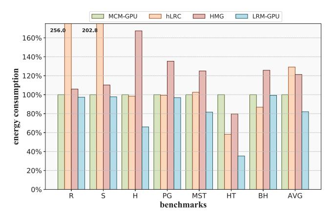
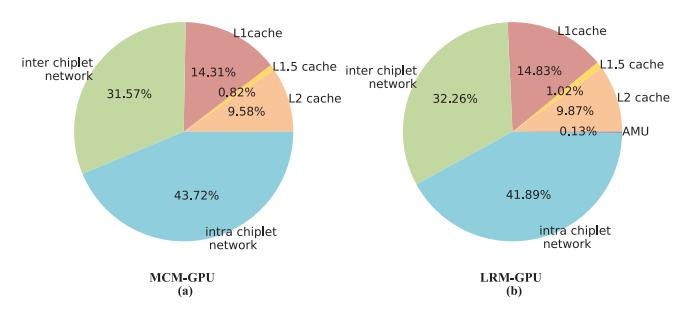

# *B. Energy and Area Evaluation*

Fig. 13. Energy consumption on MCM-GPU, hLRC, HMG, and LRM-GPU.

To evaluate the energy consumption of LRM-GPU system, we analyzed runtime activities to calculate dynamic power. We leveraged AccelWattch [21] of GPGPU-Sim and inter-chiplet transmission energy data (0.54 pJ/bit) provided in the paper [2, 40] to evaluate the energy consumption of the cache system and Network under different benchmarks. Fig. 13 presents a comparison of energy consumption among MCM-GPU, hLRC, HMG, and LRM-GPU, with all energy consumption values normalized to MCM-GPU as the baseline. The results indicate that, compared to MCM-GPU, LRM-GPU achieves an average energy reduction of 18%. Moreover, compared to HMG, LRM-GPU achieves an average energy reduction of 32%. hLRC and HMG exhibit increased energy consumption due to the increased inter-chiplet transmission traffic.

Fig. 14 presents the energy breakdown of MCM-GPU and LRM-GPU, where the inter-chiplet and intra-chiplet networks account for the majority of the energy consumption. Since LRM-GPU reduces inter-chiplet traffic, the energy share of its inter-chiplet network is slightly lower compared to MCM-GPU, and the newly added AMU consumes only 0.13%.

Fig. 14. Energy breakdown of (a) MCM-GPU and (b) LRM-GPU.

To evaluate the proposed AMU that has been embedded into the network, we employed Cadence Virtuoso to customize and implement the merge table within AMU, while the other components of AMU were realized using Verilog RTL. For the merge table, a corresponding netlist was generated under the TSMC 40nm process. This netlist was subsequently integrated into the Cadence Spectre simulation environment and simulated under the TT process corner, at a temperature of 25 ◦C, a frequency of 1 GHz, and a voltage of 1.1V to measure its power consumption. We then evaluate the area of the merge table based on the layout of the customized circuit and the 40nm standard cell library. For the remaining components of AMU, we utilized Synopsys Design Compiler to synthesize the logic circuits under the TSMC 40nm process. The breakdown of AMU's energy consumption and area utilization is detailed in Table V.

In particular, the total power consumption of AMU is 301mW at 40nm process. To better contextualize this cost, we referred to NVIDIA GPU V100, which comprises 80 SMs, a number comparable to the 64 SMs in a chiplet of our system, is fabricated using a 12nm process with a total power consumption of 300W [37]. Despite the V100 being fabricated in a more advanced process, the power consumption of AMU is only 0.1% of V100. And the total area of AMU is 1.84mm2 at 40nm process. For reference, the area of V100 is 815mm2 at 12nm process, while the AMU, evaluated in an older technology node, is only 0.2% of the V100's area.

TABLE V ENERGY AND AREA BREAKDOWN OF AMU

| Components  | Power(mW) | Area(mm2) |
|-------------|-----------|-----------|
| merge table | 185.51    | 1.52      |
| others      | 115.93    | 0.32      |
| total       | 301.44    | 1.84      |

In addition, we employ a directory to track the owner of synchronization variables. For the system with 4 chiplets, a 2 bit vector is required to represent the owner. We assume that the tag address is 48 bits, and an additional 1 bit is needed to indicate whether an entry is valid. Consequently, each entry in the directory needs 51 bits. There are 64 entries in the directory, so the total capacity of the directory is 0.4 KB, which accounts for only 0.3% of the capacity of a L1 cache.

