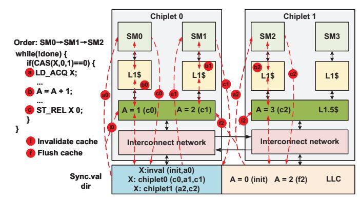
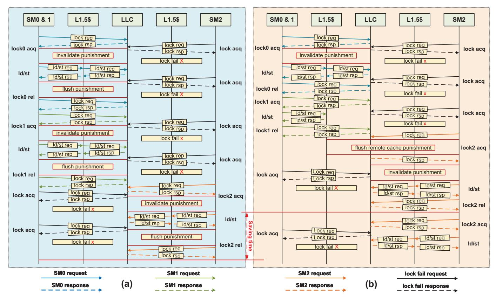

# *B. Lazy Release Consistency on Multi-Chiplet GPU*

| TABLE I                      |
|------------------------------|
| COHERENCE ACTIONS OF LRM-GPU |

|                 | status                   | action                                                                                     |  |
|-----------------|--------------------------|--------------------------------------------------------------------------------------------|--|
|                 | invalid                  | LD data from LLC invalidate L1.5\$                                                      |  |
| acquire         | local chiplet            | set owner & LD data from LLC                                                               |  |
| synchronization | remote chiplet        | flush remote L1.5\$ (if write-back) set owner & LD data from LLC invalidate L1.5\$   |  |
|                 | evicte                   | flush owner's L1.5\$ (if write-back) set owner & LD data from LLC invalidate L1.5\$) |  |
|                 | invalid local chiplet | ST data to LLC invalidate L1.5\$                                                        |  |
| release         |                          | set owner & ST data to LLC                                                                 |  |
| synchronization | remote chiplet        | flush remote L1.5\$ (if write-back) set owner & ST data to LLC invalidate L1.5\$     |  |
|                 | evicte                   | flush owner's L1.5\$ (if write-back) set owner & ST data to LLC invalidate L1.5\$    |  |

LRM-GPU leverages lazy release consistency to achieve efficient synchronization. It tracks the owner of synchronization variables through a directory and performs corresponding coherence actions only when the owner changes occur between different chiplets. Table I specifically illustrates how LRM-GPU implements synchronization operations. We focus on the coherence actions related to synchronization in the additional cache level of multi-chiplet GPUs (L1.5 cache), while disregarding the coherence actions of the L1 cache, as it remains consistent with that of traditional GPUs.

When an acquire operation accesses a synchronization variable, it may encounter four scenarios:

- (1) Invalid: There is no record of the current synchronization variable in the directory, and there are free entries. The directory allocates an entry for this synchronization variable to track its owner. Meanwhile, the acquire operation reads data from the LLC. Finally, it invalidates the local L1.5 cache to ensure that subsequent memory access can read the globally latest data.
- (2) Local chiplet: The directory has a record of the current synchronization variable, and the recorded owner is the chiplet that issued the synchronization operation request. The acquire operation directly reads data from the LLC without performing any coherence actions. This is because it indicates that there is no inter-chiplet synchronization, and the latest data is cached in the local L1.5 cache.
- (3) Remote chiplet: The directory has a record of the current synchronization variable, but the recorded owner is not the chiplet that issued the synchronization operation request. If the L1.5 cache adopts a write-back policy, the remote L1.5 cache is first flushed to write the dirty data back to the LLC. Then, the directory updates the owner to the local chiplet. Simultaneously, the acquire operation reads data from the LLC. Finally, it invalidates the local L1.5 cache to ensure that subsequent memory access operations can read the globally latest data.
- (4) Evicted: There is no record of the current synchronization variable in the directory, and no free entry. The directory evicts an entry according to a policy such as Least Recently Used (LRU). It is necessary to flush the L1.5 cache of the chiplet that owns the evicted entry to ensure that subsequent memory access operations do not read old data (if write-back policy). At the same time, the directory allocates an entry for the current synchronization operation and records its current owner. Then, the acquire operation reads data from the LLC. Finally, it invalidates the local L1.5 cache.

Fig. 5. Example of LRM-GPU synchronization behavior.

The release operation is similar to the acquire operation: (1) Invalid: The directory allocates an entry track for its owner. Simultaneously, the release operation writes the data into the LLC. Finally, it invalidates the local L1.5 cache to ensure that any subsequent acquire operations can achieve correct synchronization. (2) Local chiplet: The release op-

Fig. 6. Comparison of execution flow and implementation between MCM-GPU and LRM-GPU; (a) MCM-GPU; (b) LRM-GPU

eration merely writes the data into the LLC, as coherence actions are delayed until a subsequent change in the owner of the synchronization variable to leverage the locality of intra-chiplet synchronization. (3) Remote chiplet: the remote chiplet's L1.5 cache is first flushed (if write-back policy). Subsequently, the directory updates the owner. Meanwhile, the release operation writes the data into the LLC. Finally, it invalidates the local L1.5 cache. (4) Evicted: it needs to flush the L1.5 cache of the chiplet that owns the evicted entry (if write-back policy). At the same time, the directory allocates an entry for the current synchronization variable and records its current owner. And the release operation write data to the LLC. Finally, it invalidates the local L1.5 cache.

For better understanding, Fig. 5 presents an example of the synchronization execution flow in a lock-based synchronization program. In this example, threads from three SMs are competing for lock synchronization, where SM0 and SM1 are on chiplet0, and SM2 is on chiplet1. Their execution order is  $SM0 \rightarrow SM1 \rightarrow SM2$ . Here, we also ignore discussions on L1 cache coherence actions and focus on L1.5 cache coherence actions, assuming that the L1.5 cache employs a write-back policy since it is more complex than the write-through policy.

Initially, SM0 successfully acquires the lock (where the atomicCAS operation is directly executed in the LLC). It then issues an acquire synchronization to read the synchronization variable X from the LLC . Since there is no record of synchronization variable X in the directory, the L1.5 cache needs to be invalidated to ensure that SM0 can read the

latest data **10**. Additionally, the owner of X in the directory is set to chiplet0. Subsequently, SM0 performs load/store operations on data A 60. At this point, the L1.5 cache of chiplet0 holds the latest data for A, with A=1, while the LLC contains the stale data, A=0. Finally, SM0 executes the release operation, directly writing the data of X into the LLC @. Since there is a record of X in the directory and its owner is chiplet0, no coherence actions are required. Coherence actions will be delayed until the owner of the synchronization variable X changes. Next, SM1 acquires the lock and issues an acquire synchronization request a. Since the owner of X is chiplet0, it indicates that the latest data resides in chiplet0, and there is no need to invalidate the L1.5 cache. SM1 then performs load/store operations on data A bi, with chiplet0 holding the latest data, A=2. Finally, SM1 executes a release operation (a), again without performing any coherence actions. Subsequently, SM2 on chiplet1 acquires the lock and issues an acquire synchronization request a. Since the recorded owner of the synchronization variable X in the directory is chiplet0 at this time, the L1.5 cache of chiplet0 needs to be flushed to write back the dirty data 2, enabling chiplet 1 to obtain the latest data, A=2, from the LLC. The directory then changes the owner of synchronization variable X to chiplet 1 and invalidates the L1.5 cache of chiplet1 to ensure that it can read the latest data from the LLC 2. SM2 performs load/store operations on data A 63, obtaining the latest data, A=3. Finally, SM2 executes a release operation without performing any coherence actions 2.

Fig. 6 provides a detailed illustration of the synchronization execution of the aforementioned program in LRM-GPU, along with a comparison of the synchronization execution flows and implementations between the MCM-GPU and LRM-GPU. As shown in Fig. 6 (a), in the MCM-GPU, each acquire and release synchronization operation necessitates invalidating or flushing the local L1.5 cache, thereby resulting in substantial performance degradation. In contrast, as shown in Fig. 6 (b), LRM-GPU leverages lazy release consistency by tracking the owners of synchronization variables to exploit locality between synchronization operations. It only performs invalidatation/flushing of the L1.5 cache when the owner of a synchronization variable changes across different chiplets, thereby reducing redundant synchronization overhead.

