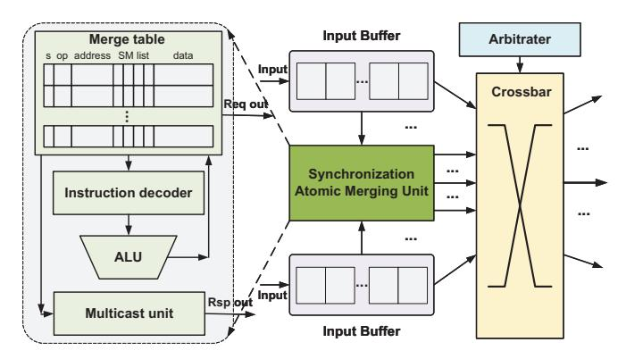
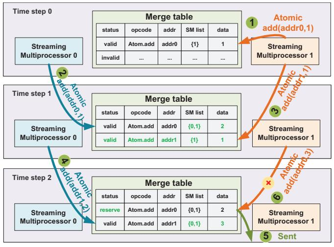

# *C. In-Network Atomic Merging for Synchronization*

The Synchronization Atomic Merge Unit (AMU) is designed to merge atomic requests targeting the same address across chiplets in the network, thereby reducing the interchiplet synchronization traffic, and each chiplet contains an AMU. Fig. 7 illustrates the detailed structure of AMU. AMU is embedded into the network and primarily comprises four components: the merge table, the instruction decoder, the ALU (Arithmetic Logic Unit), and the multicast unit.

Fig. 7. Synchronization Atomic Merge Unit microarchitecture.

The merge table contains multiple entries, with each entry consisting of five fields: (1) Status: determining whether the entry is currently valid. There are three states: "valid," indicating that the entry is valid and new atomic requests can be merged; "reserve," indicating that the entry is valid but new atomic requests cannot be merged because the recorded request has been sent and is awaiting for response; and "invalid," indicating that the entry is invalid. (2) Opcode: representing the atomic operation and corresponding operation masks and auxiliary identification information. (3) Address: identifying the address that requires access. (4) SM list: recording the IDs of SM that have issued atomic requests to the same address. (5) Data: recording the data used for the atomic operation to be performed. For instance, an atomic operation issued by SM0 to add 1 at address 0xA0AC can be represented as the tuple (valid, atomadd, 0xA0AC, 0, 1). The instruction decoder is responsible for identifying atomic operations to enable proper merging of synchronous atomic requests. The ALU performs the correct merging of synchronous atomic requests based on the decoding results. The multicast unit, during reply transmission, broadcasts responses to the corresponding SMs according to the SM IDs recorded in the merge table entries.

To meet the high-concurrency requirements of GPUs, the AMU is designed with multiple input, output, and computational channels. Additionally, the merge table is also devised with a multi-bank structure to enable parallel access. To facilitate rapid querying, we propose separating the storage of the search key (i.e., status, opcode, address) and the data (i.e., SM list, data). Specifically, a Content-Addressable Memory (CAM) is employed for the storage and querying of the search key. The CAM can determine whether there is a matching entry within the CAM and obtain the positional index in a clock cycle. Meanwhile, the data is stored using SRAM. Furthermore, to support simultaneous read and write requests on the merge table, both the CAM and the SRAM adopt a dual-port design.

Next, we discuss the workflow of AMU. It is first checked whether the request is a cross-chiplet request when an atomic request generated by an SM is sent into the network. If it is, the atomic request is forwarded to AMU. Otherwise, the request is sent directly. After entering AMU, the request is initially sent to the merge table. If a corresponding valid entry is found, the atomic request is processed and merged with the data in the table. Conversely, if no entry matches the atomic request's address or there is a match but the status is "reserve", and if there is an available entry, AMU will allocate a new entry for it. Otherwise, the atomic request is sent out directly without being recorded in the table. When allocating a new entry, AMU controller also assigns a countdown timer for it. During this countdown period, the entry can continue to receive and merge new atomic requests. Once the countdown expires, the request in the entry is sent out, and the status is changed from "valid" to "reserve," preventing further request merging. Alternatively, if the merged requests have reached the maximum number (the SM list is full), the request in the entry is also sent out, and the status is changed to "reserve". Upon receiving the response, AMU queries the merge table. If a matching entry is found, AMU broadcasts the response of the atomic operation to these SMs via the multicast unit according to the SM list, and simultaneously resets the entry to make it available for future requests. Conversely, if no entry reflects the response address, AMU directly forwards the response to the designated SM.

Fig. 8 presents an example of AMU's workflow. Initially, the merge table contains an entry for the atomicadd(addr0, 1) request issued by SM1 1 . Subsequently, SM0 and SM1 issue cross-chiplet atomicadd(addr0, 1) 2 and atomicadd(addr1, 1) 3 requests, respectively. These requests are input into AMU and first query the merge table when they arrive at the network. The atomicadd(addr0, 1) request issued by SM0 finds a matching entry, enabling their merging into atomicadd(addr0, 2), with SM0's ID being recorded. In contrast, the atomicadd(addr1, 1) request issued by SM1 does not find a matching entry, prompting the merge table to allocate a new entry to record it. After a certain period, SM0 and SM1 issue cross-chiplet atomicadd(addr1, 2) 4 and atomicadd(addr0, 3) 6 requests again, respectively. At this point, the request previously recorded as atomicadd(addr0, 2) in the merge table has already been dispatched from AMU 5, and its status has been updated to "reserve," indicating that it is awaiting a response. Consequently, the atomicadd(addr0, 3) request issued by SM1 cannot be merged with this entry and must either be allocated a new entry or be sent out directly. Meanwhile, the atomicadd(addr1, 2) request issued by SM0 finds a matching entry, allowing it to be merged with the data in the entry to produce atomicadd(addr1, 3). The responses also enter AMU and query the merge table when the responses to these requests are received. If a matching entry exists, AMU broadcasts the reply to the SMs within the chiplet based on the IDs recorded in the SM list of the entry.

Fig. 8. Example of AMU's workflow.

Although the aforementioned discussion has focused solely on examples of the atomicadd operation, the principles and methodologies apply similarly to other atomic operations. Table II lists the atomic operations supported by the AMU. When the AMU detects these free atoms (commutative/unordered atomics), it can attempt to combine multiple atomic requests targeting the same address into a single aggregated request by performing the corresponding computations. Among them, atomicas is a special case: for operations on the same address, it additionally requires that the comparison data of the two requests be identical. When the comparison data are the same, one of the requests is selected as the combined request and sent to the LLC to attempt the data exchange, while the other requests are guaranteed to fail and will wait for the response of the combined request before being returned to their corresponding SMs.

Moreover, in reality, memory accesses and data transfers in practice often operate at coarser address granularity, such as cache line granularity. Accordingly, atomic requests falling within the same coarse-grained address region can be merged to improve bandwidth utilization. For requests targeting different offsets within the same region, the merging is performed

### TABLE II EVALUATED BENCHMARKS

| Operation | Description                                                                                                                 |
|-----------|-----------------------------------------------------------------------------------------------------------------------------|
| atomicand | combined by request1's val & request2's val.                                                                                |
| atomicor  | combined by request1's val    request2's val.                                                                               |
| atomicxor | combined by request1's val ⊕ request2's val.                                                                                |
| atomicadd | combined by request1's val + request2's val.                                                                                |
| atomicsub | combined by request1's val - request2's val.                                                                                |
| atomicmax | compares request1's val and request2's val, updating with the maximum value                                                 |
| atomicmin | compares request1's val and request2's val, updating with the maximum value                                                 |
| atomiccas | only when the comparison data is same can they be combined, and at most one can be successfully swaps while the others fail |

using an operation-mask-based approach that merges multiple atomic operations into a single transaction.

### IV. EXPERIMENTAL SETUP

### A. System Setup

In the evaluation, we faithfully extended GPGPU-Sim [24] to simulate the multi-chiplet GPU system and integrated the proposed LRM-GPU into the simulator. In particular, we have developed a chiplet interconnection platform based on Book-Sim 2.0 [19], which encompasses features such as composable network construction and heterogeneous router/crossbar microarchitecture. In this platform, the network within a chiplet is independently designed and configured according to its original NoC architectures. During the chiplet integration phase, the platform takes these pre-designed intra-chiplet networks as inputs and constructs a composable inter-chiplet interconnect through a process involving network integration, modular routing, and chiplet interface incorporation. This platform has been integrated into the GPGPU-Sim simulator, enabling GPGPU-Sim to accurately model and uniformly evaluate the entire multi-chiplet system.

As shown in Table III, the evaluated multi-chiplet GPU system comprises 4 chiplets, with each chiplet containing 64 SMs, resulting in a total of 256 SMs. Each SM is equipped with a private L1 cache with a capacity of 128 KB, employing a write-through policy. Simultaneously, each chiplet features an intra-chiplet shared L1.5 cache that exclusively caches remote data, also utilizing a write-through policy. The LLC is globally shared across all chiplets and adopts a write-back policy. The total capacity of the L1.5 and LLC caches is 16 MB. All NoCs examined in this paper employ concentrated hierarchical crossbar topologies, with the inter-chiplet network directly connecting each GPU chiplet to every other GPU chiplet, as shown in Fig. 4. The total inter-chiplet bandwidth is 768 GB/s, and each hop in the inter-chiplet network incurs a latency of 32 cycles. We assume the presence of 4 memory partitions, culminating in a total of 64 memory channels and a memory bandwidth of 3 TB/s. We adopt a first-touch page allocation policy [2], which maps pages to the memory partition of the GPU chiplet that first accesses data within the

page. Furthermore, we consider distributed CTA scheduling [2], which partitions the set of CTAs by assigning each chiplet a contiguous group of CTAs to maximize data locality among CTAs within the same chiplet. These configurations are consistent with previous works [2, 52, 53]. For LRM-GPU, the synchronization variable directory comprises a total of 64 entries. And each chiplet is equipped with an AMU, which features 16 channels. Its merge table contains 2K entries, organized into 16 banks, and each entry maintains the SM list that can accommodate up to 8 SM IDs.

TABLE III MULTI-CHIPLET GPU SYSTEM CONFIGURATIONS

| Number of chiplets                            | 4                                                           |
|-----------------------------------------------|-------------------------------------------------------------|
| Total number of SMs.                          | 256                                                         |
| Max number of warps                           | 64 warps/SM, 32 threads/warp                                |
| L1 data cache                                 | 128 KB/SM, 128B lines, 4 ways, write through             |
| L1.5 cache                                    | 2 MB/chiplet, 128B lines, 16 ways, write through         |
| LLC                                           | 8 MB, 128B lines, 16 ways, write back                       |
| Total capacity of L1.5 cache and LLC cache | 16 MB                                                       |
| Inter-chiplet interconnect                    | 768GB/s, 32 cycles/hop                                      |
| Total DRAM bandwidth                          | 64 channels, 3 TB/s                                         |
| Page size/allocation                          | 4KB, first-touch                                            |
| CTA allocation                                | Distributed CTA scheduling                                  |
| Sync. variable directory                      | 64 entries, 16 entries/chiplet                              |
| AMU                                           | 16 channels; 2k entries, 16 banks; SM list: 8; data: 32B |

