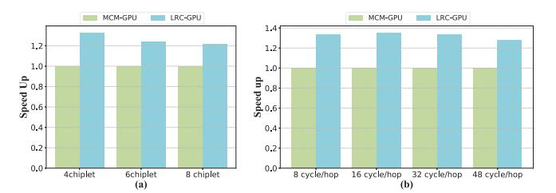

# *C. Sensitivity analyses*

We conducted a sensitivity study and analysis of LRM-GPU under different chiplet scales and inter-chiplet transmission latencies.

Chiplet scale: We increased the number of chiplets from 4 to 6 and then to 8, while keeping the resources on each chiplet unchanged, as shown in Fig. 15 (a). As the number of chiplets increases, the performance gain of LRM-GPU gradually diminishes, dropping from a 1.33× improvement with 4 chiplets to a 1.21× improvement with 8 chiplets. This is expected, since increasing the number of chiplets reduces the locality of synchronization variables across chiplets, which in turn leads to decreased performance.

Inter-chiplet transmission latency: We tested latencies ranging from 8 cycles to 48 cycles, as shown in Fig. 15 (b). The performance of LRM-GPU remains nearly unchanged between 8 and 32 cycles, with only a slight drop at 48 cycles. Due to the high parallelism of GPUs and warp switching that hides latency, GPU performance is relatively insensitive to latency but sensitive to bandwidth.

Fig. 15. Sensitivity analyses for LRM-GPU. (a) Chiplet scale; (b) Inter-chiplet transmission latency.

### VI. RELATED WORK

Multi-chiplet GPUs. Existing work on multi-chiplet GPUs mainly focuses on NUMA effects and bandwidth mismatch. MCM-GPU[2] reduces remote accesses via remote data caching, distributed CTA scheduling, and first-touch page placement. Memory-centric MCM-GPU[44] builds a bridge network on the interposer to dynamically allocate the GPU's off-chip bandwidth and better match application demands. AdCoalescer[53] and NearFetch[55] reduce cross-chiplet traffic and remote bandwidth usage by coalescing memory requests across SMs and forwarding shared data to nearby requesters along the path, respectively. SAC[52] further adapts to different sharing patterns by dynamically reconfiguring the LLC organization between memory-side and SM-side modes according to cross-chiplet sharing characteristics, thereby improving effective bandwidth. In addition, MGvm[42] proposes an MCM-aware virtual memory design to mitigate the impact of non-uniformity on TLB hit rates and page table walks, while Barre Chord[14] exploits the structural property of physically isomorphic pages across chiplets to merge multiple translations, reducing both local/remote page table walks and IOMMU access overhead.

GPU synchronization. hLRC[1] introduced a mechanism similar to DeNovo to track the ownership of synchronization variables and only performed coherence op-erations when synchronization variables resided in different L1 caches. However, in the multi-chiplet GPU, frequent ownership migration across chiplets incurs substantial coherence overhead under limited inter-chiplet bandwidth and deeper cache hierarchies. ARC[11], LAB[10], and DAB[7] merge atomic operations within an SM via warp-level reduction and on-SM atomic buffers, but do not exploit locality across SMs. Atomic Cache[54] implements the atomic operations through incache computing, thus mitigating synchronization overhead. HMG[43] extends cache coherence to multi-GPU systems using a VI-like protocol and a hierarchical sharer-tracking scheme to reduce synchronization overhead. CPElide[8] leverages the CP's global information to optimize implicit synchronization, but is ineffective for explicit synchronization because runtime contention is hard to predict. In contrast, LRM-GPU focuses on explicit synchronization in multi-chiplet GPUs, it maintains a lightweight directory of synchronization variables at the LLC and only triggers coherence actions when ownership moves across chiplets; at the same time, AMU embedded in the interconnect network exploit chipletlevel locality to merge cross-chiplet atomic requests, thereby alleviating the limited inter-chiplet bandwidth bottleneck.

