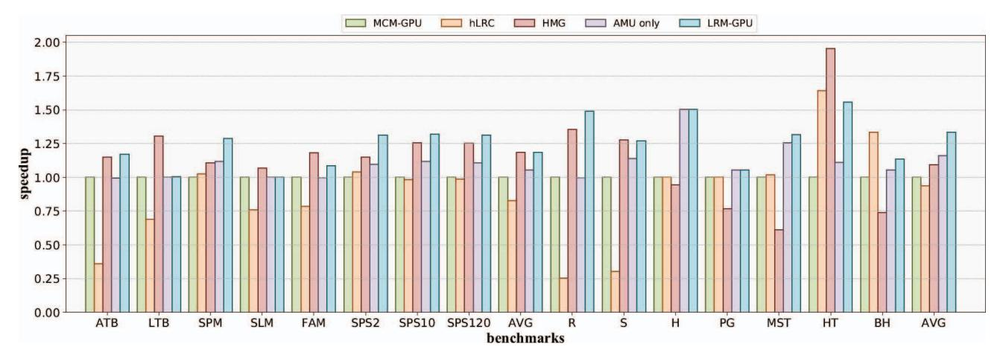

# *C. Workloads*

We focus on applications that necessitate global synchronization. Moreover, to evaluate whether the proposed design would have any adverse impact on other applications, we also assessed applications that do not involve global synchronization. Table IV provides a summary of these workloads, which have also been widely used in other studies[12, 13, 54] to investigate GPU synchronization issues. For these applications, we configured their input sizes to ensure reasonable occupancy on the multi-chiplet GPU. Additionally, to thoroughly test our proposed scheme, we made minor modifications to the workloads to incorporate synchronization semantics such as acquire and release. The multi-chiplet GPU architecture preserves the monolithic GPU abstraction, all chiplets present a unified global memory space and a single logical device to the programming model. Consequently, the workloads' kernels, data structures, and launch configurations do not need to be

Fig. 9. Speedup on MCM-GPU, hLRC, HMG, AMU only and LRM-GPU.

modified; the only differences lie in how the hardware and runtime partition data and schedule threads across chiplets, which is completely transparent to the programmer.These workloads were compiled using the O3 optimization level under CUDA 11.1. In the evaluation, we focus on the kernels that need to be global synchronized for these workloads.

