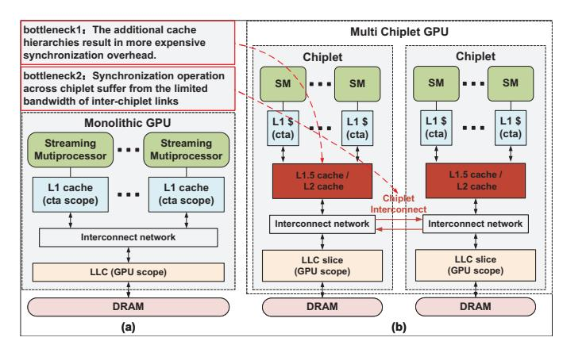
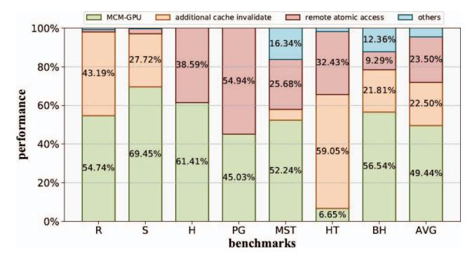

# LRM-GPU: Alleviating Synchronization Overhead for Multi-Chiplet GPU Architecture

Baiqing Zhong†, Zhirong Ye†, Xiaojie Li†, Peilin Wang†, Haiqiu Huang†, Zhaolin Li‡, Zhiyi Yu†, and Mingyu Wang†,\*

†School of Microelectronics Science and Technology, Sun Yat-Sen University, China †Department of Computer Science and Technology, Tsinghua University, China Email(s): {wangmingyu, yuzhiyi}@mail.sysu.edu.cn, lzl73@mail.tsinghua.edu.cn, {zhongbq, yezhr6, lixj263, wangplin, huanghq73}@mail2.sysu.edu.cn

Abstract—With the slowdown of process scaling and the advancement of packaging technologies, multi-chiplet GPUs have emerged as a highly promising architecture to improve the scalability of GPU performance further. Moreover, requiring adherence to atomicity and memory consistency models for shared data efficient synchronization is crucial to leverage the performance advantages of the multi-chiplet GPU architecture. However, the memory systems of multi-chiplet GPUs introduce deeper cache hierarchies and increased non-uniformity, both of which significantly exacerbate the overhead of synchronization. Specifically, acquire/release synchronization operations should invalidate/flush caches, an overhead that is significantly increased by the presence of additional cache level, and atomic operations for synchronization performed across chiplets are further impacted by the limited bandwidth of inter-chiplet links.

To address these challenges, this paper proposes LRM-GPU to provide efficient synchronization support for multi-chiplet GPUs. In order to reduce the overhead caused by the additional cache level, LRM-GPU leverages lazy release consistency in multi-chiplet GPUs, whereby the additional level of cache only performs coherence actions when the ownership of synchronization variables changes between different chiplets. LRM-GPU also implements a directory in the last-level cache to track the synchronization variables. To mitigate the overhead of atomic operations for inter-chiplet synchronization under limited interchiplet bandwidth, LRM-GPU proposes an in-network synchronization atomic merging unit to merge atomic requests across chiplets, thereby reducing the inter-chiplet synchronization traffic of atomic operations. Experimental evaluation demonstrates that, compared with the MCM-GPU, LRM-GPU achieves an average speedup of 1.33×. Moreover, compared with the state-of-the-art work HMG, it also achieves the speedup of 1.22×, reduces 52% of inter-chiplet traffic, and reduces 32% of energy consumption on average.

### I. Introduction

Modern graphics processing units (GPUs) leverage the Single-Instruction-Multiple-Threads (SIMT) architecture to efficiently execute multiple concurrent threads, proving instrumental in diverse computational domains such as high-performance computing (HPC) and machine learning [6, 26, 35, 46, 50]. As the computational demands continue to increase, GPUs have leveraged shrinking process features to dramatically increase transistor density, while also manufacturing ever-larger dies to meet the strong scaling requirements of applications [30, 34, 36, 37]. However, as transistor scaling

has slowed down and manufacture constraints the maximum die size, the scalability of GPU performance has become increasingly constrained [22, 23, 39]. These challenges have motivated researchers to explore alternative approaches to enhance the performance scalability of GPUs. Recent research has explored the composition of multiple smaller chips into a single large-scale, aggregated system, an approach commonly referred to as a Multi-Chip Module (MCM) or chiplet [2, 3, 15, 45]. The multi-chiplet GPU architecture distributes computational workloads across multiple GPU chiplets to enable scalable and efficient GPU design.

Fig. 1. Current GPU Architecture:(a)Monolithic GPU; (b)Multi-Chiplet GPU

However, as GPUs become increasingly general-purpose, they are also used for applications that require efficient support for more data sharing. Therefore, the critical aspect of showcasing multi-chiplet GPU advantages hinges on the strict adherence of all threads to efficient synchronization mechanisms [9, 27]. These mechanisms demand that shared data updates adhere to consistent access sequences and update protocols (i.e., ensuring consistency), while effectively managing conflicting accesses to uphold the deterministic nature of multi-threaded program execution (i.e., ensuring atomicity) [7, 17, 20]. Thus, the development of efficient synchronization mechanisms that uphold memory consistency and atomicity serves as an essential pillar for constructing high-performance multi-chiplet GPU architectures.

GPUs were originally designed under the assumption that inter-thread synchronization would be coarse-grained and in-

\*Corresponding author: Mingyu Wang.

frequent. As a result, they usually adopted a simple, softwaredriven coherence protocol[16, 18, 25, 38, 41, 47, 49]. As shown in Fig. 1 (a), in traditional GPUs, where L1 cache is private to Streaming Multiprocessors (SMs) and last level cache (LLC) is shared by all SMs which maintains a consistent view of data. These protocols typically invalidate all valid data from the local cache (L1 cache) at acquire operations and flush all dirty data from the local cache at release operations. And to ensure the atomicity and consistency of shared data, synchronization operations (usually atomic operations) were executed at the LLC (i.e., bypassing L1 caches).

However, the changes in multi-chiplet GPU architectures have exacerbated the overhead of such synchronization mechanisms. One of the most notable characteristics of Multi-chiplet GPUs is the Non-Uniform Memory Access (NUMA) problem caused by the bandwidth mismatch between inter-chiplet and intra-chiplet. To mitigate the NUMA problem, multi-chiplet GPUs [2, 8, 29, 52] often incorporate an additional cache level within each chiplet to leverage intra-chiplet data locality and reduce remote accesses. However, this approach results in the globally shared ordering point being located at a lower level, necessitating the invalidation/flushing of the additional cache level during global synchronization. Meanwhile, since synchronization operations are typically executed in the LLC (bypassing other caches), the limited bandwidth of interchiplet links still significantly impedes the execution of crosschiplet synchronization operations. Therefore, as illustrated in Fig. 1(b), the two critical bottlenecks for synchronization are the additional synchronization overhead introduced by the deeper cache hierarchy and the bandwidth limitation of interchiplet links for cross-chiplet synchronization operations.

To evaluate the impacts of the additional cache level and the limited inter-chiplet link bandwidth, we compared the workload performance of a 4-chiplet GPU system (as described in the section IV) with that of an equivalent but non-fabricable monolithic GPU. As illustrated in Fig. 2, these workloads involving global synchronization exhibit a significant performance degradation, with an average performance loss of 22.5% due to additional cache-level invalidations and 23.5% due to remote atomic accesses. Overall, the performance of the MCM-GPU decreases by an average of 50.5% compared to the monolithic GPU. These results indicate that efficient data synchronization represents a critical challenge in chipletbased GPU systems.

Previous research [2, 52, 53] on multi-chiplet GPUs has primarily explored mitigating the NUMA problem arising from bandwidth mismatches between inter-chiplet and intrachiplet communication for regular data accesses, yet few have addressed the challenges of data synchronization in multichiplet GPUs. HMG [43] extends the coherence protocol to multi-chiplet and multi-GPU systems by hierarchically tracking sharers, confining cache invalidation and flushing to the L1 cache level due to the maintenance of the coherence protocol. However, we observe that the complexity of HMG is unnecessary and can sometimes impair performance. CPElide [8] leverages the common processor to track data structures sent to each chiplet, but it focuses on implicit synchronization to exploit inter-kernel data reuse, rather than optimizing explicit synchronization in GPUs.

Fig. 2. Performance loss in MCM-GPU[2] versus equivalent monolithic GPU due to synchronization overhead from additional cache level and remote access (experiments are introduced in detail in section IV).

To address these challenges, this paper proposes LRM-GPU to alleviate the synchronization overhead introduced by the additional cache hierarchy and the limited bandwidth of interchiplet links. The main insight of LRM-GPU is to leverage the locality among synchronization. Firstly, the locality of synchronization behavior, when a synchronization operation is performed within a chiplet, it is likely that a subsequent synchronization operation will also occur on the same chiplet. Therefore, compared to conservatively invalidating or flushing caches on every synchronization operation, a more positive strategy can be adopted to selectively perform cache invalidation and flushing at appropriate times, thereby improving reuse and reducing synchronization overhead. Secondly, the locality of synchronization data, although atomic operations for synchronization in GPUs are typically bypassed directly to the LLC for execution, cross-chiplet atomic operations issued by different SMs may simultaneously access the same address. Therefore, we can attempt to merge these atomic operations when these operations are sent to the network, thereby reducing inter-chiplet traffic and alleviating the bandwidth pressure between chiplets. In this paper, we make the following contributions:

- 1) To mitigate the synchronization overhead caused by the additional cache level, LRM-GPU proposes an efficient synchronization support by leveraging lazy release consistency in multi-chiplet GPUs. LRM-GPU ensures that coherence actions of the additional cache level are only performed when ownership of synchronization variables is transferred between different chiplets, thereby leveraging the locality of intra-chiplet synchronization and reducing redundant cache invalidations and flushes. And to track the ownership of synchronization variables, LRM-GPU implements a directory in the LLC.
- 2) To mitigate the overhead of inter-chiplet bandwidth limitation encountered when synchronization operations are executed across different chiplets, LRM-GPU proposes innetwork atomic merge for synchronization. It embeds a synchronization atomic merging unit within the network. It identi-

fies atomic operations that are being transmitted across chiplets and performs merging processing. By merging these atomic operations at the network, it effectively reduces the traffic of synchronization operations that need to be transmitted across chiplets and alleviates the bandwidth pressure among chiplets.

3) To evaluate the proposed LRM-GPU, we faithfully extended GPGPU-SIM for the multi-chiplet GPU system, including composable network construction and heterogeneous router/crossbar microarchitectures. We have demonstrated the effectiveness of LRM-GPU through a set of detailed experiments conducted on programs with global synchronization. The evaluation results indicate that, compared to MCM-GPU, LRM-GPU achieves an average speedup of 1.33×. Moreover, compared to the state-of-the-art work HMG, LRM-GPU also achieves an average speedup of 1.22×.

