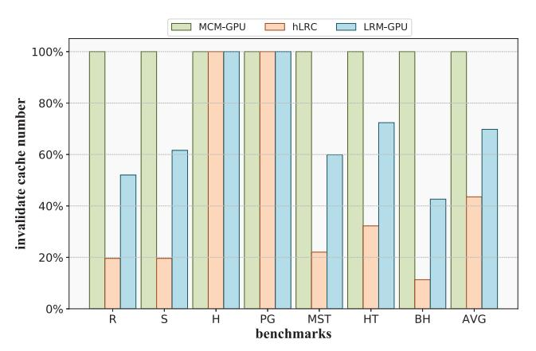
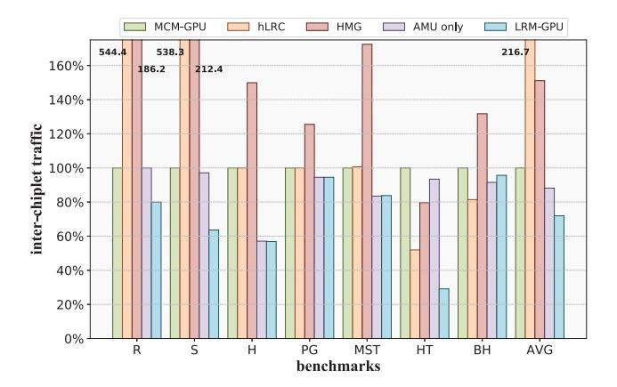
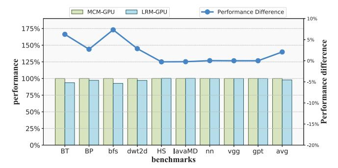

# V. EXPERIMENTAL RESULTS

### *A. Performance Evaluation*

In order to quantify the performance advantages of LRM-GPU, we evaluated multiple workloads with global synchronization, as well as microbenchmarks with different synchronization schemes, using MCM-GPU, hLRC, HMG, AMU only and LRM-GPU. The speedups are illustrated in Fig. 9, with all speedups normalized to MCM-GPU as the baseline. The simulation results show that for microbenchmarks with various synchronization schemes (including barriers, lock-based synchronization, and semaphores) LRM-GPU achieves good speedup, with an average performance improvement of 1.19×, demonstrating its effectiveness and adaptability. For most benchmarks requiring global synchronization, LRM-GPU also achieves the highest speedup, indicating that it effectively mitigates synchronization overhead in multi-chiplet GPUs. Specifically, compared to MCM-GPU, LRM-GPU attains an average speedup of 1.33×, with the AMU contributing an average speedup of 1.16×. Compared to the state-of-the-art work HMG, which extends cache coherence in multi-chiplet GPUs, LRM-GPU achieves an average speedup of 1.22×. hLRC performs poorly in most benchmarks because it caches synchronization variables in multiple levels of caches. Although this approach better exploits the locality among synchronization variables, each time a synchronization variable is accessed by different SMs, it initially misses in the local caches at all levels and necessitates flushing the synchronization variable cached in the remote L1 cache back to the LLC. During this period, all other threads are unable to obtain its registration and access it. Consequently, when contention for synchronization variables is intense, the frequent cache misses across multiple cache levels and the waiting for synchronization variable flush significantly degrade its performance. HMG achieves good performance on some benchmarks, even attaining the highest speedup in HT. However, it also performs poorly on some benchmarks, such as MST and PG, because these benchmarks contain a large number of atomic operations, which trigger numerous write-invalidations in HMG, leading to degraded performance.

Fig. 10. Invalidate cache number on MCM-GPU, hLRC, and LRM-GPU.

Fig. 10 illustrates a comparison of the number of invalidating L1.5 cache among MCM-GPU, hLRC, and LRM-GPU, with all values normalized to MCM-GPU as the baseline. Since HMG employs a cache coherence protocol to maintain data coherence in the SM-side LLC, it does not require cache invalidations or flushes beyond the L1 cache; hence, it is excluded from this comparison. Compared with MCM-GPU, LRM-GPU reduces the number of L1.5 cache invalidations by an average of 30%, while hLRC achieves a 56% reduction. For hLRC, since it caches synchronization variables in both L1 cache and L1.5 cache, local synchronization requests can access these variables more rapidly and are more easily able to acquire the registration for them compared to remote synchronization requests, thereby better leveraging locality. Consequently, in most scenarios, hLRC experiences fewer occurrences of invalid cache accesses than LRM-GPU. However, as previously mentioned, when synchronization requests are issued by different SMs, synchronization variables cached remotely need to be written back. During the write-back period, other synchronization requests attempting to access the same variable will fail, significantly increasing synchronization latency. This undermines the advantage of reducing the number of invalid cache accesses, preventing it from being effectively exploited. Regarding the histogram and pagerank benchmarks, which primarily utilize atomic operations for synchronous updates of shared data, invalidating the cache occurs only upon kernel completion. Therefore, there is virtually no reduction in the number of invalid cache accesses for both hLRC and LRM-GPU in these scenarios.

Fig. 11. Inter-chiplet traffic on MCM-GPU, hLRC, HMG, AMU only and LRM-GPU.

Fig.11 presents a comparison of inter-chiplet traffic among MCM-GPU, hLRC, HMG, AMU only and LRM-GPU. All traffic values normalized to MCM-GPU as the baseline, and the traffic here includes all memory accesses and coherence messages. Compared with MCM-GPU, LRM-GPU reduces inter-chiplet traffic by 28%, with the AMU contributing a 12% reduction in traffic. Moreover, compared with the stateof-the-art HMG design, it achieves an average reduction of 52%. For hLRC, since synchronization variables are cached across various cache levels, each time a synchronization variable is accessed by different SMs, a write-back request must be sent to the remote cache holding the synchronization variable. And, other threads cannot successfully register the synchronization variable until the write-back operation is completed. To prevent blocking memory accesses, each failed synchronization access triggers a return and resending of the request. Consequently, when contention for synchronization variables is intense, inter-chiplet traffic significantly increases. This explains the reason that hLRC still suffers performance degradation despite fewer cache invalidations. HMG employs the cache coherence protocol, necessitating the transmission of an invalidation request to sharers of written data. As a result, in most scenarios, HMG exhibits increased inter-chiplet traffic. However, since HMG does not require invalidation of caches beyond the L1 level and does not need to receive an invalidation reply, it still achieves a positive performance impact overall. In contrast, LRM-GPU effectively reduces inter-chiplet traffic in most cases and decreases the number of cache invalidations, thereby achieving a notable speedup.

Fig. 12. Performance of benchmarks without global synchronization on MCM-GPU and LRM-GPU.

To assess the impact of the LRM-GPU modifications for multi-chiplet GPUs on the execution of other programs, we tested a set of benchmarks that do not involve global synchronization, including ML inference programs such as VGG16 and GPT-2. The results are shown in Fig. 12, with all performance normalized to MCM-GPU as the baseline. The results indicate that the modifications implemented in LRM-GPU have minimal impact on the execution of other programs, with an average performance difference of only 2% compared to MCM-GPU.

