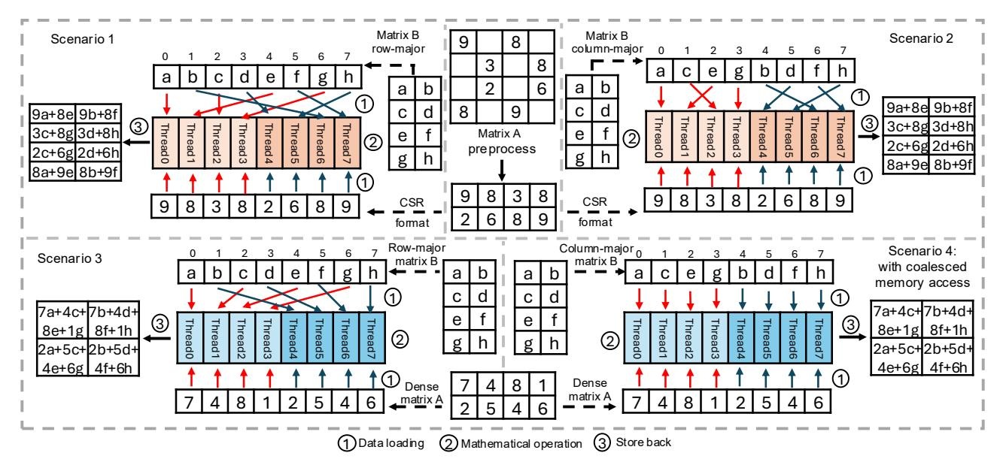
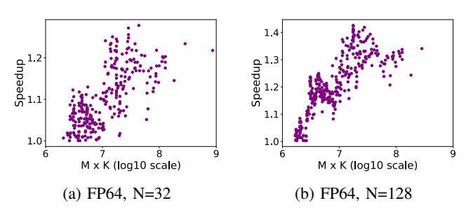

# Algorithm 1: A pseudocode of parallel CSC SpMM.

```
Input: N:K: colPtr[]: rowIdx[]: value[]: matrixB[]
  Output: matrixC[]
1 for i from 0 to K-1in parallel do
      for j \leftarrow colPtr[i]; j < colPtr[i+1]; j + + do
2
         for jj \leftarrow 0; jj < N; jj + + do
3
             rowIdx = rowIdx[j];
 4
             denseIdx = i * N + jj;
 5
             resultIdx = rowIdx * N + jj;
 6
             matrixC[resultIdx] + =
 7
               value[j] * matrixB[denseIdx];
         end
 8
      end
10 end
```



Fig. 2: The different access models of SpMM on modern GPU. The upper part illustrates the existing SpMMs. The bottom part illustrates an ideal situation of matrix A; None of Scenario 1 to 3 can achieve coalesced memory access to matrix B; They require up to warpSize memory transactions for matrix B; Scenario 4 can achieve coalesced memory access to matrix B. It only requires one memory transaction for matrix B.

#### B. GPU and Coalescing of Memory Accesses

GPU are highly data-parallel many-core processors. A typical GPU architecture comprises multiple stream multiprocessors (SMs), and several layers of the memory hierarchy. Each SM has multiple CUDA cores and a shared memory (L1 cache) [24], [25]. The memory hierarchy layers include but not limited to L1/L2 cache, texture memory, and global memory. From a programming perspective, NVIDIA CUDA provides a 3-level programming model: thread, thread block, and grid. The programmer can define the number of threads in a thread block and the number of blocks in a grid. In CUDA, a warp currently consists of 32 threads (warpSize = 32), and all the threads within a warp must reside within the same SM. This characteristic enables efficient parallel operations within a warp. The grid and block dimensions are exposed to the programmer. Each thread within a block and each block within a grid have the unique identifiers threadId and a blockId, respectively. In addition, each thread within a grid has a unique ID called *globalId*. Similarly, each thread within a warp is identified via a laneId.

Coalescing memory accesses is an optimization technique used in parallel computing systems to optimize the use of memory bandwidth and thus enhance performance [26], [27]. Coalescing memory accesses means that multiple threads access contiguous or closely located memory addresses in a way that these multiple accesses can be served by a few memory requests, instead of issuing a large number of independent memory requests. In the context of GPU, very significant performance improvements can be achieved when neighboring threads within a block or a warp access consecutive memory locations [28], [29]. For example, when an array of data is

stored in the GPU memory and each thread in warp writes to a specific element within the array, the consecutive thread accesses to consecutive elements in the array make it possible for the GPU to combine multiple memory requests into a single memory request.

#### C. Previous Approaches to Accelerate SpMM on GPU devices

A variety of methods have been proposed to accelerate the execution of SpMM on GPU devices. Sputnik uses the Reverse-Offset Memory Alignment (ROMA) approach to enable the use of vector memory instructions on misaligned memory addresses in sparse data structures and thus efficiently handle matrices with low levels of sparsity [18]. ASpT employs adaptive tiling to manage matrix irregularity and data access patterns to improve performance [17]. RoDe utilizes a decomposition technique based on the Compressed-Sparse Row (CSR) format to split rows into block parts (regular) and residual parts (irregular). Additionally, RoDe optimizes the computation pipeline, reducing the impact of synchronization [10]. cuSPARSE is a proprietary library that supports several formats such as CSR and COO, offering stable performance [21].

These previous methods do not exploit memory access coalescence for both sparse and dense matrices when running SpMM. Other approaches like GE-SpMM [19] only achieve coalesced memory access at the shared memory level, but do not coalesce memory accesses when loading the data from global memory to shared memory. Section III describes in detail why existing methods cannot achieve highly coalesced memory access to both sparse and dense matrices from global memory to threads simultaneously.



Fig. 3: Time comparison of with and without coalesced memory access of matrix *B* in the ideal scenario.

