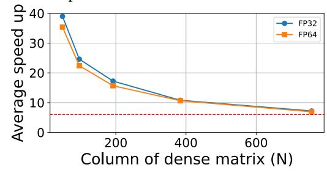
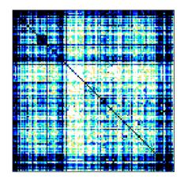
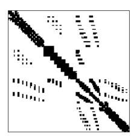

# *B. Overall performance*

Figure 8 presents the execution time of Swift and four SOTA methods in the y-axis, and the number of nonzero coefficients (NNZ) of the considered sparse matrix in the xaxis. When the NNZ is less than 106, cuSPARSE shows the lowest performance, but its performance remains relatively stable. Sputnik does not perform well in most configurations. Moreover, when the NNZ comes to 107, Sputnik becomes the slowest method. The performance of RoDe is moderate when the NNZ is less than 105. It only becomes competitive on large NNZ (larger than 106). The performance of ASpT is better than that of the three methods mentioned above.

To investigate why the speedup of Swift over ASpT is smaller than that observed in the other three benchmarks, we partition the original sparse matrix into 32!32 blocks. The ratio of the all-zero-blocks to the total number of blocks is as used as the x-axis of Figure 9 These results show that Swift performs slower than ASpT on 55.14% matrices. The matrices are mainly concentrated in regions with higher ratios. A larger ratio indicates that the nonzero elements are more concentrated in certain regions of the matrix. Since the ASpT algorithm separates the sparse matrix into dense and sparse blocks and applies different computational strategies to each,

Fig. 9: Speedup of Swift over ASpT with respect to the distribution of sparse matrix nonzeros.

Fig. 10: Speedup of Swift versus cuSPARSE considering dense matrices with different N.

it tends to exhibit an advantage when the nonzero elements of a sparse matrix are concentrated.

Table I shows the speedup of Swift over the four SOTA methods in terms of the geometric mean of time for the two considered GPU systems, *N* = 32 and *N* = 128, and FP32 and FP64. The Swift algorithm achieves better performance than the other four methods, even for the latest ASpT and RoDe. Our experimental campaign reveals that ASpT is faster than RoDe, which is inconsistent with previously published results [10]. This inconsistency comes from the fact that the previous results evaluate RoDe using only 900 matrices, while our evaluation considers 2757 matrices.

*1) Speedup of Swift over cuSPARSE for Different N Values:* We explore the performance of Swift by setting the N in the dense matrix to values that are not multiples of 32. Specifically, we evaluate five different values of N (48, 96, 182, 384, and 768), and compare the geometric mean speedup of Swift relative to cuSPARSE. As shown in the Figure 10, Swift achieves consistently good performance compared to

Fig. 11: Average Speedup between Swift with ASpT, Sputnik, RoDe, and cuSPARSE for different sparsity ranges.

(a) Best performing matrix

(b) Worst performing matrix

Fig. 12: Distribution of non-zero elements of the best and the worst performing matrices by Swift.

cuSPARSE across different N values. Further experiments indicate that the speedup of Swift plateaus at 7→ as N increases.

- *2) Speedup of Swift for Different Sparsity Regimes:* We divide our set of sparse matrices into different intervals according to their sparsity (NNZ / (M ! K)). We compute the average speedup of Swift over the SOTA methods within each interval, as shown in Figure 11. The figure reveals that Swift achieves average speedups between 10-30→ for sparsity ranges between 0.001 and 0.01. The considered matrices with sparsity *>* 0*.*1 are relatively small and, therefore, Swift delivers large gains from the coalesced accessed to the L2 GPU cache.
- *3) Impact of Swift on Performance Metrics:* We select 30 representative matrices and analyzed them using NVIDIA's performance profiling tool. Table II shows how Swift achieves better bandwidth utilization, memory coalescing, L2 hit rate, and SM occupancy than Sputnik. In general, our experiments indicate that Swift achieves better results concerning these four performance metrics than all considered previous approaches.

