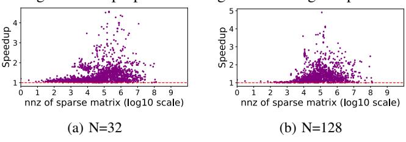
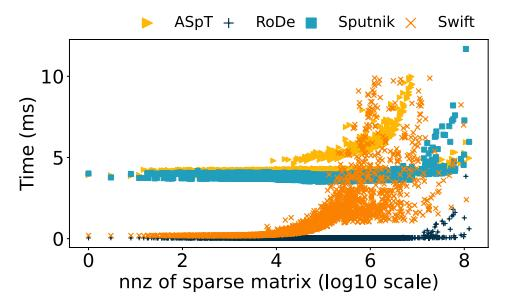

# *E. One-to-one Performance Comparison between Swift and Individual SOTA Methods*

Figure 14 and Figure 15 show one-to-one comparisons of Swift with the four individual SOTA methods on each matrix. The speedup of Swift over the others is calculated by dividing the execution time of each method by the Swift execution time and represented in the y-axis. The data points above/below 1*.*0 indicate that Swift is better/worse than the compared SOTA method. A horizontal dotted line represents the 1*.*0 threshold. Figures 14a, 14e, 15a, 15e represent the comparisons of Swift with ASpT. In FP64, Swift is faster than ASpT in most matrices. However, Swift does not perform well in some matrices. This phenomenon is more obvious in FP32. The reason is that the pattern of the sparse matrix affects Swift's performance, especially in this configuration. Figures 14b, 14f, 15b, 15f show data comparing Swift with cuSPARSE. Compared to cuSPARSE, Swift demonstrates excellent performance and consistently achieves strong results across various matrices. For both FP64 and FP32, Swift outperforms cuSPARSE.

Figures 14c, 14g, 15c, and 15g are the comparisons of Swift with respect to RoDe. The speedup of Swift over RoDe is comparable to its speedup over ASpT, with both reaching up to around 10→. However, Swift consistently outperforms RoDe on most matrices. Additionally, Swift maintains strong performance relative to RoDe in both FP64 and FP32 precision modes, though its performance in FP32 is slightly lower than in FP64. Figures 14d, 14h, 15d, and 15h display data comparing Swift with Spuntik. The speedup of Swift over Spuntik is generally lower than its speedup over cuSPARSE but higher than its speedup over AsPT and RoDe. Despite this, Swift consistently delivers excellent performance compared

Fig. 15: Speedup of Swift over the four SOTA methods on RTX 4080s (FP32).

Fig. 16: The proportion of regular and irregular parts.

Fig. 17: Speed up of coalesced memory access over noncoalesced memory access in Swift.

to Spuntik across various floating-point precisions (FP64 and FP32) and dense matrix dimensions (*N* = 32 and *N* = 128).

In summary, the performance of Swift varies when compared to different methods, depending on the scale of the dense matrices and the floating-point precision. However, Swift consistently demonstrates superior overall performance across diverse scenarios.

## *F. Performance Impact of the Different Swift Optimizations*

Swift is based on two main optimizations: It coalesces the memory accesses when computing SpMM for the regular blocks, and reduces the load imbalance across warps when processing the irregular blocks. We show the ratio between the regular and irregular parts in Figure 16 for all considered matrices. These data indicate that in most matrices the regular part dominates. However, there are 14.01% of the matrices that have more than 50% irregular blocks, particularly the smallest matrices of our experimental campaign. Data in Figure 16 indicate that, although the impact of coalesced memory access in the regular part becomes more significant as the matrix size grows, the load balancing technique for the irregular blocks is

Fig. 18: Swift with and without optimization of irregular part.

relevant for a significant portion of the matrices. Sections V-F1 and V-F2 show the benefits of memory coalescence for regular blocks and load imbalance for irregular ones.

*1) Impact of Coalesced Memory Accesses in the Regular Part:* Similar to Section III, we use the storage structure of dense matrices whether the memory accesses to the dense matrices are coalesced or not. We compare the performance achieved by the highly coalesced memory access patterns of Swift for the regular blocks, where the storage format of dense matrix *B* is column-major, with a non-coalesced memory access scenario using a row-major storage format for matrix *B*. Figure 17 shows this evaluation. The geometric mean speedup achieved by the Swift version that coalesces access to the dense *B* matrix with respect to the one that does not is 1.32→ (1.38→) when *N* = 32 (*N* = 128).

TABLE IV: Memory Bandwidth Utilization.

| Matrix   | NNZ    | ASpT   | cuSPARSE | RoDe   | Sputnik | Swift  |
|----------|--------|--------|----------|--------|---------|--------|
| c-48     | 166080 | 27.35% | 32.44%   | 30.43% | 24.53%  | 69.90% |
| rajat22  | 197264 | 47.11% | 36.38%   | 46.86% | 33.70%  | 69.90% |
| HEP-th   | 342437 | 38.27% | 34.69%   | 32.10% | 26.42%  | 79.35% |
| RFdevice | 365580 | 40.76% | 38.37%   | 52.55% | 37.20%  | 81.45% |
| bundle1  | 770901 | 19.12% | 28.23%   | 29.80% | 27.51%  | 51.91% |

- *2) Impact of Load Balancing in the Irregular Part:* Figure 18 shows the benefits of using the load balancing optimization to process the irregular blocs brings for randomly selected 20 matrices of different sizes. The result in Figure 18 shows that the imbalance of irregular parts can significantly affect the performance. The extent of optimization for the irregular portion varies across different matrices, primarily depending on the distribution of nonzero elements. This distribution significantly influences the proportion of the irregular portion relative to the entire matrix. The average speedup of Swift with irregular part optimization over that without optimization is 2.26→ (2.69→) for *N* = 32 (*N* = 128). The optimization strategy for the irregular portion is overall effective. It cannot achieve coalesced memory access like the regular portion, but the strategy ensures load balancing and efficient utilization of thread resources for the irregular portion.
- *3) GPU Memory Throughput:* We show the memory bandwidth utilization achieved by all the considered approaches for five representative matrices in Table IV. Swift achieves the highest bandwidth utilization. This is attributed to its wellbalanced workload distribution of both regular and irregular parts. Each thread within a thread block is assigned an appropriate amount of work, and the regular part benefits from coalesced memory accesses.

## *G. Preprocessing Overhead*

We compare the preprocessing overhead of Swift with that of other SOTA methods. Figure 19a shows this comparison. When the NNZ is less than 105, the preprocessing overhead incurred by Swift is smaller than ASpT and Sputnik, while comparable to that of RoDe. When the matrix NNZ is larger than 105, the preprocessing time of Swift increases. When NNZ is larger than 106, the Swift overhead is larger than the one Sputnik and RoDe incur and very similar to ASpT. In summary, Swift incurs preprocessing overhead smaller or similar than the one of ASpT, which delivers the best SpMM performance after Swift.

To explain why Swift's preprocessing overhead increases as the number of non-zero elements of the sparse matrix grows, we conduct an in-depth analysis of this overhead. Figure 19b indicates the portion of preprocessing overhead due to sorting and blocking depending on the number of nonzeros of the sparse matrix. For the smallest sparse matrices, the most timeconsuming part is sorting. As the sparse matrix size increases, blocking becomes the most time-consuming part. The reason is that as the matrix size increases, the data operations performed during blocking (e.g., data movement) surpass those required for sorting, causing the weight of time in blocking to increase.

(a) The comparison of preprocessing time.

(b) Time proportion of sorting and blocking. Fig. 19: The analysis of preprocessing in Swift.

