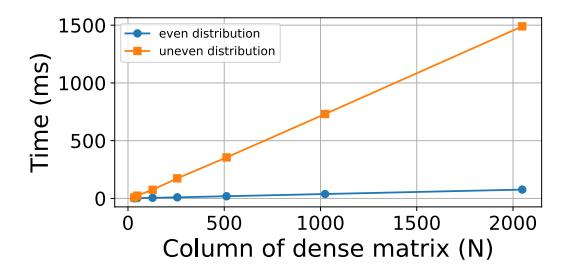

# III. MOTIVATION

Most existing SpMM methods typically overlook the impact of coalesced memory access on the dense matrix. Figure 2 highlights the issues with existing SpMM approaches in contrast to an ideal scenario. The upper part of Figure 2 shows two different scenarios distinguished by how the dense matrix *B* is stored (column-major (Scenario 2) vs. row-major (Scenario 1)), while the sparse matrix *A* is stored using the CSR format.

In Scenario 2, when one warp loads four elements in the sparse matrix *A*, the column index of the sparse matrix is not continuous, which produces non-contiguous memory accesses to the dense matrix *B*. For example, when Threads 0-3 of one warp access elements 9, 8, 3, and 8 of matrix *A*, the column index corresponds to 0, 2, 1, and 3. Consequently, the corresponding dense matrix elements for pairwise multiplication are a, e, c, and g, with correspond to columns 0, 2, 1, and 3, respectively. Threads 0-3 within a warp cannot access the dense matrix *B* continuously, failing to achieve coalesced memory access. Similarly, for Scenario 1, the addresses of the corresponding dense matrix elements accessed by Threads 0- 3, *i.e.*, a, e, c, and g, are 0, 4, 2, and 6, respectively, which is even worse than Scenario 2. The same failed coalesced memory accesses happen for Threads 4-7 in both Scenario 2 and Scenario 1.

To assess the impact of coalesced memory access on performance, we consider two additional scenarios (Scenario 3 and Scenario 4) representing the best regular data access patterns for both two input matrices. Scenario 3 and Scenario 4 are represented at the bottom of Figure 2. In the case of Scenario 3, matrix *B* is stored in row-major order, while in the Scenario 4 scenario, matrix *B* is stored in column-major order. Similar to Scenario 1 and Scenario 2, in the case of Scenario 3 the dense matrix elements loaded by Threads 0-3 are a, c, e, and f, which cannot achieve coalesced memory access. However, Scenario 4 achieves coalesced memory accesses for both matrices *A* and *B*. In summary, when threads within one warp load data in Scenario 1 to Scenario 3, they require multiple memory transactions to load *B* while Scenario 4 only requires one memory transaction for matrix *B*.

We run an experiment based on Scenarios 3 and 4 to highlight the performance impact of coalescing memory accesses. Specifically, we consider two dense matrices *A* and *B* with dimensions *M* → *K* and *K* → *N* and we compute the product *A · B* considering two different scenarios. In the

Fig. 4: The performance of SpMM with and without load balance.

first scenario, *B* is stored in row-major, resembling Scenario 3 in Figure 2, while in the second scenario, *B* is stored in column-major, similar as Scenario 4. To define the sizes of the *A* matrices, we consider 300 sparse matrices obtained from the SuiteSparse matrix collection [20], and we use their *M* → *K* dimensions. We set the value of *N* in matrix *B* to 32 and 128. The coefficients of the *A* and *B* matrices are randomly generated. Section V-A provides more details about our experimental setup. Figure 3 shows the scale of the dense matrix *A* in its x-axis, and the performance speedup of using a column-major storage for *B* with respect to a row-major one, *i.e.* the performance speedup of coalescing *B* accesses, in its y-axis. The experimental results in Figure 3 demonstrate that coalesced memory access of matrix *B* can significantly affect performance, by 10.1% (20.7%) on average for *N* = 32 (*N* = 128), and up to 27.8% (42.6%) for *N* = 32 (*N* = 128). As the matrix size increases, the performance difference becomes more pronounced. Based on these observations, Section IV describes an algorithm that achieves highly coalesced memory access for both sparse and dense matrices when computing SpMM. Section V shows that our SpMM algorithm with coalesced memory access achieves 32% (38.1%) average speedup for *N* = 32 (*N* = 128).

In addition to exploring the impact of coalesced memory access on performance, we evaluate the effect of load balance. We synthetically generate two different sparse matrices with the same dimensions (M = 87616 N= 67320 and NNZ = 13734559). The difference is that, in the first sparse matrix, the non-zero elements are evenly distributed across each row (with load balance), whereas in the second sparse matrix, the nonzero elements are unevenly distributed across rows (without load balance). We test SpMM considering these two sparse matrices and multiplying them with dense matrices of varying sizes. Section V-A describes our experimental setup. Figure 4 shows that, as the size of the dense matrix (N) increases, SpMM with balanced load performs increasingly better than SpMM with unbalanced load. The average speedup is 15.0.

