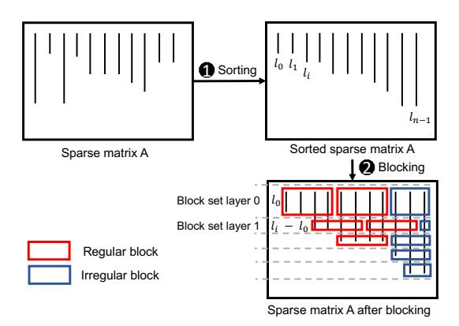

# IV. THE SWIFT ALGORITHM

The Swift SpMM algorithm makes it possible for all threads within a warp to trigger mostly continuous accesses to the sparse and dense matrices, and achieve highly coalesced memory access.

Fig. 5: An illustration of Swift sorting and blocking.

#### A. Blocking Strategy of Swift

The blocking strategy of Swift requires sorting the columns of the sparse matrix A in terms of non-zero elements per column, as Figure 5 shows. The dense matrix rows are rearranged according to the column sort of the sparse matrix. The  $l_i$  value represents the number of non-zero elements belonging to column i. Once columns are sorted, Swift groups the sorted sparse matrix into block sets in such a way that the length of each regular block matches the size of a GPU warp. Figure 5 illustrates several block sets. In the Figure, the number of nonzero columns is n, and the non-zero elements per column go from  $l_0$  to  $l_{n-1}$ .  $l_0$  is the height of the first block set layer. Then, every first  $l_0$  element in each column participates in the first block set layer. In case  $l_0$  is too large, Swift uses a maximum block height. Then, the first column i with  $l_i$ greater than  $l_0$  is where the second block set layer begins, and the block set height is  $l_i - l_0$ . Similarly, the third block starts in column j where  $l_j$  is greater than  $(l_i - l_0) + l_0 = l_i$ , that is, its height is  $l_j - l_i$ . Since the block's height depends on the  $l_i$  values, the Swift blocking is determined by the sparsity pattern of A. The block set design ensures load balance among warps and avoids thread divergence.

This blocking strategy generates n/warpSize regular blocks in the first block set layer. If n has a remainder when divided by warpSize, Swift will generate an irregular block and its size is  $(n \ mod \ warpSize) \times l_0$  in the case of the first block layer. Column sorting ensures that there are no zero coefficients mapped within a block.

## B. The Swift Data Structure

We use a column-major data structure to support Swift. The reason is that row-major formats like CSR require additional operations to select non-zero elements belonging to the same column and load them to shared memory. Instead, column-major formats can process the matrix column by column, naturally lending themselves to the Swift design. For the rest of the section, we assume that we build Swift on top of the CSC format and its data structures, without loss of generality. Swift requires extending CSC to support its blocking strategy, which Section IV-A describes, as well as the floating-point computations of SpMM. This extension includes two parts:

the regular part, which accounts for all regular blocks, and the irregular part, which keeps track of all irregular blocks. The regular part consists of six arrays: blkPtr, blkCoIdx, value, rowIdx, positionIdx, and offsetIdx. blkPtr is a pointer that stores the start position of each block in the value and rowIdx arrays. blkCoIdx stores the start column index of each block. positionIdx and offsetIdx will introduce in Section IV-C. Similarly as CSC, if the number of regular blocks is blockNum, the length of blockCoIdx is blockNum, and the length of blkPtr is blockNum + 1. The length of the value, rowIdx, positionIdx, and offsetIdx arrays is blockNum \* warpSize.

For the irregular part, Swift represents the irregular block elements using the CSC format to store them in columns starting from the right of the sorted matrix. As Figure 5 shows that the irregular part of the matrix is typically concentrated on the matrix's right side after sorting, since the sorting phase arranges the sparse matrix in ascending order of non-zero elements per column. Storing the irregular elements from right to left facilitates quick identification of each element's corresponding position during computation.

1) Example of the Swift Data Structure: Figure 6 shows an example of the Swift data structure, assuming that CSC is used as the basic format. On the left hand side plot, we represent the original sparse matrix, which is an excerpt of the jgl009 matrix belonging to the SuiteSparse Collection [20]. For clarity purposes we set the warpSize to 4 and the maximum block height to 1 in this example. We sort the original sparse matrix A into sortedMatrxA in terms of NNZ elements per column in ascending order.

The right hand side plot of Figure 6 indicates how Swift stores the sparse matrix. With respect to the regular part, we use block0 as an example. The first non-empty column of block0 is column 0. Consequently, the first elements of the contiguous four columns starting from column 0 are allocated to block 0. In contrast, block8 starts in column 2 since the two preceding columns (0 and 1) are already represented in previous blocks, and column 2 still has one element left to be represented. The irregular part is represented by the gray-shaded elements in Figure 6. These elements are allocated to the irregular part of the data structure. For example, the elements of the last column not included in the regular part are 5, 9, 3, 8, 4, and 3. These elements and their corresponding row indices are stored in the CSC format, as the bottom right-hand side plot of Figure 6 indicates.

## C. Optimization Strategy of Swift

CSC format has a key drawback: when threads attempt to accumulate multiplication results into the result matrix C (Algorithm 1, Line 7), conflicts can occur, where atomic operations are required. Segment sum [30] is adopted to performance overhead of atomic operations. As illustrated in Figure 6, in the regular case, certain blocks (e.g., block 0) may contain consecutive elements that share the same row index (rowIdx). This enables the use of segment sum, where the block is partitioned into smaller segments based on row

Fig. 6: An example of Swift: The original matrix is a real matrix called *jgl009*.

Fig. 7: An illustration of the optimization strategy of Swift.

indices (e.g., block 0 is divided into three segments  $\{9\}$ ,  $\{4\}$ , and  $\{1,2\}$ ). This technique reduces the frequency of atomic operations, thereby alleviating their negative performance impact. We further improved the efficiency of segment sum by handling multiple blocks within a thread block and utilizing shared memory.

Figure 7 illustrates the workflow. Assume that four blocks are assigned to a thread block. The row indices from these four blocks are first sorted together. After sorting, the indices of the sorted rowIdx are stored in a position index array (positionIdx). In addition, the offsetIdx array marks segment boundaries, i.e., ranges of elements that share the same row index. For each segment, the first element stores the number of remaining elements in the segment, while the rest are marked as 0. If a segment contains only one element, its entry in offsetIdx is set to -1.

The multiplication results are stored in shared memory according to the positionIdx array. Next, partial sums for elements with the same row index are accumulated locally in shared memory using the offsetIdx array. Once the local reduction is complete, the final results are written back to the global result matrix via atomic addition, minimizing the frequency of atomic operations and improving overall

performance. Section IV-D provides additional details.

