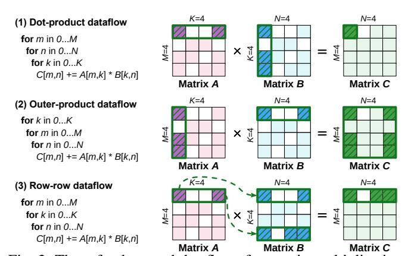
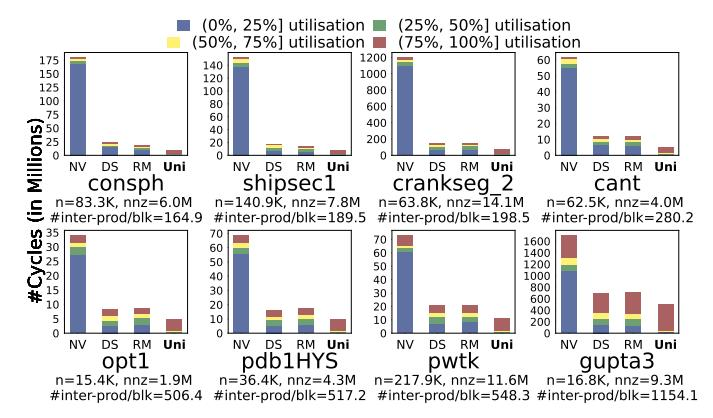
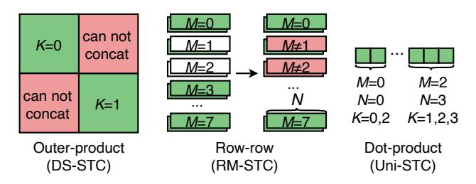

# *A. CSR and Bitmap Storage Formats*

Sparse matrices typically employ compressed storage formats to save memory and enhance computational throughput. The CSR format is prevalent due to its simplicity and efficient row-wise access to nonzero elements. Alternatively, bitmapbased representations are favoured for smaller matrices, offering a compact layout that facilitates rapid element retrieval. Fig. 1 depicts a 4 × 4 sparse matrix alongside its CSR and bitmap representations, highlighting their distinct storage and indexing mechanisms.

#### *B. Sparse Kernels*

In contrast to dense operations, sparse computations involve a diverse array of operand types, where inputs and outputs vary in both sparsity (dense or sparse) and dimensionality (vector or matrix). Fig. 2 lists these combinations into four fundamental

Fig. 1: An example of the CSR and Bitmap formats.

Fig. 2: Sparse kernels SpMV, SpMSpV, SpMM and SpGEMM.

Fig. 3: Three fundamental dataflows for matrix multiplication: dot-product, outer-product and row-row.

TABLE II: Sparse kernels in different applications.

|     | SpMV | SpMSpV | SpMM | SpGEMM |
|-----|------|--------|------|--------|
| GNN |      |        | ✓    | ✓      |
| AMG | ✓    |        |      | ✓      |
| BFS | ✓    | ✓      |      |        |

kernels—SpMV, SpMSpV, SpMM, and SpGEMM—that serve as cornerstones for scientific computing and AI workloads.

#### *C. Dataflows*

Matrix multiplication primarily relies on three fundamental dataflows: (1) the dot-product (DotP) dataflow, which computes a single element of C by multiplying a row of A with a column of B; (2) the outer-product (OutP) dataflow, which updates the whole C by multiplying a column of A with a row of B; and (3) the row-row dataflow, which generates a row of C by scaling rows of B with scalar elements from a row of A. Fig. 3 provides a schematic illustration of these mechanisms.

TABLE III: Task sizes at different levels in STCs (64 MACs).

| Task  | Task        | Task Size $(M \times N \times K)$                             |            |        |                       |  |
|-------|-------------|---------------------------------------------------------------|------------|--------|-----------------------|--|
| Level | Name        | NV-DTC                                                        | DS-STC     | RM-STC | Uni-STC               |  |
|       |             | [60]                                                          | [78], [92] | [30]   | (ours)                |  |
| T1    | MMA         |                                                               | 16×1       | 6×16   |                       |  |
| 11    | instruction | 16×16×16                                                      |            |        |                       |  |
| T2    | Machine     | $8\times8\times4$ $16\times16\times1$ $8\times16\times2$ None |            |        |                       |  |
| 12    | instruction |                                                               |            |        |                       |  |
| Т3    | Tile        | $4\times4\times4$                                             | 8×8×1      | 8×4×2  | $4 \times 4 \times 4$ |  |
| T4    | Vector      | None $1 \times 1 \times 4$                                    |            |        |                       |  |

Fig. 4: Schematic dataflow comparison of DS-STC, RM-STC, and Uni-STC across the four kernels, assuming a MAC array size of 4. Solid and dashed black boxes demarcate the data access windows for the first and final execution cycles, respectively; red slashes highlight ineffective memory accesses. For DS-STC and RM-STC, black dots signify accessed elements, while orange lines trace the per-cycle execution trajectory.

## III. MOTIVATION

#### A. Challenge 1: Acceleration of sparse applications

- 1) Demand for generality: As summarized in Table II, real-world applications frequently require a combination of sparse kernels. For instance, Graph Neural Networks (GNNs) [25], [69] use both SpMM and SpGEMM for node information propagation and aggregation. Similarly, Algebraic Multigrid (AMG) solvers [53] and Breadth-First Search (BFS) algorithms [56] depend on multiple sparse kernels for convergence and traversal efficiency. This workload diversity underscores the critical need for accelerators capable of supporting a comprehensive suite of sparse computations.
- 2) Unified data structure: Implementing a unified data structure is a necessary condition for effectively supporting multiple sparse kernels. This structure eliminates costly online format conversions between kernels, supporting a unified dataflow in hardware design to enhance generality. However,

Fig. 5: STCs' SpGEMM performance on eight representative matrices in Table VII ( $C=A^2$ ). This figure shows the results with color-coded blocks, which display the proportion of cycles with varying utilisation rates within the total cycles.

designing such a unified structure is challenging because of the sparse kernels variety and the hardware constraints.

Given the limited generality of existing accelerators, accelerating real-world sparse applications requires a unified framework that integrates a common data structure, software algorithms, and a sparse tensor core.

Understanding the inefficiency of existing STCs requires examining their decomposition of large tasks into multiple layers. As shown in Table III, we organize the computation into a four-level task hierarchy (T1–T4):

- (T1) The matrix multiply-accumulate (MMA) instruction task: A 16(M) × 16(N) × 16(K) matrix multiplication corresponding to a warp MMA (WMMA) instruction on an A100 GPU.
- (T2) Machine instruction task: A task corresponding to a Parallel Thread Execution (PTX) instruction from the compiler, which follows a predefined, multi-cycle execution flow.
- (T3) Tile task: A sub-task generated by partitioning a T2 task based on the STC's per-cycle throughput. For sparse computation, it is designed to support hardwarelevel concatenation.
- (T4) Vector task: A fine-grained task derived from a T3 task, whose length is determined by the STC's ability to merge adjacent intermediate products.

Specifically, fixed-size T2 tasks are well-suited for regular sparsity but struggle with unstructured patterns. The unpredictable locations of nonzeros in such cases lead to inefficient memory accesses and significant throughput degradation. Fig. 4 illustrates how fixed task partitioning can degrade throughput. In each cycle, DS-STC forms an outer-product task from a half-column of A and a half-row of B/x, whereas RM-STC generates multiple 'scalar  $\times$  vector' tasks from two half-row vectors. This rigid selection frequently causes inefficient data accesses (marked by red slashes), resulting in lower MAC utilisation compared to Uni-STC. Our quantitative analysis in Fig. 5 further emphasizes this performance gap. For

Fig. 6: Restrictions of different STC on task concatenation.

real-world matrices, NVIDIA dense tensor core (NV-DTC) offers only limited sparsity support, with MAC utilisation falling below 25% in 84.34% of cycles. Although DS-STC and RM-STC demonstrate higher efficiency than NV-DTC, their utilisation remains suboptimal. We therefore identify two primary challenges to enhancing STC MAC utilisation: task scheduling and task concatenation.

#### B. Challenge 2: Task scheduling

- 1) Inefficiency of data gathering: As shown in Fig. 4, DS-STC and RM-STC achieve transient high MAC utilisation by gathering sparse matrices into dense vectors. However, they suffer from frequent low-utilisation phases (indicated by red slashes in Fig. 4). These phases, stemming from ineffective accesses, lead to 61.68% and 62.78% of cycles operating below 50% utilisation (Fig. 5). Furthermore, because their T3 task dimensions are rigidly tailored to specific sparsity patterns, efficiency degrades significantly when handling diverse real-world patterns, such as long rows in matrix A.
- 2) Insufficient parallelism within STC: The proportion of low-utilisation cycles in DS-STC and RM-STC significantly surpasses the 15.82% baseline achieved in Uni-STC. This stems from their lack of a load-aware task execution mechanism. Given the inherent difficulty in minimizing low-load tasks, a paradigm shift from gathering data to gathering tasks (aggregating multiple low-load tasks) is essential. However, existing architectures lack the workload-aware design necessary to implement this shift, which hinders overall utilisation.

Therefore, it is necessary to bypass T2 task partitioning, integrate task-load awareness into STC, and support parallel task execution.

## C. Challenge 3: Task concatenation

- 1) Coarse Task Granularity: The limited proportion of high-utilisation cycles in DS-STC and RM-STC (approximately 20% in the red region of Fig. 5) stems from their coarse task granularity. Specifically, for tasks in the 50-75% utilisation range (the yellow region), these architectures lack a mechanism to further partition and reorganize them to better fit the MAC array dimensions. Therefore, T3 tasks need to be further broken down.
- 2) Concatenating restrictions: However, as shown in Fig. 6, merely refining task granularity is insufficient to resolve the utilisation bottleneck. DS-STC and RM-STC, employing outer-product and row-row dataflows respectively, adhere to

Fig. 7: (a) Uni-STC's supported data types; (b) Uni-STC's position in GPU SM; and (c) Uni-STC's architecture, highlighting three core components: TMS, DPG and SDPU.

rigid 2D or 3D structural layouts (consistent with T3 task definitions in Table III). Such rigidity limits task concatenation flexibility: DS-STC cannot concatenate tasks at different positions along the K-dimension, whereas RM-STC only permits concatenation along the N-dimension. Consequently, even with fine-grained tasks, these spatial constraints prevent efficient packing and leave the hardware underutilised.

Therefore, adopting a least-constrained dot-product method for task refinement offers a more promising solution.

