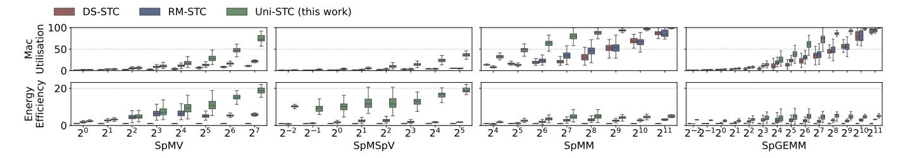
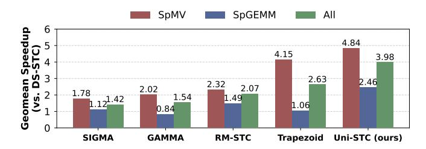

# B. Hardware Dataflow

The hardware dataflow of an STC is defined by the interplay between its task preparation method and its computational unit architecture, which ultimately dictates performance. To illustrate the resulting differences, we present a case study in Fig. 14 that compares three STCs processing a downsized  $8(M) \times 8(N) \times 8(K)$  T1 task. The comparison focuses on two key stages: task preparation and task execution. For a fair comparison, each STC is equipped with 16 multipliers and their associated adders.

1) Task preparation: The goal of task preparation is to decompose large T1 tasks into smaller T3 tasks compatible with the computational units. DS-STC and RM-STC achieve this using a hybrid software-hardware approach that reduces hardware overhead. As illustrated in Fig. 14, this process begins in software, where the compiler expands a T1 task into intermediate T2 sub-instructions, represented by the redhighlighted box. This stage leverages the GPU front-end's skipping mechanism for coarse-grained sparsity support. Subsequently, in hardware, any T2 task that still exceeds the computational unit's capacity is further subdivided into T3 tasks for sequential execution.

Although this collaborative method reduces hardware overhead, its core limitation is that T2 task splitting is rigidly tied to the computational unit's structure. Within STC, there is a lack of mechanisms to address the load imbalance of T2 tasks caused by irregularity, which typically results in relatively low

MAC utilisation. In contrast, Uni-STC adopts a more flexible strategy. Although it initially divides T1 tasks into fixed-size T3 tasks, it provides a dynamic task fusion mechanism to mitigate load imbalance.

Fig. 14 highlights the four-layer T3 tasks for Uni-STC, where the diagram's notation is interpreted as follows. The number in the center of each block denotes the count of intermediate products, the number in the upper-left corner identifies the assigned DPG, and the green blocks signify multiple T3 tasks that are concurrently executed on the SDPU during the first cycle.

2) Task execution: Achieving effective task fusion is non-trivial. As illustrated in Fig. 14, the approaches in DS-STC and RM-STC suffer from two key inefficiencies related to the MAC array. First, T2 tasks can be too small to fully utilise the array's resources, leading to wasted performance (e.g., RM-STC). Second, even sufficiently large tasks may have shapes that are incompatible with the array, which prevents the concatenation of multiple T3 tasks and thus causes inefficiency (e.g., DS-STC). This architectural challenge is compounded by the complexity of implementing a hardware-based, multi-dimensional knapsack solver on resource-constrained STCs.

Uni-STC addresses these fusion challenges by decomposing T3 tasks into even finer-grained vector dot-product operations (T4 tasks). As shown in Fig. 14, a  $2(M) \times 2(N) \times 2(K)$  T3 task is broken down into  $1(M) \times 1(N) \times 2(K)$  T4 tasks. The concatenation of these vector tasks is accomplished using simple prefix sums and shift units, thereby accelerating computation on the SDPU. Consequently, this approach boosts Uni-STC's utilisation to 75%, a significant improvement over the 50% of RM-STC and 37.5% of DS-STC.

In summary, Uni-STC adopts a software-hardware codesigned dataflow: BBC and UWMMA express and schedule the four kernels in software, while the hardware dataflow (TMS $\rightarrow$ DPG $\rightarrow$ SDPU) enables efficient task preparation and execution to improve utilisation under irregular sparsity.

Fig. 15: Space reduction of the three formats BSR  $(4 \times 4)$ , BSR  $(16 \times 16)$  and our BBC over the baseline CSR.

#### VI. EVALUATION

#### A. Experimental Setup

On the dataset side, we evaluate SpMV, SpMSpV, and SpMM using all 2893 matrices from SuiteSparse [10], and SpGEMM ( $C=A^2$ ) using its 2126 square matrices. For DNN inference, we evaluate ResNet-50 and Transformer [74] models using the 302 weight matrices from DLMC [23] at 70% and 98% sparsity. Additionally, input vectors for SpMSpV are randomly generated with 50% sparsity, and the number of columns in matrix B for SpMM is set to 64.

On the software side, we compare our BBC format with the conventional CSR and BSR (with block sizes of  $4\times 4$  and  $16\times 16$ ) to assess the memory efficiency derived from its unique sparse matrix structure.

On the hardware side, we build upon Accel-Sim [38] with added support for asynchronous memory access, integrating our STC simulator to support GAMMA [93], SIGMA [66], Trapezoid [87], NV-DTC [60] (A100's original Tensor Core), DS-STC [78], [92], RM-STC [30], and our work Uni-STC.

To rigorously evaluate the architectural benefits of Uni-STC under configurations '64 MAC@FP64 and 128 MAC@FP32', we establish a fair comparison by aligning the theoretical compute throughput of all designs. To this end, we adopt SIGMA's PE design and scale the MAC arrays of all evaluated architectures, including GAMMA and Trapezoid, accordingly.

We assess three key metrics: performance, energy, and area. Performance is measured using a unified software invocation of a T1 task with dimensions  $16(M) \times 16(N) \times 16(K)$ . Energy consumption is extrapolated from register activity following the Sparseloop methodology [80]. Uni-STC's chip area is analyzed using yosys [79], FreePDK45 [62], and CACTI7 [3].

## B. Data Structure Comparison

Fig. 15 compares the memory overhead of our BBC format against the conventional CSR and BSR (with the block sizes of  $4\times4$  and  $16\times16$ ) across all 3195 test matrices. The memory usage of the BBC format shrinks as the number of nonzeros per block (NnzPB) increases, becoming the most efficient for 2585 matrices (where NnzPB > 3.57) and delivering savings of up to  $15.26\times$  over CSR. Conversely, the BSR format typically requires more storage than CSR.

TABLE VI: Comparison of STCs. MMA instruction task size:  $16 \times 16 \times 16$ , MAC array size: 128@FP32 or 64@FP64.

| STC                 | T3 Task Size (128 or 64 MACs) $(M \times N \times K)$                                                                                       | T4 Task Size $(M \times N \times K)$ |
|---------------------|---------------------------------------------------------------------------------------------------------------------------------------------|--------------------------------------|
| GAMMA [93]          | $16 \times (8 \text{ or } 4) \times 1$                                                                                                      |                                      |
| SIGMA [66]          | $1 \times (8 \text{ or } 4) \times 16$                                                                                                      |                                      |
| Trapezoid [87]      | TrIP: $16 \times (4 \text{ or } 2) \times 2$ TrGT: $16 \times 4 \times (2 \text{ or } 1)$ TrGS: $8 \times 4 \times (4 \text{ or } 2)$ | Same as T3 Task Size              |
| NV-DTC [60]         | $(8 \text{ or } 4) \times 4 \times 4$                                                                                                       |                                      |
| DS-STC [78], [92]   | $8 \times (16 \text{ or } 8) \times 1$                                                                                                      |                                      |
| RM-STC [30]         | $(16 \text{ or } 8) \times 4 \times 2$                                                                                                      |                                      |
| Uni-STC (this work) | $4 \times 4 \times 4$                                                                                                                       | $1 \times 1 \times 4$                |

Fig. 16: MAC utilisation for GAMMA, SIGMA, Trapezoid, DS-STC, RM-STC and Uni-STC (128 MAC@FP32).

The one-time format conversion overhead is modest, comparable to the execution time of a few hundred SpMV operations. On a 64-core AMD EPYC 7702 CPU, this conversion takes less than 1000 ms, while on an NVIDIA A100 GPU, the overhead is less than 100 ms. This initial cost can be effectively amortized and becomes negligible in iterative applications such as GNN training and linear solvers.

#### C. Hardware Comparison

Table VI details the configurations of all evaluated STCs. For multi-mode architectures like SIGMA and Trapezoid, we select their best-performing configurations. Since our implementations of GAMMA, SIGMA, and Trapezoid are specifically adapted for a fair throughput comparison, which do not accurately reflect the original designs. As their energy consumption and energy efficiency are both lower than RM-STC, in this section, our analysis against these three architectures focuses solely on performance.

1) Comparison using random matrices: Following the methodology of RM-STC, we first evaluate MAC utilisation using random  $8192 \times 8192$  matrices with varying sparsity.

As shown in Fig. 16, Uni-STC achieves average speedups of  $1.67\times$ ,  $1.73\times$ , and  $1.13\times$  over GAMMA, SIGMA, and Trapezoid, respectively. The performance gain over GAMMA stems from Uni-STC's ability to bypass empty rows, a task difficult for GAMMA's blocking approach. The advantage over SIGMA is due to its effective handling of dual-sided sparsity, whereas SIGMA's modes are either limited to single-sided sparsity or incur high transmission overhead. The speedup

Fig. 17: Comparison of speedup, energy consumption, and energy efficiency of four sparse kernels, as well as ResNet50 and Transformer inference on DS-STC, RM-STC, and Uni-STC. The value after the model name denotes the layer number. Among them, the four sparse kernels use 64 MAC@FP64, and the DNN inference uses 128 MAC@FP32.

Fig. 18: Energy consumption of I/O (reading A and B, and writing C) in SpGEMM on the eight matrices.

Fig. 19: The data traffic and average network scale when writing matrix C.

against Trapezoid is attributed to Uni-STC's global task scheduling, which avoids the potential load imbalances found in Trapezoid's grouped MAC array design.

Uni-STC also demonstrates superior MAC utilisation compared with NV-DTC, DS-STC, and RM-STC by factors of

TABLE VII: Information of the eight representative matrices. The column #inter-prod/blk represents the average number of intermediate products per T1 task during SpGEMM computation, with a maximum value of  $16 \times 16 \times 16 = 4096$ .

| Matrix A   | n(A) | nnz(A) | plot | nnz(C) | #inter-prod/blk |
|------------|------|--------|------|--------|-----------------|
| consph     | 83K  | 6.0M   |      | 26.5M  | 164.9           |
| shipsec1   | 140K | 7.8M   |      | 24.1M  | 189.5           |
| crankseg_2 | 64K  | 14.1M  |      | 104.6M | 198.5           |
| cant       | 62K  | 4.0M   |      | 17.4M  | 280.2           |
| opt1       | 15K  | 1.9M   |      | 8.2M   | 506.4           |
| pdb1HYS    | 36K  | 4.3M   | X    | 19.6M  | 517.2           |
| pwtk       | 218K | 11.6M  |      | 32.8M  | 548.3           |
| gupta3     | 17K  | 9.3M   |      | 270.9M | 1154.1          |

 $2.89 \times$ ,  $1.89 \times$ , and  $1.39 \times$ , respectively. This superiority stems from its finer-grained task parallelism and stronger sparsity adaptation. In contrast, NV-DTC lacks sparsity adaptation, DS-STC's performance is constrained by dual-sided sparsity, and RM-STC is particularly sensitive to the sparsity of matrix A.

In dense computation scenarios, all DTC/STCs achieve 100% MAC utilisation, but their energy consumption varies. Normalizing to NV-DTC, our Uni-STC achieves a  $0.94\times$  energy reduction, outperforming both DS-STC  $(0.67\times)$  and RM-STC  $(0.83\times)$ . This advantage arises because DS-STC and RM-STC incur additional overhead for data reuse and intermediate transfers. In contrast, Uni-STC activates only two DPGs, preserving a data movement pattern consistent to NV-

Fig. 20: Performance distribution of the three STCs and four kernels on matrices from SuiteSparse. The x-axis denotes the average number of intermediate products per T1 task. Energy efficiency analyses use DS-STC as the baseline, and is calculated as 'speedup  $\times$  energy reduction'.

DTC. The minor additional energy in Uni-STC is attributed to its task scheduling within the TMS and DPG. The break-even point is reached when matrix A is dense and matrix B's sparsity is below 85%, at which point Uni-STC's energy efficiency becomes comparable to that of NV-DTC.

2) Comparison using real world matrices: To further highlight the performance differences among STCs arising from real-world sparse patterns, we select eight matrices from SuiteSparse, as listed in Table VII, to compare the four sparse kernels, and we use DLMC model data to evaluate the inference effects of both dense and sparse weights. Fig. 17 presents the speedup, energy reduction, and energy efficiency of Uni-STC and RM-STC, normalized to DS-STC as the baseline. The results consistently show that Uni-STC's superior performance and lower energy consumption translate to significantly higher overall energy efficiency.

For SpMV and SpMSpV kernels: About performance, (1) In SpMV, the MAC array structures of DS-STC and RM-STC limit their utilisation to below 12.5% and 25%, respectively. In contrast, Uni-STC's fine-grained task parallelism yields speedups of  $5.21\times$  over DS-STC and  $2.74\times$  over RM-STC. (2) In SpMSpV, RM-STC's MAC utilisation drops below 12.5% as the input vector x becomes sparser. Uni-STC uses the SDPU to achieve speedups of  $5.25\times$  and  $5.50\times$ . About energy, (1) For SpMV, Uni-STC reduces energy by  $2.76\times$  compared to DS-STC and  $1.01\times$  compared to RM-STC by reusing vector x data and minimizing intermediate product transfers, delivering average energy efficiency gains of  $14.34\times$  and  $2.77\times$ . (2) For SpMSpV, the energy reduction further improves to  $3.06\times$  and  $1.72\times$ , achieving average energy efficiency gains of  $15.97\times$  and  $9.41\times$ .

For SpMM, SpGEMM, and DNN inference (with convolution treated as SpGEMM), Uni-STC consistently outperforms the baselines. DS-STC exhibits poor energy efficiency due to its coarse-grained partitioning and lack of task parallelism. In comparison, Uni-STC achieves energy efficiency gains of  $1.74\times$ ,  $2.21\times$ ,  $1.37\times$ , and  $1.51\times$  over RM-STC for these four kernels, respectively. About performance, (1) For SpMM and dense DNN inference, Uni-STC's fine-grained partitioning, which leverages sparsity in matrix A, delivers  $1.53\times$  and  $1.35\times$  speedups over RM-STC, which is constrained by a fixed 4-cycle task execution. (2) For SpGEMM and sparse DNN inference, Uni-STC adapts to the sparse distribution to

TABLE VIII: Comparison of performance (P), energy consumption (E), and energy efficiency  $(E \times P)$  of STCs on the SuiteSparse Matrix Collection.

| Compared     |      | SpMV  |      |              | SpMSpV |      |              |
|--------------|------|-------|------|--------------|--------|------|--------------|
| With         |      | P     | E    | $E \times P$ | P      | E    | $E \times P$ |
| DS-STC       | Aver | 3.76  | 2.02 | 7.59         | 4.18   | 3.14 | 12.24        |
| 64 MAC@FP64  | Max  | 16.00 | 5.47 | 27.06        | 28.76  | 6.71 | 192.97       |
| DS-STC       | Aver | 3.58  | 2.79 | 9.89         | 4.18   | 4.28 | 16.71        |
| 128 MAC@FP32 | Max  | 16.00 | 7.41 | 30.79        | 28.76  | 9.15 | 263.08       |
| RM-STC       | Aver | 1.47  | 1.00 | 1.48         | 3.39   | 1.96 | 6.66         |
| 64 MAC@FP64  | Max  | 3.96  | 2.71 | 5.07         | 13.99  | 4.75 | 56.73        |
| RM-STC       | Aver | 1.39  | 1.37 | 1.91         | 3.39   | 2.68 | 9.07         |
| 128 MAC@FP32 | Max  | 3.33  | 3.67 | 6.68         | 13.99  | 6.50 | 77.34        |
|              |      | SpMM  |      |              | SpGEMM |      |              |
|              |      | P     | E    | $E \times P$ | P      | E    | $E \times P$ |
| DS-STC       | Aver | 3.07  | 1.51 | 4.17         | 2.40   | 1.91 | 4.19         |
| 64 MAC@FP64  | Max  | 8.00  | 5.61 | 20.66        | 16.00  | 5.65 | 20.75        |
| DS-STC       | Aver | 2.09  | 1.89 | 3.77         | 2.50   | 2.51 | 5.86         |
| 128 MAC@FP32 | Max  | 8.00  | 6.60 | 15.94        | 16.00  | 7.21 | 34.85        |
| RM-STC       | Aver | 2.52  | 0.77 | 1.84         | 1.45   | 1.35 | 1.86         |
| 64 MAC@FP64  | Max  | 7.15  | 1.80 | 9.19         | 5.20   | 3.59 | 5.03         |
| RM-STC       | Aver | 2.44  | 0.94 | 2.29         | 1.23   | 1.77 | 2.07         |
| 128 MAC@FP32 | Max  | 7.18  | 2.09 | 12.48        | 3.40   | 4.95 | 5.02         |

maintain speedups of  $1.88\times$  and  $1.48\times$ , whereas RM-STC struggles with dual-matrix sparsity. About energy, as illustrated in Fig. 18 and 19, Uni-STC's energy savings are substantial. It reduces the energy for writing matrix C by  $6.5\times$  compared to DS-STC, resulting in lower overall consumption than both DS-STC and RM-STC. This reduction is primarily driven by two factors: a smaller dynamic network scale (a  $2.36\times$  contribution) and reduced data traffic from the SDPU (an additional  $2.75\times$  contribution).

Moreover, the different energy efficiency improvements on ResNet50 and Transformer demonstrate Uni-STC's ability to perceive sparse loads: (1) In ResNet50, because the images are usually sparse after preprocessing, Uni-STC consumes more energy to enable multiple DPG to improve the throughput of SDPU. (2) In Transformer, because the load is relatively dense, Uni-STC activates only a single DPG in most cycles, saving nearly  $2\times$  energy consumption compared to RM-STC.

We extend our comparison to all SuiteSparse matrices for four key kernels. As detailed in Table VIII, Uni-STC consistently achieves higher energy efficiency than the state-of-the-art RM-STC.

Fig. 21: Speedup on AMG compared to DS-STC.

Fig. 22: Comparison of energy efficiency density (EED) normalized to DS-STC.

We measure computational density by calculating the average number of intermediate products contained within each T1 task. Fig. 20 illustrates the performance of the three STCs as a function of this density. For extremely sparse matrices, most T1 tasks complete in a single cycle. Consequently, the MAC utilisation across the three STCs is nearly identical, and Uni-STC conserves energy by activating only a single DPG. As block density increases, Uni-STC activates more DPGs to boost MAC utilisation, yielding higher performance in SpMM and SpGEMM. When matrices become even denser, the MAC utilisation for all STCs approaches saturation, at which point Uni-STC again saves energy by deactivating most DPGs.

