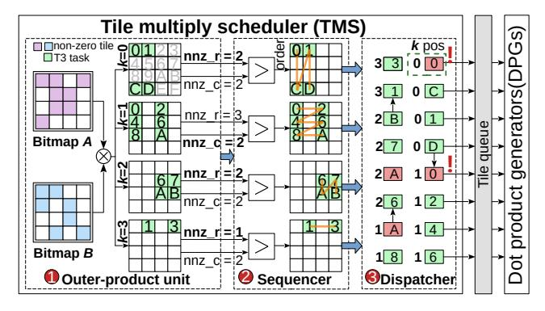
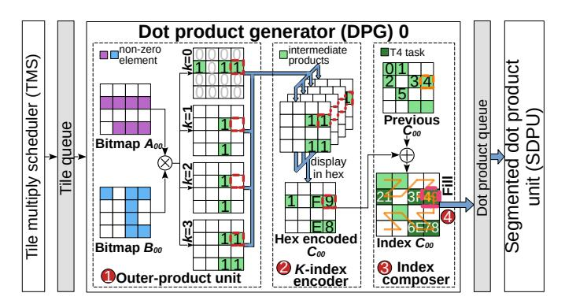
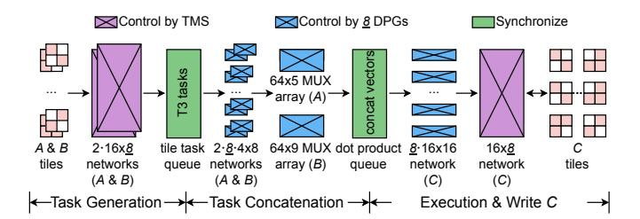

# D. Uni-STC Design Principles

Addressing these challenges, we formulate three design principles for Uni-STC:

- Unify data structure and architecture to support diverse sparse kernels.
- 2) Offload T1 task execution to the STC while augmenting scheduling capabilities.
- 3) Decompose T3 tasks into fine-grained vector tasks to enhance task concatenation efficiency.

#### IV. UNI-STC ARCHITECTURE

As shown in Fig. 7, to overcome the limitations of existing STCs, we propose Uni-STC, a unified architecture designed to replace the original GPU tensor cores and support various sparse kernels. It comprises three functional units: the Tile Multiply Scheduler (TMS), the Dot Product Generator (DPG), and the Segmented Dot Product Unit (SDPU). Operationally, the TMS first decomposes T1 tasks into T3 tasks for the DPGs. The DPGs then subsequently partition these into fine-grained T4 tasks, which are ultimately concatenated and executed by the SDPU.

## A. Task Generation Using TMS and DPG

To support diverse sparse patterns and kernels, Uni-STC's fundamental working unit is the  $4 \times 4 \times 4$  T3 task, derived from the decomposition of a larger  $16 \times 16 \times 16$  T1 task. This design choice is motivated by three key considerations:

(1) Mitigating inefficiency from real-world sparsity: Tasks defined with K=1 (DS-STC) or K=2 (RM-STC) lead to numerous low-utilisation cycles when handling patterns such

Fig. 8: TMS component and its subsequent modules.

TABLE IV: Trade-offs of T3 task sizes on cycle count, the number of DPGs to saturate SDPU, and network scale to route tiles and nonzeros. The  $4 \times 4 \times 4$  size is the best among the three, as it avoids excessive DPG counts and routing overhead.

| Task                  | #Cycles   | #DPGs to      | Network scale to route |                       |  |
|-----------------------|-----------|---------------|------------------------|-----------------------|--|
| size                  | #Cycles   | saturate SDPU | tiles                  | nonzeros              |  |
| $2 \times 2 \times 2$ | 1         | 32-64 (high)  | 64×#DPGs (high)        | $4 \times 4$          |  |
| $4 \times 4 \times 4$ | 1         | 8-16          | 16×#DPGs               | 16 × 16               |  |
| 8 × 8 × 8             | ≥2 (high) | 2-4 (low)     | 4×#DPGs                | $64 \times 64$ (high) |  |

as long rows or long columns (e.g., matrix crankseg\_2 in Fig. 5) or nonzeros concentrated near the diagonal (matrix cant). To achieve stable utilisation across such diverse structures, we adopt a symmetric configuration with M=N=K.

- (2) Facilitating a unified data structure: To meet the unified data structure requirement outlined in Section III-D while avoiding complex hardware decoders, we select symmetric tile dimensions. This symmetry allows both operands to share identical bitmap encoding logic.
- (3) Balancing resource utilisation and timing: Table IV compares the  $4\times4\times4$  configuration with alternative tile sizes. A  $2\times2\times2$  design incurs excessive resource overhead, requiring 32-64 DPGs and a much larger routing network. Conversely, an  $8\times8\times8$  size fails to meet timing constraints ( $\geq2$  cycles), suffers from limited parallelism (2-4 DPGs, denoted as low), and has high routing costs. The chosen  $4\times4\times4$  configuration strikes an balance, avoiding the resource overhead of smaller tiles and the timing violations of larger ones.

During computation, a  $16 \times 16$  matrix block is partitioned into  $16.4 \times 4$  tiles. A two-level bitmap encodes this structure to steer the pipeline: the top-level bitmap (marking tiles) guides the TMS in generating T3 tasks, while the bottom-level bitmap (marking elements) directs the DPG to generate T4 tasks.

- 1) Tile multiply scheduler (TMS) in Fig. 8:
- 2 Task ordering. Task ordering for batched T3 tasks substantially impacts data reuse and energy consumption. For in-

Fig. 9: DPG component and its adjacent modules.

Fig. 10: Comparison of dot-product, outer-product and row-row ordering methods (assuming Uni-STC can complete eight T3 tasks per cycle). The metrics are: (1) data reuse rates for matrices A and B, calculated as  $1 - \frac{\text{Actual Accesses}}{\text{Theoretical Accesses}}$ , (2) average parallel tasks per cycle, (3) average aligned tasks per cycle, and (4) average write conflict rate.

stance, at layer K=0, parallel execution of  $T_{00}, T_{01}, T_{10}, T_{11}$  fetches tiles  $(A_0, A_1, B_0, B_1)$  only once, whereas sequential execution would double read volume. To identify the most effective strategy, we evaluated dot-product, outer-product, and row-row orders based on parallelism, K-dimension alignment, and write conflicts (defined as  $\frac{\#ConflictCycles}{\#TotalCycles}$ ). As shown in Fig. 10, the outer-product strategy is superior, achieving high parallelism (avg. 4.54 tasks), a 47.38% peak reuse rate through effective K-alignment, and low write conflicts (e.g., 6.2% peak at #Nonzeros=6), thereby mitigating bottlenecks.

Additionally, we implement an adaptive intra-layer task ordering mechanism. The system dynamically selects a columnmajor order when nonzero rows outnumber nonzero columns, and a row-major order otherwise, enhancing data reuse across diverse workloads.

3 Task dispatch. The TMS enqueues generated T3 tasks into the Tile queue. In the event of a write conflict (e.g., the T3 task marked by the red box and exclamation mark in Fig. 8), the Tile queue employs round-robin arbitration to stall the conflicting T3 task, forcing the corresponding DPG to wait one cycle before execution.

- 2) Dot-product generators (DPGs): The DPG's workflow begins with a T3 task. First, it applies an outer-product method to the bottom-level bitmaps to generate four intermediate bitmap layers. These layers are then overlaid, creating a map where the 4-bit value at each position encodes the indexmatching results for a sparse vector dot-product.
- Next, the DPG combines this overlaid map with the structural layout of tile C to generate 8-bit T4 task codes. Concurrently, it extracts the required operand vectors from tiles A and B for subsequent concatenation. For instance, in Fig. 9, the value '49' in the orange box signifies the following: the upper nibble '4' denotes the accumulation target (4th nonzero in tile C), while the lower nibble '9' encodes the sparse dot-product pattern (0x1001). Thus, the T4 task '49' corresponds to:  $C_{0,0}[4] += A_{1,0} \times B_{0,3} + A_{1,3} \times B_{3,3}$ .

**4** Multiple T4 tasks from a DPG are filled into the Dotproduct queue in a Z-shaped pattern, as depicted in Fig. 9.

This ordering is critical for minimizing data movement. When vector tasks are concatenated, the required broadcast range for any nonzero is minimized. Specifically: (1) For matrix A, an element is broadcast to a compact group of only  $5 \ (4+1)$  adjacent multipliers, as our scheduling limits its reuse to at most two consecutive vector tasks (length  $\leq 4$ ). (2) For matrix B, the Z-shaped fill order ensures an element is broadcast to a slightly wider range of  $9 \ (4+4+1)$  multipliers, because two tasks requiring the same B data are separated by at most one intervening task. This localized data forwarding is highly efficient; alternative strategies, such as an N-shaped fill order, were tested and found to be inferior for most matrices.

The aforementioned process of task dispatch and vector concatenation relies on simple prefix sums and shift units. These components are commonly employed in prior works [21], [87], and are therefore omitted for brevity.

Uni-STC's default configuration of 8 DPGs is driven by a sensitivity study on Energy Efficiency Density (EED) and alignment with hardware resource budgets. The EED analysis, presented in Fig. 22, shows that increasing the DPG count from 4 to 8 benefits SpMM and SpGEMM, whereas a further increase to 16 yields diminishing returns and introduces higher overheads, particularly for SpMV and SpMSpV. Moreover, the 8-DPG configuration aligns with existing tensor core resource budgets. Because each T3 task is constrained to at most 64 intermediate products, Uni-STC can flexibly scale its precision from 256 MACs@FP16 to 64 MACs@FP64 within the same hardware footprint. This is accomplished while retaining sufficient task concatenation capability to achieve significant performance gains.

## B. Segmented Dot Product Unit (SDPU)

To facilitate parallel execution of multiple T4 tasks, we introduce the SDPU. As illustrated in Fig. 11(a), T4 tasks generated by DPG 0 are compactly concatenated for batched processing within the SDPU. Fig. 11(b) is a merge-forward structure, which dynamically configures any four adjacent multipliers into a complete binary tree. This design yields two key benefits, First, it enables the compact, parallel computation

Fig. 11: SDPU component and its preceding modules.

Fig. 12: Internal pipeline and datapath in Uni-STC.

of multiple T4 tasks. Second, it facilitates the pre-merging of up to four partial products before they are written out, which significantly reduces write traffic to the result matrix C.

#### C. Internal Pipeline and Datapath

As shown in Fig. 12, to meet the 1.5 GHz target frequency (A100), Uni-STC implements a three-stage internal pipeline that uses Tile and Dot-product queues to manage task lifecycles, thereby decoupling control and data flows.

- 1) Three-Stage Pipeline: The execution flow, triggered by the issuance of a UWMMA instruction (see Section IV-E), consists of three main stages:
  - Stage 1: Task Generation. Acting as the controller, the TMS fetches the top-level bitmap from the Meta Buffer (144B) and generates T3 tasks, which are dispatched into the Tile queue.
  - Stage 2: Task Concatenation. Eight DPGs operate in parallel, utilising underlying bitmaps to populate the Dotproduct queue with T3 and T4 task codes, as well as network control signals. These signals are used to acquire operands from the Matrix A buffer (2KB) and registers.
  - Stage 3: Execution & Write C. The SDPU pops a batch of merged T4 tasks, performs segmented dot-products, accumulates results in an accumulator buffer (1KB), and updates registers.

Notably, the Tile and Dot-product queues store only control information rather than the numerical values of matrices A and B. This design choice is driven by two factors: first, to minimize the area overhead associated with wide datapaths; and second, to accommodate potential latency, as values may not be available in the registers or buffers during the first two pipeline stages.

*2) Datapath:* Prior studies (e.g., RM-STC [30]) have established that on-chip network scale and data traffic are the primary drivers of energy consumption in STCs. While previous sections have demonstrated how Uni-STC mitigates data traffic—specifically through reuse-aware scheduling in the TMS and partial product pre-merging in the SDPU—the scale of the interconnect remains a critical efficiency bottleneck. Therefore, this section shifts focus to the other factor: optimizing Uni-STC's network scale to reduce energy per bit.

As shown in Fig. 12, Uni-STC employs a two-layer network for data access. The outer layer, controlled by the TMS, uses three dedicated 16 × 8 networks to forward tiles for matrices A, B, and C. For matrix C, since the SDPU output can be directly partitioned, each tile is handled by a dedicated 16 × 16 network, and with 8 DPGs in parallel, this results in an 8 · 16×16 network structure. For matrices A and B, each first passes through a dedicated 4×8 network into the dot product queue. Subsequently, two sets of MUX arrays—64 × 5 for A and 64 × 9 for B—select the corresponding vectors from the queue. This hierarchical network design eliminates the need to implement separate 64×256 networks for matrices A, B, and C, achieving reductions in energy per bit of 7.16×, 5.33×, and 2.83×, respectively.

Additionally, Uni-STC employs a dynamic DPG activation mechanism to optimize energy efficiency. By calculating the prefix sums of intermediate products at the Tile queue head, the TMS determines the number of DPGs required to saturate the SDPU. The control logic then power-gates any redundant DPGs and their associated datapaths—including the input networks for matrices A and B (2 · 8 · 4 × 8) and the output network for matrix C (8·16×16). This selective gating, which assumes wake-up latency is hidden by look-ahead scheduling, enables energy savings of up to 2.83× compared to an alwayson approach (see Section VI-C).

#### *D. BBC Format*

Guided by the design principles from Section III-D, we propose the BBC format, a hierarchical data structure. Its outer layer uses the CSR format to organize submatrices, while its inner layer employs a two-level bitmap to manage elements within each sparse submatrix. Fig. 13 illustrates this format with a downsized 8 × 8 matrix, where each 4 × 4 submatrix is subdivided into four 2 × 2 blocks.

The second-level index of the BBC format, ValPtr Lv2, is provided directly to Uni-STC, enabling the TMS to control the forwarding of corresponding tile data. This design choice is motivated by a trade-off between hardware and software costs. Unlike RM-STC, which requires a hardware decoder consuming 16.67% of the area overhead, BBC enables direct execution. We offload indexing to a one-time software encoding. This approach incurs negligible storage overhead—no more than 0.3% within the BBC format, translating to just 0.015% of the total die area—while eliminating the costly hardware decoder.

Additionally, the two-level bitmap structure can be used directly by TMS without decoding. Converting a 4×4 submatrix

Fig. 13: Downsized BBC format for an 8 × 8 matrix. At the top level, RowPtr and ColIdx use CSR to locate nonzero 4×4 submatrices. The sparsity pattern within these submatrices is then described by a two-level bitmap: BitMap Lv1 identifies which 2×2 blocks contain nonzero elements, and BitMap Lv2 specifies the exact location of the nonzero elements within those blocks. All nonzero elements are stored in the Value array. They are accessed using a two-level pointer where ValPtr Lv1 provides the base address for a 4 × 4 submatrix and ValPtr Lv2 provides the offset for a specific 2 × 2 block.

within the DPG into four row or column vectors accounts for approximately 6.6% of the total area overhead. The primary cost is the one-time offline construction of the BBC format. However, this cost is amortized across multiple invocations and can be entirely eliminated for frequently used matrices by saving and reloading them via implemented file I/O function.

## *E. Hardware Integration with GPU*

To integrate Uni-STC as a coprocessor in the GPU Streaming Multiprocessor (SM) and bypass the T2 task partitioning stage, we require micro-architectural adjustments to the SM in two parts: instruction issue and data interaction.

- (1) Instruction issue: This requires two control logic modifications: updating the instruction decoder to parse Uni-STC's opcodes, and extending the warp scheduler to dispatch the decoded instructions. Both modifications incur negligible area and energy overhead.
- (2) Data interaction: Uni-STC interfaces with core SM components solely via the register file, a design that leverages the high-bandwidth operand collector interfaces of modern SM90+ architectures (e.g., Hopper and Blackwell). For earlier generations like Ampere, however, the register-file ports must be widened to provide the necessary bandwidth: up to 16 FP64 source and 4 FP64 destination operands per thread, per cycle.

With these adjustments, Uni-STC operates as an independent computational unit within the SM. The following subsections detail the instruction set, execution lifecycle and control interaction.

