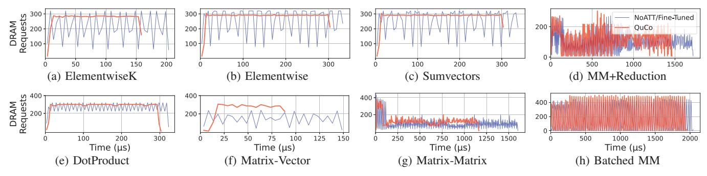
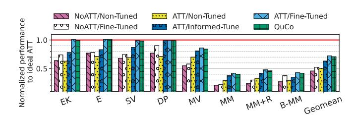

# *B. Implemented Configuration Strategy*

The configuration logic executed by the QuCo firmware takes as input both static architectural parameters—retrieved from the GPU Specification Table (GST)—and dynamic workload information such as compute intensity, vector sizes, and the number of queues requested by the user, including their intended usage (streaming or stationary), dimensional length (e.g., K dimension in a matrix), and data type size. Using this information, the QuCo unit, is able to deliver a per-kernel configuration that maximizes memory throughput and computational overlap while respecting architectural constraints. These include LDS capacity, hardware barrier limits, and maximum tile sizes supported by the ATT.

The first step is to determine the optimal tile size (Algorithm 1). QuCo explores tile sizes ranging from a minimum of 64 elements—the cache line size—up to 8,192 elements, a limit based on design-space exploration and bounded by the LDS size specified in the GST. For each candidate tile size, it evaluates a *merit factor*: the ratio of tile processing time to memory transfer time. Processing time is estimated using kernel-specific compute intensity (CI)5—ratio of operations to memory traffic—wavefront utilization, and compute throughput (e.g., MACs per cycle), plus a scheduling roundtrip overhead due to wavefront dispatch limitations (e.g., the scheduler waiting a full roundtrip before issuing the next instruction).

Transfer time is based on memory latency, DRAM bandwidth, ATT latency, and L2 cache behavior; the 2× factor in the cache transfer time models the bidirectional nature of data movement between global memory and LDS—accounting for both read and potential write traffic during tile transfers. All parameters are hardware-specific and retrieved from the GST, ensuring the algorithm is tuned to the target GPU. The *merit factor* effectively models the rate at which tiles are processed versus the rate at which they are fetched, a critical factor in GPU performance (see Algorithm 2 for more details).

In addition to the merit factor, the algorithm computes a *cost function* to evaluate resource usage for transferring a tile, considering latency, bandwidth, and cache-line constraints. The cost function aggregates the memory system costs into a normalized score. It combines tile-dependent latency—estimated

<sup>3</sup>The fact that QuCo is a hardware block implemented within the GPU ensures that data in the GST is not exposed.

<sup>4</sup>To further minimize microarchitectural overhead, QuCo could be embedded as part of existing RISC-V configuration cores, such as the AMP already included in NVIDIA Blackwell.

<sup>5</sup>To avoid confusion with Artificial Intelligence, we deliberately avoid using the acronym AI for Arithmetic Intensity.

#### Algorithm 1: Optimal Tile Size Calculation

```
Input: Range of tile sizes: [min, max], Consumer Wfs, CI, GST
Output: Optimal tile size
Function optimal_tile_size()
    for tile ∈ [min, max] do
```

#### Algorithm 2: Function for calculating the Merit Factor

```
Input: Tile Size, Consumer Wfs, GST, WfPools = 4
Output: Merit Factor
Function evaluate()
     // Step 1: Compute the best-case latency
          time for processing the tile
     bestLatency \leftarrow \frac{\text{TileSize}}{\text{SIMDMulsPerCycle} \times \text{ConsumerWfs}}
     // Step 2: Calculate processing time,
          including scheduling roundtrip overhead
     procTime \leftarrow bestLatency + (bestLatency - 1) \times
       \min(ConsumerWfs-1,WfPools)
     // Step 3: Compute memory transfer latencies
    \begin{array}{l} latencyTotal \leftarrow \text{ATTCycles} + \text{DRAMLatency} + \text{L2Latency} \\ memTransferTime \leftarrow \frac{\text{TileSize} \times \text{ElementSize}}{\text{Bandwidth}} \\ cacheTransferTime \leftarrow 2 \times \frac{\text{TileSize} \times \text{ElementSize}}{\text{CacheLineSize}} \end{array}
     // Step 4: Aggregate memory transfer time
     memTime \leftarrow latencyTotal + memTransferTime +
       cacheTransferTime \\
     // Step 5: Return the merit factor as the
          ratio of processing time to memory time
    return procTime memTime
end
```

as the sum of ATT, DRAM, and L2 latencies divided by the tile size—with two additive penalties: one inversely proportional to DRAM bandwidth and another inversely proportional to cache-line size. This models the relative impact of limited bandwidth and fine-grained cache-line usage on tile transfers.

Together, the merit factor and cost function are combined into a weighted merit score, computed as the product of both values, which determines the suitability of a given tile size. This ensures that the selected tile provides the optimal balance between computational efficiency and memory efficiency.

After iterating over possible tile sizes, the algorithm adjusts for the kernel's CI: scaling up the tile size for low-CI kernels, CI<1 (i.e., *Elementwise* or *Dot-Product*) to improve memory throughput and scaling down for high-CI kernels, CI>4 (i.e., *Matrix-Matrix multiplication*) to balance memory and computation overlap (Section IV describes the complete list of the kernels and benchmarks used in our evaluation). This ensures the tile size aligns with the kernel's characteristics.

After determining the tile size, the QuCo unit computes the optimal number of slots for each queue (Algorithm 3). This step begins by counting the number of streaming and stationary queues, as the allocation strategy prioritizes streaming

#### **Algorithm 3:** Optimal Number of Slots Calculation

```
Input: Streaming and stationary queues, CI, Compute Units
Output: Optimal number of slots for each Queue
Function optimal_num_slots()
    count streaming and stationary queues;
    if there are streaming queues then
        numSlots \leftarrow useLittlesLaw();
        numSlots \leftarrow roundToPowerOfTwo(numSlots);
        numSlots \leftarrow roundBasedOnCUs(numSlots);
        if sufficient space in LDS then
            allocate (streaming queues);
        else
            numSlots \leftarrow useComputeIntensity();
            reduce numSlots if necessary to fit the data;
            allocate(streaming queues);
        end
    end
    if there are stationary queues then
        calculate available space for each stationary queue;
        determine how many slots can fit into the remaining space;
        numSlots \leftarrow roundToPowerOfTwo(numSlots);
        numSlots \leftarrow roundBasedOnCUs(numSlots);
        reduce numSlots if necessary to fit the data;
        allocate (stationary queues);
    end
end
```

queues to maximize performance, while reserving remaining resources for stationary queues.

For streaming queues, QuCo uses a hardware-aware adaptation of Little's Law to balance queue depth with kernel latency and tile throughput. Little's Law provides a relationship between the rate at which items enter a system, the time they spend being processed, and the average number of items, and has been widely applied within the fields of operations management and computer architecture [28]. Using this approach, the ideal number of slots required for a streaming queue is derived directly from the ratio of memory transfer time (i.e., the rate at which tiles are loaded into the LDS by ATT transfers) to the total time needed to compute a tile. This ratio determines the number of slots to ensure the queues are neither underutilized nor overly provisioned (this is calculated by useLittlesLaw() in Algorithm 3).

The number is then further adjusted based on the number of compute units. Specifically, the algorithm reduces the number of tiles when more CUs are active, as higher CU utilization increases pressure on the memory system. This adjustment mitigates memory contention and balances workload distribution, ensuring that queues operate efficiently under varying compute loads.

Subsequently, the last step ensures that the calculated number of slots fits within the available LDS capacity. If the required slots exceed the LDS constraints—due to tile size or memory limitations—an alternative strategy is employed. In this fallback approach, the number of slots is re-evaluated and scaled based on the workload's CI. For low-CI workloads (e.g., *Elementwise*), more slots are allocated to improve memory throughput. For high-CI workloads (e.g., *Matrix-Matrix multiplication*), fewer slots are chosen to reduce memory pressure and better overlap computation and memory accesses. Once

TABLE I: Kernels and benchmarks with their design-space saved by using QuCo.

| Applications (Acronym)                                                               | Description                                                                                                                                                                                            | Dimensions                            | Layers          | # Queues      | # Tiles     | # Slots     | # Combinations                                                                      |
|--------------------------------------------------------------------------------------|--------------------------------------------------------------------------------------------------------------------------------------------------------------------------------------------------------|---------------------------------------|-----------------|---------------|-------------|-------------|-------------------------------------------------------------------------------------|
| ElementwiseK (EK)                                                                    | Operations optimized for high throughput [45]                                                                                                                                                          | 16777216                              | - 1             |               | 5           | 5           | 25                                                                                  |
| Elementwise (E)<br>Sumvectors (SV)<br>Dot-Product (DP)                               | General element-wise operations [45]<br>Vector summation, a basic building block [10]<br>Critical workload linear algebra [10]                                                                         | 16777216<br>2097152                   | -               | 2             | 5           | 5           | 625                                                                                 |
| Matrix-Vector (MV)<br>Matrix-Matrix (MM)<br>MM+Reduction (MM+R)<br>Batched MM (B-MM) | A staple in scientific computing [14], [45]<br>Fundamental for dense linear algebra and ML [14], [45]<br>Fused operation common in attention models [47]<br>Fundamental in inference and batching [47] |                                       | -               | 8+1           | 8           | 5           | $2.6 \times 10^{14}$                                                                |
| AlbertV2<br>T5-Small<br>Whisper Tiny                                                 | Efficient BERT for NLP tasks [24]<br>Text-to-text Transformer [41]<br>Multilingual ASR model [40]                                                                                                      | Transformer<br>(Linear)               | 74<br>96<br>827 | 8+1           | 8           | 5           | $1.92 \times 10^{16}  2.5 \times 10^{16}  2.1 \times 10^{17}$                       |
| Norm-Project<br>Attention-Score<br>Residual-MLP                                      | LayerNorm with channel-wise scaling [7], [46] Attention score computation [9], [20] Projection layer with residual connection [15]                                                                     | $16777216$ $[2048, 2048] \times 2048$ | 2<br>2<br>2     | 2<br>2<br>8+1 | 5<br>5<br>8 | 5<br>5<br>5 | $   \begin{array}{r}     1250 \\     1250 \\     2.5 \times 10^{14}   \end{array} $ |

TABLE II: Specifications of the three different GPUs modeled.

|                                                                             | Property, Amount                                                                                                         |                                                                                                                          |                                                                                                                         |  |  |  |
|-----------------------------------------------------------------------------|--------------------------------------------------------------------------------------------------------------------------|--------------------------------------------------------------------------------------------------------------------------|-------------------------------------------------------------------------------------------------------------------------|--|--|--|
| Parameter                                                                   | R9 Nano                                                                                                                  | MI100                                                                                                                    | Radeon 530                                                                                                              |  |  |  |
| Frequency CUs SIMDs L1V \$ L1I \$ L1S \$ L2 \$ DRAM Mem. Lat. \(^{\alpha}\) | 1.0 GHz<br>64<br>64 Muls/cycle<br>64x16KB 4w<br>16x32KB 4w<br>16x16KB 4w<br>16x256KB 16w<br>8x512MB<br>190, 300, 450 [3] | 1.5 GHz<br>120<br>64 Muls/cycle<br>120x16KB 4w<br>8x32KB 4w<br>8x16KB 4w<br>32x256KB 16w<br>32x1GB<br>100, 250, 300 [12] | 1.0 GHz<br>6<br>64 Muls/cycle<br>6x16KB 4w<br>32KB 4w<br>16KB 4w<br>8x256KB 16w<br>8x256MB<br>80, 200, 400 <sup>β</sup> |  |  |  |

<sup>&</sup>lt;sup>α</sup>L1, L2 (CU roundtrip) and DRAM (CU roundtrip), respectively.

streaming queues have been configured, QuCo proceeds to assign resources to stationary queues using the remaining LDS capacity evenly. This two-stage allocation ensures that latency-sensitive transfers are prioritized.

After computing the optimal tile size and number of slots for each queue, QuCo proceeds to physically allocate and initialize the queues in the LDS. Next to the already allocated space used for ATT metadata, it allocates contiguous blocks for each queue, setting up their corresponding ATT descriptors pointers (see the example in Figure 4b). Each queue includes its tile size, number of slots, and synchronization barriers. These descriptors are written directly into memory regions that are visible to the ATT units, enabling immediate use. By embedding this decision logic directly into the GPU hardware, QuCo transforms what is a complex developer-managed task into a fully autonomous process.

#### IV. EVALUATION METHODOLOGY

#### A. Simulation Environment

We evaluate QuCo using MGPUSim [44], a cycle-accurate GPU simulator calibrated with an AMD R9 Nano (GCN3 ISA), representative of mid-range GPUs. All main results (Section V-B) use this setup, while portability tests cover two additional GPUs: the high-end MI-100 and low-power Radeon 530 (Table II; results in Section V-E). We extended MGPUSim to support ATTs between global memory and LDS, modeling background data movement, operand queue management, and LDS coordination accurately at functional and cycle levels. Despite building upon an AMD platform, our ATT design is architecture-neutral, allowing any GPU with asynchronous

global-to-shared memory transfers to benefit from QuCo's automated configuration. Moreover, performance primarily depends on general GPU characteristics (e.g., bandwidth, compute throughput) rather than ISA-specific features, ensuring broad applicability. The performance trends from our ATT evaluations align closely with results reported for other ATT hardware, such as NVIDIA TMA-enabled GPUs [29], [30], [47], confirming the validity and generality of our approach.

#### B. Linear Algebra Kernels and Benchmarks

We evaluate QuCo and validate our ATT implementation using wavefront-specialized kernels—spanning both fundamental linear-algebra kernels and state-of-the-art workloads [47]—that cover diverse data-access patterns and compute intensities across domains such as machine learning, analytics, genomics, and signal processing (Table I). To compute the CI of each kernel, we calculate the ratio of floating-point operations to global memory traffic without ATT acceleration. This method captures the compute-to-memory balance of each workload without interference from asynchronous transfers. Since CI is an algorithmic property, its value remains constant across architectures and configurations, and it is used by QuCo to classify the kernel, as described in Section III-B.

Workloads range from element-wise operations to dense matrix multiplications, exposing memory- and compute-bound scenarios. Some require precise queue tuning and others test ATT's ability to overlap data movement with computation.

These kernels demand explicit wavefront specialization and fine-grained synchronization support and no existing benchmark suites (e.g., Rodinia, Parboil, Polybench) have yet been adapted or specifically designed to utilize modern asynchronous memory transfers in GPUs, whether in software or via hardware mechanisms like NVIDIA's TMA<sup>6</sup>.

#### V. EXPERIMENTAL RESULTS

To demonstrate QuCo's practical impact, we evaluate full deep learning models and composite kernel blocks built from the linear algebra kernels. These workloads, shown in Table I, reflect modern neural architectures and expose QuCo to complex, layered execution patterns where dynamic

<sup>6</sup>Recent studies on TMA in NVIDIA Hopper [29], [30] rely on microbenchmarks, while [47] evaluates only four kernels, three of which we include.

<sup>&</sup>lt;sup>β</sup> No official documentation; projected from comparable mobile GPUs [27].



Fig. 5: DRAM activity over time for *NoATT/Fine-Tuned* and QuCo.



Fig. 6: Kernel execution normalized to the ideal scenario.

queue reconfiguration is critical. The DNN models—*AlbertV2*, *T5 Small*, and *Whisper-Tiny*—are Transformer-based and memory-intensive, composed largely of matrix operations. We also evaluate three composite workloads: *Norm-Project* (normalization + projection), *Attention-Score* (dot product + activation), and *Residual-MLP* (projection + residual update). These tasks involve multiple operand queues and varying shared memory demands, making them ideal for testing QuCo's ability to adapt tile sizes and queue slots across layers with non-uniform dimensions.

