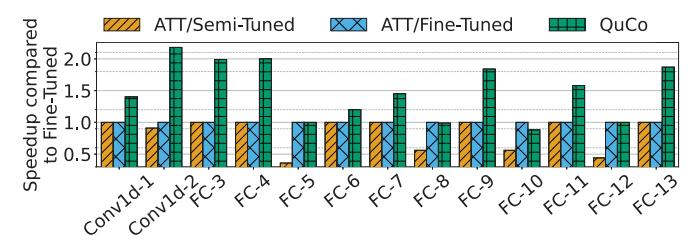
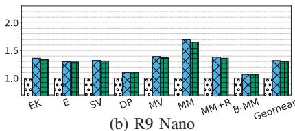
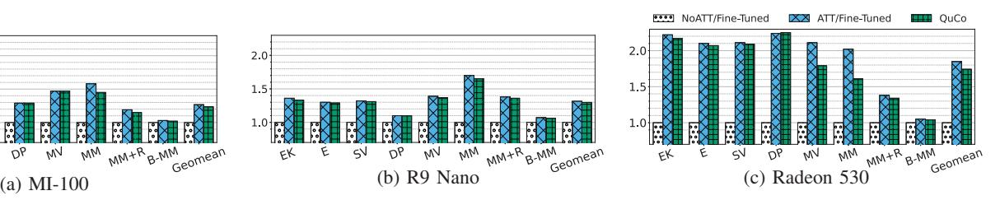

# *C. Ablation Study*

To further understand the impact of each heuristic used by QuCo, we conducted an ablation study over the linear algebra kernels. Figure 7 compares QuCo against progressively degraded versions of its design, each removing a key heuristic: i) CU-aware slot scaling; ii) Little's Law-based slot sizing; and iii) CI-based tile and slot scaling. All results are normalized to the ATT/Fine-Tuned baseline. For simpler kernels (e.g., *ElementwiseK*, *Elementwise*, *Dot-Product*), removing Little's Law occasionally improves performance due to coincidental alignment between CI-scaling and queue pressure—e.g., 4 slots versus 8. However, for more complex kernels (e.g., *Matrix-Vector*, *Matrix-Matrix*, *Matrix-Matrix + Reduction*, *Batched-Matrix-Matrix*), disabling CU-aware rounding leads to overallocation of slots—4, or even 8 slots instead of 2—causing increased memory contention and reducing performance by up to 25%. Disabling CI scaling further worsens this, as larger

Fig. 9: Layer-wise speedup in the *Whisper-Tiny* model (singular layers) compared to the *ATT/Fine-Tuned* baseline

tiles and excessive slots overload the memory system—e.g., tile sizes of 1024 or 2048 with 4 or 8 slots, compared to 512 with 2 slots—leading to slowdowns of nearly 40% (notably in *Matrix-Matrix* + *Reduction*). See Table III for the optimal configurations selected by QuCo.

#### D. Benchmarks

Figure 8 shows the efficiency of QuCo in the context of the six benchmarks listed in Table I. In particular, we present a performance comparison of three ATT-based implementations: i) *ATT/Semi-Tuned*, where only the first layer is tuned and its ATT configuration is reused for all subsequent layers—a realistic but suboptimal programmer strategy; ii) *ATT/Fine-Tuned*, our baseline for this evaluation, which uses exhaustive per-layer tuning of tile size and queue slots within the subset of the design space we covered to obtain the results for the *ATT/Fine-Tuned* configuration in Figure 8; and iii) QuCo, which automatically configures queues and descriptors for each layer.

As shown, QuCo consistently outperforms all other implementations, highlighting its ability to automatically adapt to heterogeneous layers and varying memory requirements without any programmer intervention. In the full-model benchmarks, QuCo performs comparably to or better than the ATT/Fine-Tuned baseline with an average improvement of up to 1.15×. In some cases, such as AlbertV2 or Whisper-Tiny, the ATT/Semi-Tuned configuration performs notably worse due to insufficient overlap between memory transfers and computation (suboptimal tile sizes and number of slots in the queue), confirming that reuse of early-layer tuning is not robust across a full model execution path.

The benefits of QuCo become more subtle for composite kernels when compared to the *ATT/Fine-Tuned* baseline. Unlike full DNN models with highly heterogeneous layers, these kernels consist of fewer and more uniform layers. As a result, static configurations tend to perform reasonably well, and the performance gap between manual tuning and automatic configuration narrows. Still QuCo dynamically allocates queue slots and tiles based on each layer's properties, consistently matching or slightly outperforming the *ATT/Fine-Tuned* implementation across the full execution range.

Despite QuCo being a fully automated mechanism, it delivers performance consistently comparable to or better than the best manually tuned approach. As reflected in the *Geomean* 

TABLE III: Optimal ATT setup (DSE vs. QuCo) for 3 GPUs.

| Kernel        |                            | Size                  | GPU                            | Fine-Tuned QuCo TileSize/#Slots |                            |
|---------------|----------------------------|-----------------------|--------------------------------|------------------------------------|----------------------------|
| ElementwiseK  | 1 Op. Queue Low C. I.   | 30M 16M 1.25M   | High-end Mid-end Low-end | 4096/4 2048/2 2048/4         | 4096/4 2048/2 2048/8 |
| Elementwise   | 2 Op. Queues Low C. I.  | 30M 16M 1.25M   | High-end Mid-end Low-end | 4096/2 2048/8 8192/4         | 4096/4 2048/4 2048/4 |
| Sumvectors    | 2 Op. Queues Low C. I.  | 30M 16M 1.25M   | High-end Mid-end Low-end | 4096/2 2048/8 4096/4         | 4096/4 2048/4 2048/4 |
| Dot-Product   | 2 Op. Queues Low C. I.  | 2M                    | High-end Mid-end Low-end | 2048/4 1024/2 1024/4         | 4096/4 2048/4 2048/4 |
| Matrix-Vector | 9 Op. Queues Low C. I.  | [2K, 2K] 2K        | High-end Mid-end Low-end | 512/2 512/2 512/2            | 1024/2 512/4 512/2   |
| Matrix-Matrix | 9 Op. Queues High C. I. | [1K, 2K] [2K, 128] | High-end Mid-end Low-end | 512/2 512/2 512/2            | 1024/2 512/4 512/2   |
| MM+Reduction  | 9 Op. Queues High C. I. | [1K, 1K] [1K, 4]   | High-end Mid-end Low-end | 512/2 512/2 512/2            | 512/2 512/2 256/4    |
| Batched MM    | 9 Op. Queues High C. I. | [1K, 1K] [1K, 4]   | High-end Mid-end Low-end | 512/2 512/2 512/2            | 512/2 512/2 256/4    |

column, QuCo achieves the highest average speedup across all benchmarks, underscoring its practicality as a robust and architecture-aware solution for real-world GPU workloads.

To further explore the performance benefits of per-layer or per-kernel queue reconfiguration in QuCo, we conduct an ablation study on the Whisper-Tiny model, analyzing speedups on a layer-by-layer basis across the four different implementations. Although the full model contains over 827 layers, many of them are structurally identical. For this evaluation, we extract the set of unique layer types and evaluate them individually. These layers are not executed sequentially in practice, but are isolated here to understand how QuCo behaves under different configurations and compute patterns. Figure 9 shows the speedup over the ATT/Fine-Tuned baseline. The the x-axis denotes individual layers—both convolutional and fully connected—while the y-axis shows the relative speedup achieved by each configuration. This fine-grained comparison highlights how ATT performance varies depending on layer size, properties, and queue configurations across layers.

Although the *ATT/Fine-Tuned* configuration leverages exhaustive tuning to achieve strong performance across many layers, it is inherently limited by the scope and granularity of the design space explored manually. In practice, evaluating even a modest set of tile sizes and queue slots for each layer results in an overwhelming number of combinations, making per-layer tuning prohibitively expensive. For large models like *Whisper-Tiny*, which consists of hundreds of unique layers, maintaining optimal queue configurations across all of them becomes infeasible without automation.

Additionally, the *ATT/Semi-Tuned* configuration highlights the pitfall of the *one size does not fit all* approach, where a static ATT setup is reused across all the different layers. This fixed configuration, selected early in the tuning process based on initial performance profiling, consists of a tile size of [256] elements with [4] slots. While this configuration performs reasonably well in the first few initial layers *Conv1d-1* or *FC-2*, it significantly degrades in later layers such as *FC-5*, *FC-8* 

Fig. 10: Portability study: same post-compilation QuCo binary on GPUs with different compute and memory specs.

or *FC-12*, where resource demands shift toward either bigger tiles or less occupancy. This behavior reinforces that optimal queue configuration is not only workload-architecture-specific but also layer-specific, and fixed strategies fail to generalize across an entire model.

In contrast, QuCo dynamically reconfigures the queues for each layer based on runtime parameters and architectural constraints, allowing it to navigate a vastly larger design space. As shown in Figure 9, it consistently outperforms both Semi-Tuned and Fine-Tuned approaches, delivering the highest speedup across layers. In deeper, more compute-intensive layers, QuCo demonstrates its ability to identify high-impact configurations. For instance, in *Conv1d-2*, it selects a tile size of [1024] elements and allocates [2] slots—reducing pressure on the memory system and increasing compute throughput while for *FC-3* and *FC-4*, it configures a more conservative tile size of [256] elements with [2] slots—to increase both memory occupancy and compute throughput—outperforming both baselines significantly.

