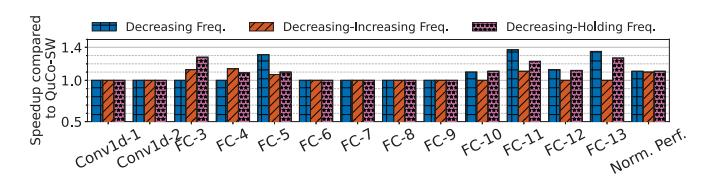

# *E. Portability*

To evaluate the portability of QuCo across a range of GPU hardware platforms, we execute the same set of kernels exact same compiled binary in case of QuCo—presented in Section V-B on three distinct GPU architectures: a high-end GPU (MI-100), a desktop-class GPU (R9 Nano, our baseline), and a mobile-like low-power GPU (Radeon 530) implementing asynchronous tile transfer operations. Details in Table II.

Figure 10 shows the speedup achieved comparing three implementations: the *NoATT/Fine-Tuned* baseline, an *ATT/Fine-Tuned* setup (exhaustively selected for each kernel and device), and QuCo. Despite differences in architectural scale, QuCo consistently delivers near-optimal performance across all platforms without requiring any manual tuning.

On the MI-100 (Figure 10a), the most compute-rich device, QuCo performs within range of the best tuned configuration across all kernels, confirming its ability to scale to large architectures. On the R9 Nano (Figure 10b), our base platform, QuCo again matches *ATT/Fine-Tuned* performance, with nearly identical trends to those reported in Section V-B. Finally, on the resource-constrained Radeon 530 (Figure 10c), QuCo demonstrates a key strength: when compute resources are scarce, the baseline *NoATT* implementation is unable to overlap memory and compute effectively. In contrast, the ATT-based implementations, and especially QuCo, achieve up

Fig. 11: Variance of QuCo parameters in the DNN models and composite kernels for the three GPUs.

to 2× speedup, highlighting the importance of overlapping computation with memory transfers for hiding memory latency under severe resource constraints.

QuCo's ability to deliver optimal or near-optimal configurations without any tuning effort and preserving the same post-compilation binary—regardless of the architecture demonstrates its portability and robustness. The variability of configurations selected by QuCo is illustrated in Table III, where tile sizes and queue slots are shown to differ across kernels and devices, reinforcing that optimal choices are architecture-dependent and validating the need for QuCo's dynamic, on-device configuration strategy.

To further prove QuCo's adaptability to workloads with varying characteristics, in Figure 11 we plot the distribution of the unique combinations selected by QuCo when the DNN models and composite kernels are executed on the three GPUs.

Lastly, to underscore the importance of portability, we highlight two dynamic execution scenarios where QuCo proves especially valuable: dynamic voltage and frequency scaling (DVFS) and multi-tenancy. First, in environments with DVFS, GPU parameters may vary during runtime, breaking assumptions made by statically tuned configurations. Although QuCo performs setup only at kernel launch, it adapts at each invocation, allowing reconfiguration between kernels without intervention. Second, in multi-tenant systems, cloud-shared GPUs or virtually partitioned GPUs, available compute and memory resources may be partitioned or shared across concurrent workloads. High-level libraries typically fail to adjust under these constraints. In contrast, QuCo dynamically infers and adjusts queue configurations based on actual resource availability at runtime, ensuring robust performance without sacrificing portability.

Fig. 12: QuCo-HW VS QuCo-SW over three different scenarios with varying frequency, see Section V-F for details.

