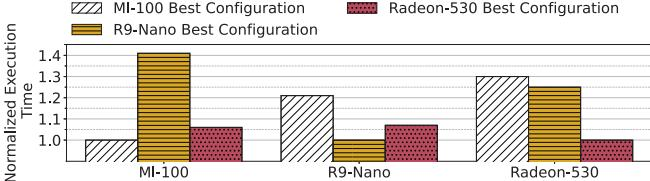

# I. INTRODUCTION AND MOTIVATION

GPUs are the primary compute platform in modern data centers, accelerating diverse, compute-intensive applications such as deep learning, scientific computing, and large-scale analytics [19]. Despite their high memory bandwidth and parallelism, modern GPUs still suffer from underutilization in memory-bound workloads due to latency and transfer bottlenecks [13], [21], [31], [32]. In particular, a prominent source of performance loss is the inefficient overlap of memory operations and computation, leaving GPU resources underutilized and idle [16]. To try to remedy this, some recent GPU designs incorporate support for *asynchronous tile transfers (ATTs)*.

*What are ATTs?* Traditional GPU data movement relies on synchronous load/store instructions issued at cache-line granularity involving a large number of registers (large bank register and scoreboard for tracking dependencies). In contrast, ATTs allow the programmer to specify multidimensional "tiles" of data to be directly moved in bulk between global memory and the on-chip scratchpad without involving vast register usage and costly data dependency tracking, while simultaneously freeing issue slots and increasing energy efficiency. This trend toward ATTs is exemplified by state-of-the-art NVIDIA's Tensor Memory Accelerator (TMA) [6] originally introduced in the Hopper architecture.

*Why are ATTs so important?* ATTs enable fine-grained overlap of data movement with computation, turning what would be idle cycles into useful work and substantially improving utilization on memory-bound kernels. Crago *et al.* [8] demonstrated these benefits across a broad spectrum of domains—including machine learning, graph analytics, genomics, and scientific simulations—showing that any workload can exploit asynchronous transfers to hide memory latency, boost throughput, and achieve more consistent performance on modern GPUs.

*What is the problem with ATTs?* In practice, programming ATTs efficiently is notoriously challenging [47]. On the one hand, different wavefronts1 must be assigned to specific tasks to improve overlap between memory access and computation [5], [8], [11], [26], technique termed wavefront specialization. Typically, one wavefront issues the ATT requests while the rest perform computation, requiring careful synchronization to guarantee that data is ready in the on-chip scratchpad (Local Data Share or LDS, from now on)—often through custom barriers. On the other hand, workload characteristics such as data reuse, access patterns, and arithmetic intensity vary not only across applications but often within kernels. To simplify this burden, NVIDIA provides a high-level abstraction for the TMA (the *cuda::pipeline*), which wraps producer-consumer wavefronts into reusable queues [34], but developers must still manually tune and manage these descriptors (tile sizes, strides, and LDS destinations) and explicitly specialize kernels at the wavefront level to orchestrate producer (memory-transfer) and consumers (compute) wavefronts. Therefore, although a welltuned ATT program can yield substantial benefits, the mechanism introduces significant complexity, tightly couples code to hardware and makes GPU programming more challenging, less portable, and less maintainable [5].

To illustrate how the achieved performance is both kerneland architecture-specific, we present two motivating experiments (the experimental setup is detailed in Section IV). Figure 1a shows that applying the best configuration of ATTs from one kernel to another can degrade performance by up to 1.2×, underscoring the need for workload-specific tuning. Figure 1b shows similar sensitivity across architectures: using the best ATT setup optimized for one GPU (e.g., R9 Nano) on others (e.g., MI-100, Radeon 530) leads to performance drops of up to 1.4×. These results highlight the paramount importance of

1We use AMD terminology for basic GPU concepts throughout this work.

(b) Impact of platform-specific tuning in a Matrix-Matrix.

Fig. 1: Lack of portability of ATT tuning effort.

adaptive, per-kernel and per-architecture configuration to fully exploit ATT-based workloads.

To bridge the gap between performance, programming effort and flexibility on ATT-supported GPUs, we introduce QuCo (Queue Configurator), a lightweight mechanism that fully automates configuration of ATT in a low-effort, high performance, and portable manner. Specifically, QuCo abstracts the complex, kernel- and architecture-dependent tasks of selecting tile sizes, determining queues configuration, and performing LDS partitioning and allocation. By abstracting these low-level details, QuCo eliminates manual tuning, delivering optimized, workload- and hardware-specific configurations in a single execution and preserving the same post-compilation binary portable across diverse GPU architectures (same family).

*Should QuCo be implemented as hardware or software?* The mechanisms and algorithms we present are agnostic to implementation. While a vendor could deploy QuCo as a software solution (e.g. within the JIT compiler or at library level), we advocate for a lightweight hardware realization: a single module per GPU die. This is for several reasons. Existing libraries (such as CUTLASS [35] or cuBLAS [33]) struggle to keep pace: static, offline-tuned implementations cannot adapt to new workloads or microarchitectures without extensive reengineering, and closed-source "black-box" solutions offer limited configurability. In virtualized or multitenant environments [17], [38], each GPU partition may require its own ATT configuration, exponentially increasing profiling overhead. Additionally, relying solely on a software solution risks exposing proprietary GPU micro-architectural details, something that some manufacturers may be reluctant to do. Finally, software solutions cannot adapt swiftly to DVFS transitions or newly introduced microarchitectural features. Ultimately, while our fundamental contributions are agnostic to this decision, the remainder of this paper focuses on hardware because of these additional benefits.

Specifically, our QuCo hardware solution adds to the GPU

die a single compact RISC-V microcontroller2 along with small on-chip memories for microcode and runtime data, as well as a GPU Specification Table (GST) that stores key architectural parameters. At kernel launch, the RISC-V core executes lightweight firmware to dynamically compute optimal parameters. By performing this computation entirely on-chip and autonomously—without host intervention or exposure of hardware details—QuCo delivers rapid, secure, and portable ATT configuration across evolving GPU architectures.

Overall, our key contributions are as follows:

- We propose QuCo, a dedicated mechanism that fully automates the configuration of ATTs, including tile sizing, slot allocation, and LDS partitioning, eliminating the need for manual tuning.
- We demonstrate that QuCo abstracts the intricate details of ATT configuration and achieves near-optimal performance, matching or outperforming fine-tuned manual configurations, while dramatically reducing programmer effort.
- We evaluate QuCo across multiple GPU architectures, showcasing its portability, queue reuse, and design space complexity to validate its efficiency and adaptability.

