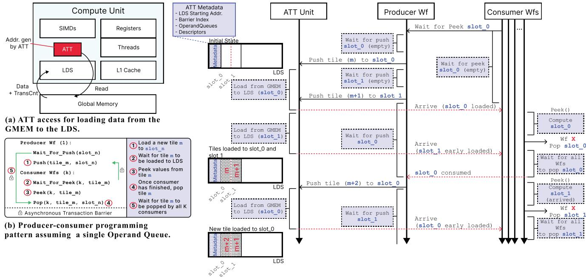
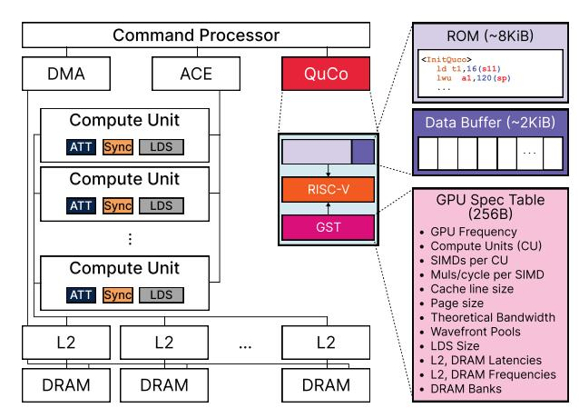

# II. BACKGROUND

In traditional GPU kernel designs, operations are highly synchronous, with all wavefronts loading data from global memory into the Local Data Share (LDS) following fixed access patterns. Wavefront specialization [5] improves resource utilization by assigning different roles to wavefronts within a workgroup. This deviates from the standard approach, where all threads execute the same instructions simultaneously. By designating one wavefront for memory transfers and others for computation, wavefront specialization introduces compute heterogeneity but demands precise synchronization to prevent stalls between data movement and execution. Porting kernels to this style requires manually restructuring code, inserting custom barriers, and verifying correctness across hardware variants—an inherently tedious and error-prone process.

Building on the challenges of manual ATT programming, the current state-of-the-art ATT engine is NVIDIA's Tensor Memory Accelerator (TMA) introduced in the H100 [6]. TMA implements the same producer–consumer wavefront specialization and asynchronous global-to-shared memory transfers we target with ATT, but its primary optimization is to feed Tensor Cores with operand tiles. By contrast, our work treats ATT as an orthogonal mechanism—equally applicable to tensor and non-tensor workloads—providing a general framework for any bulk transfer engine.

The ATT is tightly integrated within the Compute Unit, bypassing the L1 cache to directly issue read memory requests to global memory every clock cycle. It generates its own addresses and transfer counts, writing incoming data directly

2This aligns with the trend of GPUs delegating non-compute tasks to dedicated microcontrollers. For example, NVIDIA's Blackwell architecture introduces the AI Management Processor (AMP) [36], [37], a fully programmable RISC-V context scheduler at the front of the GPU pipeline.



Fig. 2: Use of the ATT unit with the Operand Queue library that constitutes the baseline in this work.

to LDS without software-managed synchronization or thread involvement, as illustrated in Figure 2a.

ATT operations are initiated using a copy descriptor—a compact structure that defines the global memory address, and number of elements to transfer. Once triggered by a single thread within a wavefront, ATT hardware takes over, managing address generation, stride calculations, and boundary conditions. This offloads complexity from the programmer, enabling efficient data transfer between global memory and shared memory (LDS).

A key innovation in the ATT mechanism is its synchronization model, which introduces specialized asynchronous barriers to optimize coordination between producer and consumer threads. In particular, ATTs use asynchronous transaction barriers, splitting synchronization into two phases: arrive and wait. Producer threads signal progress by executing a non-blocking arrive command when shared data is ready, allowing them to continue independent work without stalling. Consumer threads issue a wait command when they need the data, blocking until all producers signal arrive. This two-step process allows early threads to use idle cycles for other tasks, avoiding the inefficiencies of busy-wait synchronization.

By using these hardware-accelerated asynchronous barriers and transaction-based synchronization, ATTs enable efficient overlapping of memory transfers and computation, enhancing parallelism and performance. However, fully harnessing its potential still requires direct involvement from the programmer. Mismanaging dependencies, like ordering memory operations incorrectly, can cause race conditions, deadlocks, or incorrect results, complicating debugging. Additionally, configuring ATT descriptors requires detailed knowledge of the underlying data layout and workload, demanding precision in defining parameters such as dimensions and memory strides.

To reduce the programming complexity associated with using ATTs, NVIDIA offers the *cuda::pipeline* API, which enables efficient usage of the TMA for asynchronous memory operations via single- and multi-stage pipelines [34]. Inspired by these abstractions, we implement a high-level interface for managing producer-consumer synchronization tailored to our evaluation framework, which we refer to as *Operand Queues*.

Operand Queues encapsulate the use of ATT descriptors, and are initialized through a queue descriptor containing the key parameters required for asynchronous memory transfers. These include the global memory addresses, tile dimensions, memory strides, and LDS destination. Once configured, Operand Queues autonomously manage the low-level ATT operations, further abstracting the details of data movement.

Notably, state-of-the-art libraries such as CUTLASS3+CuTe and ThunderKittens offer high-level ATT abstractions (TMA pipelines and asynchronous I/O, respectively) that help automate data movement and computation overlap. However, to obtain hardware-specific peak ATT performance, they place the burden on the programmer [47]. As a result, effective use of these libraries still demands a deep understanding of the underlying GPU microarchitecture.

Our Operand Queues implementation is based on a producer-consumer scheme where a dedicated wavefront (producer) loads tiles into the LDS using functions like Push() and synchronizes via Wait\_For\_Push(), while multiple consumer wavefronts access these tiles using Peek() and Pop(), coordinated through asynchronous transaction barriers. Figure 2b summarizes this interaction. Figure 2c shows a detailed timeline of a queue with two slots (slot\_0 and slot\_1), highlighting the interaction between the ATT unit and the producer and consumer wavefronts. It emphasizes how memory transfers are decoupled from computation, allowing tiles to be early loaded and asynchronously consumed, thus improving data availability and overall throughput.

#### III. QuCo Unit

In this section, we introduce the *Queue Configurator* (QuCo) unit, a hardware solution that automates the configuration of any ATT-enabled GPU and makes it completely transparent to the programmer, while ensuring portability. QuCo abstracts away the low-level management of operand queues, tile sizes and LDS partitioning and allocation, providing an architecture-agnostic and performance-aware solution for efficient utilization. Internally, the QuCo unit includes a customized RISC-V microcontroller aimed at executing a lightweight firmware that dynamically computes optimized queue configurations—such as tile sizes and queue slots—based on the particularities of both the target kernel and the GPU architecture.

Figure 3 provides an overview of the GPU architecture, illustrating where the QuCo unit, a single hardware block, resides relative to key components such as the Command Processor (CP), the Asynchronous Compute Engine (ACE), the Compute Units (CUs), and the multi-banked shared L2 cache with its attached DRAM banks. A zoomed-in view of the QuCo unit reveals its internal structure: a lightweight RISC-V microcontroller, the GPU Specification Table (GST) containing essential architectural parameters, and a memory subsystem for microcode and local variables. OuCo is integrated closely with the CP, allowing it to access kernel launch parameters and architectural metadata early, enabling configuration before threads are scheduled for execution. This ensures that all memory operands (e.g., queue descriptors, ATT descriptors, and barrier pointer) are ready in the LDS before compute begins, preventing stalls and enabling seamless kernel execution.

As shown in Figure 4, QuCo acts as a control unit: the programmer specifies the number of operand queues based on the characteristics of the kernel (Figure 4a), and QuCo autonomously configures all low-level parameters—tile sizes, slot counts, LDS allocation, and synchronization barriers—tuned to the kernel's characteristics and the GPU capabilities (Figure 4b). Once initialized, these queues serve as the interface between QuCo and the execution pipeline. As shown in Figure 4c, both the ATT Unit and the Sync Unit within each CU retrieve their configuration directly from the queues set up by QuCo, enabling efficient and autonomous data movement and coordination. As a result, data movement through the ATT queues becomes transparent to the programmer, who is no longer required to manage descriptors, compute offsets, or handle synchronization.

In workloads with multiple kernels having different memory demands, QuCo can reconfigure the LDS layout with minimal overhead by overlapping the reconfiguration time



Fig. 3: Overview of the GPU architecture with the QuCo unit.

with the ongoing kernel's execution, maintaining the benefits of automatic tuning. These reconfigurations involve updating the ATT metadata—descriptor pointers, LDS base addresses, and synchronization barrier indices—which QuCo modifies in place based on the new kernel's needs. Notably, the contents of the operand queues do not need to be erased or reinitialized. Since the queues are pointer-based, resizing them only requires adjusting memory offsets and slot counts, allowing QuCo to dynamically grow or shrink queues without incurring significant data movement or synchronization costs.

A key strength of QuCo is its portability. The embedded RISC-V microcontroller runs firmware that adapts to various GPU configurations without requiring recompilation or manual tuning. This decoupling ensures consistent, optimized performance across different GPU models and future architectures. By centralizing the configuration logic and abstracting hardware-specific details, QuCo hides the complexity of using ATTs while maintaining high efficiency and scalability.

#### A. Microarchitecture

QuCo is implemented using a single compact in-order RISC-V processor supporting the RV32IMF instruction set [39], which includes integer arithmetic and single-precision floating-point operations. This 32-bit ISA proves sufficient for typical ATT-related operations (Section III-B), which involve address arithmetic, offset calculations, and basic multiplication or division instructions for scaling and aligning memory segments. This in-order design follows a simple five-stage pipeline, significantly limiting hardware complexity while retaining enough performance to handle the control logic needed for ATT initialization and reconfiguration.

Upon GPU startup, QuCo fetches its first instruction from an 8 KiB ROM containing compact firmware. This firmware handles accessing architectural parameters, computing optimal queue configurations, and writing the resulting descriptors into LDS memory. Operating independently from the GPU's wavefront scheduling, QuCo uses a 2 KiB local data buffer to store local variables, data structures, and previously computed configurations. The data buffer is addressable via OuCo's

```
✞ ☎ 1 // Init QuCo with CI, WG Size, and #CUs
2 driver.InitQuCo(HIGH, 512, 64)
4 // Register Queues with size, data-type, and vector-
5 driver.RegisterQueue(K, 4, TYPE_STREAMING)
6 driver.RegisterQueue(K, 4, TYPE_STATIONARY)
8 // Launch the Kernel
9 driver.EnqueueLaunchKernel(binary, kernArg)
```


- (a) High-Level Host Code example for a GEMM kernel.
- (b) QuCo dynamically allocates LDS space and sets queue metadata.
- (c) Compute Unit with ATT and LDS configured by QuCo.

Fig. 4: Example of QuCo for two operand queues (Queue 0 and 1) at: (a) software-level (b) queue level; (c) hardware level.

private address space, supporting repeated invocations and persistent metadata.

A key data structure accessible to QuCo is the GPU Specification Table (GST), a 256-byte read-only block populated by the vendor at manufacturing time3. The GST contains essential architectural parameters such as memory latencies, clock frequency, LDS size, number of compute units, and arithmetic throughput (e.g., FP32 fused-multiply-accumulate operations per cycle). During boot, the QuCo's firmware reads these values into local registers and data buffers to initialize the subsequent configuration process.

Once QuCo has gathered the necessary architectural data, it configures the ATT units by calculating optimal tile sizes and queue slots for the number of ATT queues requested by the user (Figure 4a). The LDS is logically partitioned, reserving a small region for metadata and ATT descriptors, with the remaining space allocated to operand queues (Figure 4b). QuCo writes all the required ATT descriptors, tile parameters, and slot pointers to the LDS, making them accessible to the ATT units. After completing the configuration, QuCo signals each ATT unit to load the updated descriptors and begins loading data from main memory to the LDS. This enables seamless operation, where the programmer interacts with the LDS using a queue structure (as introduced in Section II), while the ATT and the Sync Unit handle the low-level and complex asynchronous data movement behind the scenes.

After configuration, QuCo enters an idle state but remains ready for reactivation. In dynamic workloads with multiple kernels, particularly those with heterogeneous memory demands, QuCo can be re-invoked to recompute queue layouts and update descriptors.

Importantly, the RISC-V processor is decoupled from the main compute pipeline, ensuring that configuration tasks do not interfere with wavefront scheduling, memory requests, or execution flow, following the trend of some recent GPUs to offload configuration logic to specialized hardware <sup>4</sup> [37].

