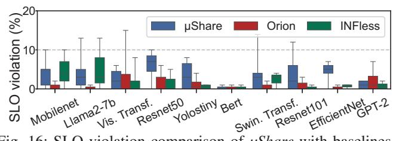
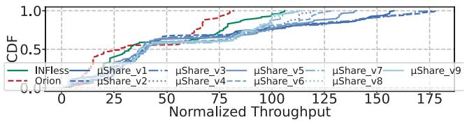
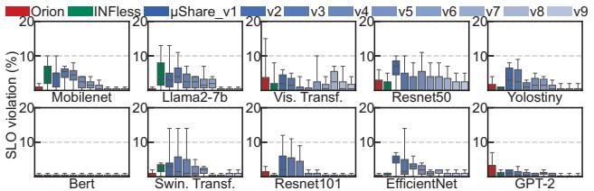
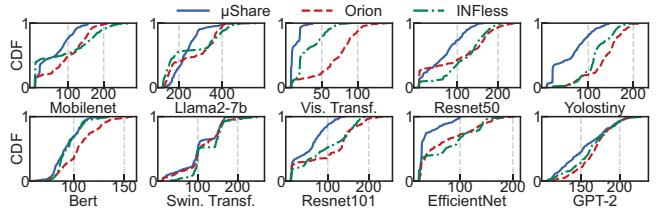

# *C. SLO Guarantee*

Low SLO Violation: *μShare can guarantee the SLO at most time. The SLO violation rate is as low as 3.35%.* We compare the ability of three systems to guarantee the SLO of all models by repeating the experiment 20 times on NVIDIA A40 GPU for each system. The violation ratios of each model are displayed in a box plot in Figure 16. Among them, the average violation rates for the 10 models of *μShare*, *INFless*, and *Orion* are 3.35%, 2.05%, and 1.12%, respectively. Compared to existing systems, *μShare*'s SLO violation only increases by 1.30%-2.23%, but it achieves a throughput improvement of 26.90%-54.09% (Evaluation 5.2).

Fig. 16: SLO violation comparison of μShare with baselines.

μShare designs a dual-SLO guarantee mechanism for inference requests to kernels. On the inference request side, it uses SLO-based feedback control of batch size to avoid input inference requests exceeding the system load. On the kernel side, it uses feedback control based on kernel launch time to adjust the number of SM threads for each kernel, accelerating kernel execution to ensure SLO. In contrast, although *INFless* and *Orion* can adjust resource allocation based on SLO violation feedback after inference requests are completed, they cannot perform SLO detection during kernel execution, and therefore sacrifice some throughput to ensure a higher SLO satisfaction rate.

**Trade-off between Throughput and SLO:**  $\mu Share$  can trade off throughput and SLO violation by tuning the Batch Manager's hyperparameters k and  $\lambda$ . We evaluate nine configurations combining  $k = \{0.05, 0.03, 0.01\}$  and  $\lambda = \{-0.1, -0.15, -0.2\}$ . Specifically,  $\mu Share\_v1-v3$  correspond to  $\lambda = -0.1$  with  $k = \{0.05, 0.03, 0.01\}$ ,  $\mu Share\_v4-v6$  to  $\lambda = -0.15$ , and  $\mu Share\_v7-v9$  to  $\lambda = -0.2$ .

The throughput of  $\mu Share\_v1-v9$  gradually decreases from 58.91 to 53.64 (Figure 17), while the SLO violation rate drops from 3.35% to 0.63% (Figure 18). At  $\mu Share\_v7$  (k=0.05,  $\lambda=-0.2$ ),  $\mu Share$  achieves an SLO violation rate of 0.84%—lower than those of the baseline systems (2.05% and 1.12%)—while maintaining a throughput improvement of 19.28%–44.83%.

Fig. 17: Throughput under different hyperparameter settings.

Fig. 18: SLO violation under different hyperparameter settings.

#### D. Latency

The end-to-end inference latency comparison between  $\mu Share\_v7$  (k=0.05,  $\lambda=-0.2$ ) and the two baselines is shown in Figure 19.  $\mu Share$  reduces average latency by 25.72%–29.53% and 99th-percentile latency by 25.33%–31.31%.

The lower latency of  $\mu Share$  results from intra-SM kernel parallelism, which effectively improves execution efficiency and kernel-level concurrency. In contrast, *INFless* exhibits higher execution latency because it lacks kernel-level scheduling for efficiency optimization, while *Orion*'s conservative co-location strategy limits the number of concurrent kernels, leading to increased request queuing latency.

Fig. 19: Latency comparison of μShare and baselines.

#### E. Low-level Hardware Utilization

High Hardware Utilization:  $\mu$ Share increases the average low-level hardward utilization by 38.53%-61.15%. We compare the low-level hardware utilization of  $\mu$ Share, INFless, and Orion in co-located scenarios and visualize the intra-SM hardware utilization within a 200ms window of the same execution stage, as shown in Figure 20. To measure hardware utilization under co-location, we first use the NVIDIA Nsight Systems tool to record the execution time and parameters of all concurrently running kernels. We then use the NVIDIA Nsight Compute tool to individually measure the utilization of six SM hardware resources for each kernel under co-located execution. Finally, for each time interval, we aggregate the utilization of all kernels active during that interval.

The average utilization of the six low-level hardware components under  $\mu Share$ , INFless, and Orion is 15.10%, 10.90%, and 9.37%, respectively.  $\mu Share$  achieves a 38.53%–61.15% improvement over two baselines. This improvement arises because scattered co-locating enables different blocks to execute concurrently within the same SM.

